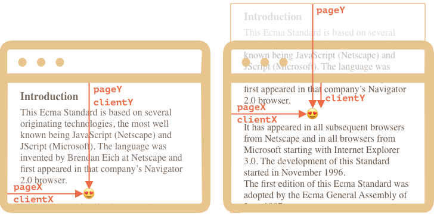
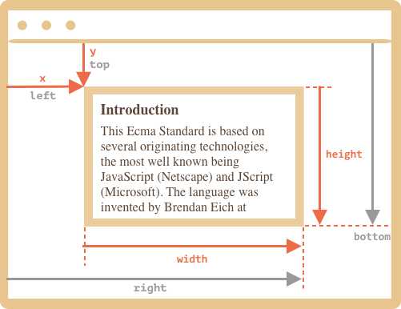
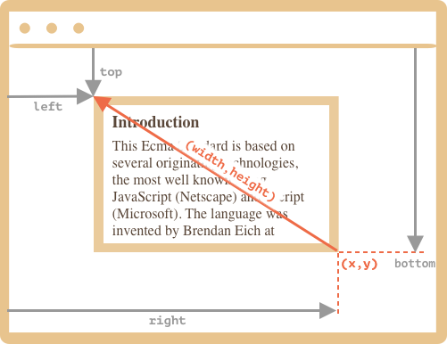
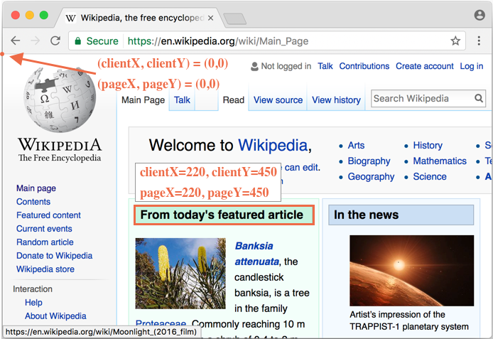
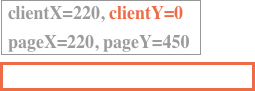

# Coordinates

To move elements around we should be familiar with coordinates.

Most JavaScript methods deal with one of two coordinate systems:

1. **Relative to the window** - similar to `position:fixed`, calculated from the window top/left edge.
    - we'll denote these coordinates as `clientX/clientY`, the reason for such name will become clear after next chapters ,
2. **Relative to the document** - similar to `position:absolute` in the document root, calculated from the document top/left edge.
    - we'll denote them `pageX/pageY`

When the page is scrolled to the top, so that the window top/left corner is exactly the document top/left corner, these coordinates equal each other. But after the document shifts, window-relative coordinates of elements change, as elements move across the window.

Here's the picture, the left part is before the scroll, and the right part - after scroll up:



As the document moved up:
- `pageY` - document-relative coordinate of the same point is still the same, it's counted from the document top (scrolled out).
- `clientY` - window-relative coordinate did change (the arrow became shorter), as the same point now became closer to window top.

We'll see more examples of window and document coordinates through this chapter.

## Element coordinates: getBoundingClientRect

The method `elem.getBoundingClientRect()` returns window coordinates for a minimal rectangle that encloses `elem` as an object of built-in [DOMRect](https://www.w3.org/TR/geometry-1/#domrect) class.

Main `DomRect` properties:

- `x/y` -- X/Y-coordinates of the rectangle origin relative to window,
- `width/height` -- width/height of the rectangle (can be negative).

Additionally, there are derived properties:

- `top/bottom` -- Y-coordinate for the top/bottom edge,
- `left/right` -- X-coordinate for the left/right edge.

```online
Click the button to see its window coordinates:

<p><input id="brTest" type="button" value="Get coordinates using button.getBoundingClientRect() for this button" onclick='showRect(this)'/></p>

<script>
function showRect(elem) {
  let r = elem.getBoundingClientRect();
  alert(`x:${r.x}
y:${r.y}
width:${r.width}
height:${r.height}
top:${r.top}
bottom:${r.bottom}
left:${r.left}
right:${r.right}
`);
}
</script>

Please, scroll the page and repeat. You will notice that as window-relative button position changes, its window coordinates (`y/top/bottom` if you scroll vertically) change as well.
```

Here's the picture:



As you can see, derived properties can be easily calculated:
- `top = y`
- `left = x`
- `bottom = y + height`
- `right = x + width`

**Why derived properties are needed? Why does `top/left` exist if there's `x/y`?**

The reason is that technically it's possible for `width/height` to be negative. A rectangle starts at `(x,y)` and `(width,height)` is actually the direction vector where it goes.

That may be useful e.g. for mouse selections, to properly mark selection start and end.

Here's a vectorized example with negative `width` and `height`:



The rectangle above starts at its bottom-right corner and then spans left/up.

As you can see, `left/top` are not `x/y` any more. The formula can be adjusted to cover negative `width/height`. That's simple enough to do, but rarely needed.

**All element coordinates are returned with positive width/height.**

The main reason why negative rectangles are covered here is to explain the need for derived propeties. Otherwise it would be odd to see `top/left` duplicating `x/y`.

Also:

- Coordinates may be decimal fractions, such as `10.5`. That's normal, internally browser uses fractions in calculations. We don't have to round them when setting to `style.position.left/top`.
- Coordinates may be negative. For instance, if the page is scrolled down and the top `elem` is now above the window. Then, `elem.getBoundingClientRect().top` is negative.


```warn header="Internet Explorer and Edge: no support for `x/y`"
Internet Explorer and Edge don't support `x/y` properties for historical reasons.

So we can either make a polywill (add getters in `DomRect.prototype`) or just use `top/left`, as they are always the same for `elem.getBoundingClientRect()`.
```

```warn header="Coordinates right/bottom are different from CSS position properties"
If we compare window coordinates versus CSS positioning, then there are obvious similarities to `position:fixed`, it's also relative to the viewport.

But in CSS positioning, `right` property means the distance from the right edge, and `bottom` property means the distance from the bottom edge.

If we just look at the picture above, we can see that in JavaScript it is not so. All window coordinates are counted from the top-left corner, including these ones.
```

## elementFromPoint(x, y) [#elementFromPoint]

The call to `document.elementFromPoint(x, y)` returns the most nested element at window coordinates `(x, y)`.

The syntax is:

```js
let elem = document.elementFromPoint(x, y);
```

For instance, the code below highlights and outputs the tag of the element that is now in the middle of the window:

```js run
let centerX = document.documentElement.clientWidth / 2;
let centerY = document.documentElement.clientHeight / 2;

let elem = document.elementFromPoint(centerX, centerY);

elem.style.background = "red";
alert(elem.tagName);
```

As it uses window coordinates, the element may be different depending on the current scroll position.

````warn header="For out-of-window coordinates the `elementFromPoint` returns `null`"
The method `document.elementFromPoint(x,y)` only works if `(x,y)` are inside the visible area.

If any of the coordinates is negative or exceeds the window width/height, then it returns `null`.

In most cases such behavior is not a problem, but we should keep that in mind.

Here's a typical error that may occur if we don't check for it:

```js
let elem = document.elementFromPoint(x, y);
// if the coordinates happen to be out of the window, then elem = null
*!*
elem.style.background = ''; // Error!
*/!*
```
````

## Using for position:fixed

Most of time we need coordinates to position something. In CSS, to position an element relative to the viewport we use `position:fixed` together with `left/top` (or `right/bottom`).

We can use `getBoundingClientRect` to get coordinates of an element, and then to show something near it.

For instance, the function `createMessageUnder(elem, html)` below shows the message under `elem`:

```js
let elem = document.getElementById("coords-show-mark");

function createMessageUnder(elem, html) {
  // create message element
  let message = document.createElement('div');
  // better to use a css class for the style here
  message.style.cssText = "position:fixed; color: red";

*!*
  // assign coordinates, don't forget "px"!
  let coords = elem.getBoundingClientRect();

  message.style.left = coords.left + "px";
  message.style.top = coords.bottom + "px";
*/!*

  message.innerHTML = html;

  return message;
}

// Usage:
// add it for 5 seconds in the document
let message = createMessageUnder(elem, 'Hello, world!');
document.body.append(message);
setTimeout(() => message.remove(), 5000);
```

```online
Click the button to run it:

<button id="coords-show-mark">Button with id="coords-show-mark", the message will appear under it</button>
```

The code can be modified to show the message at the left, right, below, apply CSS animations to "fade it in" and so on. That's easy, as we have all the coordinates and sizes of the element.

But note the important detail: when the page is scrolled, the message flows away from the button.

The reason is obvious: the message element relies on `position:fixed`, so it remains at the same place of the window while the page scrolls away.

To change that, we need to use document-based coordinates and `position:absolute`.

## Document coordinates

Document-relative coordinates start from the upper-left corner of the document, not the window.

In CSS, window coordinates correspond to `position:fixed`, while document coordinates are similar to `position:absolute` on top.

We can use `position:absolute` and `top/left` to put something at a certain place of the document, so that it remains there during a page scroll. But we need the right coordinates first.

For clarity we'll call window coordinates `(clientX,clientY)` and document coordinates `(pageX,pageY)`.

When the page is not scrolled, then window coordinate and document coordinates are actually the same. Their zero points match too:



And if we scroll it, then `(clientX,clientY)` change, because they are relative to the window, but `(pageX,pageY)` remain the same.

Here's the same page after the vertical scroll:



- `clientY` of the header `"From today's featured article"` became `0`, because the element is now on window top.
- `clientX` didn't change, as we didn't scroll horizontally.
- `pageX` and `pageY` coordinates of the element are still the same, because they are relative to the document.

## Getting document coordinates [#getCoords]

There's no standard method to get the document coordinates of an element. But it's easy to write it.

The two coordinate systems are connected by the formula:
- `pageY` = `clientY` + height of the scrolled-out vertical part of the document.
- `pageX` = `clientX` + width of the scrolled-out horizontal part of the document.

The function `getCoords(elem)` will take window coordinates from `elem.getBoundingClientRect()` and add the current scroll to them:

```js
// get document coordinates of the element
function getCoords(elem) {
  let box = elem.getBoundingClientRect();

  return {
    top: box.top + pageYOffset,
    left: box.left + pageXOffset
  };
}
```

## Summary

Any point on the page has coordinates:

1. Relative to the window -- `elem.getBoundingClientRect()`.
2. Relative to the document -- `elem.getBoundingClientRect()` plus the current page scroll.

Window coordinates are great to use with `position:fixed`, and document coordinates do well with `position:absolute`.

Both coordinate systems have their "pro" and "contra", there are times we need one or the other one, just like CSS `position` `absolute` and `fixed`.
