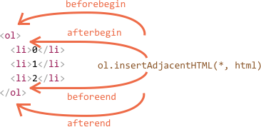

# Modifying DOM

Modifying DOM is the key to create "live" pages.

Here we'll see how to create new elements "on the fly" and modify the existing page content.

There are many methods for that. First we'll see a simple example and then explain them.

[cut]

## Example: show a message

For the start, let's see how to add a message on the page, that looks nicer than `alert`.

Here's how it will look:

```html autorun height="80"
<style>
.alert {
  padding: 15px;
  border: 1px solid #d6e9c6;
  border-radius: 4px;
  color: #3c763d;
  background-color: #dff0d8;
}
</style>

*!*
<div class="alert">
  <strong>Hi there!</strong> You've read an important message.
</div>
*/!*
```

Now let's create the same `div` with Javascript.

## Creating an element


To create DOM nodes, there are two methods:

`document.createElement(tag)`
: Creates a new element with the given tag:

    ```js
    let div = document.createElement('div');
    ```

`document.createTextNode(text)`
: Creates a new *text node* with the given text:

    ```js
    let textNode = document.createTextNode('Here I am');
    ```

### Creating the message

In our case we want to make a `div`, add classes and the message into it:

```js
let div = document.createElement('div');
div.className = "alert alert-success";
div.innerHTML = "<strong>Hi there!</strong> You've read an important message.";
```

After that, we have a ready DOM element. Right now it's in the variable `div`, but not yet seen, because not inserted into the page.

## Insertion methods

To make the `div` show up, we need to insert it somewhere into `document`.

Let's say we want to insert it into `parentElem`, like `let parentElem=document.body`.

There exist following methods to insert a node:

`parentElem.appendChild(elem)`
: Appends `elem` as the last child of `parentElem`.

    The following example adds a new `<li>` to the end of `<ol>`:

    ```html run height=100
    <ol id="list">
      <li>0</li>
      <li>1</li>
      <li>2</li>
    </ol>

    <script>
      let newLi = document.createElement('li');
      newLi.innerHTML = 'Hello, world!';

      list.appendChild(newLi);
    </script>
    ```

`parentElem.insertBefore(elem, nextSibling)`
: Inserts `elem` before `nextSibling` into `parentElem`.

    The following code inserts a new list item before the second `<li>`:

    ```html run height=100
    <ol id="list">
      <li>0</li>
      <li>1</li>
      <li>2</li>
    </ol>
    <script>
      let newLi = document.createElement('li');
      newLi.innerHTML = 'Hello, world!';

    *!*
      list.insertBefore(newLi, list.children[1]);
    */!*
    </script>
    ```

    To insert as the first element, we can do like this:

    ```js
    list.insertBefore(newLi, list.firstChild);
    ```

`parentElem.replaceChild(elem, oldChild)`
: Replaces `oldChild` with `elem` among children of `parentElem`.

All these methods return the inserted node. In other words, `parentElem.appendChild(elem)` returns `elem`. But usually the returned value is not used, we just run the method.

For our example, it would be like this:

```html run height="80"
<style>
.alert {
  padding: 15px;
  border: 1px solid #d6e9c6;
  border-radius: 4px;
  color: #3c763d;
  background-color: #dff0d8;
}
</style>

<script>
*!*
  let div = document.createElement('div');
  div.className = "alert alert-success";
  div.innerHTML = "<strong>Hi there!</strong> You've read an important message.";

  document.body.appendChild(div);
*/!*
</script>
```

These methods are "old school": they exist from the ancient times and we can meet them in many old scripts.

Unfortunately, there are some tasks that are hard to solve with them.

For instance, how to insert *html* if we have it as a string? Or, given a node, how to insert something not into it, but *before* it?

Of course, all that is solvable, but not in an elegant way.

So there exist two other sets of insertion methods to handle all cases easily.

### prepend/append/before/after

This set of methods provides more flexible insertions:

- `node.append(...nodes or strings)` -- append nodes or strings at the end of `node`,
- `node.prepend(...nodes or strings)` -- insert nodes or strings into the beginning of `node`,
- `node.before(...nodes or strings)` –- insert nodes or strings before the `node`,
- `node.after(...nodes or strings)` –- insert nodes or strings after the `node`,
- `node.replaceWith(...nodes or strings)` –- replaces `node` with the given nodes or strings.

Let's say we have a list, like this:

```html autorun
<ol id="ol">
  <li>0</li>
  <li>1</li>
  <li>2</li>
</ol>

<script>
  ol.before('before');
  ol.after('after');

  let prepend = document.createElement('li');
  prepend.innerHTML = 'prepend';
  ol.prepend(prepend);  

  let append = document.createElement('li');
  append.innerHTML = 'append';
  ol.append(append);
</script>
```

Here's where the insertions will go:


So the final list will be:

```html
before
<ol id="ol">
  <li>prepend</li>
  <li>0</li>
  <li>1</li>
  <li>2</li>
  <li>append</li>
</ol>
after
```

These methods can insert a list of nodes and text pieces. But please note: all text is inserted *as text*.

For instance, here a string and an element are inserted:

```html run
<div id="div"></div>
<script>
  div.before('<p>Hello</p>', document.createElement('hr'));
</script>
```

The final HTML would be:

```html run
*!*
&lt;p&gt;Hello&lt;/p&gt;
*/!*
<hr>
<div id="div"></div>
```

In other words, strings are inserted exactly "as text", in a safe way, like `elem.textContent` does it.

So, these methods allow to insert DOM nodes or text pieces at given places.

But what if we want to insert HTML "as html", with all tags and stuff working, like `elem.innerHTML` does it?

### insertAdjacentHTML/Text/Element

There's a versatile method `elem.insertAdjacentHTML(where, html)`.

The first parameter is a string, specifying where to insert, must be one of the following:

- `"beforebegin"` -- insert `html` before `elem`,
- `"afterbegin"` -- insert `html` into `elem`, at the beginning,
- `"beforeend"` -- insert `html` into `elem`, at the end,
- `"afterend"` -- insert `html` after `elem`.

The second parameter `html` is a HTML string, inserted "as is".

For instance:

```html run
<div id="div"></div>
<script>
  div.insertAdjacentHTML('beforebegin', '<p>Hello</p>');
</script>
```

...Would lead to:

```html run
<p>Hello</p>
<div id="div"></div>
```

That's how we can append an arbitrary HTML to our page.

Here's the picture of insertion variants:



We definitely can notice similarities between this and the previous picture. The insertion points are actually the same, but here we can insert HTML.

The method has two brothers:

- `elem.insertAdjacentText(where, text)` -- the same syntax, but a string of `text` in inserted "as text" instead of HTML,
- `elem.insertAdjacentElement(where, elem)` -- the same syntax, but inserts an element.

They exist mainly to make the syntax "uniform". In practice, most of time only `insertAdjacentHTML` is used, because for elements and text we have methods `append/prepend/before/after` -- they are just shorter to write.

So here's an alternative variant of showing a message:

```html run
<style>
.alert {
  padding: 15px;
  border: 1px solid #d6e9c6;
  border-radius: 4px;
  color: #3c763d;
  background-color: #dff0d8;
}
</style>

<script>
  document.body.insertAdjacentHTML("afterbegin", `<div class="alert alert-success">
    <strong>Hi there!</strong> You've read an important message.
  </div>`);
</script>
```

## Cloning nodes: cloneNode

How to insert one more similar message?

We could do a message-generating function and put the code there. But the alternative way would be to *clone* the existing `div` and modify the text inside it.

Sometimes when we have a big element, that may be faster and simpler.

The call `elem.cloneNode(true)` creates a "deep" clone of the element -- with all attributes and subelements. If we call it with `false`, then there would be no child elements.

An example of copying the message:

```html run height="120"
<style>
.alert {
  padding: 15px;
  border: 1px solid #d6e9c6;
  border-radius: 4px;
  color: #3c763d;
  background-color: #dff0d8;
}
</style>

<div class="alert" id="div">
  <strong>Hi there!</strong> You've read an important message.
</div>

<script>
*!*
  let div2 = div.cloneNode(true); // clone the message
  div2.querySelector('strong').innerHTML = 'Bye there!'; // change the clone

  div.after(div2); // show the clone after the existing div
*/!*
</script>
```

## Removal methods

To remove nodes, there are following methods:


`parentElem.removeChild(node)`
: Removes `elem` from  `parentElem` (assuming it's a child).

`node.remove()`
: Removes the `node` from its place.

We can easily see that the second method is much shorter. The first one exists for historical reasons.

````smart
If we want to *move* an element to another place -- there's no need to remove it from the old one.

**All insertion methods automatically remove the node from the old place.**

For instance, let's swap elements:

```html run height=50
<div id="first">First</div>
<div id="second">Second</div>
<script>
  // no need to call remove
  second.after(first); // after second insert first
</script>
```
````

Let's make our message to disappear after a second:

```html run untrusted
<style>
.alert {
  padding: 15px;
  border: 1px solid #d6e9c6;
  border-radius: 4px;
  color: #3c763d;
  background-color: #dff0d8;
}
</style>

<script>
  let div = document.createElement('div');
  div.className = "alert alert-success";
  div.innerHTML = "<strong>Hi there!</strong> You've read an important message.";

  document.body.append(div);
*!*
  setTimeout(div => div.remove(), 1000);
  // or setTimeout(div => document.body.removeChild(div), 1000);
*/!*
</script>
```

## Summary

Methods to create new nodes:

- `document.createElement(tag)` -- creates an element with the given tag,
- `document.createTextNode(value)` -- creates a text node (rarely used),
- `elem.cloneNode(deep)` -- clones the element, if `deep==true` then with all descendants.  

Insertion and removal of nodes:

- From the parent:
  - `parent.appendChild(elem)`
  - `parent.insertBefore(elem, nextSibling)`
  - `parent.removeChild(elem)`
  - `parent.replaceChild(newElem, elem)`

  all thes methods return `elem`.

- Given a node:
  - `node.append(...nodes or strings)` -- insert into `node`, at the end,
  - `node.prepend(...nodes or strings)` -- insert into `node`, at the beginning,
  - `node.before(...nodes or strings)` –- insert right before `node`,
  - `node.after(...nodes or strings)` –- insert right after `node`,
  - `node.replaceWith(...nodes or strings)` –- replace `node`.
  - `node.remove()` –- remove the `node`.

  All these methods accept a list of DOM nodes or text strings. Text strings are inserted "as text".

- To insert HTML: `elem.insertAdjacentHTML(where, html)`, inserts depending on where:
  - `"beforebegin"` -- insert `html` right before `elem`,
  - `"afterbegin"` -- insert `html` into `elem`, at the beginning,
  - `"beforeend"` -- insert `html` into `elem`, at the end,
  - `"afterend"` -- insert `html` right after `elem`.

  Also there are similar methods `elem.insertAdjacentText` and `elem.insertAdjacentElement`, they  insert text strings and elements, but they are rarely used.
