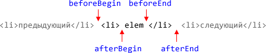

# Мультивставка: insertAdjacentHTML и DocumentFragment

Обычные методы вставки работают с одним узлом. Но есть и способы вставлять множество узлов одновременно.
[cut]
## Оптимизация вставки в документ

Рассмотрим задачу: сгенерировать список `UL/LI`. 

Есть две возможных последовательности:

<ol>
<li>Сначала вставить `UL` в документ, а потом добавить к нему `LI`:

```js
var ul = document.createElement('ul');
document.body.appendChild(ul); // сначала в документ
for(...) ul.appendChild(li);   // потом узлы
```

</li>
<li>Полностью создать список "вне DOM", а потом -- вставить в документ:

```js
var ul = document.createElement('ul');
for(...) ul.appendChild(li);   // сначала вставить узлы
document.body.appendChild(ul); // затем в документ
```

</li>
</ol>

Как ни странно, между этими последовательностями есть разница. В большинстве браузеров, второй вариант -- быстрее.

Почему же? Иногда говорят: "потому что браузер перерисовывает каждый раз при добавлении элемента". Это не так. **Дело вовсе не в перерисовке**.

Браузер достаточно "умён", чтобы ничего не перерисовывать понапрасну. В большинстве случаев процессы перерисовки и сопутствующие вычисления будут отложены до окончания работы скрипта, и на тот момент уже совершенно без разницы, в какой последовательности были изменены узлы.

**Тем не менее, при вставке узла происходят разные внутренние события и обновления внутренних структур данных, скрытые от наших глаз.**

Что именно происходит -- зависит от конкретной, внутренней браузерной реализации DOM, но это отнимает время. Конечно, браузеры развиваются и стараются свести лишние действия к минимуму. 

### Бенчмарк [#insert-bench-tbody]

Чтобы легко проверить текущее состояние дел -- вот два бенчмарка. 

Оба они создают таблицу 20x20, наполняя <code>TBODY</code> элементами <code>TR/TD</code>. 

При этом первый вставляет все в документ тут же, второй -- задерживает вставку <code>TBODY</code> в документ до конца процесса.

Кликните, чтобы запустить.

<input type="button" onclick="alert(bench(appendFirst,50))" value="TBODY cразу в DOM"/> <input type="button" onclick="alert(bench(appendLast,50))" value="Отложенная вставка TBODY в DOM"/>
  
<table id="bench-table"></table>

```js
//+ hide="открыть код" src="insert-bench.js"
```

## Добавление множества узлов

Продолжим работать со вставкой узлов. 

Рассмотрим случай, когда в документе *уже есть* большой список `UL`. И тут понадобилось срочно добавить еще 20 элементов `LI`.

Как это сделать?

Если новые элементы пришли в виде строки, то можно попробовать добавить их так:

```js
ul.innerHTML += "<li>1</li><li>2</li>...";
```

Но операция `+=` с `innerHTML` не работает с DOM. Она не прибавляет, а заменяет всё содержимое списка на дополненную строку. Это не только медленно, но все внешние ресурсы (картинки) будут загружены заново! Так лучше не делать.

А если нужно вставить в середину списка? Здесь `innerHTML` вообще не поможет.

Можно, конечно, вставить строку во временный DOM-элемент и перенести оттуда элементы, но есть и гораздо лучший вариант: метод `insertAdjacentHTML`!

## insertAdjacent*

Метод [insertAdjacentHTML](https://developer.mozilla.org/en/DOM/element.insertAdjacentHTML) позволяет вставлять произвольный HTML в любое место документа, в том числе *и между узлами*!

Он поддерживается всеми браузерами, кроме Firefox меньше версии 8, ну а там его можно эмулировать.

Синтаксис:

```js
elem.insertAdjacentHTML(where, html);
```

<dl>
<dt>`html`</dt>
<dd>Строка HTML, которую нужно вставить</dd>
<dt>`where`</dt>
<dd>Куда по отношению к `elem` вставлять строку. Всего четыре варианта:
<ol>
<li>`beforeBegin` -- перед `elem`.</li>
<li>`afterBegin` -- внутрь `elem`, в самое начало.</li>
<li>`beforeEnd` -- внутрь `elem`, в конец.</li>
<li>`afterEnd` -- после `elem`.</li>
</ol>
</dd>



Например, вставим пропущенные элементы списка *перед* `<li>5</li>`:

```html
<!--+ run -->
<ul>
  <li>1</li>
  <li>2</li>
  <li>5</li>
</ul>

<script>
var ul = document.body.children[0];
var li5 = ul.children[2];

li5.insertAdjacentHTML("beforeBegin", "<li>3</li><li>4</li>");
</script>
```

Единственный недостаток этого метода -- он не работает в Firefox до версии 8. Но его можно легко добавить, используя следующий JavaScript: [insertAdjacentFF.js](/files/tutorial/browser/dom/insertAdjacentFF.js).

У этого метода есть "близнецы-братья", которые поддерживаются везде, кроме FF, но в него они добавляются этим же скриптом:

<ul>
<li>[elem.insertAdjacentElement(where, newElem)](http://help.dottoro.com/ljbreokf.php) -- вставляет в произвольное место не строку HTML, а элемент `newElem`.</li>
<li>[elem.insertAdjacentText(where, text)](http://help.dottoro.com/ljrsluxu.php) -- создаёт текстовый узел из строки `text` и вставляет его в указанное место относительно `elem`.</li>
</ul>

Синтаксис этих методов, за исключением последнего параметра, полностью совпадает с `insertAdjacentHTML`. Вместе они образуют "универсальный швейцарский нож" для вставки чего угодно куда угодно.

## DocumentFragment

[warn header="Важно для старых браузеров"]
Оптимизация, о которой здесь идёт речь, важна в первую очередь для старых браузеров, включая IE9-. В современных браузерах эффект от нее, как правило, не превышает 20%, а иногда может быть и отрицательным.
[/warn]

До этого мы говорили о вставке строки в DOM. А что делать в случае, когда надо в существующий `UL` вставить много *DOM-элементов*?

Можно вставлять их один за другим, вызовом `insertBefore/appendChild`, но при этом получится много операций с большим живым документом. 

**Вставить пачку узлов единовременно поможет `DocumentFragment`. Это особенный *кросс-браузерный* DOM-объект, который похож на обычный DOM-узел, но им не является.**

Синтаксис для его создания:

```js
var fragment = document.createDocumentFragment();
```

В него можно добавлять другие узлы.

```js
fragment.appendChild(node);
```

Его можно клонировать:

```js
fragment.cloneNode(true); // клонирование с подэлементами
```

**У `DocumentFragment` нет обычных свойств DOM-узлов, таких как `innerHTML`, `tagName` и т.п. Это не узел.**

**"Фишка" заключается в том, что когда `DocumentFragment` вставляется в DOM -- то он исчезает, а вместо него вставляются его дети. Это свойство является уникальной особенностью `DocumentFragment`.**

Например, если добавить в него много `LI`, и потом `appendChild` к `UL`, то фрагмент растворится, и в DOM вставятся именно `LI`, причём в том же порядке, в котором были во фрагменте.

Псевдокод:

```js
// хотим вставить в список UL много LI

// делаем вспомогательный DocumentFragment
var fragment = document.createDocumentFragment();

for (цикл по li) {
  fragment.appendChild(list[i]); // вставить каждый LI в DocumentFragment 
}

ul.appendChild(fragment);   // вместо фрагмента вставятся элементы списка
```

В современных браузерах эффект от такой оптимизации может быть различным. Чтобы понять текущее положение вещей, попробуйте в различных браузерах следующий небольшой бенчмарк.

При нажатии на кнопки ниже в список добавляются `100` элементов. 
[pre]
<div>
<input type="button" onclick="alert(bench(DocumentFragmentTest.insertPlain,200))" value="Обычная вставка"/>
<input type="button" onclick="alert(bench(DocumentFragmentTest.insertDocumentFragment,200))" value="Вставка через DocumentFragment">
</div>
  [/pre]
<ul id="bench-list"></ul>


<script src="/files/tutorial/browser/dom/documentfragment-bench.js"></script>

```js
//+ hide="открыть код" src="documentfragment-bench.js"
```

## Итого

<ul>
<li>**Манипуляции, меняющие структуру DOM (вставка, удаление элементов), как правило, быстрее с отдельным маленьким узлом, чем с большим DOM, который находится в документе.** 

Конкретная разница зависит от внутренней реализации DOM в браузере.</li>
<li>**Семейство методов `elem.insertAdjacentHTML(where, html)`, `insertAdjacentElement`, `insertAdjacentText` позволяет вставлять HTML/элемент/текст в произвольное место документа.**

Метод `insertAdjacentHTML` не поддерживается в Firefox до версии 8, остальные два метода не поддерживаются в Firefox, на момент написания текста, вообще, но есть небольшой скрипт  [insertAdjacentFF.js](/files/tutorial/browser/dom/insertAdjacentFF.js), который добавляет их. Конечно, он нужен только для Firefox.
</li>
<li>**`DocumentFragment` позволяет минимизировать количество вставок в большой живой DOM. Эта оптимизация особо эффективна в старых браузерах, в новых эффект от неё меньше.**

Элементы сначала вставляются в него, а потом -- он вставляется в DOM. При вставке `DocumentFragment` "растворяется", и вместо него вставляются содержащиеся в нём узлы.

`DocumentFragment`, в отличие от `insertAdjacent*`, работает с коллекцией DOM-узлов.
</li>
</ul>


[head]
<script>
function bench(test, times) {
   var sum = 0;
   for(var i=0; i<times; i++) {
      if(test.setup) test.setup();
      var t = new Date();
      test.work();
      sum += (new Date() - t);
      if(test.tearDown) test.tearDown();
   }
   return sum;
}
/* 1. Вставляет TBODY в документ сразу. а затем элементы */
var appendFirst = new function() {
  var benchTable;

  this.setup = function() {
    // очистить всё
    benchTable = document.getElementById('bench-table')
    while(benchTable.firstChild) {
      benchTable.removeChild(benchTable.firstChild);
    }
  }

  this.work = function() {
    // встаить TBODY и элементы
    var tbody = document.createElement('TBODY');
    benchTable.appendChild(tbody);

    for(var i=0; i<20; i++) {
      var tr = document.createElement('TR');
      tbody.appendChild(tr);
      for(var j=0; j<20; j++) {
        var td = document.createElement('td');
        td.appendChild(document.createTextNode(''+i.toString(20)+j.toString(20)));
        tr.appendChild(td);
      }
    }
  }

}

/* 2. Полностью делает TBODY, а затем вставляет в документ */
var appendLast = new function() {
  var benchTable;

  this.setup = function() {
    // очистить всё
    benchTable = document.getElementById('bench-table');
    while(benchTable.firstChild) {
      benchTable.removeChild(benchTable.firstChild);
    }
  }

  this.work = function() {
    var tbody = document.createElement('TBODY');

    for(var i=0; i<20; i++) {
      var tr = document.createElement('TR');
      tbody.appendChild(tr);
      for(var j=0; j<20; j++) {
        var td = document.createElement('td');
        tr.appendChild(td);
        td.appendChild(document.createTextNode(''+i.toString(20)+j.toString(20)));
      }
    }

    benchTable.appendChild(tbody);
  }

}
</script>

<style>
##bench-table td {
  padding: 0;
}

##bench-list li {
  display: inline-block;
  margin: 0;
  padding: 2px;
  list-style-image: none;
  list-style: none;
}

</style>
[/head]