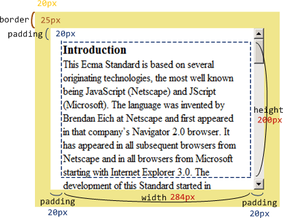
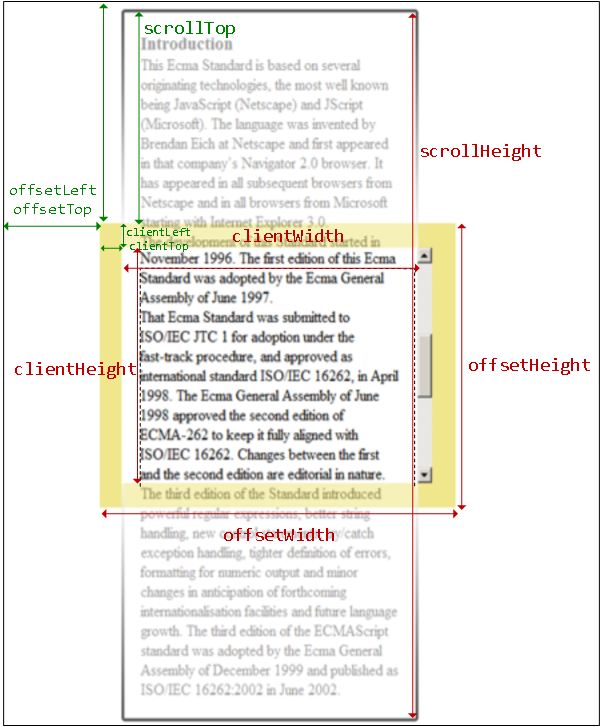
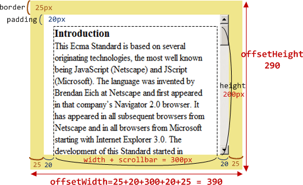
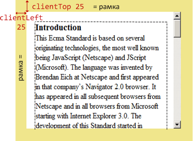
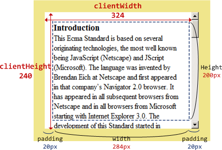
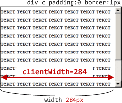
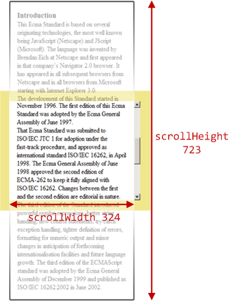
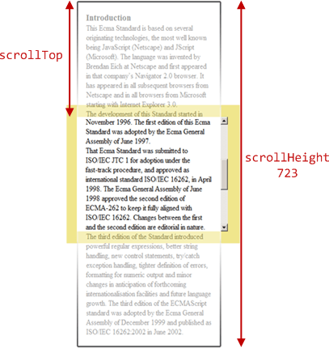

# Размеры и прокрутка элементов 

Для того, чтобы показывать элементы на произвольных местах страницы, необходимо во-первых, знать CSS-позиционирование, а во-вторых -- уметь работать с "геометрией элементов" из JavaScript.

В этой главе мы поговорим о размерах элементов DOM, способах их вычисления и *метриках* -- различных свойствах, которые содержат эту информацию.

[cut]

## Метрики: образец документа

Мы будем использовать для примера вот такой элемент, у которого есть рамка (border), поля (padding), отступы (margin) и прокрутка:

```html
<div id="example">
  ...Текст...
</div>
<style>
  #example {
    width: 300px;
    height: 200px;

    border: 25px solid #F0E68C; /* рамка 25px */

    padding: 20px;              /* поля 20px */
    margin: 20px;               /* отступы 20px */

    overflow: auto;             /* прокрутка */
  }
</style>
```

Результат выглядит так:



Вы можете открыть этот документ [edit src="metric"]в песочнице[/edit].

У элементов существует ряд свойств, содержащих их внешние и внутренние размеры. Мы будем называть их "метриками".

Метрики, в отличие от свойств CSS, содержат числа, всегда в пикселях и без единиц измерения на конце.

Вот общая картина:



На картинке все они с трудом помещаются, но, как мы увидим далее, их значения просты и понятны.

Будем исследовать их снаружи элемента и вовнутрь.

## offsetWidth/Height

Эти свойства дают "внешнюю" ширину/высоту элемента, то есть его полный размер, включая рамки `border`, но исключая внешние отступы `margin`.

В примере выше:
<ul>
<li>`offsetWidth = 390` -- внешняя ширина блока</li>
<li>`offsetHeight = 290` -- внешняя высота блока</li>
</ul>



## offsetParent, offsetLeft/Top

[warn header="Используются редко..."]
Ситуации, когда эти свойства нужны, можно перечислить по пальцам. Они возникают действительно редко. Как правило, эти свойства используют по ошибке, потому что не знают средств правильной работы с координатами, о которых мы поговорим позже. 
[/warn]

В `offsetParent` -- ссылка родительский элемент в смысле отображения на странице.

Уточним, что имеется в виду.

Когда браузер рисует страницу, то он высчитывает дерево расположения элементов, иначе говоря "дерево геометрии" или "дерево рендеринга".

Обычно элементы вложены друг в друга и структура дерева рендеринга повторяет DOM.

Но, к примеру, если у элемента стоит `position: absolute`, то его расположение вычисляется уже не относительно непосредственного родителя `parentNode`, а относительно ближайшего <a href="http://www.w3.org/TR/CSS21/visuren.html#position-props">позиционированного элемента</a> (т.е. свойство `position` которого не равно `static`), или `BODY`, если таковой отсутствует. 

Получается, что элемент имеет в дополнение к родителю в DOM -- ещё одного "родителя" в плане позиционирования, то есть относительно которого он рисуется. Этот элемент и будет в свойстве `offsetParent`.

Свойства `offsetLeft/Top` задают смещение относительно `offsetParent`.

В примере ниже внешний `<div>` является родителем внутреннего по позиционированию, и отступ от него будет в `offsetLeft/Top`:

```html
<div style="position: relative">
  <form>
    <div style="position: absolute; left: 180px; top: 180px">...</div>
  </form>
</div>
```


[smart header="Метрики для невидимых элементов равны нулю."]

Координаты и размеры в JavaScript устанавливаются только для *видимых* элементов.

Для элементов с `display:none` или находящихся вне документа дерево рендеринга не строится. Для них метрики равны нулю. Кстати, и `offsetParent` для таких элементов тоже `null`.

Это дает нам **замечательный способ для проверки, виден ли элемент**:

```js
function isHidden(elem)
  return !elem.offsetWidth && !elem.offsetHeight;
}
```

<ul>
<li>Работает, даже если родителю элемента установлено свойство `display:none`.</li>
<li>Работает для всех элементов, кроме `TR`, с которым возникают некоторые проблемы в разных браузерах. Обычно, проверяются не `TR`, поэтому всё ок.</li>
<li>Считает элемент видимым, даже если позиционирован за пределами экрана или  имеет свойство `visibility:hidden`.</li>
<li>"Схлопнутый" элемент, например пустой `div` без высоты и ширины, будет считаться невидимым.</li>
</ul>
[/smart]


### clientTop/Left

Отступ внутренней части элемента от внешней.

Другими словами, это ширина верхней/левой рамки(border) в пикселях.

В нашем примере:
<ul>
<li>`clientLeft = 25` -- ширина левой рамки</li>
<li>`clientTop = 25` -- ширина верхней рамки</li>
</ul>



Казалось бы, зачем еще какие-то свойства, если ширину рамки можно получить напрямую из CSS? Да, можно. Обычно они действительно не нужны.

Но в случае, когда документ располагается *справа налево* (арабский язык, иврит), полоса прокрутки находится слева, и тогда свойство `clientLeft` включает в себя еще и ширину полосы прокрутки.

## clientWidth/Height

Эти свойства -- размер внутренней зоны элемента внутри рамок `border`. 

Она включает в себя как ширину содержимого `width`, так и поля `padding`:



Как видно на рисунке выше, `clientWidth` в нашем документе складывается из ширины области содержимого (`284px`) плюс левый и правый `padding` (по `20px`), то есть всего `324px`.

Аналогично, `clientHeight` -- это высота области содержимого (`200px`) плюс верхний и нижний `padding` (по `20px`), то есть `240px`. На рисунке выше нижний `padding` заполнен текстом, но это неважно: по правилам он всегда входит в `clientHeight`.


**Если `padding` нет, то `clientWidth/Height` в точности равны размеру области содержимого, внутри рамок и полосы прокрутки.**



Поэтому в тех случаях, когда мы точно знаем, что `padding` нет, их используют для определения внутренних размеров элемента.

## scrollWidth/Height

Эти свойства -- аналоги `clientWidth/clientHeight`, но с учетом прокрутки.

Свойства `clientWidth/clientHeight` относятся только к видимой области элемента, а `scrollWidth/scrollHeight` добавляют к ней прокрученную по горизонтали/вертикали.

На рисунке выше:
<ul>
<li>`scrollHeight = 723` -- полная высота, включая прокрученную область</li>
<li>`scrollWidth = 324` -- полная ширина, включая прокрученную область</li>
</ul>



Эти свойства можно использовать, чтобы "распахнуть" элемент на всю ширину/высоту:

```js
element.style.height = element.scrollHeight + 'px';
```

[online]
[pre no-typography]
Нажмите на кнопку, чтобы распахнуть элемент:

<div id="scrollOpen" style="width:300px;height:200px; padding: 0;overflow: auto; border:1px solid black;">текст текст текст текст текст текст текст текст текст текст текст текст текст текст текст текст текст текст текст текст текст текст текст текст текст текст текст текст текст текст текст текст текст текст текст текст текст текст текст текст текст текст текст текст текст текст текст текст текст текст текст текст текст текст текст текст текст текст текст текст текст текст текст текст текст текст текст текст текст текст текст текст текст текст текст текст текст текст текст текст текст текст текст текст текст текст текст текст текст текст текст текст текст текст текст текст текст текст текст текст текст текст текст текст текст</div>

<button style="padding:0" onclick="document.getElementById('scrollOpen').style.height = document.getElementById('scrollOpen').scrollHeight + 'px'">element.style.height = element.scrollHeight + 'px'</button>
[/pre]
[/online]


## scrollLeft/scrollTop

Свойства `scrollLeft/scrollTop` -- ширина/высота невидимой, прокрученной в данный момент, части элемента слева и сверху.

Следующее иллюстрация показывает значения `scrollHeight` и `scrollTop` для блока с вертикальной прокруткой.



[smart header="`scrollLeft/scrollTop` можно изменять"]
В отличие от большинства свойств, которые доступны только для чтения, значения `scrollLeft/scrollTop` можно изменить, и браузер выполнит прокрутку элемента.

[online]
При клике на следующий элемент будет выполняться код `elem.scrollTop += 10`. Поэтому он будет прокручиваться на `10px` вниз:

<div onclick="this.scrollTop+=10" style="cursor:pointer;border:1px solid black;width:100px;height:80px;overflow:auto">Кликни<br>Меня<br>1<br>2<br>3<br>4<br>5<br>6<br>7<br>8<br>9</div>
[/online]
[/smart]


## Не стоит брать width/height из CSS

Теперь несколько слов о том, как не надо делать.

Как мы знаем, CSS-высоту и ширину можно установить с помощью `elem.style` и извлечь, используя `getComputedStyle`, которые в подробностях обсуждаются в главе [](/styles-and-classes).

Получение ширины элемента может быть таким:

```js
//+ run
var elem = document.body;

alert( getComputedStyle(elem).width ); // вывести CSS-ширину для elem
```

Всегда ли такой подход сработает? Увы, нет!

<ol>
<li>Во-первых, CSS-свойства `width/height` зависят от другого свойства -- `box-sizing`, которое определяет, что такое, собственно, эти ширина и высота. Получается, что изменение этого свойства, к примеру, для более удобной вёрстки, может сломать JavaScript.</li>
<li>Во-вторых, свойства `width/height` могут быть равны `auto`, например, для инлайн-элемента:

```html
<!--+ run -->
<span id="elem">Привет!</span>

<script>
*!*
  alert( getComputedStyle(elem).width );  // auto
*/!*
</script>
```
</li>
</ol>


Конечно, с точки зрения CSS размер `auto`  -- совершенно нормально, но нам-то в JavaScript нужен конкретный размер в пикселях, который мы могли бы использовать для вычислений. Получается, что в данном случае ширина `width` из CSS вообще бесполезна.

## Полоса прокрутки и содержимое

Полоса прокрутки -- причина многих проблем и недопониманий. Как говорится, "дьявол кроется в деталях". Недопустимо, чтобы наш код работал на элементах без прокрутки и начинал "глючить" с ней. 

При наличии вертикальной полосы прокрутки, она как правило забирает себе место из "области содержимого" элемента.

И это учитывают свойства `clientWidth/clientHeight`.

...Но при этом некоторые браузеры отражают реальное уменьшение ширины в результате `getComputedStyle(elem).width`, а некоторые -- нет.

В примере ниже у элемента с текстом в стилях указано `width:300px`. А вот `getComputedStyle` возвращает значение от `280px` до `300px`, в зависимости от ОС и браузера.

[online]
Если ваш браузер в принципе показывает полосу прокрутки (например, под Windows почти все браузеры так делают), то вы можете протестировать это сами, нажав на кнопку в ифрейме ниже:
[/online]

[iframe src="cssWidthScroll" link border=1]

Описанные разночтения касаются только чтения свойства `getComputedStyle(...).width` из JavaScript, визуальное отображение корректно в обоих случаях -- ширина текста при наличии прокрутки в обоих случаях уменьшается.

Этот пример важен, чтобы ещё лучше понять: CSS-свойство `width` не следует использовать в JavaScript. А стоит использовать метрики, которые мы разобрали в этом разделе.


## Итого

У элементов есть следующие метрики:
<ul>
<li>`clientWidth/clientHeight` -- ширина/высота видимой области, включая поля, но не полосы прокрутки.</li>
<li>`clientLeft/clientTop` -- ширина левой/верхней рамки или, точнее, сдвиг клиентской области, относительно верхнего левого угла блока.
Используется, преимущественно, в IE<8 для вычисления сдвига `document.body`.
</li>
<li>`scrollWidth/scrollHeight` -- ширина/высота прокручиваемой области. Включает в себя `padding` и не включает полосы прокрутки.</li>
<li>`scrollLeft/scrollTop` -- ширина/высота прокрученной части документа, считается от верхнего левого угла.</li>
<li>`offsetWidth/offsetHeight` -- "внешняя" ширина/высота блока, не считая отступов.</li>
<li>`offsetParent` -- "родитель по дереву рендеринга" -- ближайшая ячейка таблицы, body для статического позиционирования или ближайший позиционированный элемент для других типов позиционирования.</li>
<li>`offsetLeft/offsetTop` -- позиция в пикселях левого верхнего угла блока, относительно его `offsetParent`.</li>
</ul>

Все свойства, доступны только для чтения, кроме `scrollLeft/scrollTop`. Изменение этих свойств заставляет браузер прокручивать элемент.

В этой главе мы считали, что страница находится в режиме соответствия стандартам. В режиме совместимости -- некоторые старые браузеры требуют `document.body` вместо `documentElement`, в остальном всё так же. Конечно, по возможности, стоит использовать только режим соответствия стандарту.

