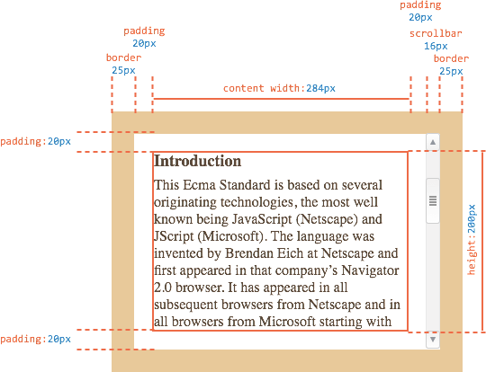
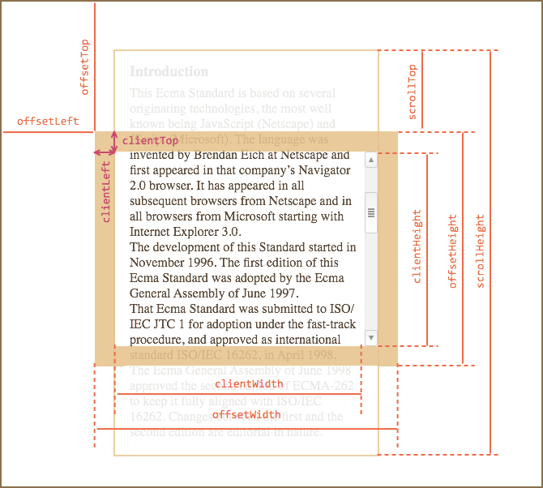
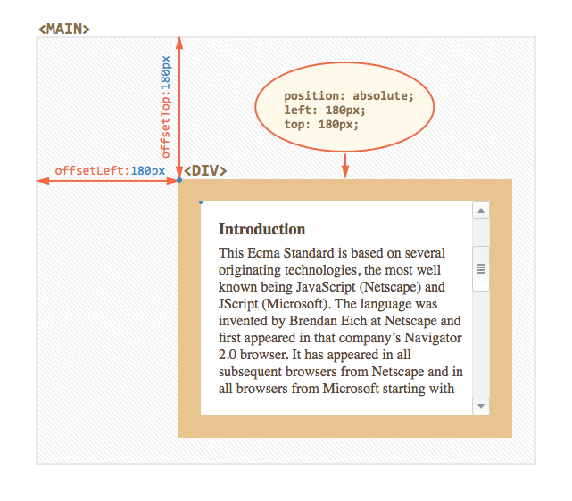
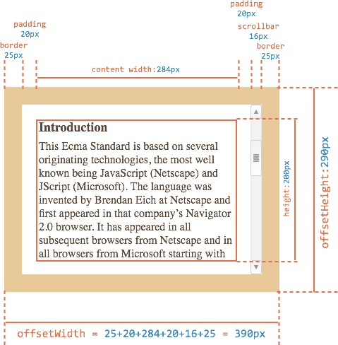
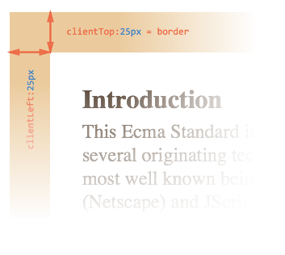
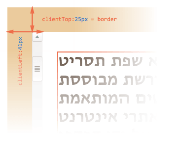
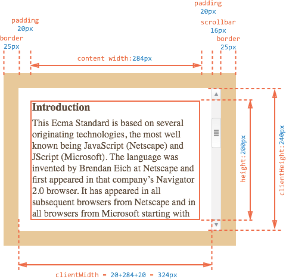
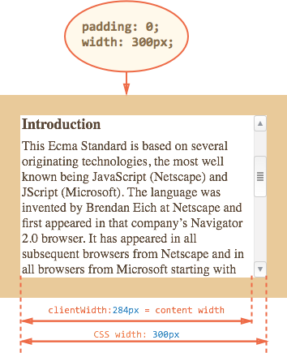
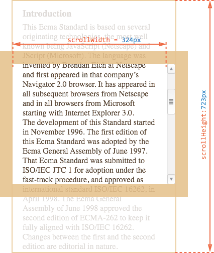
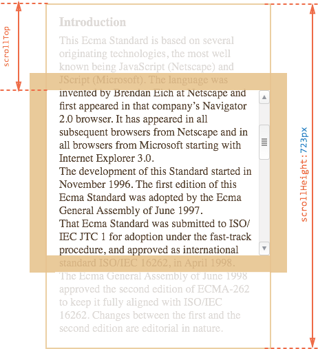

# Размеры и прокрутка элементов 

Для того, чтобы показывать элементы на произвольных местах страницы, необходимо во-первых, знать CSS-позиционирование, а во-вторых -- уметь работать с "геометрией элементов" из JavaScript.

В этой главе мы поговорим о размерах элементов DOM, способах их вычисления и *метриках* -- различных свойствах, которые содержат эту информацию.

[cut]

## Образец документа

Мы будем использовать для примера вот такой элемент, у которого есть рамка (border), поля (padding), и прокрутка:

```html
<!--+ no-beautify -->
<div id="example">
  ...Текст...
</div>
<style>
  #example {
    width: 300px;

    height: 200px;

    border: 25px solid #E8C48F; /* рамка 25px */

    padding: 20px;              /* поля 20px */

    overflow: auto;             /* прокрутка */
  }
</style>
```

У него нет отступов `margin`, в этой главе они не важны, так как метрики касаются именно размеров самого элемента, отступы в них не учитываются.

Результат выглядит так:



Вы можете открыть [edit src="metric"]этот документ в песочнице[/edit].

[smart header="Внимание, полоса прокрутки!"]
В иллюстрации выше намеренно продемонстрирован самый сложный и полный случай, когда у элемента есть ещё и полоса прокрутки.

В этом случае полоса прокрутки "отодвигает" содержимое вместе с `padding` влево, отбирая у него место.

Именно поэтому ширина содержимого обозначена как `content width` и равна `284px`, а не `300px`, как в CSS. 

Точное значение получено в предположении, что ширина полосы прокрутки равна `16px`, то есть после её вычитания на содержимое остаётся `300 - 16 = 284px`. Конечно, она сильно зависит от браузера, устройства, ОС.

Мы должны в точности понимать, что происходит с размерами элемента при наличии полосы прокрутки, поэтому на картинке выше это отражено.
[/smart]

[smart header="Поле `padding` заполнено текстом"]
Обычно поля `padding` изображают пустыми, но так как текста много, то он заполняет нижнее поле `padding-bottom` в примере выше. 

Во избежание путаницы заметим, что `padding` там, всё же, есть. Поля `padding` по CSS в элементе выше одинаковы со всех сторон. А такое заполнение -- нормальное поведение браузера.
[/smart]

## Метрики

У элементов существует ряд свойств, содержащих их внешние и внутренние размеры. Мы будем называть их "метриками".

Метрики, в отличие от свойств CSS, содержат числа, всегда в пикселях и без единиц измерения на конце.

Вот общая картина:




На картинке все они с трудом помещаются, но, как мы увидим далее, их значения просты и понятны.

Будем исследовать их снаружи элемента и вовнутрь.


## offsetParent, offsetLeft/Top

Ситуации, когда эти свойства нужны, можно перечислить по пальцам. Они возникают действительно редко. Как правило, эти свойства используют, потому что не знают средств правильной работы с координатами, о которых мы поговорим позже. 

Несмотря на то, что эти свойства нужны реже всего, они -- самые "внешние", поэтому начнём с них.

**В `offsetParent` находится ссылка на родительский элемент в смысле отображения на странице.**

Уточним, что имеется в виду.

Когда браузер рисует страницу, то он высчитывает дерево расположения элементов, иначе говоря "дерево геометрии" или "дерево рендеринга", которое содержит всю информацию о размерах.

При этом одни элементы естественным образом рисуются внутри других. Но, к примеру, если у элемента стоит `position:absolute`, то его расположение вычисляется уже не относительно непосредственного родителя `parentNode`, а относительно ближайшего <a href="http://www.w3.org/TR/CSS21/visuren.html#position-props">позиционированного элемента</a> (т.е. свойство `position` которого не равно `static`), или `BODY`, если такой отсутствует. 

Получается, что элемент имеет в дополнение к обычному родителю в DOM -- ещё одного "родителя по позиционированию", то есть относительно которого он рисуется. Этот элемент и будет в свойстве `offsetParent`.

**Свойства `offsetLeft/Top` задают смещение относительно `offsetParent`.**

В примере ниже внутренний `<div>` имеет DOM-родителя `<form>`, но `offsetParent` у него `<main>`, и сдвиги относительно его верхнего-левого угла будут в `offsetLeft/Top`:

```html
<main style="position: relative">
  <form>
    <div id="example" style="position: absolute; left: 180px; top: 180px">...</div>
  </form>
</main>
```



## offsetWidth/Height

Теперь переходим к самому элементу.

Эти два свойства -- самые простые. Они содержат "внешнюю" ширину/высоту элемента, то есть его полный размер, включая рамки `border`.



Для нашего элемента:
<ul>
<li>`offsetWidth = 390` -- внешняя ширина блока, её можно получить сложением CSS-ширины (`300px`, но её часть на рисунке выше отнимает прокрутка, поэтому `284 + 16`), полей(`2*20px`) и рамок (`2*25px`).</li>
<li>`offsetHeight = 290` -- внешняя высота блока.</li>
</ul>


[smart header="Метрики для невидимых элементов равны нулю."]

Координаты и размеры в JavaScript устанавливаются только для *видимых* элементов.

Для элементов с `display:none` или находящихся вне документа дерево рендеринга не строится. Для них метрики равны нулю. Кстати, и `offsetParent` для таких элементов тоже `null`.

**Это дает нам замечательный способ для проверки, виден ли элемент**:

```js
function isHidden(elem) {
  return !elem.offsetWidth && !elem.offsetHeight;
}
```

<ul>
<li>Работает, даже если родителю элемента установлено свойство `display:none`.</li>
<li>Работает для всех элементов, кроме `TR`, с которым возникают некоторые проблемы в разных браузерах. Обычно, проверяются не `TR`, поэтому всё ок.</li>
<li>Считает элемент видимым, даже если позиционирован за пределами экрана или  имеет свойство `visibility:hidden`.</li>
<li>"Схлопнутый" элемент, например пустой `div` без высоты и ширины, будет считаться невидимым.</li>
</ul>
[/smart]


## clientTop/Left

Далее внутри элемента у нас рамки `border`.

Для них есть свойства-метрики `clientTop` и `clientLeft`.

В нашем примере:
<ul>
<li>`clientLeft = 25` -- ширина левой рамки</li>
<li>`clientTop = 25` -- ширина верхней рамки</li>
</ul>



...Но на самом деле они -- вовсе не рамки, а отступ внутренней части элемента от внешней.

В чём же разница? 

Она возникает тогда, когда документ располагается *справа налево* (операционная система на арабском языке или иврите). Полоса прокрутки в этом случае находится слева, и тогда свойство `clientLeft` включает в себя еще и ширину полосы прокрутки.

Получится так:




## clientWidth/Height

Эти свойства -- размер элемента внутри рамок `border`. 

Они включают в себя ширину содержимого `width` вместе с полями `padding`, но без прокрутки.



На рисунке выше посмотрим вначале на `clientHeight`, её посчитать проще всего. Прокрутки нет, так что это в точности то, что внутри рамок: CSS-ширина `200px` плюс верхнее и нижнее поля `padding` (по `20px`), итого `240px`.

На рисунке  нижний `padding` заполнен текстом, но это неважно: по правилам он всегда входит в `clientHeight`.

Теперь `clientWidth` -- ширина содержимого здесь не равна CSS-ширине, её часть "съедает" полоса прокрутки. 
Поэтому в `clientWidth` входит не CSS-ширина, а реальная ширина содержимого `284px` плюс левое и правое поля `padding` (по `20px`), итого `324px`.


**Если `padding` нет, то `clientWidth/Height` в точности равны размеру области содержимого, внутри рамок и полосы прокрутки.**



Поэтому в тех случаях, когда мы точно знаем, что `padding` нет, их используют для определения внутренних размеров элемента.

## scrollWidth/Height

Эти свойства -- аналоги `clientWidth/clientHeight`, но с учетом прокрутки.

Свойства `clientWidth/clientHeight` относятся только к видимой области элемента, а `scrollWidth/scrollHeight` добавляют к ней прокрученную (которую не видно) по горизонтали/вертикали.



На рисунке выше:
<ul>
<li>`scrollHeight = 723` -- полная внутренняя высота, включая прокрученную область.</li>
<li>`scrollWidth = 324` -- полная внутренняя ширина, в данном случае прокрутки нет, поэтому она равна `clientWidth`.</li>
</ul>

Эти свойства можно использовать, чтобы "распахнуть" элемент на всю ширину/высоту, таким кодом:

```js
element.style.height = element.scrollHeight + 'px';
```

[online]
[pre no-typography]
Нажмите на кнопку, чтобы распахнуть элемент:

<div id="scrollOpen" style="width:300px;height:200px; padding: 0;overflow: auto; border:1px solid black;">текст текст текст текст текст текст текст текст текст текст текст текст текст текст текст текст текст текст текст текст текст текст текст текст текст текст текст текст текст текст текст текст текст текст текст текст текст текст текст текст текст текст текст текст текст текст текст текст текст текст текст текст текст текст текст текст текст текст текст текст текст текст текст текст текст текст текст текст текст текст текст текст текст текст текст текст текст текст текст текст текст текст текст текст текст текст текст текст текст текст текст текст текст текст текст текст текст текст текст текст текст текст текст текст текст</div>

<button style="padding:0" onclick="document.getElementById('scrollOpen').style.height = document.getElementById('scrollOpen').scrollHeight + 'px'">element.style.height = element.scrollHeight + 'px'</button>
[/pre]
[/online]

## scrollLeft/scrollTop

Свойства `scrollLeft/scrollTop` -- ширина/высота невидимой, прокрученной в данный момент, части элемента слева и сверху.

Следующее иллюстрация показывает значения `scrollHeight` и `scrollTop` для блока с вертикальной прокруткой.



[smart header="`scrollLeft/scrollTop` можно изменять"]
В отличие от большинства свойств, которые доступны только для чтения, значения `scrollLeft/scrollTop` можно изменить, и браузер выполнит прокрутку элемента.

[online]
При клике на следующий элемент будет выполняться код `elem.scrollTop += 10`. Поэтому он будет прокручиваться на `10px` вниз:

<div onclick="this.scrollTop+=10" style="cursor:pointer;border:1px solid black;width:100px;height:80px;overflow:auto">Кликни<br>Меня<br>1<br>2<br>3<br>4<br>5<br>6<br>7<br>8<br>9</div>
[/online]
[/smart]


## Не стоит брать width/height из CSS

Мы рассмотрели метрики -- свойства, которые есть у DOM-элементов. Их обычно используют для получения их различных высот, ширин и прочих расстояний.

Теперь несколько слов о том, как *не* надо делать.

Как мы знаем, CSS-высоту и ширину можно установить с помощью `elem.style` и извлечь, используя `getComputedStyle`, которые в подробностях обсуждаются в главе [](/styles-and-classes).

Получение ширины элемента может быть таким:

```js
//+ run
var elem = document.body;

alert( getComputedStyle(elem).width ); // вывести CSS-ширину для elem
```

Не лучше ли получать ширину так, вместо метрик? Вовсе нет!

<ol>
<li>Во-первых, CSS-свойства `width/height` зависят от другого свойства -- `box-sizing`, которое определяет, что такое, собственно, эти ширина и высота. Получается, что изменение `box-sizing`, к примеру, для более удобной вёрстки, сломает такой JavaScript.</li>
<li>Во-вторых, в CSS свойства `width/height` могут быть равны `auto`, например, для инлайн-элемента:

```html
<!--+ run -->
<span id="elem">Привет!</span>

<script>
*!*
  alert( getComputedStyle(elem).width ); // auto
*/!*
</script>
```

Конечно, с точки зрения CSS размер `auto`  -- совершенно нормально, но нам-то в JavaScript нужен конкретный размер в пикселях, который мы могли бы использовать для вычислений. Получается, что в данном случае ширина `width` из CSS вообще бесполезна.
</li>
</ol>

Есть и ещё одна причина.

Полоса прокрутки -- причина многих проблем и недопониманий. Как говорится, "дьявол кроется в деталях". Недопустимо, чтобы наш код работал на элементах без прокрутки и начинал "глючить" с ней. 

Как мы говорили ранее, при наличии вертикальной полосы прокрутки, в зависимости от браузера, устройства и операционной системы, она может сдвинуть содержимое.

Получается, что реальная ширина содержимого меньше CSS-ширины. И это учитывают свойства `clientWidth/clientHeight`.

...Но при этом некоторые браузеры также учитывают это в результате `getComputedStyle(elem).width`, то есть возвращают реальную внутреннюю ширину, а некоторые -- именно CSS-свойство. Эти кросс-браузерные отличия -- ещё один повод не использовать такой подход, а использовать свойства-метрики.

[online]
Если ваш браузер показывает полосу прокрутки (например, под Windows почти все браузеры так делают), то вы можете протестировать это сами, нажав на кнопку в ифрейме ниже.

[iframe src="cssWidthScroll" link border=1]

У элемента с текстом в стилях указано `width:300px`.

На момент написания этой главы при тестировании в Chrome под Windows `alert` выводил `283px`, а в Firefox -- `300px`. При этом оба браузера показывали прокрутку. Это из-за того, что Firefox возвращал именно CSS-ширину, а Chrome -- реальную ширину, за вычетом прокрутки. 
[/online]

Описанные разночтения касаются только чтения свойства `getComputedStyle(...).width` из JavaScript, визуальное отображение корректно в обоих случаях.

## Итого

У элементов есть следующие метрики:
<ul>
<li>`offsetParent` -- "родитель по дереву рендеринга" -- ближайшая ячейка таблицы, body для статического позиционирования или ближайший позиционированный элемент для других типов позиционирования.</li>
<li>`offsetLeft/offsetTop` -- позиция в пикселях левого верхнего угла блока, относительно его `offsetParent`.</li>
<li>`offsetWidth/offsetHeight` -- "внешняя" ширина/высота блока, включая рамки.</li>
<li>`clientLeft/clientTop` -- отступ области содержимого от левого-верхнего угла элемента. Если операционная система располагает вертикальную прокрутку справа, то равны ширинам левой/верхней рамки, если же слева (ОС на иврите, арабском), то `clientLeft` включает в себя прокрутку.
</li>
<li>`clientWidth/clientHeight` -- ширина/высота содержимого вместе с полями `padding`, но без полосы прокрутки.</li>
<li>`scrollWidth/scrollHeight` -- ширина/высота содержимого, включая прокручиваемую область. Включает в себя `padding` и не включает полосы прокрутки.</li>
<li>`scrollLeft/scrollTop` -- ширина/высота прокрученной части документа, считается от верхнего левого угла.</li>
</ul>

Все свойства, доступны только для чтения, кроме `scrollLeft/scrollTop`. Изменение этих свойств заставляет браузер прокручивать элемент.

В этой главе мы считали, что страница находится в режиме соответствия стандартам. В режиме совместимости -- некоторые старые браузеры требуют `document.body` вместо `documentElement`, в остальном всё так же. Конечно, по возможности, стоит использовать только режим соответствия стандарту.

