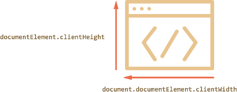

# Размеры и прокрутка страницы

Как найти ширину окна браузера? Как узнать всю высоту страницы, с учётом прокрутки?
Как прокрутить её из JavaScript?


С точки зрения HTML, документ -- это `document.documentElement`. У этого элемента, соответствующего тегу `<html>`, есть все стандартные свойства и метрики и, в теории, они и должны нам помочь. Однако, на практике есть ряд нюансов, именно их мы рассмотрим в этой главе.

[cut]

## Ширина/высота видимой части окна

Свойства `clientWidth/Height` для элемента `document.documentElement` -- это как раз ширина/высота видимой области окна.



[online]
Например, кнопка ниже выведет размер такой области для этой страницы:

<button onclick="alert(document.documentElement.clientHeight)">alert(document.documentElement.clientHeight)</button>
[/online]

[warn header="Не `window.innerWidth/Height`"]
Все браузеры, кроме IE8-, также поддерживают свойства `window.innerWidth/innerHeight`. Они хранят текущий размер *окна браузера*.

В чём отличие? Оно небольшое, но чрезвычайно важное.

Свойства `clientWidth/Height`, если есть полоса прокрутки, возвращают именно ширину/высоту внутри неё, доступную для документа, а `window.innerWidth/Height` -- игнорируют её наличие.

Если справа часть страницы занимает полоса прокрутки, то эти строки выведут разное:
```js
//+ run
alert( window.innerWidth ); // вся ширина окна
alert( document.documentElement.clientWidth ); // ширина минус прокрутка
```

Обычно нам нужна именно *доступная* ширина окна, например, чтобы нарисовать что-либо, то есть за вычетом полосы прокрутки. Поэтому используем `documentElement.clientWidth`.
[/warn]

## Ширина/высота страницы с учётом прокрутки

Теоретически, видимая часть страницы -- это `documentElement.clientWidth/Height`, а полный размер с учётом прокрутки -- по аналогии, `documentElement.scrollWidth/scrollHeight`. 

Это верно для обычных элементов.

А вот для страницы с этими свойствами возникает проблема, когда *прокрутка то есть, то нет*. В этом случае они работают некорректно. В браузерах Chrome/Safari и Opera при отсутствии прокрутки значение `documentElement.scrollHeight` в этом случае может быть даже меньше, чем `documentElement.clientHeight`, что, конечно же, выглядит как совершеннейшая чепуха и нонсенс.

Эта проблема возникает именно для `documentElement`, то есть для всей страницы. 

Надёжно определить размер страницы с учетом прокрутки можно, взяв максимум из нескольких свойств:

```js
//+ run
var scrollHeight = Math.max(
  document.body.scrollHeight, document.documentElement.scrollHeight,
  document.body.offsetHeight, document.documentElement.offsetHeight,
  document.body.clientHeight, document.documentElement.clientHeight
);

alert( 'Высота с учетом прокрутки: ' + scrollHeight );
```

Почему так? Лучше и не спрашивайте, это одно из редких мест, где просто ошибки в браузерах. Глубокой логики здесь нет.

## Получение текущей прокрутки [#page-scroll]

У обычного элемента текущую прокрутку можно получить в `scrollLeft/scrollTop`.

Что же со страницей?

Большинство браузеров корректно обработает запрос к `documentElement.scrollLeft/Top`, однако Safari/Chrome/Opera есть ошибки (к примеру [157855](https://code.google.com/p/chromium/issues/detail?id=157855), [106133](https://bugs.webkit.org/show_bug.cgi?id=106133)), из-за которых следует использовать `document.body`. 

Чтобы вообще обойти проблему, можно использовать специальные свойства `window.pageXOffset/pageYOffset`:

```js
//+ run
alert( 'Текущая прокрутка сверху: ' + window.pageYOffset );
alert( 'Текущая прокрутка слева: ' + window.pageXOffset );
```

Эти свойства:
<ul>
<li>Не поддерживаются IE8-</li>
<li>Их можно только читать, а менять нельзя.</li>
</ul>

Если IE8- не волнует, то просто используем эти свойства.

Кросс-браузерный вариант с учётом IE8 предусматривает откат на `documentElement`:

```js
//+ run
var scrollTop = window.pageYOffset || document.documentElement.scrollTop;

alert( "Текущая прокрутка: " + scrollTop );
```

## Изменение прокрутки: scrollTo, scrollBy, scrollIntoView [#window-scroll]

[warn]
Чтобы прокрутить страницу при помощи JavaScript, её DOM должен быть полностью загружен.
[/warn]

На обычных элементах свойства `scrollTop/scrollLeft` можно изменять, и при этом элемент будет прокручиваться.

Никто не мешает точно так же поступать и со страницей. Во всех браузерах, кроме Chrome/Safari/Opera можно осуществить прокрутку установкой `document.documentElement.scrollTop`, а в указанных -- использовать для этого `document.body.scrollTop`. И будет работать. Можно попробовать прокручивать и так и эдак и проверять, подействовала ли прокрутка, будет кросс-браузерно.

Но есть и другое, простое и универсальное решение -- специальные методы прокрутки страницы [window.scrollBy(x,y)](https://developer.mozilla.org/en/Window.scrollBy) и [window.scrollTo(pageX,pageY)](https://developer.mozilla.org/en/Window.scrollTo). 

<ul>
<li>Метод `scrollBy(x,y)` прокручивает страницу относительно текущих координат.
[online]
Например, кнопка ниже прокрутит страницу на `10px` вниз:

<button onclick="window.scrollBy(0,10)">window.scrollBy(0,10)</button>
[/online]
</li>
<li>Метод `scrollTo(pageX,pageY)` прокручивает страницу к указанным координатам относительно документа.

Он эквивалентен установке свойств `scrollLeft/scrollTop`.

Чтобы прокрутить в начало документа, достаточно указать координаты `(0,0)`.
[online]
<button onclick="window.scrollTo(0,0)">window.scrollTo(0,0)</button>
[/online]
</li>
</ul>

## scrollIntoView

Для полноты картины рассмотрим также метод [elem.scrollIntoView(top)](https://developer.mozilla.org/en/DOM/element.scrollIntoView).

Метод `elem.scrollIntoView(top)` вызывается на элементе и прокручивает страницу так, чтобы элемент оказался вверху, если параметр `top` равен `true`, и внизу, если `top` равен `false`. Причем, если параметр `top` не указан, то он считается равным `true`.

Кнопка ниже прокрутит страницу так, чтобы кнопка оказалась вверху:

<button onclick="this.scrollIntoView()">this.scrollIntoView()</button>

А следующая кнопка прокрутит страницу так, чтобы кнопка оказалась внизу:

<button onclick="this.scrollIntoView(false)">this.scrollIntoView(false)</button>

## Запрет прокрутки

Иногда бывает нужно временно сделать документ "непрокручиваемым". Например, при показе большого диалогового окна над документом -- чтобы посетитель мог прокручивать это окно, но не документ.

**Чтобы запретить прокрутку страницы, достаточно поставить `document.body.style.overflow = "hidden"`.**

При этом страница замрёт в текущем положении. 

[online]
Попробуйте сами:

<button onclick="document.body.style.overflow = 'hidden'">`document.body.style.overflow = 'hidden'`</button>

<button onclick="document.body.style.overflow = ''">`document.body.style.overflow = ''`</button>

При нажатии на верхнюю кнопку страница замрёт на текущем положении прокрутки. После нажатия на нижнюю -- прокрутка возобновится. 
[/online]

Вместо `document.body` может быть любой элемент, прокрутку которого необходимо запретить. 

Недостатком этого способа является то, что сама полоса прокрутки исчезает. Если она занимала некоторую ширину, то теперь эта ширина освободится, и содержимое страницы расширится, текст "прыгнет", заняв освободившееся место. 

Это может быть не очень красиво, но легко обходится, если вычислить размер прокрутки и добавить такой же по размеру `padding`.

## Итого

Размеры:

<ul>
<li>Для получения размеров видимой части окна: `document.documentElement.clientWidth/Height`
</li>
<li>Для получения размеров страницы с учётом прокрутки:

```js
var scrollHeight = Math.max(
  document.body.scrollHeight, document.documentElement.scrollHeight,
  document.body.offsetHeight, document.documentElement.offsetHeight,
  document.body.clientHeight, document.documentElement.clientHeight
);
```

</li>
</ul>

**Прокрутка окна:**

<ul>
<li>Прокрутку окна можно *получить* как `window.pageYOffset` (для горизонтальной -- `window.pageXOffset`) везде, кроме IE8-. 

На всякий случай -- вот самый кросс-браузерный способ, учитывающий IE7- в том числе:

```js
//+ run
var html = document.documentElement;
var body = document.body;

var scrollTop = html.scrollTop || body && body.scrollTop || 0;
scrollTop -= html.clientTop; // в IE7- <html> смещён относительно (0,0)

alert( "Текущая прокрутка: " + scrollTop );
```

</li>
<li>Установить прокрутку можно при помощи специальных методов:
<ul>
<li>`window.scrollTo(pageX,pageY)` -- абсолютные координаты,</li>
<li>`window.scrollBy(x,y)` -- прокрутить относительно текущего места.</li><li>`elem.scrollIntoView(top)` -- прокрутить, чтобы элемент `elem` стал виден.</li>
</ul>
</li>
</ul>

