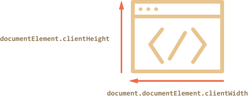

# Window sizes and scroll

How to find out the browser window width? How to get the full height of the document, including the scrolled out part? How to scroll the page from JavaScript?

From the DOM point of view, the root document element is `document.documentElement`. That element corresponds to `<html>` and has geometry properties described in the [previous chapter](info:size-and-scroll). For some cases we can use it, but there are additional methods and pecularities important enough to consider.

[cut]

## Width/height of the window

Properties `clientWidth/clientHeight` of `document.documentElement` is exactly what we want here:



```online
For instance, the button below shows the height of your window:
<button onclick="alert(document.documentElement.clientHeight)">alert(document.documentElement.clientHeight)</button>
```

````warn header="Not `window.innerWidth/Height`"
Browsers also support properties `window.innerWidth/innerHeight`. They look like what we want. So what's the difference?

Properties `clientWidth/clientHeight`, if there's a scrollbar occupying some space, return the width/height inside it. In other words, they return width/height of the visible part of the document, available for the content.

And `window.innerWidth/innerHeight` ignore the scrollbar.

If there's a scrollbar and it occupies some space, then these two lines show different values:
```js run
alert( window.innerWidth ); // full window width
alert( document.documentElement.clientWidth ); // window width minus the scrollbar
```

In most cases we need the *available* window width: to draw or position something. That is: inside scrollbars if there are any. So we should use `documentElement.clientWidth`.
````

```warn header="`DOCTYPE` is important"
Please note: top-level geometry properties may work a little bit differently when there's no `<!DOCTYPE HTML>` in HTML. Odd things are possible.

In modern HTML we should always write it. Generally that's not a JavaScript question, but here it affects JavaScript as well.
```

## Width/height of the document

Theoretically, as the visibble part of the document is `documentElement.clientWidth/Height`, the full size should be  `documentElement.scrollWidth/scrollHeight`.

That's correct for regular elements.

But for the whole page these properties do not work as intended. In Chrome/Safari/Opera if there's no scroll, then `documentElement.scrollHeight` may be even less than  `documentElement.clientHeight`! For regular elements that's a nonsense.

To have a reliable full window size, we should take the maximum of these properties:

```js run
let scrollHeight = Math.max(
  document.body.scrollHeight, document.documentElement.scrollHeight,
  document.body.offsetHeight, document.documentElement.offsetHeight,
  document.body.clientHeight, document.documentElement.clientHeight
);

alert('Full document width, with scrolled out part: ' + scrollHeight);
```

Why so? Better don't ask. These inconsistencies come from ancient times, not a "smart" logic.

## Get the current scroll [#page-scroll]

Regular elements have their current scroll state in `scrollLeft/scrollTop`.

What's with the page? Most browsers provide that for the whole page in `documentElement.scrollLeft/Top`, but Chrome/Safari/Opera have bugs (like [157855](https://code.google.com/p/chromium/issues/detail?id=157855), [106133](https://bugs.webkit.org/show_bug.cgi?id=106133)) and we should use  `document.body` instead of `document.documentElement` there.

Luckily, we don't have to remember that at all, because of the special properties `window.pageXOffset/pageYOffset`:

```js run
alert('Current scroll from the top: ' + window.pageYOffset);
alert('Current scroll from the left: ' + window.pageXOffset);
```

These properties are read-only.

## Scrolling: scrollTo, scrollBy, scrollIntoView [#window-scroll]

```warn
To scroll the page from JavaScript, its DOM must be fully loaded.
```

Regular elements can be scrolled by changing `scrollTop/scrollLeft`.

We can do the same for the page:
- For all browsers except Chrome/Safari/Opera: modify  `document.documentElement.scrollTop/Left`.
- In Chrome/Safari/Opera: use `document.body.scrollTop/Left` instead.

It should work.

But there's a simpler, more universal solution: special methods  [window.scrollBy(x,y)](mdn:api/Window/scrollBy) и [window.scrollTo(pageX,pageY)](mdn:api/Window/scrollTo).

- The method `scrollBy(x,y)` scrolls the page relative to its current position. For instance, `scrollBy(0,10)` scrolls the page `10px` down.

    ```online
    The button below demonstrates this:

    <button onclick="window.scrollBy(0,10)">window.scrollBy(0,10)</button>
    ```
- The method `scrollTo(pageX,pageY)` scrolls the page relative to the document top-left corner. It's like setting `scrollLeft/scrollTop`.

    To scroll to the very beginning, we can use `scrollTo(0,0)`.

    ```online
    <button onclick="window.scrollTo(0,0)">window.scrollTo(0,0)</button>
    ```

These properties are cross-browser.

## scrollIntoView

For completeness, let's cover one more method:  [elem.scrollIntoView(top)](mdn:api/Element/scrollIntoView).

The call to `elem.scrollIntoView(top)` scrolls the page to make `elem` visible. It has one argument `top`:

- if `top=true` (that's the default), then the page will be scrolled to make `elem` appear on the top of the window, upper side of the element aligned with the window top.
- if `top=false`, then the element bottom is aligned with the window bottom.

```online
The button below scrolls the page to make itself show at the window top:

<button onclick="this.scrollIntoView()">this.scrollIntoView()</button>

And this button scrolls the page to show it at the bottom:

<button onclick="this.scrollIntoView(false)">this.scrollIntoView(false)</button>
```

## Forbid the scrolling

Sometimes we need to make the document "unscrollable". For instance, when we need to show a large message over it, and we want the visitor to interact with that message, not with the document.

To make the document unscrollable, its enough to set `document.body.style.overflow = "hidden"`. The page will freeze on its current scroll.

```online
Try it:

<button onclick="document.body.style.overflow = 'hidden'">`document.body.style.overflow = 'hidden'`</button>

<button onclick="document.body.style.overflow = ''">`document.body.style.overflow = ''`</button>

The first button freezes the scroll, the second one resumes it.
```

We can use the same technique to "freeze" the scroll for other elements, not just for `document.body`.

The drawback of the method is that the scrollbar disappears. If it occupied some space, then that space is now free, and the content "jumps" to fill it.

That looks a bit odd, but can be worked around if we compare `clientWidth` before and after the freeze, and if it increased (the content area became wider) then add `padding` to `document.body`.

## Summary

Geometry:

- Width/height of the visible part of the document (content area width/height): `document.documentElement.clientWidth/Height`
- Width/height of the whole document, with the scrolled out part:

    ```js
    let scrollHeight = Math.max(
      document.body.scrollHeight, document.documentElement.scrollHeight,
      document.body.offsetHeight, document.documentElement.offsetHeight,
      document.body.clientHeight, document.documentElement.clientHeight
    );
    ```

Scrolling:

- Read the current scroll: `window.pageYOffset/pageXOffset`.
- Scroll the page:

    - `window.scrollTo(pageX,pageY)` -- absolute coordinates,
    - `window.scrollBy(x,y)` -- scroll relative the current place?
    - `elem.scrollIntoView(top)` -- scroll to make `elem` visible.
