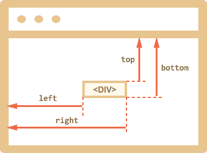

# Coordinates

To move elements around we should be familiar with coordinates.

Most JavaScript methods deal with one of two coordinate systems:

1. Relative to the window top/left.
2. Relative to the document top/left.

It's important to understand the difference and which type is where.

[cut]

## Window coordinates: getBoundingClientRect

Window coordinates start at the left-upper corner of the window.

The method `elem.getBoundingClientRect()` returns window coordinates for `elem` as an object with properties:

- `top` -- Y-coordinate for the top element edge,
- `left` -- X-coordinate for the left element edge,
- `right` -- X-coordinate for the right element edge,
- `bottom` -- Y-coordinate for the bottom element edge.

Like this:




Window coordinates do not take the scrolled out part of the document into account, they are calculated from the "window itself".

In other words, when we scroll the page, the element goes up or down and *its window coordinates change*. That's kind of important.

```online
Click the button to see its window coordinates:

<input id="brTest" type="button" value="Show button.getBoundingClientRect() for this button" onclick='showRect(this)'/>

<script>
function showRect(elem) {
  let r = elem.getBoundingClientRect();
  alert("{top:"+r.top+", left:"+r.left+", right:"+r.right+", bottom:"+ r.bottom + "}");
}
</script>

If you scroll the page, the button position changes, and window coordinates as well.
```

Also:

- Coordinates may be decimal fractions. That's normal, internally browser uses them for calculations. We don't have to round them when setting to `style.position.left/top` etc.
- Coordinates may be negative. For instance, if the page is scrolled down and its top edge is above the window then `elem.getBoundingClientRect().top` is negative.
- Some browsers also add to the result `getBoundingClientRect` properties `width` and `height`. We could also get the same by the substraction: `height=bottom-top`, `width=right-left`.

```warn header="Coordinates right/bottom are different from CSS properties"
If we compare window coordinates vs CSS positioning, then they are closest to `position:fixed` -- the position relative to the viewport.

But in CSS the `right` property means the distance from the right edge, and the `bottom` -- from the bottom edge.

If we just look at the picture below, we can see that in JavaScript it is not so. All window coordinates are counted from the upper-left corner, including these ones.
```

## elementFromPoint(x, y) [#elementFromPoint]

The call to `document.elementFromPoint(x, y)` returns the most nested element at window coordinates `(x, y)`.

The syntax is:

```js
let elem = document.elementFromPoint(x, y);
```

For instance, the code below highlights and outputs the tag of the element that is now in the middle of the window:

```js run
let centerX = document.documentElement.clientWidth / 2;
let centerY = document.documentElement.clientHeight / 2;

let elem = document.elementFromPoint(centerX, centerY);

elem.style.background = "red";
alert(elem.tagName);
```

As it uses window coordinates, the element may be different depending on the current scroll position.

````warn header="For out-of-window coordinates the `elementFromPoint` returns `null`"
The method `document.elementFromPoint(x,y)` only works if `(x,y)` are inside the visible area.

If any of the coordinates is negative or exceeds the window width/height, then it returns `null`.

In most cases such behavior is not a problem, but we should keep that in mind.

Here's a typical error that may occur if we don't check for it:

```js
let elem = document.elementFromPoint(x, y);
// if the coordinates happen to be out of the window, then elem = null
*!*
elem.style.background = ''; // Error!
*/!*
```
````

## Usage for position:fixed

Most of time we need coordinates to position something. In CSS to position an element relative to the viewport we use `position:fixed` together with the coorinates, usually  `left/top`.

For instance, the function `createMessageUnder(elem, html)` below shows the message under `elem`:

```js
let elem = document.getElementById("coords-show-mark");

function createMessageUnder(elem, html) {
  // create message element
  let message = document.createElement('div');
  // better to use a css class for the style here
  message.style.cssText = "position:fixed; color: red";

*!*
  // assign coordinates, don't forget "px"!
  let coords = elem.getBoundingClientRect();

  message.style.left = coords.left + "px";
  message.style.top = coords.bottom + "px";
*/!*

  message.innerHTML = html;

  return message;
}

// Usage:
// add it for 5 seconds in the document
let message = createMessageUnder(elem, 'Hello, world!');
document.body.append(message);
setTimeout(() => message.remove(), 5000);
```

```online
Click the button to run it:

<button id="coords-show-mark">Button with id="coords-show-mark", the message will appear under it</button>
```

The code can be modified to show the message at the left, right, below, apply CSS animations to "fade it in" and so on.

**But note the important detail: when the page is scrolled, the message flows away from the button.**

The reason is obvious: the message element uses `position: fixed`, so it remains at the same place while the page scrolls away.

To change that, we need to use document-based coordinates. We'll cover them in the next chapter.
