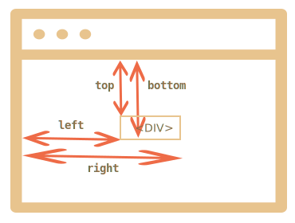

# Координаты в окне

Для того, чтобы поместить один элемент рядом с другим на странице, а также двигать его произвольным образом, к примеру, рядом с указателем мыши -- используются координаты.

*Координатная система относительно окна браузера* начинается в левом-верхнем углу текущей видимой области окна.

Мы будем называть координаты в ней `clientX/clientY`.


## getBoundingClientRect()

Метод `elem.getBoundingClientRect()` возвращает координаты элемента, под которыми понимаются размеры "воображаемого прямоугольника", который охватывает весь элемент.

Координаты возвращаются в виде объекта со свойствами:
<ul>
<li>`top` -- Y-координата верхней границы элемента,</li>
<li>`left` -- X-координата левой границы,</li>
<li>`right` -- X-координата правой границы,</li>
<li>`bottom` -- Y-координата нижней границы.</li>
</ul>

Например:



**Координаты относительно окна не учитывают прокрутку, они высчитываются от границ текущей видимой области.**

Иначе говоря, если страницу прокрутить, то элемент поднимется выше или опустится ниже -- его координаты относительно окна изменятся.

[online]
Например, кликните на кнопку, чтобы увидеть её координаты:

<input id="brTest" type="button" value="Показать button.getBoundingClientRect() для этой кнопки" onclick='showRect(this)'/>

<script>
function showRect(elem) {
  var r = elem.getBoundingClientRect()
  alert("{top:"+r.top+", left:"+r.left+", right:"+r.right+", bottom:"+ r.bottom + "}");
}
</script>

Если вы прокрутите эту страницу, то положение кнопки в окне изменится, и её координаты, соответственно, тоже. 
[/online]

<ul>
<li>Координаты могут быть дробными -- это нормально, так как они возвращаются из внутренних структур браузера.</li>
<li>Координаты могут быть и отрицательными, например если прокрутить страницу так, что верх элемента будет выходить за верхнуюю границу окна, то его `top`-координата будет меньше нуля.</li>
<li>Некоторые современные браузеры также добавляют к результату `getBoundingClientRect` свойства для ширины и высоты: `width/height`, но их можно получить и простым вычитанием: `height = bottom - top`, `width = right - left`.</li>
</ul>

[warn header="Координаты right/bottom отличаются от CSS-свойств"]
Если рассмотреть позиционирование элементов при помощи CSS-свойства `position`, то там тоже указываются `left`, `right`, `top`, `bottom`.

Однако, по CSS свойство `right` задаёт расстояние от правой границы, а `bottom` -- от нижней.

Если вы взглянете на иллюстрацию выше, то увидите, что в JavaScript это не так. Все координаты отсчитываются слева/сверху, в том числе и эти.
[/warn]


[smart header="Метод `elem.getBoundingClientRect()` изнутри"]

Браузер отображает любое содержимое, используя прямоугольники. 

В случае с блочным элементом, таким как `DIV`, элемент сам по себе образует прямоугольник. Но если элемент строчный и содержит в себе длинный текст, то каждая строка будет отдельным прямоугольником, с одинаковой высотой но разной длиной (у каждой строки -- своя длина).

Более подробно это описано в: <a href="http://www.w3.org/TR/CSS21/visuren.html#anonymous-block-level">спецификации</a>.

Если обобщить, содержимое элемента может отображаться в одном прямоугольнике или в нескольких.

Все эти прямоугольники можно получить с помощью [elem.getClientRects()](https://developer.mozilla.org/en/DOM/element.getClientRects). А метод [elem.getBoundingClientRect()](https://developer.mozilla.org/en/DOM/element.getBoundingClientRect) возвращает один охватывающий прямоугольник для всех `getClientRects()`.
[/smart]


## elementFromPoint(x, y) [#elementFromPoint]

Возвращает элемент, который находится на координатах `(x, y)` относительно окна.

Синтаксис:

```js
var elem = document.elementFromPoint(x, y);
```

Например, код ниже ниже выделяет и выводит тег у элемента, который сейчас в середине окна:

```js
//+ run
var centerX = document.documentElement.clientWidth / 2;
var centerY = document.documentElement.clientHeight / 2;

var elem = document.elementFromPoint(centerX, centerY);

elem.style.background = "red";
alert( elem.tagName );
elem.style.background = "";
```

Аналогично предыдущему методу, используются координаты относительно окна, так что, в зависимости от прокрутки страницы, в центре может быть разный элемент.

[warn header="Для координат вне окна `elementFromPoint` возвращает `null`"]
Метод `document.elementFromPoint(x,y)` работает только если координаты `(x,y)` находятся в пределах окна.

Если одна из них отрицательна или больше чем ширина/высота окна -- он возвращает `null`.

В большинстве сценариев использования это не является проблемой, но нужно проверять, что результат -- не `null`.
[/warn] 


## Координаты для position:fixed

Координаты обычно требуются не просто так, а, например, чтобы переместить элемент на них.

В CSS для позиционирования элемента относительно окна используется свойство `position:fixed`. Как правило, вместе с ним идут и координаты, например `left/top`.

Например, функция `createMessageUnder` из кода ниже код покажет сообщение под элементом `elem`:

```js
var elem = document.getElementById("coords-show-mark");

function createMessageUnder(elem, text) {
  // получить координаты
  var coords = elem.getBoundingClientRect();

  // создать элемент для сообщения
  var message = document.createElement('div');
  // стиль лучше задавать классом
  message.style.cssText = "position:fixed; color: red";

*!*
  // к координатам обязательно добавляем "px"!
  message.style.left = coords.left + "px";
  message.style.top = coords.bottom + "px";
*/!*

  message.innerHTML = text;

  return message;
}

// Использование
// добавить на 5 сек в документ
var message = createMessageUnder(elem, 'Привет, мир!');
document.body.appendChild(message);
setTimeout(function() {
  document.body.removeChild(message);
}, 5000);
```

[online]
Нажмите на кнопку, чтобы запустить его:

<button id="coords-show-mark">кнопка с id="coords-show-mark"</button>
[/online]

Этот код можно модифицировать, чтобы показывать сообщение слева, справа, сверху, делать это вместе с CSS-анимацией и так далее. Для этого нужно всего лишь понимать, как получить координаты.

**Заметим, однако, важную деталь: при прокрутке страницы сообщение будет визуально отдаляться от кнопки.**

Причина очевидна, ведь оно использует `position: fixed`, так что при прокрутке остаётся на месте, а страница скроллируется. 

Как сделать, чтобы сообщение было именно на конкретном месте документа, а не окна, мы рассмотрим в следующей главе.


[head]
<script>
document.addEventListener('DOMContentLoaded', function() {

document.getElementById('coords-show-mark').onclick = function() {
var elem = document.getElementById("coords-show-mark");

function createMessageUnder(elem, text) {
  // получить координаты
  var coords = elem.getBoundingClientRect();

  // создать элемент для сообщения
  var message = document.createElement('div');
  // стиль лучше задавать классом
  message.style.cssText = "position:fixed; color: red";

  // к координатам обязательно добавляем "px"!
  message.style.left = coords.left + "px";
  message.style.top = coords.bottom + "px";

  message.innerHTML = text;

  return message;
}

// Использование
// добавить на 5 сек в документ
var message = createMessageUnder(elem, 'Привет, мир!');
document.body.appendChild(message);
setTimeout(function() {
  document.body.removeChild(message);
}, 5000);
}

});

</script>
[/head]