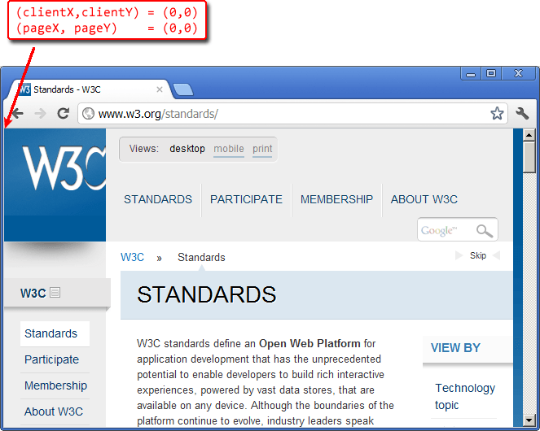
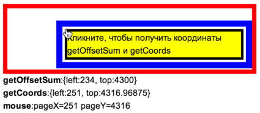
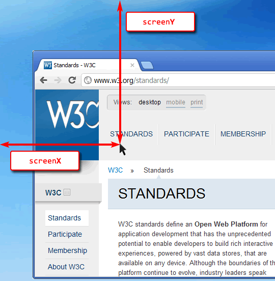

# Координаты в документе

*Система координат относительно страницы* или, иначе говоря, *относительно документа*, начинается в левом-верхнем углу, но не окна, а именно страницы.

И координаты в ней означают позицию по отношению не к окну браузера, а к документу в целом.

Если провести аналогию с CSS, то координаты относительно окна -- это `position:fixed`, а относительно документа -- `position:absolute` (при позиционировании вне других элементов, естественно).

Мы будем называть координаты в ней `pageX/pageY`.

[cut]

Они нужны в первую очередь для того, чтобы показывать элемент в определённом месте страницы, а не окна.

## Сравнение систем координат

Когда страница не прокручена, точки начала координат относительно окна `(clientX,clientY)` и документа `(pageX,pageY)` совпадают:



Например, координаты элемента с надписью "STANDARDS" равны расстоянию от верхней/левой границы окна:


**Прокрутим страницу, чтобы элемент был на самом верху:**

Посмотрите на рисунок ниже, на нём -- та же страница, только прокрученная, и тот же элемент "STANDARDS".

<ul>
<li>Координата `clientY` изменилась. Она была `175`, а стала `0`, так как элемент находится вверху окна.</li>
<li>Координата `pageY` осталась такой же, так как отсчитывается от левого-верхнего угла *документа*.</li>
</ul>


Итак, координаты `pageX/pageY` не меняются при прокрутке, в отличие от  `clientX/clientY`.

## Получение координат [#getCoords]

К сожалению, готовой функции для получения координат элемента относительно страницы нет. Но её можно легко написать самим.

Эти две системы координат жёстко связаны: `pageY = clientY + текущая вертикальная прокрутка`.

Наша функция `getCoords(elem)` будет брать результат `elem.getBoundingClientRect()` и прибавлять текущую прокрутку документа.

Результат `getCoords`: объект с координатами `{left: .., top: ..}`

```js
function getCoords(elem) {  // кроме IE8-
  var box = elem.getBoundingClientRect();
  
  return {
    top: box.top + pageYOffset,
    left: box.left + pageXOffset
  };

}
```

Если нужно поддерживать более старые IE, то вот альтернативный, самый кросс-браузерный вариант:

```js
//+ autorun
function getCoords(elem) {
  // (1)
  var box = elem.getBoundingClientRect();
  
  var body = document.body;
  var docEl = document.documentElement;
  
  // (2)
  var scrollTop = window.pageYOffset || docEl.scrollTop || body.scrollTop;
  var scrollLeft = window.pageXOffset || docEl.scrollLeft || body.scrollLeft;
  
  // (3)
  var clientTop = docEl.clientTop || body.clientTop || 0;
  var clientLeft = docEl.clientLeft || body.clientLeft || 0;
  
  // (4)
  var top  = box.top +  scrollTop - clientTop;
  var left = box.left + scrollLeft - clientLeft;
  
  return { top: top, left: left };
}
```

Разберем что и зачем, по шагам:

<ol>
<li>Получаем прямоугольник.</li>
<li>Считаем прокрутку страницы. Все браузеры, кроме IE8- поддерживают свойство `pageXOffset/pageYOffset`. В более старых IE, когда установлен DOCTYPE, прокрутку можно получить из `documentElement`, ну и наконец если DOCTYPE некорректен -- использовать `body`.</li>
<li>В IE документ может быть смещен относительно левого верхнего угла. Получим это смещение.</li>
<li>Добавим прокрутку к координатам окна и вычтем смещение `html/body`, чтобы получить координаты всего документа.</li>
</ol>

### Устаревший метод: offset*

Есть альтернативный способ нахождения координат -- это пройти всю цепочку `offsetParent` от элемента вверх и сложить отступы `offsetLeft/offsetTop`.

Мы разбираем его здесь с учебной целью, так как он используется лишь в старых браузерах.

Вот функция, реализующая такой подход.

```js
//+ autorun
function getOffsetSum(elem) {
  var top = 0, left = 0;

  while(elem) {
    top = top + parseInt(elem.offsetTop);
    left = left + parseInt(elem.offsetLeft);
    elem = elem.offsetParent;     
  }
   
  return {top: top, left: left};
}
```

Казалось бы, код нормальный. И он как-то работает, но разные браузеры преподносят "сюрпризы", включая или выключая размер рамок и прокруток из `offsetTop/Left`, некорректно учитывая позиционирование. В итоге результат не всегда верен. Можно, конечно, разобрать эти проблемы и посчитать действительно аккуратно и правильно этим способом, но зачем? Ведь есть `getBoundingClientRect`.

[online]
Вы можете увидеть разницу между вычислением координат через `offset*` и `getBoundingClientRect` на примере.

В прямоугольнике ниже есть 3 вложенных `DIV`. Все они имеют `border`, кое-кто из них имеет `position/margin/padding`.

Кликните по внутреннему (жёлтому) элементу, чтобы увидеть результаты обоих методов: `getOffsetSum` и `getCoords`, а также реальные координаты курсора -- `event.pageX/pageY` (мы обсудим их позже в статье [](/fixevent)).

[pre]
<div style="position:relative;padding:10px;height:80px;width:380px;border:7px red solid">
  <div style="border:10px blue solid;padding:2px;position:absolute;left:20%;top:20%">
  <div id="getBoundingClientRectEx" style="background-color:yellow;border:4px solid black;margin:2px;cursor:pointer">Кликните, чтобы получить координаты getOffsetSum и getCoords</div>
  </div>
</div>
<div id="getBoundingClientRectExRes">
<div><b>getOffsetSum</b>:<span>значение getOffsetSum()</span></div>
<div><b>getCoords</b>:<span>значение getCoords()</span></div>
<div><b>mouse</b>:<span>координаты мыши</span></div>
</div>

<script>
document.getElementById('getBoundingClientRectEx').onclick = function(event) {
  var o = getOffsetSum(this);
  var orect = getCoords(this);
  
  event = event || window.event;
  if ( event.pageX == null && event.clientX != null ) {
    var html = document.documentElement, body = document.body;
    event.pageX = event.clientX + (html && html.scrollLeft || body && body.scrollLeft || 0) - (html.clientLeft || 0)
    event.pageY = event.clientY + (html && html.scrollTop || body && body.scrollTop || 0) - (html.clientTop || 0)
  }

  var list = document.getElementById('getBoundingClientRectExRes').getElementsByTagName('SPAN')
  list[0].innerHTML = '{left:'+o.left+', top:'+o.top+'}'
  list[1].innerHTML = '{left:'+orect.left+', top:'+orect.top+'}'
  list[2].innerHTML = 'pageX='+event.pageX+' pageY='+event.pageY
}
</script>
[/pre]

**При клике на любом месте желтого блока вы легко увидите разницу между `getOffsetSum(elem)` и `getCoords(elem)`.**

Для того, чтобы узнать, какой же результат верный, кликните в левом-верхнем углу жёлтого блока, причём обратите внимание -- кликать нужно не на жёлтом, а на чёрном, это рамка, она тоже входит в элемент. Будут видны точные координаты мыши, так что вы можете сравнить их с `getOffsetSum/getCoords`.

Пример клика в правильном месте (обратите внимание на разницу координат):



Именно `getCoords` всегда возвращает верное значение.
[/online]

## Координаты на экране screenX/screenY

Есть ещё одна система координат, которая используется очень редко, но для полноты картины необходимо её упомянуть.

*Координаты относительно экрана* `screenX/screenY` отсчитываются от его левого-верхнего угла. Имеется в виду именно *весь экран*, а не окно браузера.



Такие координаты могут быть полезны, например, при работе с мобильными устройствами или для открытия нового окна посередине экрана вызовом [window.open](https://developer.mozilla.org/en-US/docs/DOM/window.open).

<ul>
<li>Размеры экрана хранятся в глобальной переменной [screen](https://developer.mozilla.org/en/DOM/window.screen):

```js
//+ run
// общая ширина/высота
alert( screen.width + ' x ' + screen.height ); 

// доступная ширина/высота (за вычетом таскбара и т.п.)
alert( screen.availWidth + ' x ' + screen.availHeight); 

// есть и ряд других свойств screen (см. документацию)
```

</li>
<li>Координаты левого-верхнего угла браузера на экране хранятся в `window.screenX,` `window.screenY` (не поддерживаются IE8-):

```js
//+ run
alert("Браузер находится на " + window.screenX + "," + window.screenY);
```

Они могут быть и меньше нуля, если окно частично вне экрана. </li>
</ul>

Заметим, что общую информацию об экране и браузере получить можно, а вот координаты конкретного элемента на экране -- нельзя, нет аналога `getBoundingClientRect` или иного метода для этого. 

## Итого  

У любой точки в браузере есть координаты:
<ol>
<li>Относительно окна `window` -- `elem.getBoundingClientRect()`.</li>
<li>Относительно документа `document` -- добавляем прокрутку, во всех фреймворках есть готовая функция.</li>
<li>Относительно экрана `screen` -- можно узнать координаты браузера, но не элемента.</li>
</ol>

Иногда в старом коде можно встретить использование `offsetTop/Left` для подсчёта координат. Это очень старый и неправильный способ, не стоит его использовать.

Координаты будут нужны нам далее, при работе с событиями мыши (координаты клика) и элементами (перемещение).

