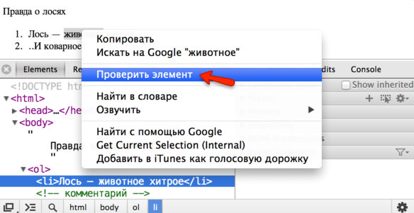
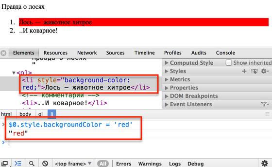
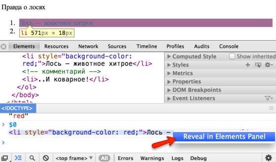

# Работа с DOM из консоли

Исследовать и изменять DOM можно с помощью инструментов разработки, встроенных в браузер. Посмотрим средства для этого на примере Google Chrome.
[cut]

## Доступ к элементу

Откройте документ [losi.html](losi.html) и, в инструментах разработчика, перейдите во вкладку Elements.

Чтобы проанализировать любой элемент:
<ul>
<li>Выберите его во вкладке Elements.</li>
<li>...Либо внизу вкладки Elements есть лупа, при нажатии на которую можно выбрать элемент кликом.</li>
<li>...Либо, что обычно удобнее всего, просто кликните на нужном месте на странице правой кнопкой и выберите в меню "Проверить Элемент".</li>
</ul>



Справа будет различная информация об элементе:
<dl>
<dt>Computed Style</dt>
<dd>Итоговые свойства CSS элемента, которые он приобрёл в результате применения всего каскада стилей, включая внешние CSS-файлы и атрибут `style`.</dd>
<dt>Style</dt>
<dd>Каскад стилей, применённый к элементу. Каждое стилевое правило отдельно, здесь же можно менять стили кликом.</dd>
<dt>Metrics</dt>
<dd>Размеры элемента.</dd>
<dt>...</dt>
<dd>И еще некоторые реже используемые вкладки, которые станут понятны по мере изучения DOM.</dd>
</dl>

[warn header="DOM в Elements не совсем соответствует реальному"]
Отображение DOM во вкладке Elements не совсем соответствует реальному. В частности, там не отображаются пробельные узлы. Это сделано для удобства просмотра. Но мы-то знаем, что они есть. 

С другой стороны, в Elements можно увидеть CSS-псевдоэлементы, такие как `::before`, `::after`. Это также сделано для удобства, в DOM их не существует.
[/warn]


## Выбранные элементы $0 $1...

Зачастую бывает нужно выбрать элемент DOM и сделать с ним что-то на JavaScript. 

Находясь во вкладке Elements, откройте консоль нажатием Esc (или перейдите на вкладку Console).

**Последний элемент, выбранный во вкладке Elements, доступен в консоли как `$0`, предыдущий -- `$1` и так далее.**

Запустите на элементе команду, которая делает его красным:

```js
$0.style.backgroundColor = 'red';
```

В браузере это может выглядеть примерно так:



Мы выделили элемент, применили к нему JavaScript в консоли, тут же увидели изменения в браузере.

Есть и обратная дорожка. Любой элемент из JS-переменной можно посмотреть во вкладке Elements, для этого:

<ol>
<li>Выведите эту переменную в консоли, например при помощи `console.log`.</li>
<li>Кликните на выводе в консоли правой кнопкой мыши.</li>
<li>Выберите соответствующий пункт меню.</li>
</ol>



Таким образом, можно легко перемещаться из Elements в консоль и обратно.

## Ещё методы консоли

Для поиска элементов в консоли есть два специальных метода:
<ul>
<li>`$$("div.my")` -- ищет все элементы в DOM по данному CSS-селектору.</li>
<li>`$("div.my")` -- ищет первый элемент в DOM по данному CSS-селектору.</li>
</ul>

Более полная документация по методам консоли доступна на страницах [Console API Reference для Chrome](https://developers.google.com/web/tools/chrome-devtools/debug/console/console-reference) и [Command Line API для Firebug](https://getfirebug.com/wiki/index.php/Command_Line_API), а также на [firebug.ru](http://firebug.ru).

Другие браузеры реализуют похожий функционал, освоив Chrome/Firebug, вы легко с ними разберётесь.
