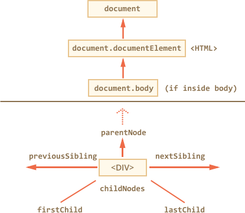

libs:
  - d3
  - domtree

---


# DOM Navigation

DOM allows to do anything with HTML-element and its contents, but first we need to reach it.

All operations on DOM start with the `document` object. From it we can access any node.

[cut]

Here's a picture of links that allow to walk between DOM nodes:



Let's discuss them in more detail.

## On top: documentElement and body

The topmost tree nodes are available directly as `document` properties:

`<html>` = `document.documentElement`
: The topmost document node is `document.documentElement`. That's DOM node of `<html>` tag.

`<body>` = `document.body`
: Another widely used DOM node is the `<body>` element -- `document.body`.

`<head>` = `document.head`
: The `<head>` tag is available as `document.head`.

````warn header="There's a catch: `document.body` can be `null`"
A script cannot access an element that doesn't exist at the moment of running.

In particular, if a script is inside `<head>`, then `document.body` is unavailable, because the browser did not reach it yet.

So, in the example below `alert` will show `null`:

```html run
<html>

<head>
  <script>
*!*
    alert( "From HEAD: " + document.body ); // null, there's no <body> yet
*/!*
  </script>
</head>

<body>

  <script>
    alert( "From BODY: " + document.body ); // HTMLBodyElement, now it exists
  </script>

</body>
</html>
```
````

```smart header="In the DOM world `null` is actively used"
In the DOM, the value meaning "no such node" is `null`, not `undefined`.
```

## Children: childNodes, firstChild, lastChild

There are two tree terms that we'll use:

- **Child nodes (or children)** -- elements that are nested exactly 1 level below the given one. For instance, `<head>` and `<body>` are children of `<html>` element.
- **Descendants** -- all elements that are nested in the given one, including children, their children and so on. That is: the DOM subtree.

The `childNodes` collection provides access to all child nodes, including text nodes.

The example below shows children of `document.body`:

```html run
<html>
<body>
  <div>Begin</div>

  <ul>
    <li>Information</li>
  </ul>

  <div>End</div>

  <script>
*!*
    for (let i = 0; i < document.body.childNodes.length; i++) {
      alert( document.body.childNodes[i] ); // Text, DIV, Text, UL, ..., SCRIPT
    }
*/!*
  </script>
  ...more stuff...
</body>
</html>
```

Please note an interesting detail here. If we run the example above, the last element shown is `<script>`. In fact, the document has more stuff below, but at the moment of the execution the browser did not read it yet, so the script doesn't see it.

Properties `firstChild` and `lastChild` give fast access to the first and last elements.

If there are child nodes, then the following is always true:
```js
elem.childNodes[0] === elem.firstChild
elem.childNodes[elem.childNodes.length - 1] === elem.lastChild
```

There's also a special function `elem.hasChildNodes()` to check whether an element is empty.

### DOM collections

As we can see, `childNodes` looks like an array. But actually it's not an array, but rather a *collection* -- a special array-like iterable object.

There are two important consequences:

1. We can use `for..of` to iterate over it:
  ```js
  for (let node of document.body.childNodes) {
    alert(node); // will work the same as above
  }
  ```
  That's because it's iterable -- supports the `Symbol.iterator` property, as required.

2. Array methods won't work, because it's not an array:
  ```js run
  alert(document.body.childNodes.filter); // undefined (there's no filter method!)
  ```

The first thing is nice. The second is tolerable, because we can use `Array.from` to create a "real" array from it:

  ```js run
  alert( Array.from(document.body.childNodes).filter ); // now it's there
  ```

```warn header="DOM collections are read-only"
Even more -- *all* navigation properties listed in this chapter are read-only.

We can't replace an element by assigning `childNodes[i] = ...`.

Changing DOM is accomplished with other methods that we'll see in the next chapter.
```

```warn header="DOM collections are live"
Almost all DOM collections with minor exceptions are *live*. In other words, they reflect the current state of DOM.

If new elements appear or get removed from DOM, they are refreshed automatically.
```

```warn header="Shouldn't use `for..in` to loop over collections"
Collections are iterable using `for..of`. Sometimes people try to use `for..in` for that.

Please, don't. The `for..in` loop iterates over all enumerable properties. And collections some that we usually do not want to get.
```

## Siblings and the parent

The parent is available as `parentNode`. The next node in the same parent (sibling) is `nextSibling`, and the previous one is `previousSibling`.

For instance:

```js run
// <html><head>...</head><body>...</body></html>

// parent of <body> is <html>
alert( document.body.parentNode === document.documentElement ); // true

// after <head> goes <body>
alert( document.head.nextSibling ); // HTMLBodyElement

// before <body> goes <head>
alert( document.body.previousSibling ); // HTMLHeadElement
```

## Element-only navigation

Navigation properties listed above refer to *all* nodes. For instance, in `childNodes` we can see both text nodes, element nodes, and even comment nodes if there exist.

But for many tasks we don't want text or comment nodes. We want to manipulate on element nodes that represent tags.

So let's check out more navigation links that only take *element nodes* into account:


The links look like those given above, just with `Element` word inside:

- `children` -- only those children that are element nodes.
- `firstElementChild`, `lastElementChild` -- first and last element children.
- `previousElementSibling`, `nextElementSibling` -- neighbour elements.
- `parentElement` -- parent element.

````smart header="Why `parentElement`? Can the parent be *not* an element?"
The `parentElement` property returns the element parent, while `parentNode` returns "any node" parent. These properties are always the same, with one exception:

```js run
alert( document.documentElement.parentNode ); // document
alert( document.documentElement.parentElement ); // null
```

In other words, the `documentElement` (`<html>`) is the root node. Formally, it has `document` as its parent. But `document` is not an element, so `parentNode` returns it and `parentElement` does not.

Sometimes that matters when we're walking over the chain of parents and call a method on each of them, but `document` doesn't have it, so we don't want it.
````

Let's modify one of examples above: replace `childNodes` with `children`. Now it will show only elements:

```html run
<html>
<body>
  <div>Begin</div>

  <ul>
    <li>Information</li>
  </ul>

  <div>End</div>

  <script>
*!*
    for (let elem of document.body.children) {
      alert(elem); // DIV, UL, DIV, SCRIPT
    }
*/!*
  </script>
  ...
</body>
</html>
```

## More links, tables [#dom-navigation-tables]

Till now we described the basic navigation properties. Certain DOM element types may provide more, specific to their type, for better convenience.

Tables are a great example and important particular case of that.

`<table>` elements support these properties:
- `table.rows` -- the collection of `<tr>` elements of the table.
- `table.caption/tHead/tFoot` -- references to elements `<caption>`, `<thead>`, `<tfoot>`.
- `table.tBodies` -- the collection of `<tbody>` elements (can be many according to the standard).

`<thead>`, `<tfoot>`, `<tbody>` elements provide:
- `tbody.rows` -- the collection of `<tr>` inside them.

`<tr>`:
- `tr.cells` -- the collection of `<td>` and `<th>` cells inside the given `<tr>`.
- `tr.sectionRowIndex` -- the number of the given `<tr>` inside the enclosing `<thead>/<tbody>`.
- `tr.rowIndex` -- the number of the `<tr>` in the table.

`<td>` and `<th>`:
- `td.cellIndex` -- the number of the cell inside the enclosing `<tr>`.

An example of usage:

```html run height=100
<table id="table">
  <tr>
    <td>one</td><td>two</td>
  </tr>
  <tr>
    <td>three</td><td>four</td>
  </tr>
</table>

<script>
// get the content of the first row, second cell
alert( table.*!*rows[0].cells[1]*/!*.innerHTML ) // "two"
</script>
```

The specification: [tabular data](https://html.spec.whatwg.org/multipage/tables.html).

There are also additional navigation properties for HTML forms. We'll look at them later when start working with forms.

# Summary

The main navigation sets are:

- `parentNode`, `childNodes`, `firstChild`, `lastChild`, `previousSibling`, `nextSibling` -- for all nodes.
- `parentElement`, `children`, `firstElementChild`, `lastElementChild`, `previousElementSibling`, `nextElementSibling` -- if we take only element nodes into account.

Some types of DOM elements, e.g. tables, provide additional properties and collections to access their content.
