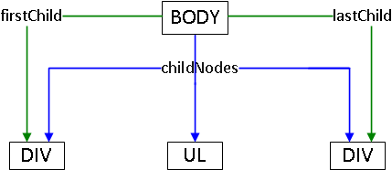
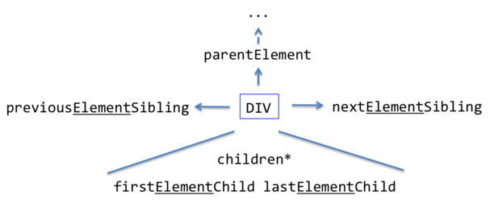

# Ссылки между DOM-элементами

Для того, чтобы изменить узел DOM или его содержимое, нужно сначала его получить.

Доступ к DOM начинается с объекта `document`. Из него можно добраться до любых узлов.

[cut]

Вот картина, которая, с небольшими дополниниями, будет обсуждаться в этой главе:


## Корень: documentElement и body   

Войти в "корень" дерева можно двумя путями.

<dl>
<dt>`<HTML>` = `document.documentElement`</dt>
<dd>Первая точка входа -- `document.documentElement`. Это свойство ссылается на DOM-объект для тега `HTML`.</dd>
<dt>`<BODY>` = `document.body`</dt>
<dd>Вторая точка входа -- `document.body`, который соответствует тегу `BODY`.</dd>
</dl>

Оба варианта отлично работают. Но есть одна тонкость: **`document.body` может быть равен `null`**.

Например, при доступе к `document.body` в момент обработки тега `HEAD`, то `document.body = null`. Это вполне логично, потому что `BODY` еще не существует.

**Нельзя получить доступ к элементу, которого еще не существует в момент выполнения скрипта.**

В следующем примере, первый `alert` выведет `null`:

```html
<!--+ run -->
<!DOCTYPE HTML>
<html>
  <head>
    <script>
      alert("Из HEAD: " + document.body); // null
    </script>
  </head>
  <body>
  
    <script>
      alert("Из BODY: " + document.body);
    </script>

  </body>
</html>
```

[smart header="В DOM активно используется `null`"]

В мире DOM в качестве значения "нет такого элемента" или "узел не найден" используется не `undefined`, а `null`.
[/smart]

## document.getElementById или просто id

Если элементу назначен специальный атрибут `id`, то можно получить его прямо по переменной с именем из значения `id`.

Например:

```html
<!--+ run -->
<div id="*!*content-holder*/!*">
  <div id="*!*content*/!*">Элемент</div>
</div>

<script>
*!*
  alert( content ); // DOM-элемент
  alert( window['content-holder'] ); // в имени дефис, поэтому через [...]
*/!*
</script>
```

По стандарту, значение `id` должно быть уникально, то есть в документе может быть только один элемент с данным `id`.

Это поведение соответствует [стандарту](http://www.whatwg.org/specs/web-apps/current-work/#dom-window-nameditem). Оно существует, в первую очередь, для совместимости, как осколок далёкого прошлого и не очень приветствуется, поскольку использует глобальные переменные.  Браузер пытается помочь нам, смешивая пространства имён JS и DOM, но при этом возможны конфликты.

**Более правильной и общепринятой практикой является доступ к элементу вызовом `document.getElementById("идентификатор")`.**

Например:

```html
<!--+ run -->
<div id="*!*content*/!*">Выделим этот элемент</div>

<script>
*!*
  var elem = document.getElementById('content');

  elem.style.background = 'red';

  alert( elem == content ); // true

  content.style.background = ""; // один и тот же элемент
*/!*
</script>
```

**Далее я изредка буду использовать прямое обращение через переменную в примерах, чтобы было меньше букв и проще было понять происходящее. Но предпочтительным методом является `document.getElementById`.**

## Дочерние элементы

Здесь и далее мы будем использовать два принципиально разных термина.

<ul>
<li>**Дочерние элементы (или дети)** -- элементы, которые лежат *непосредственно* внутри данного. Например, внутри `<HTML>` обычно лежат `<HEAD>` и `<BODY>`.</li>
<li>**Потомки** -- все элементы, которые лежат внутри данного, вместе с их детьми, детьми их детей и так далее. То есть, всё поддерево.</li>
</ul>

### childNodes   

Псевдо-массив `childNodes` хранит все дочерние элементы, включая текстовые.

Пример ниже последовательно выведет дочерние элементы `document.body`:

```html
<!--+ run src="index.html" -->
```

Во всех браузерах, кроме старых IE, `document.body.childNodes[0]` это текстовый узел из пробелов, а `DIV` -- второй потомок: `document.body.childNodes[1]`.

В IE8- не создаются пустые текстовые узлы, поэтому там дети начнутся с `DIV`.

Как вы думаете, почему перечисление узлов в примере выше заканчивается на `SCRIPT` ? Неужели под скриптом нет пробельного узла?

[hide]
Конечно, потому что пробельный узел будет в итоговом документе, но его еще нет на момент выполнения скрипта.
[/hide]

[warn header="Коллекция только для чтения!"]
Все навигационные свойства, которые перечислены в этой главе -- только для чтения. Нельзя просто заменить элемент присвоением `childNodes[i] = ...`. В частности, методы массива для `childNodes` тоже не поддерживаются, поэтому это свойство и называют "коллекцией".

Изменения DOM осуществляется другими методами, которые мы рассмотрим далее, все навигационные ссылки при этом обновляются автоматически.
[/warn]


### children   

А что если текстовые узлы нам не интересны? 

**Свойство `children`, перечисляет только дочерние узлы-элементы, соответствующие тегам.**
 
Модифицируем предыдущий пример, применив `children` вместо `childNodes`. 

Теперь он будет выводить не все узлы, а только узлы-элементы:

```html
<!--+ src="index.html" run link -->
```

[warn header="В IE8- в `children` присутствуют узлы-комментарии"]
С точки зрения стандарта это ошибка, но IE8- также включает в `children` узлы, соответствующие HTML-комментариям.

Это может привести к сюрпризам при использовании свойства `children`, поэтому HTML-комментарии либо убирают либо используют функцию (или фреймворк, к примеру, jQuery), который автоматически офильтрует их.
[/warn]

### Коллекции -- не массивы

Коллекции, которые возвращают методы поиска, не являются массивами.

У них нет методов массива, таких как `join`, `pop`, `forEach` и т.п. 

Например, этот пример выполнится с ошибкой:

```js
//+ run
var elems = document.documentElement.childNodes;

*!*
elems.forEach(function(elem) { // нет такого метода!
*/!*
  /* ... */
});
```

Можно для перебора коллекции использовать обычный цикл `for(var i=0; i<elems.length; i++) ...`

Но что делать, если уж очень хочется воспользоваться методами массива?

Варианта два:
<ol>
<li>Применить метод массива через `call/apply`:

```js
//+ run
var elems = document.documentElement.childNodes;

*!*
[].forEach.call(elems, function(elem) { 
*/!*
  alert(elem);  // HEAD, текст, BODY
});
```

</li>
<li>При помощи [Array.prototype.slice](https://developer.mozilla.org/en-US/docs/Web/JavaScript/Reference/Global_Objects/Array/slice) сделать из коллекции массив.

Обычно вызов `arr.slice(a, b)` делает новый массив и копирует туда элементы `arr` с индексами от `a` до `b-1` включительно. Если же вызвать его без аргументов `arr.slice()`, то он делает новый массив и копирует туда все элементы  `arr`. 

Это работает и для коллекции:

```js
//+ run
var elems = document.documentElement.childNodes;
*!*
elems = Array.prototype.slice.call(elems); // теперь elems - массив
*/!*

elems.forEach(function(elem) { 
  alert(elem.tagName);  // HEAD, текст, BODY
});
```

</li>
</ol>

[warn header="Нельзя перебирать коллекцию через `for..in`"]
Ранее мы говорили, что не рекомендуется использовать для перебора массива цикл `for..in`.

**Коллекции -- наглядный пример, почему нельзя. Они похожи на массивы, но у них есть свои свойства и методы, которых в массивах нет.**

При запуске этого кода вы увидите, что `alert` сработает не 3, а целых 5 раз!

```js
//+ run
var elems = document.documentElement.childNodes;

for(var key in elems) {
  alert(key); // 0, 1, 2, length, item
}
```

Цикл `for..in` вывел не только ожидаемые индексы `0`, `1`, `2`, по которым лежат узлы в коллекции, но и свойства `length` (в коллекции оно enumerable), а также функцию `item(n)` -- она никогда не используется, возвращает `n-й` элемент коллекции, старый аналог обращения по индексу `[n]`. 

В реальном коде мы хотим перебирать только элементы, поэтому желательно использовать `for(var i=0; i<elems.length; i++)`, либо методы массивов, как описано выше.
[/warn]

## firstChild и lastChild   

Свойства `firstChild` и `lastChild` обеспечивают быстрый доступ к первому и последнему дочернему элементу.

Например, для документа:

```html
<body>
  <div>...</div>
  <ul>...</ul>
  <div>...</div>
</body>
```

DOM-дерево будет таким (внутренности `div` и `ul` скрыты):

<div class="domtree" id="traversing-dom-domtree"></div>
<script>
document.addEventListener('DOMContentLoaded', function() {

var node = {"name":"HTML","nodeType":1,"children":[{"name":"HEAD","nodeType":1,"children":[]},{"name":"BODY","nodeType":1,"children":[{"name":"#text","nodeType":3,"content":"\n  "},{"name":"DIV","nodeType":1,"_children":[{"name":"#text","nodeType":3,"content":"..."}]},{"name":"#text","nodeType":3,"content":"\n  "},{"name":"UL","nodeType":1,"_children":[{"name":"#text","nodeType":3,"content":"..."}]},{"name":"#text","nodeType":3,"content":"\n  "},{"name":"DIV","nodeType":1,"_children":[{"name":"#text","nodeType":3,"content":"..."}]},{"name":"#text","nodeType":3,"content":"\n"}]}]}


  drawHtmlTree(node, document.getElementById('traversing-dom-domtree'), 690, 400);
});
</script>

Если бы пробельных узлов не было, например, в IE8, то была бы такая картина ссылок:



С другой стороны, так как пробельные узлы, всё же, есть, то `body.firstChild` и `body.lastChild` будут указывать как раз на них, то есть на первый и последний `#text`.

Всегда верны равенства:

```js
body.firstChild === body.childNodes[0]
body.lastChild === body.childNodes[body.childNodes.length-1]
```

## parentNode, previousSibling и nextSibling   

Ранее мы смотрели свойства для доступа к детям. Теперь рассмотрим ссылки для доступа вверх и в стороны от узла.

<ul>
<li>Свойство `parentNode` ссылается на родительский узел.</li>
<li>Свойства `previousSibling` и `nextSibling` дают доступ к левому и правому соседу.</li>
</ul>

Ниже изображены ссылки между `BODY` и его потомками для документа:

```html
<!--+ src="index.html" run link -->
```

Ссылки (пробельные узлы обозначены решеткой `#`):


## Ссылки для элементов (IE9+)

Все современные браузеры, включая IE9+, поддерживают дополнительные ссылки:

<ul>
<li>`firstElementChild` -- первый потомок-элемент (`=children[0]`)</li>
<li>`lastElementChild` -- последний потомок-элемент (`=children[children.length-1]`)</li>
<li>`nextElementSibling` -- правый брат-элемент</li>
<li>`previousElementSibling` -- левый брат-элемент</li>
<li>`parentElement` -- родительский узел-элемент, по факту отличается от `parentNode` только тем, что `document.documentElement.parentElement = null`, то есть `document` он элементом не считает.</li>
</ul>

Любые другие узлы, кроме элементов, просто игнорируются. 

Например:

```html
<!--+ run -->
<body>
  firstElementChild: <div>...</div>
  <!-- комментарий -->
  lastElementChild: <span>...</span>

  <script>
    alert(document.body.firstElementChild.nextElementSibling); // SPAN
  </script>

</body>
```

Современные браузеры также поддерживают дополнительные интерфейсы для обхода DOM c фильтром по узлам: `NodeIterator`, `TreeFilter` и `TreeWalker`. Они были утверждены аж в 2000-м году, однако на практике оказались неудобными, и потому практически не применяются. Вы можете почитать о них в стандарте [DOM 2 Traversal](http://www.w3.org/TR/DOM-Level-2-Traversal-Range/traversal.html#Traversal-Filters). 


## Итого

Сверху в DOM можно войти либо через `document.documentElement` (тег `HTML`), либо через `document.body` (тег `BODY`).

По элементу DOM можно получить всех соседей через ссылки:

<dl>
<dt>`childNodes`, `children`</dt>
<dd>Список дочерних узлов.</dd>
<dt>`firstChild`, `lastChild`</dt>
<dd>Первый и последний потомки</dd>
<dt>`parentNode`</dt>
<dd>Родительский узел</dd>
<dt>`previousSibling`, `nextSibling`</dt>
<dd>Соседи влево-вправо</dd>
</dl>

Все навигационные ссылки доступны только для чтения и поддерживаются автоматически.

Свойства-коллекции, хотя и имеют индексы, а также `length`, не являются массивами. Поэтому их и называют "псевдомассивами", "коллекциями" или "списками". Далее мы встретимся с кучей других полезных коллекций, которые тоже не будут массивами.

В современных браузерах, включая IE9+, реализованы дополнительные свойства, работающие только для элементов: 

<ul>
<li>`firstElementChild` -- первый потомок-элемент</li>
<li>`lastElementChild` -- последний потомок-элемент </li>
<li>`nextElementSibling` -- правый брат-элемент</li>
<li>`previousElementSibling` -- левый брат-элемент</li>
</ul>

Картинка только со ссылками для элементов:



<ul>
<li>`children*` -- единственное свойство из списка, поддерживаемое IE8-.</li>
</ul>

[libs]
d3
domtree
[/libs]