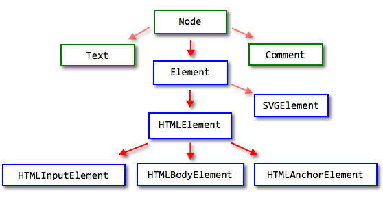

# Свойства узлов: тип, тег и содержимое

В этой главе мы познакомимся с основными, самыми важными свойствами, которые отвечают за тип DOM-узла, тег и содержимое.

[cut]

## Классы, иерархия DOM

Самое главное различие между DOM-узлами -- разные узлы являются объектами различных классов.

Поэтому, к примеру, у узла, соответствующего тегу `<td>` -- одни свойства, у `<form>` -- другие, у `<a>` -- третьи. 

Есть и кое-что общее, за счёт наследования.

Классы DOM образуют иерархию.

Основной объект в ней: [Node](http://dom.spec.whatwg.org/#interface-node), от которого наследуют остальные:



На рисунке выше изображены основные классы:
<ul>
<li>Прямо от `Node` наследуют текстовые узлы `Text`, комментарии `Comment` и элементы `Element`.</li>
<li>Элементы `Element` -- это ещё не HTML-элементы, а более общий тип, который используется в том числе в XML. От него наследует `SVGElement` для SVG-графики и, конечно, `HTMLElement`.</li>
<li>От `HTMLElement` уже наследуют разнообразные узлы HTML:
<ul>
<li>Для `<input>` -- `HTMLInputElement`</li>
<li>Для `<body>` -- `HTMLBodyElement`</li>
<li>Для `<a>` -- `HTMLAnchorElement`... и так далее.</li>
</ul>
</li>
</ul>

Узнать класс узла очень просто -- достаточно привести его к строке, к примеру, вывести:

```js
//+ run
alert( document.body ); // [object HTMLBodyElement]
```

Можно и проверить при помощи `instanceof`:

```js
//+ run
alert( document.body instanceof HTMLBodyElement ); // true
alert( document.body instanceof HTMLElement ); // true
alert( document.body instanceof Element ); // true
alert( document.body instanceof Node ); // true
```

Как видно, DOM-узлы -- обычные JavaScript-объекты. Их классы заданы в прототипном стиле. В этом легко убедиться, если вывести в консоли любой элемент через `console.dir(elem)`. Или даже можно напрямую обратиться к методам, которые хранятся в `Node.prototype`, `Element.prototype` и так далее.

[smart header="`console.dir(elem)` против `console.log(elem)`"]
Вывод `console.log(elem)` и `console.dir(elem)` различен.

<ul>
<li>`console.log` выводит элемент в виде, удобном для исследования HTML-структуры.</li>
<li>`console.dir` выводит элемент в виде JavaScript-объекта, удобно для анализа его свойств.</li>
</ul>
Попробуйте сами на `document.body`.
[/smart]

Детальное описание свойств и методов каждого DOM-класса дано в [спецификации](https://html.spec.whatwg.org/multipage/).

Например, [The input element](https://html.spec.whatwg.org/multipage/forms.html#the-input-element) описывает класс, соответствующий `<input>`, включая [interface HTMLInputElement](https://html.spec.whatwg.org/multipage/forms.html#htmlinputelement), который нас как раз и интересует.

При описании свойств и методов используется не JavaScript, а специальный язык [IDL](https://ru.wikipedia.org/wiki/%D0%AF%D0%B7%D1%8B%D0%BA_%D0%BE%D0%BF%D0%B8%D1%81%D0%B0%D0%BD%D0%B8%D1%8F_%D0%B8%D0%BD%D1%82%D0%B5%D1%80%D1%84%D0%B5%D0%B9%D1%81%D0%BE%D0%B2) (Interface Definition Language), который достаточно легко понять "с ходу".

Вот из него выдержка, с комментариями:

```js
// Объявлен HTMLInputElement
// двоеточие означает, что он наследует от HTMLElement
interface HTMLInputElement: HTMLElement { 

  // у всех таких элементов есть строковые свойства 
  // accept, alt, autocomplete, value
  attribute DOMString accept;
  attribute DOMString alt;
  attribute DOMString autocomplete;
  attribute DOMString value;
  
  // и логическое свойство autofocus
  attribute boolean autofocus;
  ...
  // а также метод select, который значение не возвращает (void)
  void select();
  ...
}
```

Далее в этом разделе мы поговорим о самых главных свойствах узлов DOM, которые используются наиболее часто.

## Тип: nodeType   

Тип узла содержится в его свойстве `nodeType`.

Как правило, мы работаем всего с двумя типами узлов:
<ul>
<li>Элемент.</li>
<li>Текстовый узел.</li>
</ul>

На самом деле типов узлов гораздо больше. Строго говоря, их 12, и они описаны в спецификации с древнейших времён, см. <a href="http://www.w3.org/TR/REC-DOM-Level-1/level-one-core.html#ID-1950641247">DOM Уровень 1</a>:

```js
interface Node {
  // Всевозможные значения nodeType
  const unsigned short ELEMENT_NODE = 1;
  const unsigned short ATTRIBUTE_NODE = 2;
  const unsigned short TEXT_NODE = 3;
  const unsigned short CDATA_SECTION_NODE = 4;
  const unsigned short ENTITY_REFERENCE_NODE = 5;
  const unsigned short ENTITY_NODE = 6;
  const unsigned short PROCESSING_INSTRUCTION_NODE = 7;
  const unsigned short COMMENT_NODE = 8;
  const unsigned short DOCUMENT_NODE = 9;
  const unsigned short DOCUMENT_TYPE_NODE = 10;
  const unsigned short DOCUMENT_FRAGMENT_NODE = 11;
  const unsigned short NOTATION_NODE = 12;
  ...
}
```

В частности, тип "Элемент" `ELEMENT_NODE` имеет номер 1, а "Текст" `TEXT_NODE` -- номер 3.

Например, выведем все узлы-потомки `document.body`, *являющиеся элементами*:

```html
<!--+ run -->
<body>
  <div>Читатели:</div>
  <ul>
    <li>Вася</li>
    <li>Петя</li>
  </ul>

  <!-- комментарий -->

  <script>
    var childNodes = document.body.childNodes;

    for (var i = 0; i < childNodes.length; i++) {

*!*
      // отфильтровать не-элементы  
      if (childNodes[i].nodeType != 1) continue;
*/!*

      alert( childNodes[i] );

    }
  </script>
</body>
```

Тип узла можно только читать, изменить его невозможно.


## Тег: nodeName и tagName   

Существует целых два свойства: `nodeName` и `tagName`, которые содержат название(тег) элемента узла. 

**Название HTML-тега всегда находится в верхнем регистре.**

Например, для `document.body`:

```js
//+ run
alert( document.body.nodeName ); // BODY
alert( document.body.tagName ); // BODY
```

[smart header="В XHTML `nodeName` может быть не в верхнем регистре"]
У браузера есть два режима обработки документа: HTML и XML-режим. Обычно используется режим HTML.

XML-режим включается, когда браузер получает XML-документ через `XMLHttpRequest`(технология AJAX) или при наличии заголовка `Content-Type: application/xml+xhtml`.

В XML-режиме сохраняется регистр и `nodeName` может выдать "body" или даже "bOdY" -- в точности как указано в документе. XML-режим используют очень редко.
[/smart]

### Какая разница между tagName и nodeName ?

Разница отражена в названиях свойств, но неочевидна. 

<ul>
<li>Свойство `tagName` есть только у элементов `Element` (в IE8- также у комментариев, но это ошибка в браузере).</li>
<li>Свойство `nodeName` определено для любых узлов `Node`, для элементов оно равно `tagName`, а для не-элементов обычно содержит строку с типом узла.</li>
</ul>

Таким образом, при помощи `tagName` мы можем работать только с элементами, а `nodeName` может что-то сказать и о других типах узлов.

Например, сравним `tagName` и `nodeName` на примере узла-комментария и объекта `document`:

```html
<!--+ run -->
<body>
  <!-- комментарий -->

  <script>
    // для комментария
    alert( document.body.firstChild.nodeName ); // #comment
    alert( document.body.firstChild.tagName ); // undefined (в IE8- воскл. знак "!")

    // для документа
    alert( document.nodeName ); // #document, т.к. корень DOM -- не элемент
    alert( document.tagName ); // undefined
  </script>
</body>
```

При работе с элементами, как это обычно бывает, имеет смысл использовать свойство `tagName` -- оно короче.

## innerHTML: содержимое элемента

Свойство `innerHTML` описано в спецификации HTML 5 -- <a href="http://www.w3.org/TR/html5/embedded-content-0.html">embedded content</a>.

Оно позволяет получить HTML-содержимое элемента в виде строки. В `innerHTML` можно и читать и писать. 

Пример выведет на экран все содержимое `document.body`, а затем заменит его на другое:

```html
<!--+ run -->
<body>
  <p>Параграф</p>
  <div>Div</div>

  <script>
    alert( document.body.innerHTML ); // читаем текущее содержимое
    document.body.innerHTML = 'Новый BODY!'; // заменяем содержимое
  </script>

</body>
```

Значение, возвращаемое `innerHTML` -- всегда валидный HTML-код. При записи можно попробовать записать  что угодно, но браузер исправит ошибки:

```html
<!--+ run -->
<body>

  <script>
    document.body.innerHTML = '<b>тест'; // незакрытый тег
    alert( document.body.innerHTML ); // <b>тест</b> (исправлено)
  </script>

</body>
```

Свойство `innerHTML` -- одно из самых часто используемых. 

### Тонкости innerHTML   

`innerHTML` не так прост, как может показаться, и таит в себе некоторые тонкости, которые могут сбить с толку новичка, а иногда и опытного программиста.

Ознакомьтесь с ними. Даже если этих сложностей у вас *пока* нет, эта информация отложится где-то в голове и поможет, когда проблема появится.

[warn header="Для таблиц в IE9- -- `innerHTML` только для чтения"]
В Internet Explorer версии 9 и ранее, <a href="http://msdn.microsoft.com/en-us/library/ms533897.aspx">innerHTML</a> доступно только для чтения для элементов `COL`, `COLGROUP`, `FRAMESET`, `HEAD`, `HTML`, `STYLE`, `TABLE`, `TBODY`, `TFOOT`, `THEAD`, `TITLE`, `TR`. 

В частности, в IE9- запрещена запись в `innerHTML` для любых табличных элементов, кроме ячеек (`TD/TH`).
[/warn]

[warn header="Добавление `innerHTML+=` осуществляет перезапись"]
Синтаксически, можно добавить текст к `innerHTML` через `+=`:

```js
chatDiv.innerHTML += "<div>Привет !</div>";
chatDiv.innerHTML += "Как дела?";
```

На практике этим следует пользоваться с большой осторожностью, так как фактически происходит не добавление, а перезапись:
<ol>
<li>Удаляется старое содержание</li>
<li>На его место становится новое значение `innerHTML`.</li>
</ol>

Так как новое значение записывается с нуля, то **все изображения и другие ресурсы будут перезагружены**. В примере выше вторая строчка перезагрузит `smile.gif`, который был до неё. Если в `chatDiv` много текста, то эта перезагрузка будет очень заметна. 

Есть и другие побочные эффекты, например если существующий текст был выделен мышкой, то в большинстве браузеров это выделение пропадёт. Если в HTML был `<input>`, в который посетитель что-то ввёл, то введённое значение пропадёт. И тому подобное.

К счастью, есть и другие способы добавить содержимое, не использующие `innerHTML`.
[/warn]

[warn header="Скрипты не выполняются"]
Если в `innerHTML` есть тег `script` -- он не будет выполнен. 

К примеру:

```html
<!--+ run -->
<div id="my"></div>

<script>
  var elem = document.getElementById('my');
  elem.innerHTML = 'ТЕСТ<script>alert( 1 );</scr' + 'ipt>';
</script>
```

В примере закрывающий тег `</scr'+'ipt>` разбит на две строки, т.к. иначе браузер подумает, что это конец скрипта. Вставленный скрипт не выполнится.

Исключение -- IE9-, в нем вставляемый скрипт выполняются, если у него есть атрибут `defer`. Но это нестандартная возможность, которой не следует пользоваться.

[/warn]

[warn header="IE8- обрезает `style` и `script` в начале `innerHTML`"]
Если в начале `innerHTML` находятся стили `<style>`, то старый IE проигнорирует их. То есть, иными словами, они не применятся.

Смотрите также [innerHTML на MSDN](http://msdn.microsoft.com/en-us/library/ms533897%28v=vs.85%29.aspx) на эту тему.
[/warn]

## outerHTML: HTML элемента целиком

Свойство `outerHTML` содержит HTML элемента целиком.

Пример чтения `outerHTML`:

```html
<!--+ run -->
<div>Привет <b>Мир</b></div>

<script>
  var div = document.body.children[0];

  alert( div.outerHTML ); // <div>Привет <b>Мир</b></div>
</script>
```

**Изменить `outerHTML` элемента невозможно.**

Здесь мы остановимся чуть подробнее. Дело в том, что технически свойство `outerHTML` доступно на запись. Но при этом элемент не меняется, а *заменяется на новый*, который тут же создаётся из нового `outerHTML`.

При этом переменная, в которой изначально был старый элемент, и в которой мы "перезаписали" `outerHTML`, остаётся со старым элементом.

Это легко может привести к ошибкам, что видно на примере:

```html
<!--+ run -->
<div>Привет, Мир!</div>

<script>
  var div = document.body.children[0];

*!*
  // заменяем div.outerHTML на <p>...</p>
*/!*
  div.outerHTML = '<p>Новый элемент!</p>';

*!*
  // ... но содержимое div.outerHTML осталось тем же, несмотря на "перезапись"
*/!*
  alert( div.outerHTML ); // <div>Привет, Мир!</div>
</script>
```

То, что произошло в примере выше -- так это замена `div` в документе на новый узел `<p>...</p>`. При этом переменная `div` не получила этот новый узел! Она сохранила старое значение, чтение из неё это отлично показывает.

[warn header="Записал `outerHTML`? Понимай последствия!"]
Иногда начинающие делают здесь ошибку: сначала заменяют `div.outerHTML`, а потом продолжают работать с `div`, как будто это изменившийся элемент. Такое возможно с `innerHTML`, но не с `outerHTML`.

Записать новый HTML в `outerHTML` можно, но нужно понимать, что это никакое не изменение свойств узла, а создание нового. 

Новосозданный узел не доступен сразу в переменной, хотя его, конечно, можно получить из DOM.
[/warn]

## nodeValue/data: содержимое текстового узла   

Свойство `innerHTML` есть только у узлов-элементов. 

**Содержимое других узлов, например, текстовых или комментариев, доступно на чтение и запись через свойство `data`.**

Его тоже можно читать и обновлять. Следующий пример демонстрирует это:

```html
<!--+ run height="50" -->
<body>
  Привет
  <!-- Комментарий -->
  <script>
    for (var i = 0; i < document.body.childNodes.length; i++) {
*!*
      alert( document.body.childNodes[i].data );
*/!*
    }
  </script>
  Пока
</body>
```

Если вы запустите этот пример, то увидите, как выводятся последовательно:
<ol>
<li>`Привет` -- это содержимое первого узла (текстового).</li>
<li>`Комментарий` -- это содержимое второго узла (комментария).</li>
<li>`Пробелы` -- это содержимое небольшого пробельного узла после комментария до скрипта.</li>
<li>`undefined` -- далее цикл дошёл до <code>&lt;script&gt;</code>, но это узел-элемент, у него нет `data`.</li>
</ol>

Вообще говоря, после <code>&lt;script&gt;...&lt;/script&gt;</code> и до закрытия `</body>` в документе есть еще один текстовый узел. Однако, на момент работы скрипта браузер ещё не знает о нём, поэтому не выведет.

**Свойство `nodeValue` мы использовать не будем.**

Оно работает так же, как `data`, но на некоторых узлах, где `data` нет, `nodeValue` есть и имеет значение `null`. Как-то использовать это тонкое отличие обычно нет причин. 

**Два свойства существуют по историческим причинам, мы будем использовать лишь `data`, поскольку оно короче.**

## Текст: textContent

Свойство `textContent` содержит только текст внутри элемента, за вычетом всех `<тегов>`.

Оно поддерживается везде, кроме IE8-.

Например:

```html
<!--+ run -->
<div>
  <h1>Срочно в номер!</h1>
  <p>Марсиане атакуют людей!</p>
</div>

<script>
  var news = document.body.children[0];

  // \n  Срочно в номер!\n  Марсиане атакуют людей!\n
  alert( news.textContent );
</script>
```

Как видно из примера выше, возвращается в точности весь текст, включая переводы строк и пробелы, но без тегов.

**Иными словами, `elem.textContent` возвращает конкатенацию всех текстовых узлов внутри `elem`.**

Не сказать, чтобы эта информация была часто востребована.

**Гораздо полезнее возможность записать текст в элемент, причём именно как текст!**

В этом примере имя посетителя попадёт в первый `div` как `innerHTML`, а во второй -- как текст:

```html
<!--+ run -->
<div></div>
<div></div>

<script>
  var name = prompt("Введите имя?", "<b>Винни-пух</b>");

  document.body.children[0].innerHTML = name;
  document.body.children[1].textContent = name;
</script>
```

При запуске примера мы увидим, что в первый `DIV` текст от посетителя вставился в именно как HTML, то есть теги стали именно тегами, а во второй -- как обычный текст. 

Вряд ли мы *действительно* хотим, чтобы посетители вставляли в наш сайт произвольный HTML-код. Присваивание через `textContent` -- один из способов от этого защититься.

[warn header="Нестандартное свойство `innerText`"]
Всеми браузерами, кроме Firefox, поддерживается нестандартное свойство [innerText](http://msdn.microsoft.com/en-us/library/ie/ms533899.aspx). 

У него, в некотором роде, преимущество перед `textContent` в том, что оно по названию напоминает `innerHTML`, его проще запомнить.

Однако, свойство `innerText` не следует использовать, так как оно не стандартное и не будет стандартным.

Это свойство возвращает текст не в том виде, в котором он в DOM, а в том, в котором он виден -- как если бы мы выбрали содержимое элемента мышкой и скопировали его. В частности, если элемент невидим, то его текст возвращён не будет. Это довольно странная особенность существует по историческим причинам и скорее мешает, чем помогает.

Впрочем, при записи значения `innerText` работает так же, как и `textContent`.
[/warn]

## Свойство hidden

Как правило, видим или невидим узел, определяется через CSS, свойствами `display` или `visibility`.

В стандарте HTML5 предусмотрен специальный атрибут и свойство для этого: `hidden`.

Его поддерживают все современные браузеры, кроме IE10-.

В примере ниже второй и третий `<div>` скрыты:

```html
<!--+ run height="80" -->
<div>Текст</div>
<div hidden>С атрибутом hidden</div>
<div>Со свойством hidden</div>

<script>
  var lastDiv = document.body.children[2];
  lastDiv.hidden = true;
</script>
```

Технически, атрибут `hidden` работает так же, как `style="display:none"`. Но его проще поставить через JavaScript (меньше букв), и могут быть преимущества для скринридеров и прочих нестандартных браузеров.

Для старых IE тоже можно сделать, чтобы свойство поддерживалось, мы ещё вернёмся к этому далее в учебнике.


## Исследование элементов

У DOM-узлов есть и другие свойства, зависящие от типа, например:

<ul>
<li>`value` -- значение для `INPUT`, `SELECT` или `TEXTAREA`</li>
<li>`id` -- идентификатор</li>
<li>`href` -- адрес ссылки</li>
<li>...многие другие...</li>
</ul>

Например:

```html
<!--+ run height="80" -->
<input type="text" value="значение">

<script>
  var input = document.body.children[0];

  alert( input.type ); // "text"
  alert( input.id ); // "input"
  alert( input.value ); // значение
</script>
```

Как узнать, какие свойства есть у данного типа элементов?

Это просто. Нужно либо посмотреть [список элементов HTML5](http://dev.w3.org/html5/markup/elements.html) и найти в нём интересующий вас элемент и прочитать секцию с `interface`.

Если же недосуг или интересуют особенности конкретного браузера -- элемент всегда можно вывести в консоль вызовом `console.dir(элемент)`.

Метод `console.dir` выводит аргумент не в "красивом" виде, а как объект, который можно развернуть и исследовать.

Например:

```js
//+ run
// в консоли можно будет увидеть все свойства DOM-объекта document 
console.dir(document);
```

## Итого

Основные свойства DOM-узлов:

<dl>
<dt>`nodeType`</dt>
<dd>Тип узла. Самые популярные типы: `"1"` - для элементов и `"3"` - для текстовых узлов. Только для чтения.</dd>
<dt>`nodeName/tagName`</dt>
<dd>Название тега заглавными буквами. `nodeName` имеет специальные значения для узлов-неэлементов. Только для чтения.</dd>
<dt>`innerHTML`</dt>
<dd>Внутреннее содержимое узла-элемента в виде HTML. Можно изменять.</dd>
<dt>`outerHTML`</dt>
<dd>Полный HTML узла-элемента. При записи в `elem.outerHTML` переменная `elem` сохраняет старый узел.</dd>
<dt>`nodeValue/data`</dt>
<dd>Содержимое текстового узла или комментария. Свойство `nodeValue` также определено и для других типов узлов. Можно изменять.</dd>
</dl>

Узлы DOM также имеют другие свойства, в зависимости от тега. Например, у `INPUT` есть свойства `value` и `checked`, а у `A` есть `href` и т.д. Мы рассмотрим их далее.

