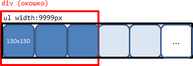
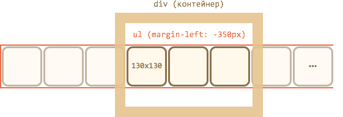

Лента изображений должна быть оформлена как список, согласно принципам семантической вёрстки.

Нужно стилизовать его так, чтобы он был длинной лентой, из которой внешний `DIV` вырезает нужную часть для просмотра:

Чтобы список был длинный и элементы не переходили вниз, ему ставится `width: 9999px`, а элементам, соответственно, `float:left`.

[warn header="Не используйте display:inline"]
Элементы с `display:inline` имеют дополнительные отступы для возможных "хвостов букв".

В частности, для `img` нужно поставить в стилях явно `display:block`, чтобы пространства под ними не оставалось.
[/warn]

При прокрутке UL сдвигается назначением `margin-left`:

У внешнего `DIV` фиксированная ширина, поэтому "лишние" изображения обрезаются.

Снаружи окошка находятся стрелки и внешний контейнер.

Реализуйте эту структуру, и к ней прикручивайте обработчики, которые меняют `ul.style.marginLeft`.

