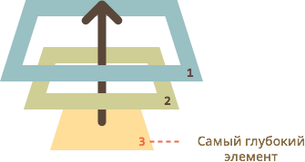
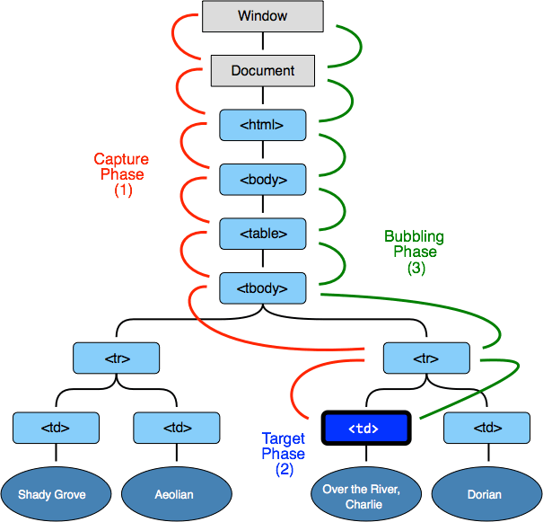

# Всплытие и перехват

Давайте сразу начнём с примера. 

Этот обработчик для `<div>` сработает, если вы кликните по вложенному тегу `<em>` или `<code>`:

```html
<!--+ autorun height=60 -->
<div onclick="alert('Обработчик для Div сработал!')">
  <em>Кликните на <code>EM</code>, сработает обработчик на <code>DIV</code></em>
</div>
```

Вам не кажется это странным? Почему же сработал обработчик на `<div>`, если клик произошёл на `<em>`?

## Всплытие

Основной принцип всплытия:

**При наступлении события обработчики сначала срабатывают на самом вложенном элементе, затем на его родителе, затем выше и так далее, вверх по цепочке вложенности.**

Например, есть 3 вложенных элемента `FORM > DIV > P`, с обработчиком на каждом:

```html
<!--+ run autorun -->
<style>
  body * { margin: 10px; border: 1px solid blue; }
</style>

<form onclick="alert('form')">FORM
    <div onclick="alert('div')">DIV
        <p onclick="alert('p')">P</p>
    </div>
</form>
```

Всплытие гарантирует, что клик по внутреннему `<p>` вызовет обработчик `onclick` (если есть) сначала на самом `<p>`, затем на элементе `<div>` далее на элементе `<form>`, и так далее вверх по цепочке родителей до самого `document`.



Поэтому если в примере выше кликнуть на `P`, то последовательно выведутся `alert`: `p` -> `div` -> `form`.

Этот процесс называется *всплытием*, потому что события "всплывают" от внутреннего элемента вверх через родителей, подобно тому, как всплывает пузырек воздуха в воде.

[warn header="Всплывают *почти* все события."]
Ключевое слово в этой фразе -- "почти". 

Например, событие `focus` не всплывает. В дальнейших главах мы будем детально знакомиться с различными событиями и увидим ещё примеры.
[/warn]

## Целевой элемент event.target   

На каком бы элементе мы ни поймали событие, всегда можно узнать, где конкретно оно произошло.

**Самый глубокий элемент, который вызывает событие, называется *"целевым"* или *"исходным"* элементом и доступен как `event.target`.**

Отличия от `this` (=`event.currentTarget`):
<ul>
<li>`event.target` -- это **исходный элемент**, на котором произошло событие, в процессе всплытия он неизменен.</li>
<li>`this` -- это **текущий элемент**, до которого дошло всплытие, на нём сейчас выполняется обработчик.</li>
</ul>

Например, если стоит только один обработчик `form.onclick`, то он "поймает" все клики внутри формы. Где бы ни был клик внутри -- он всплывёт до элемента `<form>`, на котором сработает обработчик.

При этом:

<ul>
<li>`this` (`=event.currentTarget`) всегда будет сама форма, так как обработчик сработал на ней.</li>
<li>`event.target` будет содержать ссылку на конкретный элемент внутри формы, самый вложенный, на котором произошёл клик.</li>
</ul>

[online]
[example height=220 src="bubble-target"]
[/online]

Возможна и ситуация, когда `event.target` и `this` -- один и тот же элемент, например если в форме нет других тегов и клик был на самом элементе `<form>`.

## Прекращение всплытия   

Всплытие идет прямо наверх. Обычно событие будет всплывать наверх и наверх, до элемента `<html>`, а затем до `document` и даже до `window`, вызывая все обработчики на своем пути.

**Но любой промежуточный обработчик может решить, что событие полностью обработано, и остановить всплытие.**

Для остановки всплытия нужно вызвать метод `event.stopPropagation()`.

Например, здесь при клике на кнопку обработчик `body.onclick` не сработает:

```html
<!--+ run autorun -->
<body onclick="alert('сюда обработка не дойдёт')">
  <button onclick="event.stopPropagation()">Кликни меня</button>
</body>
```

[smart header="event.stopImmediatePropagation()"] 
Если у элемента есть несколько обработчиков на одно событие, то даже при прекращении всплытия все они будут выполнены. 

То есть, `stopPropagation` препятствует продвижению события дальше, но на текущем элементе все обработчики отработают.

Для того, чтобы полностью остановить обработку, современные браузеры поддерживают метод `event.stopImmediatePropagation()`. Он не только предотвращает всплытие, но и останавливает обработку событий на текущем элементе.
[/smart]

[warn header="Не прекращайте всплытие без необходимости!"]
Всплытие -- это удобно. Не прекращайте его без явной нужды, очевидной и архитектурно прозрачной. 

Зачастую прекращение всплытия создаёт свои подводные камни, которые потом приходится обходить. 

Например:
<ol>
<li>Мы делаем меню. Оно обрабатывает клики на своих элементах и делает для них `stopPropagation`. Вроде бы, всё работает.</li>
<li>Позже мы решили отслеживать все клики в окне, для какой-то своей функциональности, к примеру, для статистики -- где вообще у нас кликают люди. Например, Яндекс.Метрика так делает, если включить соответствующую опцию.</li>
<li>Над областью, где клики убиваются `stopPropagation`, статистика работать не будет! Получилась "мёртвая зона".</li>
</ol>

Проблема в том, что `stopPropagation` убивает всякую возможность отследить событие сверху, а это бывает нужно для реализации чего-нибудь "эдакого", что к меню отношения совсем не имеет.
[/warn]

## Погружение

В современном стандарте, кроме "всплытия" событий, предусмотрено ещё и "погружение".

Оно гораздо менее востребовано, но иногда, очень редко, знание о нём может быть полезным.

[cut]

## Три стадии прохода события

Кроме всплытия, есть ещё стадии прохода события.

В соответствии со стандартом, их три:

<ol>
<li>Событие сначала идет сверху вниз. Эта стадия называется *"стадия перехвата"* (capturing stage).</li>
<li>Событие достигло целевого элемента. Это -- *"стадия цели"* (target stage).</li>
<li>После этого событие начинает всплывать. Это -- *"стадия всплытия"* (bubbling stage).</li>
</ol>

В [стандарте DOM Events 3](http://www.w3.org/TR/DOM-Level-3-Events/) это продемонстрировано так:



То есть, при клике на `TD` событие путешествует по цепочке родителей сначала вниз к элементу ("погружается"), а потом наверх ("всплывает"), по пути задействуя обработчики.

**Ранее мы говорили только о всплытии, потому что другие стадии, как правило, не используются и проходят незаметно для нас.**

Обработчики, добавленные через `on...`, ничего не знают о стадии перехвата, а начинают работать со всплытия.

**Чтобы поймать событие на стадии перехвата, нужно использовать третий аргумент `addEventListener`:**

<ul>
<li>Если аргумент `true`, то событие будет перехвачено по дороге вниз.</li>
<li>Если аргумент `false`, то событие будет поймано при всплытии.</li>
</ul>

Стадия цели, обозначенная на рисунке цифрой `(2)`, особо не обрабатывается, так как обработчики, назначаемые обоими этими способами, срабатывают также на целевом элементе.

## Примеры

В примере ниже на `form, div, p` стоят те же обработчики, что и раньше, но на этот раз -- на стадии погружения.

Чтобы увидеть перехват в действии, кликните на элементе `P`:

[example height=220 src="capture"]

Обработчики сработают в порядке "сверху-вниз": `FORM` -> `DIV` -> `P`.

JS-код здесь такой:

```js
var elems = document.querySelectorAll('form,div,p');

// на каждый элемент повесить обработчик на стадии перехвата
for(var i=0; i<elems.length; i++) {
  elems[i].addEventListener("click", highlightThis, true);
}
```

Никто не мешает назначить обработчики для обеих стадий, вот так:

```js
var elems = document.querySelectorAll('form,div,p');

for(var i=0; i<elems.length; i++) {
  elems[i].addEventListener("click", highlightThis, true);
  elems[i].addEventListener("click", highlightThis, false);
}
```

Кликните по внутреннему элементу `P`, чтобы увидеть порядок прохода события:

[example height=220 src="both"]

Должно быть `FORM` -> `DIV` -> `P` -> `P` -> `DIV` -> `FORM`. Заметим, что элемент `P` участвует в обоих стадиях.

Как видно из примера, один и тот же обработчик можно назначить на разные стадии. При этом номер текущей стадии он, при необходимости, может получить из свойства `event.eventPhase` (=1, если погружение, =3, если всплытие).

[smart header="Есть события, которые не всплывают, но которые можно перехватить"]
Есть события, которые можно поймать только на стадии перехвата, а на стадии всплытия -- нельзя.. 

Например, таково событие фокусировки на элементе [onfocus](/focus-blur).
[/smart]


## Отличия IE8-

Чтобы было проще ориентироваться, я собрал отличия IE8-, которые имеют отношение ко всплытию, в одну секцию. 
 
Их знание понадобится, если вы решите писать на чистом JS, без фреймворков и вам понадобится поддержка IE8-.

<dl>
<dt>Нет свойства `event.currentTarget`</dt>
<dd>Обратим внимание, что при назначении обработчика через `onсвойство` у нас есть `this`, поэтому `event.currentTarget`, как правило, не нужно, а вот при назначении через `attachEvent` обработчик не получает `this`, так что текущий элемент, если нужен, можно будет взять лишь из замыкания.</dd>
<dt>Вместо `event.target` в IE8- используется `event.srcElement`</dt>
<dd>Если мы пишем обработчик, который будет поддерживать и IE8- и современные браузеры, то можно начать его так:

```js
elem.onclick = function(event) {
  event = event || window.event;
  var target = event.target || event.srcElement;

  // ... теперь у нас есть объект события и target
  ...
}
```

</dd>
<dt>Для остановки всплытия используется код `event.cancelBubble=true`.</dt>
<dd>Кросс-браузерно остановить всплытие можно так:

```js
event.stopPropagation ? event.stopPropagation() : (event.cancelBubble=true);
```

</dd>
</dl>

Далее в учебнике мы будем использовать стандартные свойства и вызовы, поскольку добавление этих строк, обеспечивающих совместимость -- достаточно простая и очевидная задача.

Ещё раз хотелось бы заметить -- эти отличия понадобятся при написании JS-кода с поддержкой IE8- без фреймворков. Почти все JS-фреймворки обеспечивают кросс-браузерную поддержку `target`, `currentTarget` и `stopPropagation()`.

## Итого

Алгоритм:
<ul>
<li>При наступлении события -- элемент, на котором оно произошло, помечается как "целевой" (`event.target`).</li>
<li>Далее событие сначала двигается вниз от корня документа к `event.target`, по пути вызывая обработчики, поставленные через `addEventListener(...., true)`.</li>
<li>Далее событие двигается от `event.target` вверх к корню документа, по пути вызывая обработчики, поставленные через `on*` и `addEventListener(...., false)`.</li>
</ul>

Каждый обработчик имеет доступ к свойствам события:
<ul>
<li>`event.target` -- самый глубокий элемент, на котором прозошло событие.</li>
<li>`event.currentTarget` (=`this`) -- элемент, на котором в данный момент сработал обработчик (до которого "доплыло" событие).</li>
<li>`event.eventPhase` -- на какой фазе он сработал (погружение =1, всплытие = 3).</li>
</ul>

Любой обработчик может остановить событие вызовом `event.stopPropagation()`, но делать это не рекомендуется, так как в дальнейшем это событие может понадобиться, иногда для самых неожиданных вещей.

В современной разработке стадия погружения используется очень редко. 

Этому есть две причины:
<ol>
<li>Историческая, так как IE лишь с версии 9 в полной мере поддерживает современный стандарт.</li>
<li>Разумная -- когда происходит событие, то разумно дать возможность первому сработать обработчику на самом элементе, поскольку он наиболее конкретен. Код, который поставил обработчик именно на этот элемент, знает максимум деталей о том, что это за элемент, чем он занимается, и обработчик через замыкание, скорее всего, имеет к ним доступ.

Далее имеет смысл передать обработку события родителю -- он тоже понимает, что происходит, но уже менее детально, далее -- выше, и так далее, до самого объекта `document`, обработчик на котором реализовывает самую общую функциональность уровня документа.</li>
</ol>
