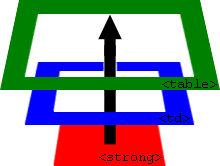

# Делегирование событий

Всплытие событий позволяет реализовать один из самых важных приёмов разработки -- *делегирование*.

Он заключается в том, что если у нас есть много элементов, события на которых нужно обрабатывать похожим образом, то вместо того, чтобы назначать обработчик каждому -- мы ставим один обработчик на их общего предка. Из него можно получить целевой элемент `event.target`, понять на каком именно потомке произошло событие и обработать его.

## Пример "Ба Гуа" 

Рассмотрим пример -- <a href="http://en.wikipedia.org/wiki/Ba_gua">диаграмму "Ба Гуа"</a>. Это таблица, отражающая древнюю китайскую философию.

Вот она:
[iframe height=350 src="bagua" edit link]

Её HTML (схематично):

```html
<table>
  <tr>
    <th colspan="3"><em>Bagua</em> Chart: Direction, Element, Color, Meaning</th>
  </tr>
  <tr>
     <td>...<strong>Northwest</strong>...</td>
     <td>...</td>
     <td>...</td>
  </tr>
  <tr>...еще 2 строки такого же вида...</tr>
  <tr>...еще 2 строки такого же вида...</tr>
</table>
```

В этой таблице всего 9 ячеек, но могло быть и 99, и даже 9999, не важно.

**Наша задача -- реализовать подсветку ячейки `<td>` при клике.**

Вместо того, чтобы назначать обработчик для каждой ячейки, мы повесим *один обработчик* на элемент `<table>`. 

Он  использует `event.target`, чтобы получить элемент, на котором произошло событие, и подсветить его.

Код будет таким:

```js
var selectedTd;

*!*
table.onclick = function(event) {
  var target = event.target; // где был клик?
  
  if (target.tagName != 'TD') return; // не на TD? тогда не интересует

  highlight(target); // подсветить TD
};
*/!*

function highlight(node) {
  if (selectedTd) {
    selectedTd.classList.remove('highlight');
  }
  selectedTd = node;
  selectedTd.classList.add('highlight');
}
```

Такой код будет работать и ему без разницы, сколько ячеек в таблице. Обработчик всё равно один. Я могу добавлять, удалять `<td>` из таблицы, менять их количество -- моя подсветка будет стабильно работать, так как обработчик стоит на `<table>`.

Однако, у текущей версии кода есть недостаток.

**Клик может быть не на том теге, который нас интересует, а внутри него.**

В нашем случае клик может произойти на вложенном элементе, внутри `<td>`, например на `<strong>`. Такой клик будет пойман по пути наверх, но `target` у него будет не `<td>`, а `<strong>`:



**Внутри обработчика `table.onclick` мы должны найти нужный `<td>` по `event.target`.**

Для этого мы вручную, используя ссылку `parentNode`, будем идти вверх по иерархии родителей от `event.target` и выше и проверять:
<ul>
<li>Если нашли `<td>`, значит это то что нужно.</li>
<li>Если дошли до элемента `table` и при этом `<td>` не найден, то наверное клик был вне `<td>`, например на элементе заголовка таблицы.</li>
</ul>
  
Улучшенный обработчик `table.onclick` с циклом `while`,  который этот делает:

```js
table.onclick = function(event) {
  var target = event.target;
  
  // цикл двигается вверх от target к родителям до table
  while(target != table) { 
    if (target.tagName == 'TD') {
       // нашли элемент, который нас интересует!
       highlight(target);
       return;
    }
    target = target.parentNode;
  }

  // возможна ситуация, когда клик был вне <td>
  // если цикл дошёл до table и ничего не нашёл, 
  // то обработчик просто заканчивает работу
}
```

[smart]
Кстати, в проверке `while` можно бы было использовать `this` вместо `table`:

```js
while(target != this) {
  // ...
}
```

Это тоже будет работать, так как в обработчике `table.onclick` значением `this` является текущий элемент, то есть `table`.
[/smart]


## Применение делегирования: действия в разметке  

Обычно делегирование -- это средство оптимизации интерфейса. Мы используем один обработчик для *схожих* действий на однотипных элементах.

**Но делегирование позволяет использовать обработчик и для абсолютно разных действий.** 

Например, нам нужно сделать меню с разными кнопками: "Сохранить", "Загрузить", "Поиск" и т.д. И есть объект с соответствующими методами: `save`, `load`, `search` и т.п...

Первое, что может прийти в голову -- это найти каждую кнопку и назначить ей свой обработчик среди методов объекта.

Но более изящно решить задачу можно путем добавления одного обработчика на всё меню, а для каждой кнопки в специальном атрибуте, который мы назовем `data-action` (можно придумать любое название, но `data-*` является валидным в HTML5), укажем, что она должна вызывать:

```html
<button *!*data-action="save"*/!*>Нажмите, чтобы Сохранить</button>
```

Обработчик считывает содержимое атрибута и выполняет метод. Взгляните на рабочий пример:

```html
<!--+ autorun height=auto -->
<div id="menu">
  <button data-action="save">Сохранить</button>
  <button data-action="load">Загрузить</button>
  <button data-action="search">Поиск</button>
</div>

<script>
function Menu(elem) {
  this.save = function() { alert('сохраняю'); };
  this.load = function() { alert('загружаю'); };
  this.search = function() { alert('ищу'); };

  var self = this;

  elem.onclick = function(e) {
    var target = e.target;
*!*
    var action = target.getAttribute('data-action');
    if (action) {
      self[action]();
    }
*/!*
  };
}

new Menu(menu);
</script>
```

Обратите внимание, как используется трюк с `var self = this`, чтобы сохранить ссылку на объект `Menu`. Иначе обработчик просто бы не смог вызвать методы `Menu`, потому что *его собственный `this` ссылается на элемент*.

Что в этом случае нам дает использование делегирования событий?
[compare]
+Не нужно писать код, чтобы присвоить обработчик каждой кнопке. Меньше кода, меньше времени, потраченного на инициализацию.
+Структура HTML становится по-настоящему гибкой. Мы можем добавлять/удалять кнопки в любое время.
+Данный подход является семантичным. Мы можем использовать классы `.action-save`, `.action-load` вместо атрибута `data-action`, если захотим.
[/compare]


## Итого

Делегирование событий -- это здорово! Пожалуй, это один из самых полезных приёмов для работы с DOM. Он отлично подходит, если есть много элементов, обработка которых очень схожа.

Алгоритм:
<ol>
<li>Вешаем обработчик на контейнер.</li>
<li>В обработчике: получаем `event.target`.</li>
<li>В обработчике: если необходимо, проходим вверх цепочку `target.parentNode`, пока не найдем нужный подходящий элемент (и обработаем его), или пока не упремся в контейнер (`this`). </li>
</ol>
Зачем использовать:
[compare]
+Упрощает инициализацию и экономит память: не нужно вешать много обработчиков.
+Меньше кода: при добавлении и удалении элементов не нужно ставить или снимать обработчики.
+Удобство изменений: можно массово добавлять или удалять элементы путём изменения `innerHTML`. 
[/compare]

Конечно, у делегирования событий есть свои ограничения.

[compare]
-Во-первых, событие должно всплывать, и нельзя, чтобы какой-то промежуточный обработчик вызвал `event.stopPropagation()`.
-Во-вторых, делегирование создает дополнительную нагрузку на браузер, ведь обработчик запускается, когда событие происходит в любом месте контейнера, не обязательно на элементах, которые нам  интересны. Но обычно эта нагрузка невелика и не является проблемой.
[/compare]


