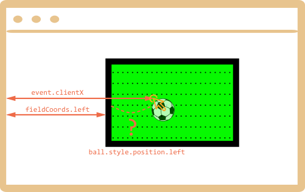

First we need to choose a method of positioning the ball.

We can't use `position:fixed` for it, because scrolling the page would move the ball from the field.

So we should use `position:absolute` and, to make the positioning really solid, make `field` itself positioned.

Then the ball will be positioned relatively to the field:

```css
#field {
  width: 200px;
  height: 150px;
  position: relative;
}

#ball {
  position: absolute;
  left: 0; /* relative to the closest positioned ancestor (field) */
  top: 0;
  transition: 1s all; /* CSS animation for left/top makes the ball fly */
}
```

Next we need to assign the correct `ball.style.position.left/top`. They contain field-relative coordinates now.

Here's the picture:



We have `event.clientX/clientY` -- window-relative coordinates of the click.

To get field-relative `left` coordinate of the click, we can substract the field left edge and the border width:

```js
let left = event.clientX - fieldCoords.left - field.clientLeft;
```

Normally, `ball.style.position.left` means the "left edge of the element" (the ball). So if we assign that `left`, then the ball edge, not center, would be under the mouse cursor.

We need to move the ball half-width left and half-height up to make it center.

So the final `left` would be:

```js
let left = event.clientX - fieldCoords.left - field.clientLeft - ball.offsetWidth/2;
```

The vertical coordinate is calculated using the same logic.

Please note that the ball width/height must be known at the time we access `ball.offsetWidth`. Should be specified in HTML or CSS.
