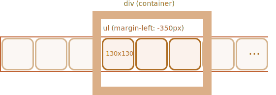

The images ribbon can be represented as `ul/li` list of images ``.

Normally, such a ribbon is wide, but we put a fixed-size `
` around to "cut" it, so that only a part of the ribbon is visibble:

To make the list show horizontally we need to apply correct CSS properties for `<li>`, like `display: inline-block`.

For `` we should also adjust `display`, because by default it's `inline`. There's extra space reserved under `inline` elements for "letter tails", so we can use `display:block` to remove it.

To do the scrolling, we can shift `<ul>`. There are many ways to do it, for instance by changing `margin-left` or (better performance) use `transform: translateX()`:

The outer `
` has a fixed width, so "extra" images are cut.

The whole carousel is a self-contained "graphical component" on the page, so we'd better wrap it into a single `
` and style things inside it.
