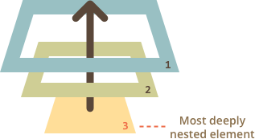
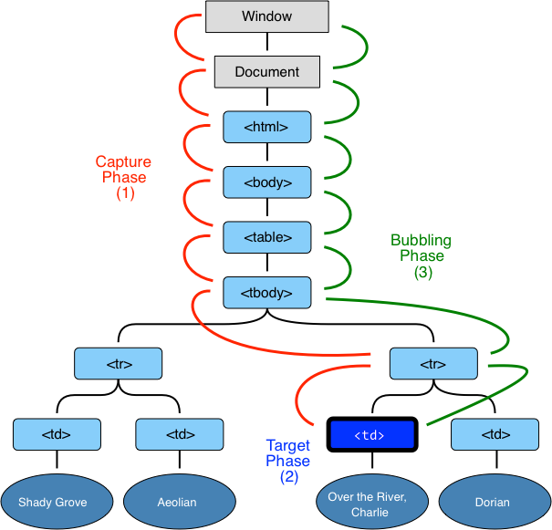

# Bubbling and capturing

Let's start with an example.

This handler is assigned to `<div>`, but also runs if you click any nested tag like `<em>` or `<code>`:

```html autorun height=60
<div onclick="alert('The handler !')">
  <em>If you click on <code>EM</code>, the handler on <code>DIV</code> runs.</em>
</div>
```

Isn't it a bit strange? Why the handler on `<div>` runs if the actual click was on `<em>`?

## Bubbling

The bubbling principle is simple.

**When an event happens on an element, it first runs the handlers on it, then on its parent, then all the way up on other ancestors.**

Let's say, we have 3 nested elements `FORM > DIV > P` with a handler on each of them:

```html run autorun
<style>
  body * {
    margin: 10px;
    border: 1px solid blue;
  }
</style>

<form onclick="alert('form')">FORM
  <div onclick="alert('div')">DIV
    <p onclick="alert('p')">P</p>
  </div>
</form>
```

A click on the inner `<p>` first runs `onclick`:
1. On that `<p>`.
2. Then on the outer `<div>`.
3. Then on the outer `<form>`.
4. And so on upwards till the `document` object.



So if we click on `<p>`, then we'll see 3 alerts: `p` -> `div` -> `form`.

The process is called "bubbling", because events "bubble" from the inner element up through parents like a bubble in the water.

```warn header="*Almost* all events bubble."
The key word in this phrase is "almost".

For instance, a `focus` event does not bubble. There are other examples too, we'll meet them. But still it's an exception, rather then a rule, most events do bubble.
```

## event.target

A handler on a parent element can always get the details about where it actually happened.

**The most deeply nested element that caused the event is called a *target* element, accessible as `event.target`.**

Note the differences from `this` (=`event.currentTarget`):

- `event.target` -- is the "source" element that initiated the event, it doesn't change through the bubbling process.
- `this` -- is the "current" element, the one that has a currently running handler on it.

For instance, if we have a single handler `form.onclick`, then it can "catch" all clicks inside the form. No matter where the click happened, it bubbles up to `<form>` and runs the handler.

In that handler:

- `this` (`=event.currentTarget`) is the `<form>` element, because the handler runs on it.
- `event.target` is the concrete element inside the form that actually was clicked.

Check it out:

[codetabs height=220 src="bubble-target"]

It's surely possible that `event.target` equals `this` -- when the click was directly on `<form>`.

## Stopping bubbling

A bubbling event goes from the source element straight up. Normally it goes till `<html>`, and then to `document` object, and some events even reach `window`, calling all handlers on its path.

But any handler may decide that the event has been fully processed and stop the bubbling.

The method for it is `event.stopPropagation()`.

For instance, here `body.onclick` doesn't work if you click on `<button>`:

```html run autorun height=60
<body onclick="alert(`the bubbling doesn't reach here`)">
  <button onclick="event.stopPropagation()">Click me</button>
</body>
```

```smart header="event.stopImmediatePropagation()"
If an element has multiple event handlers on a single event, then even if one of them stops the bubbling, the other ones still execute.

In other words, `event.stopPropagation()` stops the move upwards, but on the current element all handlers will run.

To completely stop all bubbling and prevent handlers on the current element from running, there's a method `event.stopImmediatePropagation()`. After its call no other handlers execute.
```

```warn header="Don't stop bubbling without a need!"
Bubbling is convenient. Don't stop it without a real need: obvious and architecturally well-thought.

Sometimes `event.stopPropagation()` creates hidden pitfalls that later may become problems.

For instance:

1. We create a nested menu. Each submenu handles clicks on its elements and calls `stopPropagation` so that outer parts don't trigger. Everything works.
2. Later we decide to catch clicks inside the whole window, to track users' behavior (where people click). Some counters do that. Usually a counter code does that by `document.addEventListener('click', ...)`.
3. Our statistics won't work over the area where clicks are stopped by `stopPropagation`. We've got a "dead zone".

There are usually many ways to do things and keep bubbling. One of them is to use custom events, we'll cover them later. Also we can write our data into the `event` object in one handler and read it in another one.
```


## Capturing

There's another "stage" of event processing called "capturing". It is rarely used in the code, but sometimes can be useful.

The standard [DOM Events 3](http://www.w3.org/TR/DOM-Level-3-Events/) describes 3 stages of event processing:

1. Capturing stage -- an event goes down to the element.
2. Target stage -- an event reached the source element.
3. Bubbling stage -- the event bubbles up from the element.

Here's the picture of a click on `<td>` inside a table:



That is: for a click on `<td>` the event first goes through the ancestors chain down to the element (capturing), then it reaches the target, and then it goes up (bubbles), calling handlers on its way.

**Before we only talked about bubbling, because the capturing stage is rarely used. Normally it is invisible to us.**

Handlers added using `on...`-property or using HTML attributes don't know anything about capturing, they only run on the 2nd and 3rd stages.

To catch an event on the capturing stage, we need to use the 3rd argument of `addEventListener`:

- If it's `true`, then the handler is set on the capturing stage.
- If it's `false` (default), then on the bubbling stage.

Note that while formally there are 3 stages, the 2nd stage (reached the element) is not handled separately: handlers on both capturing and bubbling stages do that.

Let's see it in action:

```html run autorun height=100 edit
<table border="1">
<tr>
  <td>Shady Grove</td>
  <td>Aeolian</td>
</tr>
<tr>
  <td>Over the River, Charlie</td>
  <td>Dorian</td>
</tr>
</table>

<script>
  for(let elem of document.querySelectorAll('*')) {
      elem.addEventListener("click", e => alert(`Capturing: ${elem.tagName}`), true);
      elem.addEventListener("click", e => alert(`Bubbling: ${elem.tagName}`));
  }
</script>
```

The code sets click handlers on *every* element in the document to see which ones are working.

If you click on `<td>`, then the sequence is: `HTML` -> `BODY` -> `TABLE` -> `TBODY` -> `TR` -> `TD` (capturing stage, the first listener), and then `TD` -> `TR` -> `TBODY` -> `TABLE` -> `BODY` -> `HTML` (bubbling stage, the second listener).

Please note that `TD` shows up two times: at the end of capturing and at the start of bubbling.

There's a property `event.eventPhrase` that tells us the number of the stage on which the event was caught. But it's rarely used, because we usually know it in the handler.

## Summary

The event handling process:

- When an event happens -- the most nested element where it happens gets labeled as the "source element" (`event.target`).
- Then the event first moves from the document root down the `event.target`, calling handlers assigned with `addEventListener(...., true)` on the way.
- Then the event moves from `event.target` up to the root, calling handlers assigned using  `on*` and `addEventListener(...., false)`.

Each handler can access `event` object properties:

- `event.target` -- the deepest element that originated the event.
- `event.currentTarget` (=`this`) -- the current element the handles the event (the one that has the handler on it)
- `event.eventPhase` -- the current phase (capturing=1, bubbling=3).

Any event handler can stop the event by calling `event.stopPropagation()`, but that's not recommended, because we can't really be sure we won't need it, maybe for completely different things.

The capturing stage is used very rarely, usually we handle events on bubbling. And there's a logic behind that.

In real world, when an accident happens, local authorities react first. They know best the area where it happened. Then (if needed) higher-level powers, and so on.

The same for event handlers. The code that set the handler on a particular element knows maximum  details about the element and what it does. A handler on a particular `<td>` may be suited for that exactly `<td>`, it knows everything about it, so it should get the chance first. Then its immediate parent also knows about the context, but a little bit less, and so on till the very top element that handles general concepts and runs the last.

Bubbling and capturing lay the foundation for "event delegation" -- an extremely powerful event handling pattern that we study in the next chapter.
