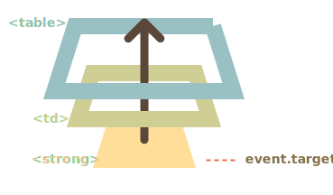

# Event delegation

Capturing and bubbling allow us to implement one of most powerful event handling patterns called *event delegation*.

The idea is that if we have a lot of elements handled in a similar way, then instead of assigning a handler to each of them -- we put a single handler on their common ancestor.

In the handler we get `event.target` to see where the event actually happened and handle it.

Let's see an example -- the [Ba-Gua diagram](http://en.wikipedia.org/wiki/Ba_gua) reflecting the ancient Chinese philosophy.

Here it is:

[iframe height=350 src="bagua" edit link]

The HTML is like this:

```html
<table>
  <tr>
    <th colspan="3"><em>Bagua</em> Chart: Direction, Element, Color, Meaning</th>
  </tr>
  <tr>
    <td class="nw"><strong>Northwest</strong><br>Metal<br>Silver<br>Elders</td>
    <td class="n">...</td>
    <td class="ne">...</td>
  </tr>
  <tr>...2 more lines of this kind...</tr>
  <tr>...2 more lines of this kind...</tr>
</table>
```

The table has 9 cells, but there could be 99 or 9999, doesn't matter.

**Our task is to highlight a cell `<td>` on click.**

Instead of assign an `onclick` handler to each `<td>` (can be many) -- we'll setup the "catch-all" handler on `<table>` element.

It will use `event.target` to get the clicked element and highlight it.

The code:

```js
let selectedTd;

*!*
table.onclick = function(event) {
  let target = event.target; // where was the click?

  if (target.tagName != 'TD') return; // not on TD? Then we're not interested

  highlight(target); // highlight it
};
*/!*

function highlight(td) {
  if (selectedTd) { // remove the existing highlight if any
    selectedTd.classList.remove('highlight');
  }
  selectedTd = td;
  selectedTd.classList.add('highlight'); // highlight the new td
}
```

Such a code doesn't care how many cells there are in the table. We can add/remove `<td>` dynamically at any time and the highlighting will still work.

Still, there's a drawback.

The click may occur not on the `<td>`, but inside it.

In our case if we take a look inside the HTML, we can see nested tags inside `<td>`, like `<strong>`:

```html
<td>
*!*
  <strong>Northwest</strong>
*/!*
  ...
</td>
```

Naturally, if a click happens on that `<strong>` then it becomes the value of `event.target`.



In the handler `table.onclick` we should take such `event.target` and find out whether the click was inside `<td>` or not.

Here's the improved code:

```js
table.onclick = function(event) {
  let td = event.target.closest('td'); // (1)

  if (!td) return; // (2)

  if (!table.contains(td)) return; // (3)

  highlight(td); // (4)
};
```

Explanations:
1. The method `elem.closest(selector)` returns the nearest ancestor that matches the selector. In our case we look for `<td>` on the way up from the source element.
2. If `event.target` is not inside any `<td>`, then the call returns immediately, as there's nothing to do.
3. In case of nested tables, `event.target` may be a `<td>`, but lying outside of the current table. So we check if that's actually *our table's* `<td>`.
4. And, if it's so, then highlight it.

As the result, we have a fast, efficient highlighting code, that doesn't care about the total number of `<td>` in the table.

## Delegation example: actions in markup

There are other uses for event delegation.

Let's say, we want to make a menu with buttons "Save", "Load", "Search" and so on. And there's an object with methods `save`, `load`, `search`... How to match them?

The first idea may be to assign a separate handler to each button. But there's a more elegant solution. We can add a handler for the whole menu and `data-action` attributes for buttons that has the method to call:

```html
<button *!*data-action="save"*/!*>Click to Save</button>
```

The handler reads the attribute and executes the method. Take a look at the working example:

```html autorun height=60 run untrusted
<div id="menu">
  <button data-action="save">Save</button>
  <button data-action="load">Load</button>
  <button data-action="search">Search</button>
</div>

<script>
  class Menu {
    constructor(elem) {
      this._elem = elem;
      elem.onclick = this.onClick.bind(this); // (*)
    }

    save() {
      alert('saving');
    }

    load() {
      alert('loading');
    }

    search() {
      alert('searching');
    }

    onClick(event) {
*!*
      let action = event.target.dataset.action;
      if (action) {
        this[action]();
      }
*/!*
    };
  }

  new Menu(menu);
</script>
```

Please note that `this.onClick` is bound to `this` in `(*)`. That's important, because otherwise `this` inside it would reference the DOM element (`elem`), not the `Menu` object, and `this[action]` would not be what we need.

So, what advantages does delegation give us here?

```compare
+ We don't need to write the code to assign a handler to each button. Just make a method and put it in the markup.
+ The HTML structure is flexible, we can add/remove buttons at any time.
```

We could also use classes `.action-save`, `.action-load`, but an attribute `data-action` is better semantically. And we can use it in CSS rules too.

## The "behavior" pattern

We can also use event delegation to add "behaviors" to elements *declaratively*, with special attributes and classes.

The pattern has two parts:
1. We add a custom attribute to an element that describes its behavior.
2. A document-wide handler tracks events, and if an event happens on an attributed element -- performs the action.

### Behavior: Counter

For instance, here the attribute `data-counter` adds a behavior: "increase value on click" to buttons:

```html run autorun height=60
Counter: <input type="button" value="1" data-counter>
One more counter: <input type="button" value="2" data-counter>

<script>
  document.addEventListener('click', function(event) {

    if (event.target.dataset.counter != undefined) { // if the attribute exists...
      event.target.value++;
    }

  });
</script>
```

If we click a button -- its value is increased. Not buttons, but the general approach is important here.

There can be as many attributes with `data-counter` as we want. We can add new ones to HTML at any moment. Using the event delegation we "extended" HTML, added an attribute that describes a new behavior.

```warn header="For document-level handlers -- always `addEventListener`"
When we assign an event handler to the `document` object, we should always use `addEventListener`, not `document.on<event>`, because the latter will cause conflicts: new handlers overwrite old ones.

For real projects it's normal that there are many handlers on `document` set by different parts of the code.
```

### Behavior: Toggler

One more example of behavior. A click on an element with the attribute `data-toggle-id` will show/hide the element with the given `id`:

```html autorun run height=60
<button *!*data-toggle-id="subscribe-mail"*/!*>
  Show the subscription form
</button>

<form id="subscribe-mail" hidden>
  Your mail: <input type="email">
</form>

<script>
*!*
  document.addEventListener('click', function(event) {
    let id = event.target.dataset.toggleId;
    if (!id) return;

    let elem = document.getElementById(id);

    elem.hidden = !elem.hidden;
  });
*/!*
</script>
```

Let's note once again what we did. Now, to add toggling functionality to an element -- there's no need to know JavaScript, just use the attribute `data-toggle-id`.

That may become really convenient -- no need to write JavaScript for every such element. Just use the behavior. The document-level handler makes it work for any element of the page.

We can combine multiple behaviors on a single element as well.

The "behavior" pattern can be an alternative to mini-fragments of JavaScript.

## Summary

Event delegation is really cool! It's one of the most helpful patterns for DOM events.

It's often used to add the same handling for many similar elements, but not only for that.

The algorithm:

1. Put a single handler on the container.
2. In the handler -- check the source element `event.target`.
3. If the event happened inside an element that interests us, then handle the event.

Benefits:

```compare
+ Simplifies initialization and saves memory: no need to add many handlers.
+ Less code: when adding or removing elements, no need to add/remove handlers.
+ DOM modifications: we can mass add/remove elements with `innerHTML` and the like.
```

The delegation has its limitations of course:

```compare
- First, the event must be bubbling. Some events do not bubble. Also, low-level handlers should not use `event.stopPropagation()`.
- Second, the delegation may add CPU load, because the container-level handler reacts on events in any place of the container, no matter whether they interest us or not. But usually the load is negligible, so we don't take it into account.
```
