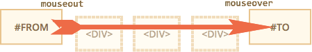
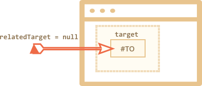
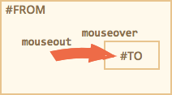

# Moving: mouseover/out, mouseenter/leave

Let's dive into more details about events that happen when mouse moves between elements.

## Mouseover/mouseout, relatedTarget

The `mouseover` event occurs when a mouse pointer comes over an element, and `mouseout` -- when it leaves.


These events are special, because they have a `relatedTarget`.

This property complements `target`. When a mouse leaves one element for another, one of them becomes `target`, and the other one `relatedTarget`.

For `mouseover`:

- `event.target` -- is the element where the mouse came over.
- `event.relatedTarget` -- is the element from which the mouse came (`relatedTarget` -> `target`).

For `mouseout` the reverse:

- `event.target` -- is the element that mouse left.
- `event.relatedTarget` -- is the new under-the-pointer element, that mouse left for (`target` -> `relatedTarget`).

```online
In the example below each face feature is an element. When you move the mouse, you can see mouse events in the text area.

Each event has the information about where the element came and where it came from.

[codetabs src="mouseoverout" height=280]
```

```warn header="`relatedTarget` can be `null`"
The `relatedTarget` property can be `null`.

That's normal and just means that the mouse came not from another element, but from out of the window. Or that it left the window.

We should keep that possibility in mind when using `event.relatedTarget` in our code. If we access `event.relatedTarget.tagName`, then there will be an error.
```

## Events frequency

The `mousemove` event triggers when the mouse moves. But that doesn't mean that every pixel leads to an event.

The browser checks the mouse position from time to time. And if it notices changes then triggers the events.

That means that if the visitor is moving the mouse very fast then DOM-elements may be skipped:



If the mouse moves very fast from `#FROM` to `#TO` elements as painted above, then intermediate `<div>` (or some of them) may be skipped. The `mouseout` event may trigger on `#FROM` and then immediately `mouseover` on `#TO`.

In practice that's helpful, because if there may be many intermediate elements. We don't really want to process in and out of each one.

On the other hand, we should keep in mind that we can't assume that the mouse slowly moves from one event to another. No, it can "jump".

In particular it's possible that the cursor jumps right inside the middle of the page from out of the window. And `relatedTarget=null`, because it came from "nowhere":



<div style="display:none">
In case of a fast move, intermediate elements may trigger no events. But if the mouse enters the element (`mouseover`), when we're guaranteed to have `mouseout` when it leaves it.
</div>

```online
Check it out "live" on a teststand below.

The HTML is two nested `<div>` elements. If you move the mouse fast over them, then there may be no events at all, or maybe only the red div triggers events, or maybe the green one.

Also try to move the pointer over the red `div`, and then move it out quickly down through the green one. If the movement is fast enough then the parent element is ignored.

[codetabs height=360 src="mouseoverout-fast"]
```

## "Extra" mouseout when leaving for a child

Imagine -- a mouse pointer entered an element. The `mouseover` triggered. Then the cursor goes into a child element. The interesting fact is that `mouseout` triggers in that case. The cursor is still in the element, but we have a `mouseout` from it!



That seems strange, but can be easily explained.

**According to the browser logic, the mouse cursor may be only over a *single* element at any time -- the most nested one (and top by z-index).**

So if it goes to another element (even a descendant), then it leaves the previous one. That simple.

There's a funny consequence that we can see on the example below.

The red `<div>` is nested inside the blue one. The blue `<div>` has `mouseover/out` handlers that log all events in the textarea below.

Try entering the blue element and then moving the mouse on the red one -- and watch the events:

[codetabs height=360 src="mouseoverout-child"]

1. On entering the blue one -- we get `mouseover [target: blue]`.
2. Then after moving from the blue to the red one -- we get `mouseout [target: blue]` (left the parent).
3. ...And immediately `mouseover [target: red]`.

So, for a handler that does not take `target` into account, it looks like we left the parent in `mouseout` in `(2)` and returned back to it by `mouseover` in `(3)`.

If we perform some actions on entering/leaving the element, then we'll get a lot of extra "false" runs. For simple stuff that may be unnoticeable. For complex things that may bring unwanted side-effects.

We can fix it by using `mouseenter/mouseleave` events instead.

## Events mouseenter and mouseleave

Events `mouseenter/mouseleave` are like `mouseover/mouseout`. They also trigger when the mouse pointer enters/leaves the element.

But there are two differences:

1. Transitions inside the element are not counted.
2. Events `mouseenter/mouseleave` do not bubble.

These events are intuitively very clear.

When the pointer enters an element -- the `mouseenter` triggers, and then doesn't matter where it goes while inside the element. The `mouseleave` event only triggers when the cursor leaves it.

If we make the same example, but put `mouseenter/mouseleave` on the blue `<div>`, and do the same -- we can see that events trigger only on entering and leaving the blue `<div>`. No extra events when going to the red one and back. Children are ignored.

[codetabs height=340 src="mouseleave"]

## Event delegation

Events `mouseenter/leave` are very simple and easy to use. But they do not bubble. So we can't use event delegation with them.

Imagine we want to handle mouse enter/leave for table cells. And there are hundreds of cells.

The natural solution would be -- to set the handler on `<table>` and process events there. But `mouseenter/leave` don't bubble. So if such event happens on `<td>`, then only a handler on that `<td>` can catch it.

Handlers for `mouseenter/leave` on `<table>` only trigger on entering/leaving the whole table. It's impossible to get any information about transitions inside it.

Not a problem -- let's use `mouseover/mouseout`.

A simple handler may look like this:

```js
// let's highlight cells under mouse
table.onmouseover = function(event) {
  let target = event.target;
  target.style.background = 'pink';
};

table.onmouseout = function(event) {
  let target = event.target;
  target.style.background = '';
};
```

```online
[codetabs height=480 src="mouseenter-mouseleave-delegation"]
```

These handlers work when going from any element to any inside the table.

But we'd like to handle only transitions in and out of `<td>` as a whole. And highlight the cells as a whole. We don't want to handle transitions that happen between the children of `<td>`.

One of solutions:

- Remember the currently highlighted `<td>` in a variable.
- On `mouseover` -- ignore the event if we're still inside the current `<td>`.
- On `mouseout` -- ignore if we didn't leave the current `<td>`.

That filters out "extra" events when we are moving between the children of `<td>`.

```offline
The details are in the [full example](sandbox:mouseenter-mouseleave-delegation-2).
```

```online
Here's the full example with all details:

[codetabs height=380 src="mouseenter-mouseleave-delegation-2"]

Try to move the cursor in and out of table cells and inside them. Fast or slow -- doesn't matter. Only `<td>` as a whole is highlighted unlike the example before.
```


## Summary

We covered events `mouseover`, `mouseout`, `mousemove`, `mouseenter` and `mouseleave`.

Things that are good to note:

- A fast mouse move can make `mouseover, mousemove, mouseout` to skip intermediate elements.
- Events `mouseover/out` and `mouseenter/leave` have an additional target: `relatedTarget`. That's the element that we are coming from/to, complementary to `target`.
- Events `mouseover/out` trigger even when we go from the parent element to a child element. They assume that the mouse can be only over one element at one time -- the deepest one.
- Events `mouseenter/leave` do not bubble and do not trigger when the mouse goes to a child element. They only track whether the mouse comes inside and outside the element as a whole.
