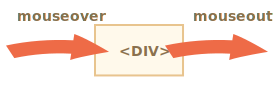
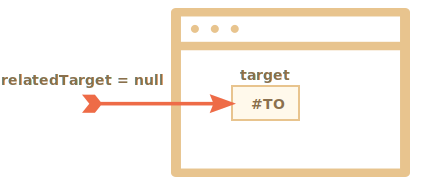
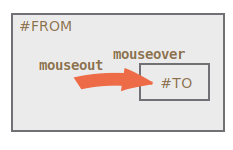
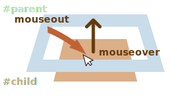

# Moving the mouse: mouseover/out, mouseenter/leave

Let's dive into more details about events that happen when the mouse moves between elements.

## Events mouseover/mouseout, relatedTarget

The `mouseover` event occurs when a mouse pointer comes over an element, and `mouseout` -- when it leaves.



These events are special, because they have property `relatedTarget`. This property complements `target`. When a mouse leaves one element for another, one of them becomes `target`, and the other one - `relatedTarget`.

For `mouseover`:

- `event.target` -- is the element where the mouse came over.
- `event.relatedTarget` -- is the element from which the mouse came (`relatedTarget` -> `target`).

For `mouseout` the reverse:

- `event.target` -- is the element that the mouse left.
- `event.relatedTarget` -- is the new under-the-pointer element, that mouse left for (`target` -> `relatedTarget`).

```online
In the example below each face and its features are separate elements. When you move the mouse, you can see mouse events in the text area.

Each event has the information about both `target` and `relatedTarget`:

[codetabs src="mouseoverout" height=280]
```

```warn header="`relatedTarget` can be `null`"
The `relatedTarget` property can be `null`.

That's normal and just means that the mouse came not from another element, but from out of the window. Or that it left the window.

We should keep that possibility in mind when using `event.relatedTarget` in our code. If we access `event.relatedTarget.tagName`, then there will be an error.
```

## Skipping elements

The `mousemove` event triggers when the mouse moves. But that doesn't mean that every pixel leads to an event.

The browser checks the mouse position from time to time. And if it notices changes then triggers the events.

That means that if the visitor is moving the mouse very fast then some DOM-elements may be skipped:


If the mouse moves very fast from `#FROM` to `#TO` elements as painted above, then intermediate `<div>` elements (or some of them) may be skipped. The `mouseout` event may trigger on `#FROM` and then immediately `mouseover` on `#TO`.

That's good for performance, because there may be many intermediate elements. We don't really want to process in and out of each one.

On the other hand, we should keep in mind that the mouse pointer doesn't "visit" all elements along the way. It can "jump".

In particular, it's possible that the pointer jumps right inside the middle of the page from out of the window. In that case `relatedTarget` is `null`, because it came from "nowhere":



```online
You can check it out "live" on a teststand below.

Its HTML has two nested elements: the `<div id="child">` is inside the `<div id="parent">`. If you move the mouse fast over them, then maybe only the child div triggers events, or maybe the parent one, or maybe there will be no events at all.

Also move the pointer into the child `div`, and then move it out quickly down through the parent one. If the movement is fast enough, then the parent element is ignored. The mouse will cross the parent element without noticing it.

[codetabs height=360 src="mouseoverout-fast"]
```

```smart header="If `mouseover` triggered, there must be `mouseout`"
In case of fast mouse movements, intermediate elements may be ignored, but one thing we know for sure: if the pointer "officially" entered an element (`mouseover` event generated), then upon leaving it we always get `mouseout`.
```

## Mouseout when leaving for a child

An important feature of `mouseout` -- it triggers, when the pointer moves from an element to its descendant, e.g. from `#parent` to `#child` in this HTML:

```html
<div id="parent">
  <div id="child">...</div>
</div>
```

If we're on `#parent` and then move the pointer deeper into `#child`, but we get `mouseout` on `#parent`!



That may seem strange, but can be easily explained.

**According to the browser logic, the mouse cursor may be only over a *single* element at any time -- the most nested one and top by z-index.**

So if it goes to another element (even a descendant), then it leaves the previous one.

Please note another important detail of event processing.

The `mouseover` event on a descendant bubbles up. So, if `#parent` has `mouseover` handler, it triggers:



```online
You can see that very well in the example below: `<div id="child">` is inside the `<div id="parent">`. There are `mouseover/out` handlers on `#parent` element that output event details.

If you move the mouse from `#parent` to `#child`, you see two events on `#parent`:
1. `mouseout [target: parent]` (left the parent), then
2. `mouseover [target: child]` (came to the child, bubbled).

[codetabs height=360 src="mouseoverout-child"]
```

As shown, when the pointer moves from `#parent` element to `#child`, two handlers trigger on the parent element: `mouseout` and `mouseover`:

```js
parent.onmouseout = function(event) {
  /* event.target: parent element */
};
parent.onmouseover = function(event) {
  /* event.target: child element (bubbled) */
};
```

**If we don't examine `event.target` inside the handlers, then it may seem that the mouse pointer left `#parent` element, and then immediately came back over it.**

But that's not the case! The pointer is still over the parent, it just moved deeper into the child element.

If there are some actions upon leaving the parent element, e.g. an animation runs in `parent.onmouseout`, we usually don't want it when the pointer just goes deeper into `#parent`.

To avoid it, we can check `relatedTarget` in the handler and, if the mouse is still inside the element, then ignore such event.

Alternatively we can use other events: `mouseenter` и `mouseleave`, that we'll be covering now, as they don't have such problems.

## Events mouseenter and mouseleave

Events `mouseenter/mouseleave` are like `mouseover/mouseout`. They trigger when the mouse pointer enters/leaves the element.

But there are two important differences:

1. Transitions inside the element, to/from descendants, are not counted.
2. Events `mouseenter/mouseleave` do not bubble.

These events are extremely simple.

When the pointer enters an element -- `mouseenter` triggers. The exact location of the pointer inside the element or its descendants doesn't matter.

When the pointer leaves an element -- `mouseleave` triggers.

```online
This example is similar to the one above, but now the top element has `mouseenter/mouseleave` instead of `mouseover/mouseout`.

As you can see, the only generated events are the ones related to moving the pointer in and out of the top element. Nothing happens when the pointer goes to the child and back. Transitions between descendants are ignores

[codetabs height=340 src="mouseleave"]
```

## Event delegation

Events `mouseenter/leave` are very simple and easy to use. But they do not bubble. So we can't use event delegation with them.

Imagine we want to handle mouse enter/leave for table cells. And there are hundreds of cells.

The natural solution would be -- to set the handler on `<table>` and process events there. But `mouseenter/leave` don't bubble. So if such event happens on `<td>`, then only a handler on that `<td>` is able to catch it.

Handlers for `mouseenter/leave` on `<table>` only trigger when the pointer enters/leaves the table as a whole. It's impossible to get any information about transitions inside it.

So, let's use `mouseover/mouseout`.

Let's start with simple handlers that highlight the element under mouse:

```js
// let's highlight an element under the pointer
table.onmouseover = function(event) {
  let target = event.target;
  target.style.background = 'pink';
};

table.onmouseout = function(event) {
  let target = event.target;
  target.style.background = '';
};
```

```online
Here they are in action. As the mouse travels across the elements of this table, the current one is highlighted:

[codetabs height=480 src="mouseenter-mouseleave-delegation"]
```

In our case we'd like to handle transitions between table cells `<td>`: entering a cell and leaving it. Other transitions, such as inside the cell or outside of any cells, don't interest us. Let's filter them out.

Here's what we can do:

- Remember the currently highlighted `<td>` in a variable, let's call it `currentElem`.
- On `mouseover` -- ignore the event if we're still inside the current `<td>`.
- On `mouseout` -- ignore if we didn't leave the current `<td>`.

Here's an example of code that accounts for all possible situations:

[js src="mouseenter-mouseleave-delegation-2/script.js"]

Once again, the important features are:
1. It uses event delegation to handle entering/leaving of any `<td>` inside the table. So it relies on `mouseover/out` instead of `mouseenter/leave` that don't bubble and hence allow no delegation.
2. Extra events, such as moving between descendants of `<td>` are filtered out, so that `onEnter/Leave` runs only if the pointer leaves or enters `<td>` as a whole.

```online
Here's the full example with all details:

[codetabs height=460 src="mouseenter-mouseleave-delegation-2"]

Try to move the cursor in and out of table cells and inside them. Fast or slow -- doesn't matter. Only `<td>` as a whole is highlighted, unlike the example before.
```

## Summary

We covered events `mouseover`, `mouseout`, `mousemove`, `mouseenter` and `mouseleave`.

These things are good to note:

- A fast mouse move may skip intermediate elements.
- Events `mouseover/out` and `mouseenter/leave` have an additional property: `relatedTarget`. That's the element that we are coming from/to, complementary to `target`.

Events `mouseover/out` trigger even when we go from the parent element to a child element. The browser assumes that the mouse can be only over one element at one time -- the deepest one.

Events `mouseenter/leave` are different in that aspect: they only trigger when the mouse comes in and out the element as a whole. Also they do not bubble.
