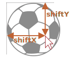

# Drag'n'Drop with mouse events

Drag'n'Drop is a great interface solution. Taking something, dragging and dropping is a clear and simple way to do many things, from copying and moving (see file managers) to ordering (drop into cart).

In the modern HTML standard there's a [section about Drag and Drop](https://html.spec.whatwg.org/multipage/interaction.html#dnd) with special events such as `dragstart`, `dragend` and so on.

They are interesting because they allow to solve simple tasks easily, and also allow to handle drag'n'drop of "external" files into the browser. So we can take a file in the OS file-manager and drop it into the browser window. Then JavaScript gains access to its contents.

But native Drag Events also have limitations. For instance, we can't limit dragging by a certain area. Also we can't make it "horizontal" or "vertical" only. There are other drag'n'drop tasks that can't be implemented using that API.

So here we'll see how to implement Drag'n'Drop using mouse events. Not that hard either.

## Drag'n'Drop algorithm

The basic Drag'n'Drop algorithm looks like this:

1. Catch `mousedown` on a draggable element.
2. Prepare the element for moving (maybe create a copy of it or whatever).
3. Then on `mousemove` move it by changing `left/top` and `position:absolute`.
4. On `mouseup` (button release) -- perform all actions related to a finished Drag'n'Drop.

These are the basics. We can extend it, for instance, by highlighting droppable (available for the drop) elements when hovering over them.

Here's the algorithm for drag'n'drop of a ball:

```js
ball.onmousedown = function(event) { // (1) start the process

  // (2) prepare to moving: make absolute and on top by z-index
  ball.style.position = 'absolute';
  ball.style.zIndex = 1000;
  // move it out of any current parents directly into body
  // to make it positioned relative to the body
  document.body.append(ball);  
  // ...and put that absolutely positioned ball under the cursor

  moveAt(event.pageX, event.pageY);

  // centers the ball at (pageX, pageY) coordinates
  function moveAt(pageX, pageY) {
    ball.style.left = pageX - ball.offsetWidth / 2 + 'px';
    ball.style.top = pageY - ball.offsetHeight / 2 + 'px';
  }

  function onMouseMove(event) {
    moveAt(event.pageX, event.pageY);
  }

  // (3) move the ball on mousemove
  document.addEventListener('mousemove', onMouseMove);

  // (4) drop the ball, remove unneeded handlers
  ball.onmouseup = function() {
    document.removeEventListener('mousemove', onMouseMove);
    ball.onmouseup = null;
  };

};
```

If we run the code, we can notice something strange. On the beginning of the drag'n'drop, the ball "forks": we start dragging its "clone".

```online
Here's an example in action:

[iframe src="ball" height=230]

Try to drag'n'drop the mouse and you'll see the strange behavior.
```

That's because the browser has its own Drag'n'Drop for images and some other elements that runs automatically and conflicts with ours.

To disable it:

```js
ball.ondragstart = function() {
  return false;
};
```

Now everything will be all right.

```online
In action:

[iframe src="ball2" height=230]
```

Another important aspect -- we track `mousemove` on `document`, not on `ball`. From the first sight it may seem that the mouse is always over the ball, and we can put `mousemove` on it.

But as we remember, `mousemove` triggers often, but not for every pixel. So after swift move the cursor can jump from the ball somewhere in the middle of document (or even outside of the window).

So we should listen on `document` to catch it.

## Correct positioning

In the examples above the ball is always moved so, that it's center is under the pointer:

```js
ball.style.left = pageX - ball.offsetWidth / 2 + 'px';
ball.style.top = pageY - ball.offsetHeight / 2 + 'px';
```

Not bad, but there's a side-effect. To initiate the drag'n'drop, we can `mousedown` anywhere on the ball. But if do it at the edge, then the ball suddenly "jumps" to become centered.

It would be better if we keep the initial shift of the element relative to the pointer.

For instance, if we start dragging by the edge of the ball, then the cursor should remain over the edge while dragging.



1. When a visitor presses the button (`mousedown`) -- we can remember the distance from the cursor to the left-upper corner of the ball in variables `shiftX/shiftY`. We should keep that distance while dragging.

    To get these shifts we can substract the coordinates:

    ```js
    // onmousedown
    let shiftX = event.clientX - ball.getBoundingClientRect().left;
    let shiftY = event.clientY - ball.getBoundingClientRect().top;
    ```

2. Then while dragging we position the ball on the same shift relative to the pointer, like this:

    ```js
    // onmousemove
    // ball has position:absoute
    ball.style.left = event.pageX - *!*shiftX*/!* + 'px';
    ball.style.top = event.pageY - *!*shiftY*/!* + 'px';
    ```

The final code with better positioning:

```js
ball.onmousedown = function(event) {

*!*
  let shiftX = event.clientX - ball.getBoundingClientRect().left;
  let shiftY = event.clientY - ball.getBoundingClientRect().top;
*/!*

  ball.style.position = 'absolute';
  ball.style.zIndex = 1000;
  document.body.append(ball);

  moveAt(event.pageX, event.pageY);

  // moves the ball at (pageX, pageY) coordinates
  // taking initial shifts into account
  function moveAt(pageX, pageY) {
    ball.style.left = pageX - *!*shiftX*/!* + 'px';
    ball.style.top = pageY - *!*shiftY*/!* + 'px';
  }

  function onMouseMove(event) {
    moveAt(event.pageX, event.pageY);
  }

  // move the ball on mousemove
  document.addEventListener('mousemove', onMouseMove);

  // drop the ball, remove unneeded handlers
  ball.onmouseup = function() {
    document.removeEventListener('mousemove', onMouseMove);
    ball.onmouseup = null;
  };

};

ball.ondragstart = function() {
  return false;
};
```

```online
In action (inside `<iframe>`):

[iframe src="ball3" height=230]
```

The difference is especially noticeable if we drag the ball by its right-bottom corner. In the previous example the ball "jumps" under the pointer. Now it fluently follows the cursor from the current position.

## Potential drop targets (droppables)

In previous examples the ball could be dropped just "anywhere" to stay. In real-life we usually take one element and drop it onto another. For instance, a file into a folder, or a user into a trash can or whatever.

In other words, we take a "draggable" element and drop it onto "droppable" element.

We need to know where the element was dropped at the end of Drag'n'Drop -- to do the corresponding action, and, preferably, know the droppable we're dragging over, to highlight it.

The solution is kind-of interesting and just a little bit tricky, so let's cover it here.

What may be the first idea? Probably to set `mouseover/mouseup` handlers on potential droppables and detect when the mouse pointer appears over them. And then we know that we are dragging over/dropping on that element.

But that doesn't work.

The problem is that, while we're dragging, the draggable element is always above other elements. And mouse events only happen on the top element, not on those below it.

For instance, below are two `<div>` elements, red on top of blue. There's no way to catch an event on the blue one, because the red is on top:

```html run autorun height=60
<style>
  div {
    width: 50px;
    height: 50px;
    position: absolute;
    top: 0;
  }
</style>
<div style="background:blue" onmouseover="alert('never works')"></div>
<div style="background:red" onmouseover="alert('over red!')"></div>
```

The same with a draggable element. The ball is always on top over other elements, so events happen on it. Whatever handlers we set on lower elements, they won't work.

That's why the initial idea to put handlers on potential droppables doesn't work in practice. They won't run.

So, what to do?

There's a method called `document.elementFromPoint(clientX, clientY)`. It returns the most nested element on given window-relative coordinates (or `null` if given coordinates are out of the window).

So in any of our mouse event handlers we can detect the potential droppable under the pointer like this:

```js
// in a mouse event handler
ball.hidden = true; // (*)
let elemBelow = document.elementFromPoint(event.clientX, event.clientY);
ball.hidden = false;
// elemBelow is the element below the ball, may be droppable
```

Please note: we need to hide the ball before the call `(*)`. Otherwise we'll usually have a ball on these coordinates, as it's the top element under the pointer: `elemBelow=ball`.

We can use that code to check what element we're "flying over" at any time. And handle the drop when it happens.

An extended code of `onMouseMove` to find "droppable" elements:

```js
let currentDroppable = null; // potential droppable that we're flying over right now

function onMouseMove(event) {
  moveAt(event.pageX, event.pageY);

  ball.hidden = true;
  let elemBelow = document.elementFromPoint(event.clientX, event.clientY);
  ball.hidden = false;

  // mousemove events may trigger out of the window (when the ball is dragged off-screen)
  // if clientX/clientY are out of the window, then elementfromPoint returns null
  if (!elemBelow) return;

  // potential droppables are labeled with the class "droppable" (can be other logic)
  let droppableBelow = elemBelow.closest('.droppable');

  if (currentDroppable != droppableBelow) { // if there are any changes
    // we're flying in or out...
    // note: both values can be null
    //   currentDroppable=null if we were not over a droppable before this event (e.g over an empty space)
    //   droppableBelow=null if we're not over a droppable now, during this event

    if (currentDroppable) {
      // the logic to process "flying out" of the droppable (remove highlight)
      leaveDroppable(currentDroppable);
    }
    currentDroppable = droppableBelow;
    if (currentDroppable) {
      // the logic to process "flying in" of the droppable
      enterDroppable(currentDroppable);
    }
  }
}
```

In the example below when the ball is dragged over the soccer gate, the gate is highlighted.

[codetabs height=250 src="ball4"]

Now we have the current "drop target", that we're flying over, in the variable `currentDroppable` during the whole process and can use it to highlight or any other stuff.

## Summary

We considered a basic Drag'n'Drop algorithm.

The key components:

1. Events flow: `ball.mousedown` -> `document.mousemove` -> `ball.mouseup` (cancel native `ondragstart`).
2. At the drag start -- remember the initial shift of the pointer relative to the element: `shiftX/shiftY` and keep it during the dragging.
3. Detect droppable elements under the pointer using `document.elementFromPoint`.

We can lay a lot on this foundation.

- On `mouseup` we can finalize the drop: change data, move elements around.
- We can highlight the elements we're flying over.
- We can limit dragging by a certain area or direction.
- We can use event delegation for `mousedown/up`. A large-area event handler that checks  `event.target` can manage Drag'n'Drop for hundreds of elements.
- And so on.

There are frameworks that build architecture over it: `DragZone`, `Droppable`, `Draggable` and other classes. Most of them do the similar stuff to described above, so it should be easy to understand them now. Or roll our own, as you can see that's easy enough to do, sometimes easier than adapting a third-part solution.
