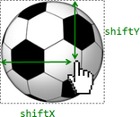

# Мышь: Drag'n'Drop   

Drag'n'Drop -- это возможность захватить мышью элемент и перенести его. В свое время это было замечательным открытием в области интерфейсов, которое позволило упростить большое количество операций.

Перенос мышкой может заменить целую последовательность кликов. И, самое главное, он упрощает внешний вид интерфейса: функции, реализуемые через Drag'n'Drop, в ином случае потребовали бы дополнительных полей, виджетов и т.п.

[cut]
## Отличия от HTML5 Drag'n'Drop

В современном стандарте HTML5 есть поддержка Drag'n'Drop при помощи [специальных событий](http://www.html5rocks.com/en/tutorials/dnd/basics/). Эти события поддерживаются всеми браузерами, в мелочах отстаёт от них IE.

У них есть своя область применения, например можно перетащить файл в браузер, но здесь сосредоточимся на реализации техник Drag'n'Drop в более широком смысле, для более обширного класса задач.

**Далее речь пойдет о реализации Drag'n'Drop при помощи событий мыши.**

**Изложенные методы применяются в элементах управления для обработки любых действий вида "захватить - потянуть - отпустить".** 

## Основная логика Drag'n'Drop
 
Для организации Drag'n'Drop нужно:
<ol>
 <li>При помощи события `mousedown` отследить нажатие кнопки на переносимом элементе.</li>
 <li>При нажатии -- подготовить элемент к перемещению: обычно ему назначается `position:absolute` и ставятся координаты `left/top` по координатам курсора.</li>
<li>Далее отслеживаем движение мыши через <code>mousemove</code> и передвигаем переносимый элемент на новые координаты путём смены `left/top`.</li>
 <li>При отпускании кнопки мыши, то есть наступлении события <code>mouseup</code> -- остановить перенос элемента и произвести все действия, связанные с окончанием Drag'n'Drop.</li>
</ol>

В следующем примере эти шаги реализованы для переноса мяча:

```js
//+ autorun
var ball = document.getElementById('ball');

ball.onmousedown = function(e) { // 1. отследить нажатие*!*
  var self = this;

  // подготовить к перемещению
  // 2. разместить на том же месте, но в абсолютных координатах*!*
  this.style.position = 'absolute'; 
  moveAt(e);
  // переместим в body, чтобы мяч был точно не внутри position:relative
  document.body.appendChild(this); 

  this.style.zIndex = 1000; // показывать мяч над другими элементами
  
  // передвинуть мяч под координаты курсора   
  function moveAt(e) {
    self.style.left = e.pageX-20+'px'; // 20 - половина ширины/высоты мяча
    self.style.top = e.pageY-20+'px'; 
   }

  // 3, перемещать по экрану*!*
  document.onmousemove = function(e) {
    moveAt(e);
  }

  // 4. отследить окончание переноса *!*
  this.onmouseup = function() {
    document.onmousemove = self.onmouseup = null;
  }
}
```

В действии:
<div style="height:80px">
Кликните по мячу и тяните, чтобы двигать его.

</div>

**Попробуйте этот пример. Он не совсем работает, мячик "раздваивается".**

Сейчас мы это исправим.

## Отмена переноса браузера

При нажатии мышью на `` браузер начинает выполнять свой собственный, встроенный Drag'n'Drop, который и портит наш перенос.

Чтобы браузер не вмешивался, нужно отменить действие по умолчанию для события `dragstart`:

```js
ball.ondragstart = function() { 
  return false; 
};
```

Исправленный пример:

```js
//+ autorun
var ball = document.getElementById('ball2');

ball.onmousedown = function(e) {
  var self = this;

  this.style.position = 'absolute'; 
  moveAt(e);
  document.body.appendChild(this); 

  this.style.zIndex = 1000; 
  
  function moveAt(e) {
    self.style.left = e.pageX-20+'px'; 
    self.style.top = e.pageY-20+'px'; 
   }

  document.onmousemove = function(e) {
    moveAt(e);
  };

  this.onmouseup = function() {
    document.onmousemove = self.onmouseup = null;
  };
}

*!*
ball.ondragstart = function() { 
  return false; 
};
*/!*
```

В действии:

<div style="height:80px">
Кликните по мячу и тяните, чтобы двигать его.

</div>

[smart header="Обработчик `mousemove` ставим на `document`"]

**Почему событие `mousemove` в примере отслеживается на `document`, а не на `ball`?**

С первого взгляда кажется, что мышь всегда над мячом и обработчик `mousemove` можно повесить на сам мяч, а не на документ. 

Однако, на самом деле **мышь во время переноса не всегда над мячом**. Вспомните, браузер регистрирует `mousemove` часто, но не для каждого пикселя. 

Быстрое движение курсора вызовет `mousemove` уже не над мячом, а, например, в дальнем конце страницы. 
Вот почему мы должны отслеживать `mousemove` на всём `document`.
[/smart]

## Правильное позиционирование

В примерах выше мяч позиционируется в центре под курсором мыши:

```js
self.style.left = e.pageX - 20 + 'px';
self.style.top = e.pageY - 20 + 'px';
```

Число `20` здесь -- половина длины мячика. Оно использовано здесь потому, что если поставить `left/top` ровно в `pageX/pageY`, то мячик прилипнет верхним-левым углом к курсору мыши. Будет некрасиво.

**Для правильного переноса необходимо, чтобы изначальный сдвиг курсора относительно элемента сохранялся: где захватили, за ту "часть элемента" и переносим.**



<ul>
<li>Когда человек нажимает на мячик `mousedown` -- курсор сдвинут относительно левого-верхнего угла мяча на расстояние `shiftX/shiftY`. И мы хотели бы сохранить этот сдвиг.

Получить значения `shiftX/shiftY` легко: достаточно вычесть из координат курсора `pageX/pageY` левую-верхнюю границу мячика, полученную при помощи функции [getCoords](#getCoords).

**При Drag'n'Drop мы везде используем координаты относительно документа, так как они подходят в большем количестве ситуаций.**

Конечно же, не проблема перейти к координатам относительно окна, если это понадобится. Достаточно использовать `position:fixed`, `elem.getBoundingClientRect()` для определения координат и `e.clientX/Y`.

```js
// onmousedown
shiftX = e.pageX - getCoords(ball).left;
shiftY = e.pageY - getCoords(ball).top;
```

</li>
<li>Далее при переносе мяча мы располагаем его `left/top` с учетом сдвига, то есть вот так:

```js
// onmousemove
self.style.left = e.pageX - *!*shiftX*/!* + 'px';
self.style.top = e.pageY - *!*shiftY*/!* + 'px';
```

</li>
</ul>


**Пример с правильным позиционированием:**

В этом примере позиционирование осуществляется не на `20px`, а с учётом изначального сдвига.

```js
//+ autorun
var ball = document.getElementById('ball3');

ball.onmousedown = function(e) {
  var self = this;

  var coords = getCoords(this);
*!*
  var shiftX = e.pageX - coords.left;
  var shiftY = e.pageY - coords.top;
*/!*

  this.style.position = 'absolute';
  document.body.appendChild(this);
  moveAt(e);

  this.style.zIndex = 1000; // над другими элементами

  function moveAt(e) {
    self.style.left = e.pageX - *!*shiftX*/!* + 'px';
    self.style.top = e.pageY - *!*shiftY*/!* + 'px';
  }

  document.onmousemove = function(e) { 
    moveAt(e); 
  };

  this.onmouseup = function() {
    document.onmousemove = self.onmouseup = null;
  };

}

ball.ondragstart = function() { 
  return false; 
};
```

В действии:

<div style="height:80px">
Кликните по мячу и тяните, чтобы двигать его.

</div>

Различие особенно заметно, если захватить мяч за правый-нижний угол. В предыдущем примере мячик "прыгнет" серединой под курсор, в этом -- будет плавно переноситься с текущей позиции.

## Итого

Мы рассмотрели "минимальный каркас" `Drag'n'Drop`. 

Его компоненты:

<ol>
<li>События `mousedown` -> `document.mousemove` -> `mouseup`.</li>
<li>Передвижение с учётом изначального сдвига `shiftX/shiftY`.</li>
<li>Отмена действия браузера по событию `dragstart`.</li>
</ol>

На этой основе можно сделать очень многое. 

<ul>
<li>При `mouseup` можно обработать окончание переноса, произвести изменения в данных, если они нужны.</li>
<li>Во время самого переноса можно подсвечивать элементы, над которыми проходит элемент.</li>
</ul>

Это и многое другое мы рассмотрим в статье про [Drag'n'Drop объектов](/drag-and-drop-objects).

[libs]
getCoords.js
[/libs]