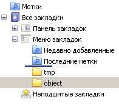

# Мышь: Drag'n'Drop объектов

В [предыдущей статье](/drag-and-drop) мы рассмотрели основы Drag'n'Drop. Здесь мы построим на этой основе фреймворк, предназначенный для переноса *объектов* -- элементов списка, узлов дерева и т.п.

Почти все javascript-библиотеки реализуют Drag'n'Drop так, как написано (хотя бывает что и менее эффективно ;)). Зная, что и как, вы сможете легко написать свой код переноса или поправить, адаптировать существующую библиотеку под себя.
[cut]
## Документ

Как пример задачи -- возьмём документ с иконками браузера ("объекты переноса"), которые можно переносить в компьютер ("цель переноса"):

<ul>
<li>Элементы, которые можно переносить (иконки браузеров), помечены атрибутом `draggable`.</li>
<li>Элементы, на которые можно положить (компьютер), имеют атрибут `droppable`.</li>
</ul>

```html


<p>Браузер переносить сюда:</p>


```

Работающий пример с переносом. 


[iframe border=1 src="dragDemo" height=250 link edit]

Далее мы рассмотрим, как делается фреймворк для таких переносов, а в перспективе -- и для более сложных.

Требования:
<ul>
<li>Поддержка большого количества элементов без "тормозов".</li>
<li>Продвинутые возможности по анимации переноса.</li>
<li>Удобная обработка успешного и неудачного переноса.</li>
</ul>

## Начало переноса

Чтобы начать перенос элемента, мы должны отловить нажатие левой кнопки мыши на нём. Для этого используем событие `mousedown`. 

..И здесь нас ждёт первая особенность переноса объектов. На что ставить обработчик?

**Переносимых элементов может быть много.** В нашем документе-примере это всего лишь несколько иконок, но если мы хотим переносить элементы списка или дерева, то их может быть 100 штук и более.

Назначать обработчик на каждый DOM-элемент -- нецелесообразно. Проще всего решить эту задачу делегированием. 

**Повесим обработчик `mousedown` на контейнер, который содержит переносимые элементы,** и будем определять нужный элемент поиском ближайшего `draggable` вверх по иерархии от `event.target`. В качестве контейнера здесь и далее будем брать `document`.

Найденный переносимый объект сохраним в переменной `dragObject` и начнём двигать.

Код обработчика `mousedown`:

```js
var dragObject = {}; 

document.onmousedown = function(e){

  if (e.which != 1) {
    return; // нажатие правой кнопкой не запускает перенос
  }

  // найти ближайший draggable, пройдя по цепочке родителей target
  var elem = findDraggable(e.target, document);

  if (!elem) return; // не нашли, клик вне draggable объекта

  // запомнить переносимый объект 
  dragObject.elem = elem;

  // запомнить координаты, с которых начат перенос объекта
  dragObject.downX = e.pageX;
  dragObject.downY = e.pageY;
}
```

В обработчике используется функция `findDraggable` для поиска переносимого элемента по `event.target`:

```js
function findDraggable(event) {
  var elem = event.target;

  // найти ближайший draggable, пройдя по цепочке родителей target
  while(elem != document && elem.getAttribute('draggable') == null) {
    elem = elem.parentNode;
  }
  return elem == document ? null : elem;
}
```

**Здесь мы пока не начинаем перенос, потому что нажатие на элемент вовсе не означает, что его собираются куда-то двигать.** Возможно, на нём просто кликают.

Это важное различие. Нужно отличать перенос от клика, в том числе -- от клика, который сопровождается нечаянным перемещением на пару пикселей (рука дрогнула).

Иначе при клике элемент будет сниматься со своего места, и потом тут же возвращаться обратно (никуда не положили). Это лишняя работа и, вообще, выглядит некрасиво.

**Поэтому в `mousedown` мы запоминаем, какой элемент и где был зажат, а начало переноса будем инициировать из `mousemove`,** если он передвинут хотя бы на несколько пикселей. 

## Перенос элемента

Первой задачей обработчика `mousemove` является инициировать начало переноса, если элемент передвинули в зажатом состоянии.

Ну а второй задачей -- отображать его перенос при каждом передвижении мыши. Схематично, обработчик имеет такой вид:

```js
document.onmousemove = function(e) {
  if (!dragObject.elem) return; // элемент не зажат

  if ( !dragObject.avatar ) { // элемент нажат, но пока не начали его двигать
    ... начать перенос, присвоить dragObject.avatar = переносимый элемент
  }

  ...отобразить перенос элемента...
}
```

Здесь мы видим новое свойство `dragObject.avatar`. При начале переноса *аватар* делается из элемента и сохраняется в свойство `dragObject.avatar`.

***"Аватар"* -- это DOM-элемент, который перемещается по экрану.** 

Почему бы не перемещать по экрану сам `draggable`-элемент? Зачем, вообще, нужен аватар?

Дело в том, что иногда сам элемент передвигать неудобно, например он слишком большой. А удобно создать некоторое визуальное представление элемента, и его уже переносить. Аватар дает такую возможность.

А в простейшем случае аватаром можно будет сделать сам элемент, и это не повлечёт дополнительных расходов.

### Визуальное перемещение аватара

Для того, чтобы отобразить перенос аватара, достаточно поставить ему `position: absolute` и менять координаты `left/top`.

Для использования абсолютных координат относительно документа, аватар должен быть прямым потомком `BODY`.

Следующий код готовит аватар к переносу:

```js
// в начале переноса:
if (avatar.parentNode != document.body) { 
  document.body.appendChild(avatar); // переместить в BODY, если надо
}
avatar.style.zIndex = 9999; // сделать, чтобы элемент был над другими
avatar.style.position = 'absolute';
```

... А затем его можно двигать:

```js
// при каждом движении мыши

avatar.style.left = новая координата + 'px';
avatar.style.top = новая координата + 'px';
```

**Как вычислять новые координаты `left/top` при переносе?**

Чтобы элемент сохранял свою позицию под курсором, необходимо при нажатии запомнить его изначальный сдвиг относительно курсора, и сохранять его при переносе.


Этот сдвиг по горизонтали обозначен `shiftX` на рисунке выше. Аналогично, есть `shiftY`. Они вычисляются как расстояние между курсором и левой/верхней границей элемента при `mousedown`. Детали вычислений описаны в главе [](/drag-and-drop).

Таким образом, при `mousemove` мы будем назначать элементу координаты курсора с учетом сдвига `shiftX/shiftY`:

```js
avatar.style.left = e.pageX - shiftX + 'px';
avatar.style.top = e.pageY - shiftY + 'px';
```

### Полный код mousemove

Код `mousemove`, решающий задачу начала переноса и позиционирования аватара:

```js
document.onmousemove = function(e) {
  if (!dragObject.elem) return; // элемент не зажат

  if ( !dragObject.avatar ) { // если перенос не начат...

    // посчитать дистанцию, на которую переместился курсор мыши
    var moveX = e.pageX - dragObject.downX;
    var moveY = e.pageY - dragObject.downY;
    if ( Math.abs(moveX) < 3 && Math.abs(moveY) < 3 ) {
      return; // ничего не делать, мышь не передвинулась достаточно далеко
    }

    *!*dragObject.avatar = createAvatar(e)*/!*; // захватить элемент
    if (!dragObject.avatar) { 
      dragObject = {}; // аватар создать не удалось, отмена переноса
      return; // возможно, нельзя захватить за эту часть элемента
    }

    // аватар создан успешно
    // создать вспомогательные свойства shiftX/shiftY
    var coords = getCoords(avatar);
    dragObject.shiftX = dragObject.downX - coords.left;
    dragObject.shiftY = dragObject.downY - coords.top;

    *!*startDrag(e)*/!*; // отобразить начало переноса
  }

  // отобразить перенос объекта при каждом движении мыши
  dragObject.avatar.style.left = e.pageX - dragObject.shiftX + 'px';
  dragObject.avatar.style.top = e.pageY - dragObject.shiftY + 'px';

  return false; 
}
```

Здесь используются две функции для начала переноса: `createAvatar(e)` и `startDrag(e)`.

Функция `createAvatar(e)` создает аватар. В нашем случае в качестве аватара берется сам `draggable` элемент. После создания аватара в него записывается функция `avatar.rollback`, которая задает поведение при отмене переноса. 

Как правило, отмена переноса влечет за собой разрушение аватара, если это был клон, или возвращение его на прежнее место, если это сам элемент. 

В нашем случае для отмены переноса нужно запомнить старую позицию элемента и его родителя.

```js
//+ hide="Раскрыть код createAvatar"
function createAvatar(e) {

  // запомнить старые свойства, чтобы вернуться к ним при отмене переноса
  var avatar = dragObject.elem;
  var old = {
    parent: avatar.parentNode,
    nextSibling: avatar.nextSibling,
    position: avatar.position || '',
    left: avatar.left || '',
    top: avatar.top || '',
    zIndex: avatar.zIndex || ''
  };

  // функция для отмены переноса
  avatar.rollback = function() {
    old.parent.insertBefore(avatar, old.nextSibling);
    avatar.style.position = old.position;
    avatar.style.left = old.left;
    avatar.style.top = old.top;
    avatar.style.zIndex = old.zIndex
  };

  return avatar;
}
```

Функция `startDrag(e)` инициирует начало переноса и позиционирует аватар на странице.

```js
function startDrag(e) {
  var avatar = dragObject.avatar;

  document.body.appendChild(avatar);
  avatar.style.zIndex = 9999;
  avatar.style.position = 'absolute';
}
```

### Окончание переноса

Окончание переноса происходит по событию `mouseup`. 

Его обработчик можно поставить на аватаре, т.к. аватар всегда под курсором и `mouseup` происходит на нем. Но для универсальности и большей гибкости (вдруг мы захотим перемещать аватар *рядом* с курсором?) поставим его, как и остальные, на `document`.

Задача обработчика `mouseup`:
<ol>
<li>Обработать успешный перенос, если он идет (существует аватар)</li>
<li>Очистить данные `dragObject`.</li>
</ol>

Это дает нам следующий код:

```js
document.onmouseup = function(e) {
  // (1) обработать перенос, если он идет
  if (dragObject.avatar) { 
    *!*finishDrag(e)*/!*;
  }

  // в конце mouseup перенос либо завершился, либо даже не начинался
  // (2) в любом случае очистим "состояние переноса" dragObject
  dragObject = {};
}
```

Для завершения переноса в функции `finishDrag(e)` нам нужно понять, на каком элементе мы находимся, и если над `droppable` -- обработать перенос, а нет -- откатиться:

```js
function finishDrag(e) {
  var dropElem = *!*findDroppable(e)*/!*;

  if (dropElem) {
    ... успешный перенос ...
  } else {
    ... отмена переноса ...
  }
}
```

### Определяем элемент под курсором

Чтобы понять, над каким элементом мы остановились -- используем метод [document.elementFromPoint(clientX, clientY)](https://developer.mozilla.org/en/DOM/document.elementFromPoint), который мы обсуждали в разделе [координаты](#elementFromPoint). Этот метод получает координаты *относительно окна* и возвращает самый глубокий элемент, который там находится.

Функция `findDroppable(event)`, описанная ниже, использует его и находит самый глубокий элемент с атрибутом `droppable` под курсором мыши:

```js
// возвратит ближайший droppable или null
// *!*предварительный вариант findDroppable, исправлен ниже!*/!*
function findDroppable(event) {

  // взять элемент на данных координатах
  var elem = document.elementFromPoint(event.clientX, event.clientY);

  // пройти вверх по цепочке родителей в поисках droppable
  while(elem != document && elem.getAttribute('droppable') == null) {
    elem = elem.parentNode;
  }

  return elem == document ? null : elem;
}
```

Обратите внимание -- для `elementFromPoint` нужны координаты относительно окна `clientX/clientY`, а не `pageX/pageY`.

Вариант выше -- предварительный. Он не будет работать. Если попробовать применить эту функцию, будет все время возвращать один и тот же элемент! А именно -- *текущий переносимый*. Почему так?

..Дело в том, что в процессе переноса под мышкой находится именно аватар. При начале переноса ему даже `z-index` ставится большой, чтобы он был поверх всех остальных. 

**Аватар перекрывает остальные элементы. Поэтому функция `document.elementFromPoint()` увидит на текущих координатах именно его.**

Чтобы это изменить, нужно либо поправить код переноса, чтобы аватар двигался *рядом* с курсором мыши, либо поступить проще:

<ol><li>Спрятать аватар.</li>
<li>Вызывать `elementFromPoint`.</li>
<li>Показать аватар.</li></ol>

Напишем вспомогательную функцию `getElementUnderClientXY(elem, clientX, clientY)`, которая это делает:

```js
/* получить элемент на координатах clientX/clientY, под elem */
function getElementUnderClientXY(elem, clientX, clientY) {
  // сохранить старый display и спрятать переносимый элемент
  var display = elem.style.display || '';
  elem.style.display = 'none';

  // получить самый вложенный элемент под курсором мыши
  var target = document.elementFromPoint(clientX, clientY);

  // показать переносимый элемент обратно
  elem.style.display = display;

  if (!target || target == document) { // такое бывает при выносе за границы окна
    target = document.body; // поправить значение, чтобы был именно элемент
  }

  return target;
}
```

Правильный код `findDroppable`:

```js
function findDroppable(event) {
  var elem = getElementUnderClientXY(dragObject.avatar, event.clientX, event.clientY);

  while(elem != document && elem.getAttribute('droppable') == null) {
    elem = elem.parentNode;
  }

  return elem == document ? null : elem;
}
```

## Сводим части фреймворка вместе

Сейчас в нашем распоряжении находятся основные фрагменты кода и решения всех технических подзадач. 

Приведем их в нормальный вид.

### dragManager

Перенос будет координироваться единым объектом. Назовем его `dragManager`.

Для его создания используем не обычный синтаксис `{...}`, а вызов `new function`. Это позволит прямо при создании объявить дополнительные переменные и функции в замыкании, которыми могут пользоваться методы объекта, а также назначить обработчики:

```js
var dragManager = new function() {
  
  var dragObject = {};

  var self = this; // для доступа к себе из обработчиков

  function onMouseDown(e) { ... }
  function onMouseMove(e) { ... }
  function onMouseUp(e) { ... }

  document.onmousedown = onMouseDown;
  document.onmousemove = onMouseMove;
  document.onmouseup = onMouseUp;

  this.onDragEnd = function(dragObject, dropElem) { };
  this.onDragCancel = function(dragObject) { };
}
```

Всю работу будут выполнять обработчики `onMouse*`, которые оформлены как локальные функции. В данном случае они ставятся на `document` через `on...`, но вы легко можете поменять это на `addEventListener/attachEvent`.

Внутренний объект `dragObject` будет содержать информацию об объекте переноса. 

У него будут следующие свойства:
<dl>
<dt>`elem`</dt>
<dd>Текущий зажатый мышью объект, если есть (ставится в `mousedown`).</dd>
<dt>`avatar`</dt>
<dd>Элемент-аватар, который передвигается по странице.</dd>
<dt>`downX/downY`</dt>
<dd>Координаты, на которых был клик `mousedown`</dd>
<dt>`shiftX/shiftY`</dt>
<dd>Относительный сдвиг курсора от угла элемента, вспомогательное свойство вычисляется в начале переноса.</dd>
</dl>

**Задачей `dragManager` является общее управление переносом.** Для обработки его окончания вызываются методы `onDrag*`, которые назначаются внешним кодом.

Разработчик, подключив `dragManager`, описывает в этих методах, что делать при начале и завершении переноса. 

[smart]
Если в вашем распоряжении есть современный JavaScript-фреймворк, то можно заменить вызовы методов `onDrag*` на генерацию соответствующих событий.
[/smart]

### Реализация переноса иконок

С использованием этого фреймворка перенос иконок браузеров в компьютер реализуется просто:

```js
dragManager.onDragEnd = function(dragObject, dropElem) {

  // успешный перенос, показать улыбку классом computer-smile
  dropElem.className = 'computer computer-smile';

  // скрыть переносимый объект
  dragObject.elem.style.display = 'none';

  // убрать улыбку через 0.2 сек
  setTimeout(function() { dropElem.className = 'computer'; }, 200);
};

dragManager.onDragCancel = function(dragObject) {
  // откат переноса
  dragObject.avatar.rollback(); 
};
```

Результат:


[iframe border=1 src="dragDemo" height=250 link edit]


## Варианты расширения этого кода

Существует масса возможных применений Drag'n'Drop. Реализациях всех из них здесь превратила бы довольно простой фреймворк в страшнейшего монстра.

Поэтому мы разберем варианты расширений и их реализации, чтобы вы, при необходимости, легко могли написать то, что нужно.

### Захватывать элемент можно только за "ручку"

Функция `createAvatar(e)` может быть модифицирована, чтобы захватывать элемент можно было, только ухватившись за определенную зону. 

Например, окно чата можно "взять", только захватив его за заголовок.

Для этого достаточно проверять по `e.target`, куда, всё же, нажал посетитель. Если взять элемент на данных координатах нельзя, то `createAvatar` может вернуть `false`, и перенос не будет начат.

### Проверка прав положить на droppable

Бывает так, что не на любое место в `droppable` можно положить элемент. 

Само решение "можно или нет" может зависеть как от переносимого элемента (или "аватара" как его полномочного представителя), так и от конкретного места в `droppable`, над которым посетитель отпустил кнопку мыши.

Например: в админке есть дерево всех объектов сайта: статей, разделов, посетителей и т.п. 

<ul>
<li>В этом дереве есть узлы различных типов: "статьи", "разделы" и "пользователи".</li>
<li>Все узлы являются переносимыми объектами.</li>
<li>Узел "статья" (draggable) можно переносить в "раздел" (droppable), а узел "пользователи" -- нельзя. Но и то и другое можно поместить в "корзину".</li>
</ul>

Эта задача решается добавлением проверки в `findDroppable(e)`. Эта функция знает и об аватаре и о событии. При попытке положить в "неправильное" место функция `findDroppable(e)` должна возвращать `null`.

Рассмотрим эту задачу поглубже, так как она встречается часто.

**Есть две наиболее частые причины, по которым аватар нельзя положить на потенциальный `droppable`.**

Первую мы уже рассмотрели: "несовпадение типов". Это как раз тот случай, когда "узлы-разделы" дерева админки могут принимать только "статьи", и не могут -- "посетителей".

В этом случае мы можем проверить это в `findDroppable`, так как вся необходимая информация о типах у нас есть.

Вторая причина -- посложнее.

**Может не хватать прав на такое действие с `draggable/droppable`, в рамках наложенных на посетителя ограничений.**

Например, человек не может положить статью именно в данный раздел.

А возможно, объект переноса удален из базы администратором, и браузер об этом (пока) не знает -- мы должны корректно обрабатывать все случаи, включая этот.

Здесь сложность в том, что **окончательное решение знает только сервер**. Значит, нужно сделать запрос. А элемент после отпускания мыши не может "зависнуть" над элементом в ожидании ответа, нужно его куда-то положить.

**Как правило, применяют "оптимистичный" сценарий, по которому мы считаем, что перенос обычно успешен.**

При нём посетитель кладет объект туда, куда он хочет. 

Затем, в коде `onDragEnd`:
<ol>
<li>Визуально обрабатывается завершение переноса, как будто все ок.</li>
<li>Производится асинхронный запрос к серверу, содержащий информацию о переносе.</li>
<li>Сервер обрабатывает перенос и возвращает ответ, все ли в порядке.</li>
<li>Если нет -- выводится ошибка и возвращается `avatar.rollback()`. Аватар в этом случае должен предусматривать возможность отката после успешного завершения.</li>
</ol>

**Процесс общения с сервером сопровождается индикацией загрузки и, при необходимости, блокировкой новых операций переноса до получения подтверждения.**
</dd>
</dl>


### Индикация переноса

Можно добавить методы `onDragEnter/onDragMove/onDragLeave` для интеграции с внешним кодом, которые вызываются при заходе (`onDragEnter`), при каждом передвижении (`onDragMove`), и при выходе из `droppable` (`onDragLeave`).

При этом бывает, что нужно поддерживать перенос *в элемент*, но и перенос *между элементами*. Разберем два варианта такой ситуации:

<dl>
<dt>Поддержка трех видов переноса: "между", "под", "над" `droppable`</dt>
<dd>Этот сценарий встречается, когда можно вставить статью как *в* существующий "узел-раздел" дерева, так и *между* разделами. 

В этом случае `droppable` делится на 3 части по высоте: 25% - 50% - 25%, берутся координаты элемента и определяется попадание координаты события на нужную часть.

В параметры `dragObject` добавляется флаг, обозначающий, куда по отношению к найденному `droppable` происходит перенос.
</dd>
<dt>Поддержка переноса только "между"</dt>
<dd>Здесь есть два варианта.
<ol>
<li>Во-первых, можно разделить `droppable` в отношении 50%/50% и по координатам смотреть, куда мы попали.</li>
<li>В некоторых случаях, например при вставке между `droppable`-элементами списка, можно считать, что *элемент вставляется перед тем `LI`, над которым проходит*. 

А чтобы вставить после последнего -- нужно перетащить аватар на сам DOM-элемент списка, но не на существующий `droppable`, а в пустое место, которое оставляется внизу для этой цели.</li>
</ol>
</dd>
</dl>

Индикацию "переноса между" удобнее всего делать либо раздвижением элементов, либо показом полосы-индикатора <code>border-top/border-bottom</code>, как показано на рисунке ниже:

 

### Анимация отмены переноса
Отмену переноса и возврат аватара на место можно красиво анимировать.

Один из частых вариантов -- скольжение объекта обратно к исходному месту, откуда его взяли. Для этого достаточно поправить `avatar.revert()` соотвествующим образом.

## Итого

Алгоритм Drag'n'Drop:
<ol>
<li>При `mousedown` запомнить координаты нажатия.</li>
<li>При `mousemove` инициировать перенос, как только зажатый элемент передвинули на 3 пикселя или больше.
<ol>
<li>Создать аватар, если можно начать перенос с этой точки `draggable`.</li>  
<li>Перемещать его по экрану. Новые координаты ставить по `e.pageX/pageY` с учетом изначального сдвига элемента относительно курсора.</li>
</ol>
</li>
<li>При `mouseup` обработать завершение переноса. Элемент под аватаром получить по координатам, предварительно спрятав аватар.</li>
</ol>

Получившийся попутно с обсуждением технических моментов Drag'n'Drop фреймворк обладает рядом особенностей:

[compare]
+Он прост. Он действительно очень прост.
+Он полностью кросс-браузерный, не содержит хаков.
+Он позволяет работать с большим количеством потенциальных `draggable`/`droppable`.
+Его легко расширить и поменять.
[/compare]

Вы можете получить файлы и посмотреть итоговое демо [edit src="dragDemo"]в песочнице[/edit].


В зависимости от ваших задач, вы можете либо использовать его как отправную точку, либо реализовать свой. 

ООП-вариант фреймворка находится в статье [](/drag-and-drop-plus).
[head]
<script>
function getElementUnderClientXY(elem, clientX, clientY) {
  var display = elem.style.display || '';
  elem.style.display = 'none';

  var target = document.elementFromPoint(clientX, clientY);

  elem.style.display = display;

  if (!target || target == document) { 
    target = document.body; 
  }

  return target;
}

</script>
[/head]
[libs]
getCoords.js
[/libs]