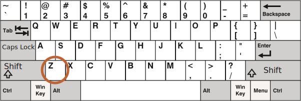
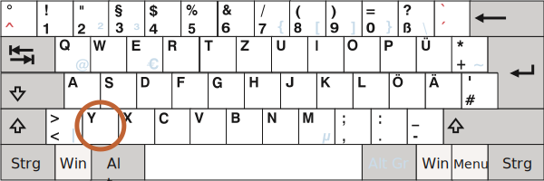

# Keyboard: keydown and keyup

Before we get to keyboard, please note that on modern devices there are other ways to "input something". For instance, people use speech recognition (especially on mobile devices) or copy/paste with the mouse.

So if we want to track any input into an `<input>` field, then keyboard events are not enough. There's another event named `input` to track changes of an `<input>` field, by any means. And it may be a better choice for such task. We'll cover it later in the chapter <info:events-change-input>.

Keyboard events should be used when we want to handle keyboard actions (virtual keyboard also counts). For instance, to react on arrow keys `key:Up` and `key:Down` or hotkeys (including combinations of keys).


## Teststand [#keyboard-test-stand]

```offline
To better understand keyboard events, you can use the [teststand](sandbox:keyboard-dump).
```

```online
To better understand keyboard events, you can use the teststand below.

Try different key combinations in the text field.

[codetabs src="keyboard-dump" height=480]
```


## Keydown and keyup

The `keydown` events happens when a key is pressed down, and then `keyup` -- when it's released.

### event.code and event.key

The `key` property of the event object allows to get the character, while the `code` property of the event object allows to get the "physical key code".

For instance, the same key `key:Z` can be pressed with or without `key:Shift`. That gives us two different characters: lowercase `z` and uppercase `Z`.

The `event.key` is exactly the character, and it will be different. But `event.code` is the same:

| Key          | `event.key` | `event.code` |
|--------------|-------------|--------------|
| `key:Z`      |`z` (lowercase)         |`KeyZ`        |
| `key:Shift+Z`|`Z` (uppercase)          |`KeyZ`        |


If a user works with different languages, then switching to another language would make a totally different character instead of `"Z"`. That will become the value of `event.key`, while `event.code` is always the same: `"KeyZ"`.

```smart header="\"KeyZ\" and other key codes"
Every key has the code that depends on its location on the keyboard. Key codes described in the [UI Events code specification](https://www.w3.org/TR/uievents-code/).

For instance:
- Letter keys have codes `"Key<letter>"`: `"KeyA"`, `"KeyB"` etc.
- Digit keys have codes: `"Digit<number>"`: `"Digit0"`, `"Digit1"` etc.
- Special keys are coded by their names: `"Enter"`, `"Backspace"`, `"Tab"` etc.

There are several widespread keyboard layouts, and the specification gives key codes for each of them.

Read the [alphanumeric section of the spec](https://www.w3.org/TR/uievents-code/#key-alphanumeric-section) for more codes, or just press a key in the [teststand](#keyboard-test-stand) above.
```

```warn header="Case matters: `\"KeyZ\"`, not `\"keyZ\"`"
Seems obvious, but people still make mistakes.

Please evade mistypes: it's `KeyZ`, not `keyZ`. The check like `event.code=="keyZ"` won't work: the first letter of `"Key"` must be uppercase.
```

What if a key does not give any character? For instance, `key:Shift` or `key:F1` or others. For those keys, `event.key` is approximately the same as `event.code`:

| Key          | `event.key` | `event.code` |
|--------------|-------------|--------------|
| `key:F1`      |`F1`          |`F1`        |
| `key:Backspace`      |`Backspace`          |`Backspace`        |
| `key:Shift`|`Shift`          |`ShiftRight` or `ShiftLeft`        |

Please note that `event.code` specifies exactly which key is pressed. For instance, most keyboards have two `key:Shift` keys: on the left and on the right side. The `event.code` tells us exactly which one was pressed, and `event.key` is responsible for the "meaning" of the key: what it is (a "Shift").

Let's say, we want to handle a hotkey: `key:Ctrl+Z` (or `key:Cmd+Z` for Mac). Most text editors hook the "Undo" action on it. We can set a listener on `keydown` and check which key is pressed.

There's a dilemma here: in such a listener, should we check the value of `event.key` or `event.code`?

On one hand, the value of `event.key` is a character, it changes depending on the language. If the visitor has several languages in OS and switches between them, the same key gives different characters. So it makes sense to check `event.code`, it's always the same.

Like this:

```js run
document.addEventListener('keydown', function(event) {
  if (event.code == 'KeyZ' && (event.ctrlKey || event.metaKey)) {
    alert('Undo!')
  }
});
```

On the other hand, there's a problem with `event.code`. For different keyboard layouts, the same key may have different characters.

For example, here are US layout ("QWERTY") and German layout ("QWERTZ") under it (from Wikipedia):





For the same key, US layout has "Z", while German layout has "Y" (letters are swapped).

Literally, `event.code` will equal `KeyZ` for people with German layout when they press `key:Y`.

If we check `event.code == 'KeyZ'` in our code, then for people with German layout such test will pass when they press `key:Y`.

That sounds really odd, but so it is. The [specification](https://www.w3.org/TR/uievents-code/#table-key-code-alphanumeric-writing-system) explicitly mentions such behavior.

So, `event.code` may match a wrong character for unexpected layout. Same letters in different layouts may map to different physical keys, leading to different codes. Luckily, that happens only with several codes, e.g. `keyA`, `keyQ`, `keyZ` (as we've seen), and doesn't happen with special keys such as `Shift`. You can find the list in the [specification](https://www.w3.org/TR/uievents-code/#table-key-code-alphanumeric-writing-system).

To reliably track layout-dependent characters, `event.key` may be a better way.

On the other hand, `event.code` has the benefit of staying always the same, bound to the physical key location. So hotkeys that rely on it work well even in case of a language switch.

Do we want to handle layout-dependant keys? Then `event.key` is the way to go.

Or we want a hotkey to work even after a language switch? Then `event.code` may be better.

## Auto-repeat

If a key is being pressed for a long enough time, it starts to "auto-repeat": the `keydown` triggers again and again, and then when it's released we finally get `keyup`. So it's kind of normal to have many `keydown` and a single `keyup`.

For events triggered by auto-repeat, the event object has `event.repeat` property set to `true`.


## Default actions

Default actions vary, as there are many possible things that may be initiated by the keyboard.

For instance:

- A character appears on the screen (the most obvious outcome).
- A character is deleted (`key:Delete` key).
- The page is scrolled (`key:PageDown` key).
- The browser opens the "Save Page" dialog (`key:Ctrl+S`)
-  ...and so on.

Preventing the default action on `keydown` can cancel most of them, with the exception of OS-based special keys. For instance, on Windows `key:Alt+F4` closes the current browser window. And there's no way to stop it by preventing the default action in JavaScript.

For instance, the `<input>` below expects a phone number, so it does not accept keys except digits, `+`, `()` or `-`:

```html autorun height=60 run
<script>
function checkPhoneKey(key) {
  return (key >= '0' && key <= '9') || ['+','(',')','-'].includes(key);
}
</script>
<input *!*onkeydown="return checkPhoneKey(event.key)"*/!* placeholder="Phone, please" type="tel">
```

The `onkeydown` handler here uses `checkPhoneKey` to check for the key pressed. If it's valid (from `0..9` or one of `+-()`), then it returns `true`, otherwise `false`.

As we know, the `false` value returned from the event handler, assigned using a DOM property or an attribute, such as above, prevents the default action, so nothing appears in the `<input>` for keys that don't pass the test. (The `true` value returned doesn't affect anything, only returning `false` matters)

Please note that special keys, such as `key:Backspace`, `key:Left`, `key:Right`, do not work in the input. That's a side effect of the strict filter `checkPhoneKey`. These keys make it return `false`.

Let's relax the filter a little bit by allowing arrow keys `key:Left`, `key:Right` and `key:Delete`, `key:Backspace`:

```html autorun height=60 run
<script>
function checkPhoneKey(key) {
  return (key >= '0' && key <= '9') ||
    ['+','(',')','-',*!*'ArrowLeft','ArrowRight','Delete','Backspace'*/!*].includes(key);
}
</script>
<input onkeydown="return checkPhoneKey(event.key)" placeholder="Phone, please" type="tel">
```

Now arrows and deletion works well.

Even though we have the key filter, one still can enter anything using a mouse and right-click + Paste. Mobile devices provide other means to enter values. So the filter is not 100% reliable.

The alternative approach would be to track the `oninput` event -- it triggers *after* any modification. There we can check the new `input.value` and modify it/highlight the `<input>` when it's invalid. Or we can use both event handlers together.

## Legacy

In the past, there was a `keypress` event, and also `keyCode`, `charCode`, `which` properties of the event object.

There were so many browser incompatibilities while working with them, that developers of the specification had no way, other than deprecating all of them and creating new, modern events (described above in this chapter). The old code still works, as browsers keep supporting them, but there's totally no need to use those any more.

## Mobile Keyboards

When using virtual/mobile keyboards, formally known as IME (Input-Method Editor), the W3C standard states that a KeyboardEvent's [`e.keyCode` should be `229`](https://www.w3.org/TR/uievents/#determine-keydown-keyup-keyCode) and [`e.key` should be `"Unidentified"`](https://www.w3.org/TR/uievents-key/#key-attr-values).

While some of these keyboards might still use the right values for `e.key`, `e.code`, `e.keyCode`... when pressing certain keys such as arrows or backspace, there's no guarantee, so your keyboard logic might not always work on mobile devices.

## Summary

Pressing a key always generates a keyboard event, be it symbol keys or special keys like `key:Shift` or `key:Ctrl` and so on. The only exception is `key:Fn` key that sometimes presents on a laptop keyboard. There's no keyboard event for it, because it's often implemented on lower level than OS.

Keyboard events:

- `keydown` -- on pressing the key (auto-repeats if the key is pressed for long),
- `keyup` -- on releasing the key.

Main keyboard event properties:

- `code` -- the "key code" (`"KeyA"`, `"ArrowLeft"` and so on), specific to the physical location of the key on keyboard.
- `key` -- the character (`"A"`, `"a"` and so on), for non-character keys, such as `key:Esc`, usually has the same value  as `code`.

In the past, keyboard events were sometimes used to track user input in form fields. That's not reliable, because the input can come from various sources. We have `input` and `change` events to handle any input (covered later in the chapter <info:events-change-input>). They trigger after any kind of input, including copy-pasting or speech recognition.

We should use keyboard events when we really want keyboard. For example, to react on hotkeys or special keys.
