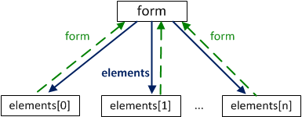

# Навигация и свойства элементов формы

Элементы управления, такие как `<form>`, `<input>` и другие имеют большое количество своих важных свойств и ссылок.

[cut]

## Псевдомассив form.elements

Элементы `FORM` можно получить по имени или номеру, используя свойство `document.forms[name/index]`.

Например:

```js
//+ no-beautify
document.forms.my -- форма с именем 'my'
document.forms[0] -- первая форма в документе
```

**Любой *элемент* формы `form` можно получить аналогичным образом, используя свойство `form.elements`.**



Например:

```html
<!--+ run height=40 -->
<body>
  <form name="my">
    <input name="one" value="1">
    <input name="two" value="2">
  </form>

  <script>
    var form = document.forms.my; // можно document.forms[0]

    var elem = form.elements.one; // можно form.elements[0]

    alert( elem.value ); // "один"
  </script>
</body>
```

**Может быть несколько элементов с *одинаковым именем*. В таком случае `form.elements[name]` вернет коллекцию элементов**, например:

```html
<!--+ run height=40 -->
<body>
<form>
  <input type="radio" name="*!*age*/!*" value="10">
  <input type="radio" name="*!*age*/!*" value="20">
</form>

<script>
var form = document.forms[0];

var elems = form.elements.age;

alert(elems[0].value); // 10, первый input
</script>
</body>
```

Эти ссылки не зависят от окружающих тегов. Элемент может быть "зарыт" где-то глубоко в форме, но он всё равно доступен через `form.elements`.

**Свойство `elements` также есть у элементов `<fieldset>`.**
Вот пример:

```html
<!--+ run height=80 -->
<body>
  <form>
    <fieldset name="set">
      <legend>fieldset</legend>
      <input name="text" type="text">
    </fieldset>
  </form>

  <script>
    var form = document.forms[0];

    alert( form.elements.text ); // INPUT
*!*
    alert( form.elements.set.elements.text ); // INPUT
*/!*
  </script>
</body>
```

Спецификация: [HTML5 Forms](https://html.spec.whatwg.org/multipage/forms.html).

[warn header="Доступ `form.name` тоже работает, но с особенностями"]
Получить доступ к элементам формы можно не только через `form.elements[name/index]`, но и проще: `form[index/name]`.
 
Этот способ короче, так как обладает одной неприятной особенностью: если к элементу обратиться по его `name`, а потом свойство `name` изменить, то он по-прежнему будет доступен под старым именем.

Звучит странно, поэтому посмотрим на примере.

```html
<!--+ run height=40 -->
<form name="myform">
  <input name="text">
</form>

<script>
  var form = document.forms.myform;

  alert( form.elements.text == form.text ); // true, это тот самый INPUT

  form.text.name = "new-name"; // меняем name ему

  // нет больше элемента с таким именем
  alert( form.elements.text ); // undefined

  alert( form.text ); //  INPUT (а должно быть undefined!)
</script>
```

[/warn]

## Ссылка на форму element.form

По элементу можно получить его форму, используя свойство `element.form`.

Пример:

```html
<!--+ run height=40 -->
<body>
<form>
  <input type="text" name="*!*surname*/!*">
</form>

<script>
var form = document.forms[0];

var elem = form.elements.surname;

*!*
alert(elem.form == form); // true
*/!*
</script>
</body>
```

Познакомиться с другими свойствами элементов можно в спецификации [HTML5 Forms](https://html.spec.whatwg.org/multipage/forms.html).

## Элемент label

Элемент `label` -- один из самых важных в формах. 

**Клик на `label` засчитывается как фокусировка или клик на элементе формы, к которому он относится.**

Это позволяет посетителям кликать на большой красивой метке, а не на маленьком квадратике `input type=checkbox` (`radio`). Конечно, это очень удобно.
 
Есть два способа показать, какой элемент относится к `label`:

<ol>
<li>Дать метке атрибут `for`, равный `id` соответствующего `input`:

```html
<!--+ autorun -->
<table>
  <tr>
    <td>
      <label for="agree">Согласен с правилами</label>
    </td>
    <td>
      <input id="agree" type="checkbox">
    </td>
  </tr>
  <tr>
    <td>
      <label for="not-a-robot">Я не робот</label>
    </td>
    <td>
      <input id="not-a-robot" type="checkbox">
    </td>
  </tr>
</table>
```

</li>
<li>Завернуть элемент в `label`. В этом случае можно обойтись без дополнительных атрибутов:

```html
<!--+ autorun  no-beautify -->
<label>Кликни меня <input type="checkbox"></label>
```

</li>
</ol>

## Элементы input и textarea

Для большинства типов `input` значение ставится/читается через свойство `value`.

```js
input.value = "Новое значение";
textarea.value = "Новый текст";
```

[warn header="Не используйте `textarea.innerHTML`"]
Для элементов `textarea` также доступно свойство `innerHTML`, но лучше им не пользоваться: оно хранит только HTML, изначально присутствовавший в элементе, и не меняется при изменении значения.
[/warn]

Исключения -- `input type="checkbox"` и `input type="radio"`

**Текущее "отмеченное" состояние для `checkbox` и `radio` находится в свойстве `checked` (`true/false`).**

```js
if (input.checked) {
  alert( "Чекбокс выбран" );
}
```

## Элементы select и option

Селект в JavaScript можно установить двумя путями: поставив значение  `select.value`, либо установив свойство `select.selectedIndex` в номер нужной опции.:

```js
select.selectedIndex = 0; // первая опция
```

Установка `selectedIndex = -1` очистит выбор.

**Список элементов-опций доступен через `select.options`.**

Если `select` допускает множественный выбор (атрибут `multiple`), то значения можно получить/установить, сделав цикл по `select.options`. При этом выбранные опции будут иметь свойство `option.selected = true`.

Пример:

```html
<!--+ run -->
<form name="form">
  <select name="genre" *!*multiple*/!*>
    <option value="blues" selected>Мягкий блюз</option>
    <option value="rock" selected>Жёсткий рок</option>
    <option value="classic">Классика</option>
  </select>
</form>

<script>
var form = document.forms[0];
var select = form.elements.genre;

for (var i = 0; i < select.options.length; i++) {
  var option = select.options[i];
*!*
  if(option.selected) {
    alert( option.value );
  }
*/!*
}
</script>
```

Спецификация: [the select element](https://html.spec.whatwg.org/multipage/forms.html#the-select-element).

[smart header="`new Option`"]
В стандарте [the option element](https://html.spec.whatwg.org/multipage/forms.html#the-option-element) есть любопытный короткий синтаксис для создания элемента с тегом `option`:

```js
option = new Option(text, value, defaultSelected, selected);
```

Параметры:
<ul>
<li>`text` -- содержимое,</li>
<li>`value` -- значение,</li>
<li>`defaultSelected` и `selected` поставьте в `true`, чтобы сделать элемент выбранным.</li>
</ul>

Его можно использовать вместо `document.createElement('option')`, например:

```js
var option = new Option("Текст", "value");
// создаст <option value="value">Текст</option>
```

Такой же элемент, но выбранный:

```js
var option = new Option("Текст", "value", true, true);
```

[/smart]

[smart header="Дополнительные свойства `option`"]

У элементов `option` также есть особые свойства, которые могут оказаться полезными (см. [the option element](https://html.spec.whatwg.org/multipage/forms.html#the-option-element)):

<dl>
<dt>`selected`</dt>
<dd>выбрана ли опция</dd>
<dt>`index`</dt>
<dd>номер опции в списке селекта</dd>
<dt>`text`</dt>
<dd>Текстовое содержимое опции (то, что видит посетитель).</dd>
</dl>

[/smart]


## Итого

Свойства для навигации по формам:

<dl>
<dt>`document.forms`</dt>
<dd>Форму можно получить как `document.forms[name/index]`.</dd>
<dt>`form.elements`</dt>
<dd>Элементы в форме: `form.elements[name/index]`. Каждый элемент имеет ссылку на форму в свойстве `form`. Свойство `elements` также есть у `<fieldset>`.</dd>
</dl>

Значение элементов читается/ставится через `value` или `checked`.

Для элемента `select` можно задать опцию по номеру через `select.selectedIndex` и перебрать опции через `select.options`. При этом выбранные опции (в том числе при мультиселекте) будут иметь свойство `option.selected = true`.

