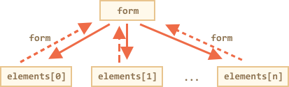

# Form properties and methods [todo]

Forms and control elements, such as `<input>` have a lot of special properties and events.

Working with forms can be much more convenient if we know them.


[cut]

## Navigation: form and elements

Document forms are members of the special collection `document.forms`.

That's a *named* collection: we can use both the name and the number to get the form.

```js no-beautify
document.forms.my - the form with name="my"
document.forms[0] - the first form in the document
```

When we have a form, then any element is available in the named collection `form.elements`.

For instance:

```html run height=40
<form name="my">
  <input name="one" value="1">
  <input name="two" value="2">
</form>

<script>
  // get the form
  let form = document.forms.my; // <form name="my"> element

  // get the element
  let elem = form.elements.one; // <input name="one"> element

  alert( elem.value ); // 1
</script>
```

There may be multiple elements with the same name, that's often the case with radio buttons.

In that case `form.elements[name]` is a collection, for instance:

```html run height=40
<form>
  <input type="radio" *!*name="age"*/!* value="10">
  <input type="radio" *!*name="age"*/!* value="20">
</form>

<script>
let form = document.forms[0];

let ageElems = form.elements.age;

alert(ageElems[0].value); // 10, the first input value
</script>
```

These navigation properties do not depend on the tag structure. All elements, no matter how deep they are in the form, are available in `form.elements`.


````smart header="Fieldsets as \"subforms\""
A form may have one or many `<fieldset>` elements inside it. They also support the `elements` property.

For instance:

```html run height=80
<body>
  <form id="form">
    <fieldset name="userFields">
      <legend>info</legend>
      <input name="login" type="text">
    </fieldset>
  </form>

  <script>
    alert(form.elements.login); // <input name="login">

*!*
    let fieldset = form.elements.userFields;
    alert(fieldset); // HTMLFieldSetElement

    // we can get the input both from the form and from the fieldset
    alert(fieldset.elements.login == form.elements.login); // true
*/!*
  </script>
</body>
```
````

````warn header="Shorter notation: `form.name`"
There's a shorter notation: we can access the element as `form[index/name]`.

Instead of `form.elements.login` we can write `form.login`.

That also works, but there's a minor issue: if we access an element, and then change its `name`, then it is still available under the old name (as well as under the new one).

That's easy to see in an example:

```html run height=40
<form id="form">
  <input name="login">
</form>

<script>
  alert(form.elements.login == form.login); // true, the same <input>

  form.login.name = "username"; // change the name of the input

  // form.elements updated the name:
  alert(form.elements.login); // undefined
  alert(form.elements.username); // input

*!*
  // the direct access now can use both names: the new one and the old one
  alert(form.username == form.login); // true
*/!*
</script>
```

That's usually not a problem, because we rarely change names of form elements.

````

## Backreference: element.form

For any element, the form is available as `element.form`. So a form references all elements, and elements
reference the form.

Here's the picture:



For instance:

```html run height=40
<form id="form">
  <input type="text" name="login">
</form>

<script>
*!*
  // form -> element
  let login = form.login;

  // element -> form
  alert(login.form); // HTMLFormElement
*/!*
</script>
```

## Values: input and textarea

Normally, we can read the value as `input.value` or `input.checked` (for radio)

Для большинства типов `input` значение ставится/читается через свойство `value`.

```js
input.value = "Новое значение";
textarea.value = "Новый текст";
```

```warn header="Не используйте `textarea.innerHTML`"
Для элементов `textarea` также доступно свойство `innerHTML`, но лучше им не пользоваться: оно хранит только HTML, изначально присутствовавший в элементе, и не меняется при изменении значения.
```

Исключения -- `input type="checkbox"` и `input type="radio"`

**Текущее "отмеченное" состояние для `checkbox` и `radio` находится в свойстве `checked` (`true/false`).**

```js
if (input.checked) {
  alert( "Чекбокс выбран" );
}
```

## Элементы select и option

Селект в JavaScript можно установить двумя путями: поставив значение  `select.value`, либо установив свойство `select.selectedIndex` в номер нужной опции.:

```js
select.selectedIndex = 0; // первая опция
```

Установка `selectedIndex = -1` очистит выбор.

**Список элементов-опций доступен через `select.options`.**

Если `select` допускает множественный выбор (атрибут `multiple`), то значения можно получить/установить, сделав цикл по `select.options`. При этом выбранные опции будут иметь свойство `option.selected = true`.

Пример:

```html run
<form name="form">
  <select name="genre" *!*multiple*/!*>
    <option value="blues" selected>Мягкий блюз</option>
    <option value="rock" selected>Жёсткий рок</option>
    <option value="classic">Классика</option>
  </select>
</form>

<script>
var form = document.forms[0];
var select = form.elements.genre;

for (var i = 0; i < select.options.length; i++) {
  var option = select.options[i];
*!*
  if(option.selected) {
    alert( option.value );
  }
*/!*
}
</script>
```

Спецификация: [the select element](https://html.spec.whatwg.org/multipage/forms.html#the-select-element).

````smart header="`new Option`"
В стандарте [the option element](https://html.spec.whatwg.org/multipage/forms.html#the-option-element) есть любопытный короткий синтаксис для создания элемента с тегом `option`:

```js
option = new Option(text, value, defaultSelected, selected);
```

Параметры:

- `text` -- содержимое,
- `value` -- значение,
- `defaultSelected` и `selected` поставьте в `true`, чтобы сделать элемент выбранным.

Его можно использовать вместо `document.createElement('option')`, например:

```js
var option = new Option("Текст", "value");
// создаст <option value="value">Текст</option>
```

Такой же элемент, но выбранный:

```js
var option = new Option("Текст", "value", true, true);
```
````

```smart header="Дополнительные свойства `option`"
У элементов `option` также есть особые свойства, которые могут оказаться полезными (см. [the option element](https://html.spec.whatwg.org/multipage/forms.html#the-option-element)):

`selected`
: выбрана ли опция

`index`
: номер опции в списке селекта

`text`
: Текстовое содержимое опции (то, что видит посетитель).
```

## Итого

Свойства для навигации по формам:

`document.forms`
: Форму можно получить как `document.forms[name/index]`.

`form.elements`
: Элементы в форме: `form.elements[name/index]`. Каждый элемент имеет ссылку на форму в свойстве `form`. Свойство `elements` также есть у `<fieldset>`.

Значение элементов читается/ставится через `value` или `checked`.

Для элемента `select` можно задать опцию по номеру через `select.selectedIndex` и перебрать опции через `select.options`. При этом выбранные опции (в том числе при мультиселекте) будут иметь свойство `option.selected = true`.


Спецификация: [HTML5 Forms](https://html.spec.whatwg.org/multipage/forms.html).
