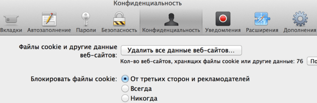

# Cookies, document.cookie

Cookies allow to store small pieces of data directly in the browser. They are not part of Javascript, but rather part of HTTP, defined by [RFC 6265](https://tools.ietf.org/html/rfc6265) specification.

We can use Javascript or server-side headers to get/set cookies.

Then the browser sends them in `Cookie` header of every request to the domain that set the cookie, but not to other domains.

So, cookies are mainly used for authorization and user-tracking. We set a cookie, and then get it at new visits of the same user, so we know who he is.

The browser provides a special accessor `document.cookie` for that. Managing it manually is quite a tedious task, so we'll compose a few several functions for that.

## Reading from document.cookie

```online
Do you have any cookies on that site? Let's see:
```

```offline
Assuming you're on a website, it's possible to see the cookies, like this:
```

```js run
alert( document.cookie ); // cookie1=value1; cookie2=value2;...
```

The string consist of `name=value` pairs, delimited by `; `. So, to find a particular cookie, we can split `document.cookie` by `; `, and then find the right key. We can use either a regular expression or arrays for that.

## getCookie(name)

The shortest way to access cookie is to use a [regular expression](info:regular-expressions).

The function `getCookie(name)` returns the cookie with the given `name`:

```js
// returns the cookie with the given name,
// or undefined if not found
function getCookie(name) {
  let matches = document.cookie.match(new RegExp(
    "(?:^|; )" + name.replace(/([\.$?*|{}\(\)\[\]\\\/\+^])/g, '\\$1') + "=([^;]*)"
  ));
  return matches ? decodeURIComponent(matches[1]) : undefined;
}
```

Here the regexp is generated dynamically, to match `; name=<value>`.

Please note that a cookie value can be an arbitrary string. If it contains characters that break the formatting, for instance spaces or `;`, such characters are encoded.

To decode them, we need to use a built-in `decodeURIComponent` function, the function does it also.

## Writing to document.cookie

The `document.cookie` is writable. But it's not a data property, but rather an accessor.

**A write operation to `document.cookie` passes through the browser that updates cookies mentioned in it, but doesn't touch other cookies.**

For instance, this call sets a cookie with the name `user` and value `John`:

```js run
document.cookie = "user=John";
alert(document.cookie);
```

If you run it, then probably you'll see multiple cookies. Only the cookie named `user` was altered.

Cookies have several options, many of them are important and should be set.

The options are listed after `key=value`, delimited by `;`, for instance:

```js run
document.cookie = "user=John; path=/; expires=Tue, 19 Jan 2038 03:14:07 GMT"
```

## path

- **`path=/mypath`**

The url path prefix, where the cookie is accessible. By default, it's the current path.

Usually, we should set `path=/` to make the cookie accessible from all website pages.

Please note: the path must be absolute.

## domain

- **`domain=site.com`**

Domain where the cookie is accessible.

By default, cookie is accessible only at the domain that set it. So, if we set a cookie at `site.com`, we won't get it at `forum.site.com`.

```js
// at site.com
document.cookie = "user=John"

// at forum.site.com
alert(document.cookie); // no user
```

If we'd like subdomains to access the cookie, we should set `domain=site.com` explicitly. For historical reasons, `domain=.site.com` (a dot at the start) also works this way:

```js
// at site.com
document.cookie = "user=John; domain=site.com"

// at forum.site.com
alert(document.cookie); // with user
```

## expires, max-age

By default, a cookie disappears when the browser is closed. They are called "session cookies"

To change it, we must set either `expires` or `max-age` option.

- **`expires=Tue, 19 Jan 2038 03:14:07 GMT`**

Cookie expiration date (when it dies automatically).

The date must be exactly in this format, in GMT timezone. We can use `date.toUTCString` to get it. For instance, we can set the cookie to expire in 1 day:

```js
// +1 day from now
let date = new Date(Date.now() + 86400e3);
date = date.toUTCString();
document.cookie = "user=John; expires=" + date;
```

If the date is in the past, the cookie will be deleted from the browser.

-  **`max-age=3600`**

An alternative to `expires`, specifies the cookie expiration in seconds.

Can be either a number of seconds from the current moment, or `0` for immediate expiration (to remove the cookie):

```js
// cookie will die +1 hour from now
document.cookie = "user=John; max-age=3600";

// delete cookie (let it expiree right now)
document.cookie = "user=John; max-age=0";
```  

## secure

- **`secure`**

The cookie should be transferred only over HTTPS.

That's important, by default if we set a cookie at `http://site.com`, then it also appears at `https://site.com` and vise versa.

With this option, if a cookie is set at `https://site.com`, the browser does not set it to `http://site.com`. So if a cookie has sensitive content, like authorization, then it's more secure.

```js
// set the cookie secure (only sent with HTTPS requests)
document.cookie = "user=John; secure";
```  

## samesite

That's another security option, to protect from so-called XSRF (cross-site request forgery) attacks.

To understand when it's useful, let's introduce the following attack scenario.

### XSRF attack

Imagine, you are logged into the site `bank.com`. That is: you have an authentication cookie from that site. Your browser sends it to `bank.com` on every request, so that it recognizes you and performs all sensitive financial operations.

Now, while browsing the web in another window, you occasionally come to another site `evil.com`, that has a `<form action="https://bank.com/pay">` with parameters containing hacker's account and JavaScript code that sends it automatically.

The form is submitted to the bank site, and your cookie is also sent, just because it's sent every time you visit `bank.com`. So that the bank actually performs the payment.


That's called a cross-site request forgery (or XSRF) attack.

Real banks are protected from it of course. All forms generated by `bank.com` have a special field, so called "xsrf protection token", that the evil page can't generate.

### Enter cookie samesite option

Now, cookie samesite option provides another way to protect from such attacks, that does not require "xsrf protection tokens".

It has two possible values:

- **`samesite=strict`, same as `samesite` without value**

A cookie with `samesite=strict` is never sent if the user comes from outside the site.

In other words, whether a user follows a link from the mail or submits a form from `evil.com`, the cookie is not sent. Then `bank.com` will not recognize the user, and will not proceed with the payment.

The protection is indeed reliable. Only operations originating from `bank.com` will send cookies. Although, it may be a little too strict.

When a user follows a legitimate link to `bank.com`, like from their own notes, they'll be surprised that `bank.com` does not recognize them. Indeed, `samesite=strict` cookies are nots sent in that case.

So there's another, more relaxed value.

- **`samesite=lax`**

Lax mode, just like `strict`, forbids the browser to send cookies when coming from outside the site, but adds an exception.

A `samesite=lax` cookie is sent if both of these conditions are true:
1. The HTTP method is "safe" (e.g. GET, but not POST).

    The full list safe of HTTP methods is in the [RFC7231 specification](https://tools.ietf.org/html/rfc7231). Basically, these are the methods that should be used for reading, but not writing the data. They must not perform any data-changing operations. Following a link is always GET, the safe method.

2. The operation performs top-level navigation (changes URL in the browser address bar).

    That's usually true, but if the navigation is performed in an `<iframe>`, then it's not top-level. Also, AJAX requests do not get in.

So, what `samesite=lax` does is basically allows a most common "open URL" operation to bring cookies. Something more complicated, like AJAX request from another site or a form submittion, passes through, but loses cookies by the way.

If that's fine for you, then adding `samesite=lax` will probably not break the user experience and add protection.

Overall, `samesite` is great, but it has an important drawback:
- `samesite` is not supported, ignored by old browsers (like year 2017).

So if we solely rely on `samesite` to provide protection, then old browsers will be totally vulnerable.

But we surely can use `samesite` together with other protection measures, like xsrf tokens, to add an additional layer of protection.

## setCookie(name, value, options)

If we gather all options together, here's a small function that sets the cookie `name` to the given `value` with reasonable default options:
Если собрать все настройки воедино, вот такая функция ставит куки:

```js
function setCookie(name, value, options = {}) {

  options = {
    path: '/',
    // add other defaults here if necessary
    ...options
  };

  if (options.expires.toUTCString) {
    options.expires = options.expires.toUTCString();
  }

  options.value = encodeURIComponent(options.value);

  let updatedCookie = encodeURIComponent(name) + "=" + encodeURIComponent(value);

  for (let optionKey in options) {
    updatedCookie += "; " + optionKey;
    let optionValue = options[optionKey];
    if (optionValue !== true) {
      updatedCookie += "=" + optionValue;
    }
  }

  document.cookie = updatedCookie;
}
```

Аргументы:

name
: название cookie

value
: значение cookie (строка)

options
: Объект с дополнительными свойствами для установки cookie:

expires
: Время истечения cookie. Интерпретируется по-разному, в зависимости от типа:

    - Число -- количество секунд до истечения. Например, `expires: 3600` -- кука на час.
    - Объект типа [Date](https://developer.mozilla.org/ru/docs/Web/JavaScript/Reference/Global_Objects/Date) -- дата истечения.
    - Если expires в прошлом, то cookie будет удалено.
    - Если expires отсутствует или `0`, то cookie будет установлено как сессионное и исчезнет при закрытии браузера.

path
: Путь для cookie.

domain
: Домен для cookie.

secure
: Если `true`, то пересылать cookie только по защищенному соединению.


## Функция deleteCookie(name)

Здесь всё просто -- удаляем вызовом `setCookie` с датой в прошлом.

```js
function deleteCookie(name) {
  setCookie(name, "", {
    expires: -1
  })
}
```

## Сторонние cookie

При работе с cookie есть важная тонкость, которая касается внешних ресурсов.

Теоретически, любой ресурс, который загружает браузер, может поставить cookie.

Например:

- Если на странице есть ``, то вместе с картинкой в ответ сервер может прислать заголовки, устанавливающие cookie.
- Если на странице есть `<iframe src="http://facebook.com/button.php">`, то во-первых сервер может вместе с `button.php` прислать cookie, а во-вторых JS-код внутри ифрейма может записать в `document.cookie`

При этом cookie будут принадлежать тому домену, который их поставил. То есть, на `mail.ru` для первого случая, и на `facebook.com` во втором.

**Такие cookie, которые не принадлежат основной странице, называются "сторонними" (3rd party) cookies. Не все браузеры их разрешают.**

Как правило, в настройках браузера можно поставить "Блокировать данные и файлы cookie сторонних сайтов" (Chrome).

**В Safari такая настройка включена по умолчанию и выглядит так:**



### Тс-с-с. Большой брат смотрит за тобой.

Цель этого запрета -- защитить посетителей от слежки со стороны рекламодателей, которые вместе с картинкой-баннером присылают и куки, таким образом помечая посетителей.

Например, на многих сайтах стоят баннеры и другая реклама Google Ads. При помощи таких cookie компания Google будет знать, какие именно сайты вы посещаете, сколько времени вы на них проводите и многое другое.

Как? Да очень просто -- на каждом сайте загружается, к примеру, картинка с рекламой. При этом баннер берётся с домена, принадлежащего Google. Вместе с баннером Google ставит cookie со специальным уникальным идентификатором.

Далее, при следующем запросе на баннер, браузер пошлёт стандартные заголовки, которые включают в себя:

- Cookie с домена баннера, то есть уникальный идентификатор, который был поставлен ранее.
- Стандартный заголовок Referrer (его не будет при HTTPS!), который говорит, с какого сайта сделан запрос. Да, впрочем, Google и так знает, с какого сайта запрос, ведь идентификатор сайта есть в URL.

Так что Google может хранить в своей базе, какие именно сайты из тех, на которых есть баннер Google, вы посещали, когда вы на них были, и т.п. Этот идентификатор легко привязывается к остальной информации от других сервисов, и таким образом картина слежки получается довольно-таки глобальной.

Здесь я не утверждаю, что в конкретной компании Google всё именно так... Но во-первых, сделать так легко, во-вторых идентификаторы действительно ставятся, а в-третьих, такие знания о человеке позволяют решать, какую именно рекламу и когда ему показать. А это основная доля доходов Google, благодаря которой корпорация существует.

Возможно, компания Apple, которая выпустила Safari, поставила такой флаг по умолчанию именно для уменьшения влияния Google?

### А если очень надо?

Итак, Safari запрещает сторонние cookie по умолчанию. Другие браузеры предоставляют такую возможность, если посетитель захочет.

**А что, если ну очень надо поставить стороннюю cookie, и чтобы это было надёжно?**

Такая задача действительно возникает, например, в системе кросс-доменной авторизации, когда есть несколько доменов 2-го уровня, и хочется, чтобы посетитель, который входит в один сайт, автоматически распознавался во всей сетке. При этом cookie для авторизации ставятся на главный домен -- "мастер", а остальные сайты запрашивают их при помощи специального скрипта (и, как правило, копируют к себе для оптимизации, но здесь это не суть).

Ещё пример -- когда есть внешний виджет, например, `iframe` с информационным сервисом, который можно подключать на разные сайты. И этот `iframe` должен знать что-то о посетителе, опять же, авторизация или какие-то настройки, которые хорошо бы хранить в cookie.

Есть несколько способов поставить 3rd-party cookie для Safari.

Использовать ифрейм.
: Ифрейм является полноценным окном браузера. В нём должна быть доступна вся функциональность, в том числе cookie. Как браузер решает, что ифрейм "сторонний" и нужно запретить для него и его скриптов установку cookie? Критерий таков: "в ифрейме нет навигации". Если навигация есть, то ифрейм признаётся полноценным окном.

    Например, в сторонний `iframe` можно сделать POST. И тогда, в ответ на POST, сервер может поставить cookie. Или прислать документ, который это делает. Ифрейм, в который прошёл POST, считается родным и надёжным.

Popup-окно
: Другой вариант -- использовать popup, то есть при помощи `window.open` открывать именно окно со стороннего домена, и уже там ставить cookie. Это тоже работает.

Редирект
: Ещё одно альтернативное решение, которое подходит не везде - это сделать интеграцию со сторонним доменом, такую что на него можно сделать редирект, он ставит cookie и делает редирект обратно.

## Дополнительно

- На Cookie наложены ограничения:
    - Имя и значение (после `encodeURIComponent`) вместе не должны превышать 4кб.
    - Общее количество cookie на домен ограничено 30-50, в зависимости от браузера.
    - Разные домены 2-го уровня полностью изолированы. Но в пределах доменов 3-го уровня куки можно ставить свободно с указанием `domain`.
    - Сервер может поставить cookie с дополнительным флагом `HttpOnly`. Cookie с таким параметром передаётся только в заголовках, оно никак не доступно из JavaScript.

- Иногда посетители отключают cookie. Отловить это можно проверкой свойства [navigator.cookieEnabled](https://developer.mozilla.org/en-US/docs/DOM/window.navigator.cookieEnabled)

    ```js run
    if (!navigator.cookieEnabled) {
      alert( 'Включите cookie для комфортной работы с этим сайтом' );
    }
    ```

    ...Конечно, предполагается, что включён JavaScript. Впрочем, посетитель без JS и cookie с большой вероятностью не человек, а бот.

## Итого

Файл с функциями для работы с cookie: [cookie.js](cookie.js).
