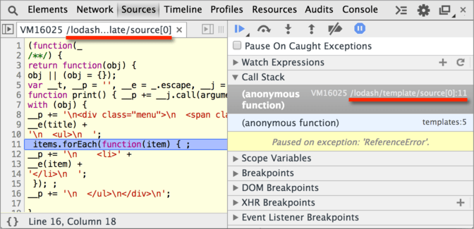

# Шаблонизатор LoDash

В этой главе мы рассмотрим *шаблонизацию* -- удобный способ генерации HTML-структуры для виджета и её реализацию при помощи библиотеки [LoDash](http://lodash.com).
[cut]

Все виджеты можно условно разделить на три группы по генерации DOM-структуры:
<ol>
<li>**Получают готовый HTML/DOM и "оживляют" его.**

Это типичный случай в сайтах, где JavaScript -- на ролях "второго помощника". Разметка, CSS уже есть, от JavaScript, условно говоря, требуются лишь обработчики, чтобы менюшки заработали.</li>
<li>**Создают DOM для компоненты самостоятельно.**

В ряде случаев даже на простых страницах нужно генерировать DOM динамически. Например, виджет "подсказка" при наведении на элемент создаёт красивую подсказку и показывает её. Элемент генерируется в JavaScript-коде.

В более сложных интерфейсах компоненты генерируют свой DOM на основе данных, полученных с сервера или из других источников.</li>
<li>**=1+2: должны уметь как "оживить" уже готовый DOM, так и создать свой.**

Бывает и так, что виджет должен уметь и то и другое. Например, так работает Twitter, который при загрузке сразу показывает текущие сообщения (HTML генерируется на сервере), но может динамически добавлять новые. 

Браузер быстро скачивает HTML и отображает его, посетитель видит текущие сообщения и рад этому. А затем уже подгружается объёмный JavaScript, который умеет загружать сообщения с сервера, создавать их и т.д.
</li>
</ol>

С первым типом виджетов -- вопросов нет. Добавляем обработчики, и дело сделано.

Интересно начинается со второго типа, и совсем интересно -- с третьим типом.

## Зачем нужны шаблоны?

Ранее мы уже видели код `Menu`, который сам создаёт свой элемент:

```js
function Menu(options) {
  // ... приведены только методы для генерации DOM ...

  function render() {
    elem = $('<div class="menu"></div>');
    elem.append( $('<span/>', { class: "title", text: options.title }))

    elem.on('mousedown selectstart', false);

    elem.on('click', '.title', onTitleClick);
  }

  function renderItems() {
    var items = options.items || [];
    var list = $('<ul/>');
    $.each(items, function(i, item) {
      list.append( $('<li>').text(item) );
    })
    list.appendTo(elem);
  }
  
  // ...
}
```

Понятен ли этот код? Очевидно ли, какой HTML он генерирует?

С первого взгляда -- вряд ли. Нужно как минимум внимательно посмотреть и продумать код, чтобы разобраться. Причём это -- с jQuery, если на обычном JavaScript написать, код ещё длиннее и сложнее будет.

...А что, если нужно изменить создаваемый HTML? ...А что, если эта задача досталась не программисту, который написал этот код, а верстальщику, который c HTML/CSS проекта знаком отлично, но этот JS-код видит впервые? Вероятность ошибок при этом зашкаливает за все разумные пределы. 

**К счастью, генерацию HTML можно упростить. Для этого воспользуемся шаблонами.**

## Шаблон

*Шаблон* -- это заготовка, которая путём подстановки значений (текст сообщения, цена и т.п.) превращается в DOM/HTML.

Пример шаблона для меню:

```html
<div class="menu">
  <span class="title"><%-title%></span>
  <ul>
    <% items.forEach(function(item) { %>
    <li><%-item%></li>
    <% }); %>
  </ul>
</div>
```

Как видно, это обычный HTML, со специальными вставками `<% ... %>`. Для работы с таким шаблоном используется специальная функция `_.template`, которая предоставляется фреймворком [LoDash](http://lodash.com/docs#template), её синтаксис мы подробно посмотрим далее.

Взглянем, каким будет вывод меню с использованием шаблона:

```js
// шаблон должен быть в переменной tmpl
*!*
// сгенерировать HTML, используя шаблон tmpl с данными title и items
*/!*
var html = _.template(tmpl, { 
  title: "Сладости",
  items: [
    "Торт",
    "Печенье",
    "Пирожное"
  ]
});
```

Значение `html` в результате:

```html
<div class="menu">
  <span class="title">Сладости</span>
  <ul>
    <li>Торт</li>
    <li>Печенье</li>
    <li>Сладости</li>
  </ul>
</div>
```

Этот гораздо проще, чем JS-код, не правда ли? Шаблон очень наглядно показывает, что в итоге должно получиться. Шаблоны можно использовать для описания как меню целиком, так и его частей.

## Шаблонизация через _.template [#tmpl]

Далее мы подробнее познакомимся с `_.template` и синтаксисом шаблонов.

[warn header="Holy war detected!"]
Способов шаблонизации и, в особенности, синтаксисов шаблонов, примерно столько же, сколько способов [поймать льва в пустыне](http://lurkmore.to/%D0%9A%D0%B0%D0%BA_%D0%BF%D0%BE%D0%B9%D0%BC%D0%B0%D1%82%D1%8C_%D0%BB%D1%8C%D0%B2%D0%B0_%D0%B2_%D0%BF%D1%83%D1%81%D1%82%D1%8B%D0%BD%D0%B5). Иначе говоря... много.

Эта глава -- совершенно не место для священных войн на эту тему. Далее будет более полный обзор типов шаблонных систем, применяемых в JavaScript, но начнём мы с `_.template`, поскольку эта "шаблонка" проста, быстра и демонстрирует целый класс шаблонных систем, активно используемых в самых разных JS-проектах.
[/warn]

### Синтаксис шаблона 

Шаблон представляет собой строку со специальными разделителями, которых всего три:

<dl>
<dt>`<% code %>` -- код</dt>
<dd>Код между разделителями `<% ... %>` будет выполнен "как есть"</dd>
<dt>`<%= expr %>` -- для вставки HTML</dt>
<dd>Переменная или выражение внутри `<%= ... %>` будет вставлено  "как есть". Например: `<%=title %>` вставит значение переменной `title`, а `<%=2+2%>` вставит `4`.</dd>
<dt>`<%- expr %>` -- для вставки текста</dt>
<dd>Переменная или выражение внутри `<%- ... %>` будет вставлено "как текст", то есть с заменой символов `< > & " '` на соответствующие HTML-entities. 

Например, если `expr` содержит текст `<br>`, то при `<%-expr%>` в результат попадёт (в отличие от `<%=expr%>`) не HTML-тег `<br>`, а  текст `&lt;br&gt;`.</dd>
</dl>

### Функция _.template

Для работы с шаблоном в библиотеке [LoDash](https://github.com/bestiejs/lodash) есть функция `_.template(tmpl, data, options)`.

Её аргументы:
<dl>
<dt>`tmpl`</dt>
<dd>Шаблон.</dd>
<dt>`data`</dt>
<dd>Объект с данными.</dd>
<dt>`options`</dt>
<dd>Необязательные настройки, например можно поменять разделители.</dd>
</dl>

Эта функция запускает "сборку" шаблона с объектом `data` и возвращает результат в виде строки.

Вот так:

```js
//+ run
// Шаблон*!*
var tmpl = '<span class="title"><%=title%></span>';

// Данные*!*
var data = {
  title: "Заголовок"
};

// Результат подстановки*!*
var result = _.template(tmpl, data); 
alert(result); // <span class="title">Заголовок</span>
```

Этот пример похож на операцию "поиск-и-замена": функция `_.template` просто заменила `<%=title%>` в шаблоне `tmpl` на значение свойства `data.title`.

Но возможность вставки JS-кода делает шаблоны сильно мощнее.

Например, вот шаблон для генерации списка от `1` до `count`:

```js
//+ run
var tmpl = '<ul>\
  <% for (var i=1; i<=count; i++) { %> \
    <li><%=i%></li> \
  <% } %>\
</ul>';
alert( _.template(tmpl, {count: 5}) );
```

Здесь в результат попал сначала текст `<ul>`, потом выполнился код `for`, который последовательно сгенерировал элементы списка, и затем список был закрыт `</ul>`.  

Скоро мы подробнее разберём, за счёт чего работает функция `_.template`.

### Хранение шаблона в документе

Шаблон -- это многострочный HTML-текст. Объявлять его в скрипте, как сделано выше -- неудобно и некрасиво.

**Один из способов объявления шаблона -- в HTML, внутри <code>&lt;script&gt;</code> с нестандартным `type`, например `"text/template"`:**

```html
<script type="*!*text/template*/!*" id="menu-template">
<div class="menu">
  <span class="title"><%-title%></span> 
</div>
</script>
```

Если `type` не знаком браузеру, то содержимое такого скрипта игнорируется, однако оно доступно при помощи `innerHTML`:

```js
var template = document.getElementById('menu-template').innerHTML;
```

В данном случае выбран `type="text/template"`, однако подошёл бы и любой другой нестандартный, например `text/html`.

Полный пример HTML с подключением библиотеки и шаблоном:

```html
<!--+ run height=150 -->
<!-- библиотека LoDash -->
<script src="//cdnjs.cloudflare.com/ajax/libs/lodash.js/2.4.1/lodash.js"></script>

<!-- шаблон для списка от 1 до count -->
<script *!*type="text/template"*/!* id="list-template">
<ul>
  <% for (var i=1; i<=count; i++) { %>
  <li><%=i%></li>
  <% } %>
</ul>
</script>

<script>
  var tmpl = document.getElementById('list-template').innerHTML;

*!*  
  // ..а вот и результат
  var result = _.template(tmpl, {count: 5});
  document.write( result );
*/!*
</script>
```

### Как работает функция _.template?

Понимание того, как работает `_.template`, очень важно для отладки ошибок в шаблонах. 

Вызов `_.template(tmpl, data)` выполняется в два этапа:
<ol>
<li>Разбивает строку `tmpl` по разделителям и, при помощи `new Function` создаёт на её основе JavaScript-функцию.</li>
<li>Запускает эту функцию с данными `data`, так что она уже генерирует результат.</li>
</ol>

Эти два процесса можно разделить. Функцию из строки-шаблона можно получить в явном виде вызовом `_.template(tmpl)` (без второго аргумента).

Пример:

```js
//+ run
var compiled = _.template("<h1><%=title%></h1>");

alert( compiled( {title: "Заголовок"} ) );  // <h1>Заголовок</h1>
```

Функция `compiled`, которую вернул вызов `_template` из этого примера, выглядит примерно так:

```js
function(obj) { 
  obj || (obj = {}); 
  var __t, __p = '', __e = _.escape; 
  with(obj) { \
    __p += '<h1>' + 
      ((__t = (title)) == null ? '' : __t) + 
      '</h1>';
  }
  return __p
}
```

Она является результатом вызова `new Function("obj", "код")`, где код динамическим образом генерируется внутри `_.template` на основе шаблона:
<ol>
<li>Вначале в коде идёт "шапка" -- стандартное начало функции, в котором объявляется переменная `__p`. В неё будет записываться результат.</li>
<li>Затем добавляется блок `with(obj) { ... }`, внутри которого в `__p` добавляются фрагменты HTML из шаблона, а также переменные из выражений `<%=...%>`. Код из `<%...%>` копируется в функцию "как есть".</li>
<li>Затем функция завершается, и `return __p` возвращает результат.</li>
</ol>

При вызове этой функции, например `compiled({title: "Заголовок"})`, она получает объект данных как `obj`, здесь это `{title: "Заголовок"}`, и если внутри `with(obj) { .. }` обратиться к `title`, то по правилам [конструкции with](/with) это свойство будет получено из объекта.

Поэтому в шаблоне мы можем обращаться к свойствам переданного объекта, напрямую.

[smart header="Можно и без `with`"]
Конструкция `with` является устаревшей, но в данном случае она полезна. 

Так как функция создаётся через `new Function("obj", "код")` то:
<ul>
<li>Она работает в глобальной области видимости, не имеет доступа к внешним локальным переменным.</li>
<li>Внешний `use strict` на такую функцию не влияет, то есть даже в строгом режиме шаблон продолжит работать.</li>
</ul>
Если мы, по какой-то причине, не хотим использовать `with` -- это возможно. Для этого достаточно поставить третий параметр -- `options`, указав параметр `variable` (название переменной с данными).

Например:

```js
//+ run
alert( _.template("<h1><%=menu.title%></h1>", null, {variable: "menu"}) );
```

Результат:

```js
*!*
function(*!*menu*/!*) {
*/!*
  var __t, __p = '', __e = _.escape;
  __p += '<h1>' +
    ((__t = (menu.title)) == null ? '' : __t) +
    '</h1>';
  return __p
}
```

При таком подходе переменная `title` уже не будет искаться в объекте данных автоматически, поэтому нужно будет обращаться к ней как `<%=menu.title%>`.
[/smart]

[smart header="Кеширование скомпилированных шаблонов"]
Чтобы не компилировать один и тот же шаблон много раз, результаты обычно кешируют.

Например, глобальная функция `getTemplate("menu-template")` может доставать шаблон из HTML, компилировать, результат запоминать и сразу отдавать при последующих обращениях к тому же шаблону. 
[/smart]

### Меню на шаблонах
 
Рассмотрим для наглядности полный пример меню на шаблонах.

HTML (шаблоны):

```html
<script type="text/template" id="menu-template">
<div class="menu">
  <span class="title"><%-title%></span>
</div>
</script>

<script type="text/template" id="menu-list-template">
<ul>
  <% items.forEach(function(item) { %>
  <li><%-item%></li>
  <% }); %>
</ul>
</script>
```

JS для создания меню:

```js
var menu = new Menu({ 
  title: "Сладости",
*!*
  // передаём также шаблоны
*/!*
  template: _.template($('#menu-template').html()),
  listTemplate: _.template($('#menu-list-template').html()),
  items: [
    "Торт",
    "Пончик",
    "Пирожное",
    "Шоколадка",
    "Мороженое"
  ]
});

$(document.body).append(menu.getElem());
```

JS код `Menu`:

```js
function Menu(options) {
  var elem;

  function getElem() {
    if (!elem) render();
    return elem;
  }

  function render() {
    var elemHtml = options.template({title: options.title});

    elem = $(elemHtml);

    elem.on('mousedown selectstart', false);

    elem.on('click', '.title', onTitleClick);
  }

  function renderItems() {
    if (elem.find('ul').length) return;
    
    var listHtml = options.listTemplate({items: options.items});
    elem.append(listHtml);
  }

  function onTitleClick(e) {
    toggle();
  }

  function open() {
    renderItems();
    elem.addClass('open');
  };

  function close() {
    elem.removeClass('open');
  };

  function toggle() {
    if (elem.hasClass('open')) close();
    else open();
  };

  this.getElem = getElem;
  this.toggle = toggle;
}
```

Результат:

[iframe src="menu-3-template" edit border="1" height="160"]

Здесь два шаблона. Первый, для меню, мы уже разобрали, посмотрим на список опций:

```html
<ul>
  <% items.forEach(function(item) { %>
  <li><%-item%></li>
  <% }); %>
</ul>
```

Если разбить шаблон для списка элементов по разделителям, то он будет таким:
<ul>
<li>`<ul>` -- текст</li>
<li>`<% items.forEach(function(item) { %>` -- код</li>
<li>`<li>` -- текст</li>
<li>`<%-item%>` -- вставить значение `item` с экранированием</li>
<li>`</li>` -- текст</li>
<li>`<% }); %>` -- код</li>
<li>`</ul>` -- текст</li>
</ul>

А вот функция, которую возвратит `_.template` для этого шаблона. Она практически один-в-один содержит эти инструкции:

```js
function(obj) {
  obj || (obj = {});
  var __t, __p = '', __e = _.escape;
  with(obj) {
*!*
    __p += '\n<ul>\n  ';
    items.forEach(function(item) { 
      __p += '\n  <li>' + 
        __e(item) + // <%-item%> экранирование функцией _.escape
        '</li>\n  ';
    });
    __p += '\n</ul>\n';
*/!*
  }
  return __p
}
```

Код попал в функцию "как есть", выражение в `<%-...%>` обёрнуто в вызов [_.escape](http://lodash.com/docs#escape).

### Отладка шаблонов

Что, если в шаблоне ошибка? Например, синтаксическая. Конечно, ошибки будут возникать, куда же без них. 

**Шаблон компилируется в функцию, ошибка будет либо при компиляции, либо позже, в процессе её выполнения.**

Более сложным является второй случай, так как отладчик при этом останавливается где-то посередине "страшной" функции, и при этом, особенно если шаблонов много и компилируются они где-то раньше по коду -- бывает совершенно неочевидно, из какого шаблона она получена. 

Попробуйте сами запустить пример с открытыми инструментами разработчика и включённой опцией "остановка при ошибке":

```html
<!--+ run src="index.html" -->
```

В шаблоне допущена ошибка, поэтому отладчик остановит выполнение. 

В Chrome картина будет примерно такой:



**LoDash пытается нам помочь. Он добавляет к шаблонам специальный идентификатор [sourceURL](http://www.html5rocks.com/en/tutorials/developertools/sourcemaps/#toc-sourceurl), который служит аналогом "имени файла".  На картинке он отмечен красным.**

По умолчанию `sourceURL` имеет вид `/lodash/template/source[N]`, где `N` -- постоянно увеличивающийся номер шаблона. В данном случае мы можем понять, что эта функция получена при самой первой компиляции.

**Это, конечно, лучше чем ничего, но, как правило, его имеет смысл заменить `sourceURL` на свой.**

Это делается при компиляции дополнительным параметром `sourceURL`:

```js
...
var compiled = _.template(tmpl, null, {sourceURL: '/template/menu-template'});
...
```

Попробуйте запустить [исправленный пример](/tutorial/widgets/template-error-sourceurl/) и вы увидите в качестве имени файла `/template/menu-template`.

[warn header="Не определена переменная -- ошибка"]
Кстати говоря, а в чём же здесь ошибка? 

...А в том, что переменная `items` не передана в шаблон. При доступе к неизвестной переменной JavaScript генерирует ошибку.

Самый простой способ это обойти -- обращаться к необязательным переменным через `obj`, например `<%=obj.items%>`. Тогда в случае `undefined` просто ничего не будет выведено. Но в данном случае реакция совершенно адекватна, так как для меню список опций `items` является обязательным.
[/warn]
 
## Итого

Шаблоны полезны для того, чтобы отделить HTML от кода. Это упрощает разработку и поддержку. 

В этой главе подробно разобрана система шаблонизации из библиотеки [LoDash](https://github.com/bestiejs/lodash). 

Теперь, когда мы с ней знакомы, мы можем как использовать её в своих проектах, так и перейти к более глобальному рассмотрению подходов к шаблонизации.

[libs]
lodash.js
[/libs]