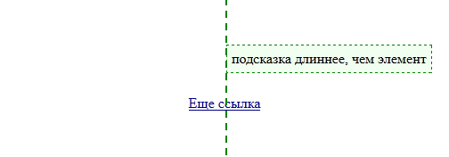
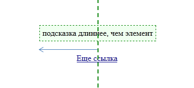

# Подсказки

Функция показа подсказки должна при первом показе сгенерировать элемент с подсказкой, а затем -- показать в нужном месте страницы. 

Обсудим, как это сделать.

Для генерации подсказки добавим вспомогательную функцию `getTooltipElem()`. Она будет возвращать существующий элемент, если он есть, а если нет -- генерировать новый.

```js
function getTooltipElem() {
  if (!tooltipElem) {
    tooltipElem = $('<div/>', {
      "class" : 'tooltip',
      html: html
    });
  }
  return tooltipElem;
}
```

**Основная настройка вида подсказки -- в CSS-классе `tooltip`.**

Например:

```css
.tooltip {
  position:absolute;
  z-index:100; /* подсказка должна перекрывать другие элементы */
  padding: 10px 20px;

  /* красивости... */
  border: 1px solid #b3c9ce;
  border-radius: 4px;
  text-align: center;
  font: italic 14px/1.3 arial, sans-serif; 
  color: #333;
  background: #fff;
  box-shadow: 3px 3px 3px rgba(0,0,0,.3);
}
```

**Как правильно отпозиционировать подсказку? Для начала, по горизонтали.**

Центр подсказки должен быть ровно над центром элемента, который имеет координату `elem.offset().left + elem.outerWidth()/2`.

Если поставить `tooltipElem.left` в это значение -- результат будет выглядеть так:


```js
tooltipElem.left = elem.offset().left + elem.outerWidth()/2
```

Дополнительно нужно сдвинуть подсказку на половину собственной ширины влево:



```js
left -= tooltipElem.outerWidth()/2;
```

**Теперь отпозиционируем по вертикали.**

Это гораздо проще: нужно взять координату Y элемента и вычесть из неё высоту подсказки и дополнительный отступ.

```js
elemCoords.top - tooltipElem.outerHeight() - 10
```

# Проверка решения

Проверьте, пожалуйста, ваше решение на предмет возможных ошибок:

<ul>
<li>Подсказка корректно работает при прокрутке?</li>
<li>Не используете ли вы события `mouseout/mouseover`? Лучше -- `mouseenter/mouseleave` (или, более кратко в jQuery: `hover`).</li>
<li>Вторая подсказка с `offset:0` расположена сразу над элементом, а не как первая.</li>
<li>Элемент с подсказкой генерируется динамически, при наведении, а не когда подсказка только создаётся?</li>
<li>Элемент с подсказкой *позиционируется* при показе, а не при создании? Ведь элемент, на котором стоит подсказка, может менять своё положение.</li>
</ul>

