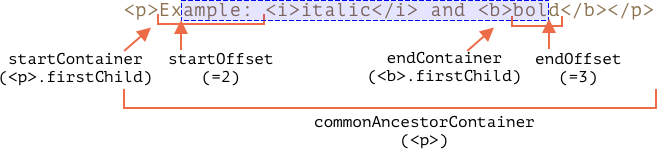
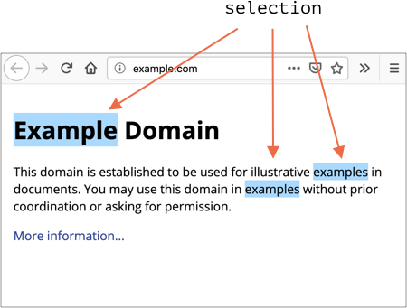
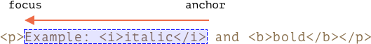

libs:
  - d3
  - domtree

---

# Selection and Range

In this chapter we'll cover text selection.

JavaScript can do everything with it: get the existing selection, select/deselect it or its parts, remove the selected part from the document, wrap it into a tag, and so on.

You can get a few ready to use recipes at the end, in "Summary" section. But you'll get much more if you read on. The underlying `Range` and `Selection` objects are easy to grasp, and then you'll need no recipes to make them do what you want.

## Range

The basic concept of selection is [Range](https://dom.spec.whatwg.org/#ranges): basically, a pair of "boundary points": range start and range end.

Each point represented as a parent DOM node with the relative offset from its start. For an element node, the offset is a child number, for a text node it's the position in the text.

First, we can create a range (the constructor has no parameters):

```js
let range = new Range();
```

Then we can set the boundaries using `range.setStart(node, offset)` and `range.setEnd(node, offset)`.

For example, consider this fragment of HTML:

```html
<p id="p">Example: <i>italic</i> and <b>bold</b></p>
```

Here's its DOM structure, note that here text nodes are important for us:

<div class="select-p-domtree"></div>

<script>
let selectPDomtree = {
  "name": "P",
  "nodeType": 1,
  "children": [{
    "name": "#text",
    "nodeType": 3,
    "content": "Example: "
  }, {
    "name": "I",
    "nodeType": 1,
    "children": [{
      "name": "#text",
      "nodeType": 3,
      "content": "italic"
    }]
  }, {
    "name": "#text",
    "nodeType": 3,
    "content": " and "
  }, {
    "name": "B",
    "nodeType": 1,
    "children": [{
      "name": "#text",
      "nodeType": 3,
      "content": "bold"
    }]
  }]
}

drawHtmlTree(selectPDomtree, 'div.select-p-domtree', 690, 320);
</script>

Let's select `"Example: <i>italic</i>"`. That's two first children of `<p>` (counting text nodes):


```html run
<p id="p">Example: <i>italic</i> and <b>bold</b></p>

<script>
*!*
  let range = new Range();

  range.setStart(p, 0);
  range.setEnd(p, 2);
*/!*

  // toString of a range returns its content as text (without tags)
  alert(range); // Example: italic

  // apply this range for document selection (explained later)
  document.getSelection().addRange(range);
</script>
```

- `range.setStart(p, 0)` -- sets the start at the 0th child of `<p>` (that's a text node `"Example: "`).
- `range.setEnd(p, 2)` -- spans the range up to (but not including) 2nd child of `<p>` (that's a text node `" and "`, but as the end is not included, so the last selected node is `<i>`).

Here's a more flexible test stand where you try more variants:

```html run autorun
<p id="p">Example: <i>italic</i> and <b>bold</b></p>

From <input id="start" type="number" value=1> – To <input id="end" type="number" value=4>
<button id="button">Click to select</button>
<script>
  button.onclick = () => {
  *!*
    let range = new Range();

    range.setStart(p, start.value);
    range.setEnd(p, end.value);
  */!*

    // apply the selection, explained later
    document.getSelection().removeAllRanges();
    document.getSelection().addRange(range);
  };
</script>
```

E.g. selecting from `1` to `4` gives range `<i>italic</i> and <b>bold</b>`.


We don't have to use the same node in `setStart` and `setEnd`. A range may span across many unrelated nodes.

### Selecting parts of text nodes

Let's select the text partially, like this:


That's also possible, we just need to set the start and the end as a relative offset in text nodes.

We need to create a range, that:
- starts from position 2 in `<p>` first child (taking all but two first letters of "Ex<b>ample:</b> ")
- ends at the position 3 in `<b>` first child (taking first three letters of "<b>bol</b>d"):

```html run
<p id="p">Example: <i>italic</i> and <b>bold</b></p>

<script>
  let range = new Range();

  range.setStart(p.firstChild, 2);
  range.setEnd(p.querySelector('b').firstChild, 3);

  alert(range); // ample: italic and bol

  // use this range for selection (explained later)
  window.getSelection().addRange(range);
</script>
```

The range object has following properties:



- `startContainer`, `startOffset` -- node and offset of the start,
  - in the example above: first text node inside `<p>` and `2`.
- `endContainer`, `endOffset` -- node and offset of the end,
  - in the example above: first text node inside `<b>` and `3`.
- `collapsed` -- boolean, `true` if the range starts and ends on the same point (so there's no content inside the range),
  - in the example above: `false`
- `commonAncestorContainer` -- the nearest common ancestor of all nodes within the range,
  - in the example above: `<p>`

## Range methods

There are many convenience methods to manipulate ranges.

Set range start:

- `setStart(node, offset)` set start at: position `offset` in `node`
- `setStartBefore(node)` set start at: right before `node`
- `setStartAfter(node)` set start at: right after `node`

Set range end (similar methods):

- `setEnd(node, offset)` set end at: position `offset` in `node`
- `setEndBefore(node)` set end at: right before `node`
- `setEndAfter(node)` set end at: right after `node`

**As it was demonstrated, `node` can be both a text or element node: for text nodes `offset` skips that many of characters, while for element nodes that many child nodes.**

Others:
- `selectNode(node)` set range to select the whole `node`
- `selectNodeContents(node)` set range to select the whole `node` contents
- `collapse(toStart)` if `toStart=true` set end=start, otherwise set start=end, thus collapsing the range
- `cloneRange()` creates a new range with the same start/end

To manipulate the content within the range:

- `deleteContents()` - remove range content from the document
- `extractContents()` - remove range content from the document and return as [DocumentFragment](info:modifying-document#document-fragment)
- `cloneContents()` - clone range content and return as [DocumentFragment](info:modifying-document#document-fragment)
- `insertNode(node)` -- insert `node` into the document at the beginning of the range
- `surroundContents(node)` -- wrap `node` around range content. For this to work, the range must contain both opening and closing tags for all elements inside it: no partial ranges like `<i>abc`.

With these methods we can do basically anything with selected nodes.

Here's the test stand to see them in action:

```html run autorun height=260
Click buttons to run methods on the selection, "resetExample" to reset it.

<p id="p">Example: <i>italic</i> and <b>bold</b></p>

<p id="result"></p>
<script>
  let range = new Range();

  // Each demonstrated method is represented here:
  let methods = {
    deleteContents() {
      range.deleteContents()
    },
    extractContents() {
      let content = range.extractContents();
      result.innerHTML = "";
      result.append("extracted: ", content);
    },
    cloneContents() {
      let content = range.cloneContents();
      result.innerHTML = "";
      result.append("cloned: ", content);
    },
    insertNode() {
      let newNode = document.createElement('u');
      newNode.innerHTML = "NEW NODE";
      range.insertNode(newNode);
    },
    surroundContents() {
      let newNode = document.createElement('u');
      try {
        range.surroundContents(newNode);
      } catch(e) { alert(e) }
    },
    resetExample() {
      p.innerHTML = `Example: <i>italic</i> and <b>bold</b>`;
      result.innerHTML = "";

      range.setStart(p.firstChild, 2);
      range.setEnd(p.querySelector('b').firstChild, 3);

      window.getSelection().removeAllRanges();  
      window.getSelection().addRange(range);  
    }
  };

  for(let method in methods) {
    document.write(`<div><button onclick="methods.${method}()">${method}</button></div>`);
  }

  methods.resetExample();
</script>
```

There also exist methods to compare ranges, but these are rarely used. When you need them, please refer to the [spec](https://dom.spec.whatwg.org/#interface-range) or [MDN manual](https://developer.mozilla.org/en-US/docs/Web/API/Range).


## Selection

`Range` is a generic object for managing selection ranges. We may create such objects, pass them around -- they do not visually select anything on their own.

The document selection is represented by `Selection` object, that can be obtained as `window.getSelection()` or `document.getSelection()`.

A selection may include zero or more ranges. At least, the [Selection API specification](https://www.w3.org/TR/selection-api/) says so. In practice though, only Firefox allows to select multiple ranges in the document by using `key:Ctrl+click` (`key:Cmd+click` for Mac).

Here's a screenshot of a selection with 3 ranges, made in Firefox:



Other browsers support at maximum 1 range per selection. As we'll see, some of `Selection` methods imply that there may be many ranges, but again, in all browsers except Firefox, there's at maximum 1.

## Selection properties

Similar to a range, a selection has a start, called "anchor", and the end, called "focus".

The main selection properties are:

- `anchorNode` -- the node where the selection starts,
- `anchorOffset` -- the offset in `anchorNode` where the selection starts,
- `focusNode` -- the node where the selection ends,
- `focusOffset` -- the offset in `focusNode` where the selection ends,
- `isCollapsed` -- `true` if selection selects nothing (empty range), or doesn't exist.
- `rangeCount` -- count of ranges in the selection, maximum `1` in all browsers except Firefox.

````smart header="Selection end may be in the document before start"
There are many ways to select the content, depending on the user agent: mouse, hotkeys, taps on a mobile etc.

Some of them, such as a mouse, allow the same selection can be created in two directions: "left-to-right" and "right-to-left".

If the start (anchor) of the selection goes in the document before the end (focus), this selection is said to have "forward" direction.

E.g. if the user starts selecting with mouse and goes from "Example" to "italic":


Otherwise, if they go from the end of "italic" to "Example", the selection is directed "backward", its focus will be before the anchor:



That's different from `Range` objects that are always directed forward: the range start can't be after its end.
````

## Selection events

There are events on to keep track of selection:

- `elem.onselectstart` -- when a selection starts.
    - May trigger on any element.
    - Preventing default action makes the selection not start.
- `document.onselectionchange` -- when a selection changes.
    - Triggers only on `document`.

## Selection tracking demo

Here's a small demo that shows selection boundaries
dynamically as it changes:

```html run height=80
<p id="p">Select me: <i>italic</i> and <b>bold</b></p>

From <input id="from" disabled> – To <input id="to" disabled>
<script>
  document.onselectionchange = function() {
    let {anchorNode, anchorOffset, focusNode, focusOffset} = document.getSelection();

    from.value = `${anchorNode && anchorNode.data}:${anchorOffset}`;
    to.value = `${focusNode && focusNode.data}:${focusOffset}`;
  };
</script>
```

To get the whole selection:
- As text: just call `document.getSelection().toString()`.
- As DOM nodes: get the underlying ranges and call their `cloneContents()` method (only first range if we don't support Firefox multiselection).

And here's the demo of getting the selection both as text and as DOM nodes:

```html run height=100
<p id="p">Select me: <i>italic</i> and <b>bold</b></p>

Cloned: <span id="cloned"></span>
<br>
As text: <span id="astext"></span>

<script>
  document.onselectionchange = function() {
    let selection = document.getSelection();

    cloned.innerHTML = astext.innerHTML = "";

    // Clone DOM nodes from ranges (we support multiselect here)
    for (let i = 0; i < selection; i++) {
      cloned.append(selection.getRangeAt(i).cloneContents());
    }

    // Get as text
    astext.innerHTML += selection;
  };
</script>
```

## Selection methods

Selection methods to add/remove ranges:

- `getRangeAt(i)` -- get i-th range, starting from `0`. In all browsers except firefox, only `0` is used.
- `addRange(range)` -- add `range` to selection. All browsers except Firefox ignore the call, if the selection already has an associated range.
- `removeRange(range)` -- remove `range` from the selection.
- `removeAllRanges()` -- remove all ranges.
- `empty()` -- alias to `removeAllRanges`.

Also, there are methods to manipulate the selection range directly:

- `collapse(node, offset)` -- replace selected range with a new one that starts and ends at the given `node`, at position `offset`.
- `setPosition(node, offset)` -- alias to `collapse`.
- `collapseToStart()` - collapse (replace with an empty range) to selection start,
- `collapseToEnd()` - collapse to selection end,
- `extend(node, offset)` - move focus of the selection to the given `node`, position `offset`,
- `setBaseAndExtent(anchorNode, anchorOffset, focusNode, focusOffset)` - replace selection range with the given anchor and focus. All content in-between them is selected.
- `selectAllChildren(node)` -- select all children of the `node`.
- `deleteFromDocument()` -- remove selected content from the document.
- `containsNode(node, allowPartialContainment = false)` -- checks whether the selection contains `node` (partically if the second argument is `true`)

So, for many tasks we can call `Selection` methods, no need to access the underlying `Range` object.

For example, selecting the whole contents of the paragraph:

```html run
<p id="p">Select me: <i>italic</i> and <b>bold</b></p>

<script>
  // select from 0th child of <p> to the last child
  document.getSelection().setBaseAndExtent(p, 0, p, p.childNodes.length);
</script>
```

The same thing using ranges:

```html run
<p id="p">Select me: <i>italic</i> and <b>bold</b></p>

<script>
  let range = new Range();
  range.selectNodeContents(p); // or selectNode(p) to select the <p> tag too

  document.getSelection().removeAllRanges(); // clear existing selection if any
  document.getSelection().addRange(range);
</script>
```

```smart header="To select, remove the existing selection first"
If the selection already exists, empty it first with `removeAllRanges()`. And then add ranges. Otherwise, all browsers except Firefox ignore new ranges.

The exception is some selection methods, that replace the existing selection, like `setBaseAndExtent`.
```

## Selection in form controls

Form elements, such as `input` and `textarea` provide [API for selection in their values](https://html.spec.whatwg.org/#textFieldSelection).

As the value is a pure text, not HTML, these methods to not use `Selection` or `Range` objects, they are much simpler.

- `input.select()` -- selects everything in the text control,
- `input.selectionStart` -- position of selection start (writeable),
- `input.selectionEnd` -- position of selection start (writeable),
- `input.selectionDirection` -- direction, one of: "forward", "backward" or "none" (if e.g. selected with a double mouse click),
- `input.setSelectionRange(start, end, [direction])` -- change the selection to span from `start` till `end`, in the given direction (optional).

To modify the content of the selection:

- `input.setRangeText(replacement, [start], [end], [selectionMode])` -- replace a range of text with the new text. If the `start` and `end` arguments are not provided, the range is assumed to be the selection.

The last argument, `selectionMode`, determines how the selection will be set after the text has been replaced. The possible values are:

- `"select"` -- the newly inserted text will be selected.
- `"start"` -- the selection range collapses just before the inserted text.
- `"end"` -- the selection range collapses just after the inserted text.
- `"preserve"` -- attempts to preserve the selection. This is the default.

For example, this code uses `onselect` event to track selection:

```html run
<textarea id="area" style="width:80%;height:60px">Select this text</textarea>
<br>
From <input id="from" disabled> – To <input id="to" disabled>

<script>
  area.onselect = function() {
    from.value = area.selectionStart;
    to.value = area.selectionEnd;
  };
</script>
```

The `document.onselectionchange` event should not trigger for selections inside a form control, according to the [spec](https://w3c.github.io/selection-api/#dfn-selectionchange), as it's not related to `document` selection and ranges. Some browsers generate it though.

**When nothing is selected, `selectionStart` and `selectionEnd` both equal the cursor position.**

Or, to rephrase, when nothing is selected, the selection is collapsed at cursor position.

We can use it to move cursor:

```html run
<textarea id="area" style="width:80%;height:60px">
Focus on me, the cursor will be at position 10.
</textarea>

<script>
  area.onfocus = () => {
    // zero delay setTimeout is needed
    // to trigger after browser focus action
    setTimeout(() => {
      // we can set any selection
      // if start=end, the cursor it exactly at that place
      area.selectionStart = area.selectionEnd = 10;
    });
  };
</script>
```

...Or to insert something "at the cursor" using `setRangeText`.

Here's an button that replaces the selection with `"TEXT"` and puts the cursor immediately after it. If the selection is empty, the text is just inserted at the cursor position:

```html run
<textarea id="area" style="width:80%;height:60px">Select something here</textarea>
<br>

<button id="button">Insert!</button>

<script>
  button.onclick = () => {
    // replace range with TEXT and collapse the selection at its end
    area.setRangeText("TEXT", area.selectionStart, area.selectionEnd, "end");
  };    
</script>
</body>
```


## Making unselectable

To make something unselectable, there are three ways:

1. Use CSS property `user-select: none`.

    ```html run
    <style>
    #elem {
      user-select: none;
    }
    </style>
    <div>Selectable <div id="elem">Unselectable</div> Selectable</div>
    ```

    This doesn't allow the selection to start at `elem`. But the user may start the selection elsewhere and include `elem` into it.

    Then `elem` will become a part of `document.getSelection()`, so the selection actully happens, but its content is usually ignored in copy-paste.


2. Prevent default action in `onselectstart` or `mousedown` events.

    ```html run
    <div>Selectable <div id="elem">Unselectable</div> Selectable</div>

    <script>
      elem.onselectstart = () => false;
    </script>
    ```

    This prevents starting the selection on `elem`, but the visitor may start it at another element, then extend to `elem`.

    That's convenient when there's another event handler on the same action that triggers the select. So we disable the selection to avoid conflict.

    And `elem` contents still be copied.

3. We can also clear the selection post-factum after it happens with `document.getSelection().empty()`. That's rarely used, as this causes unwanted blinking as the selection appears-disappears.

## References

- [DOM spec: Range](https://dom.spec.whatwg.org/#ranges)
- [Selection API](https://www.w3.org/TR/selection-api/#dom-globaleventhandlers-onselectstart)
- [HTML spec: APIs for the text control selections](https://html.spec.whatwg.org/multipage/form-control-infrastructure.html#textFieldSelection)


## Summary

We covered two different APIs for selections:

1. For document: `Selection` and `Range` objects.
2. For `input`, `textarea`: additional methods and properties.

The second API is very simple, as it works with text.

The most used recipes are probably:

1. Getting the selection:
    ```js run
    let selection = document.getSelection();

    // then apply Range methods to selection.getRangeAt(0)
    // or to all ranges if supporting multi-select
    for (let i = 0; i < selection; i++) {
      cloned.append(selection.getRangeAt(i).cloneContents());
    }
    ```
2. Setting the selection
    ```js run
    let selection = document.getSelection();

    // directly:
    selection.setBaseAndExtent(...from...to...);

    // or create range and:
    selection.removeAllRanges();
    selection.addRange(range);
    ```

Another important thing to know about selection: the cursor position in editable elements, like `<textarea>` is always at the start or the end of the selection.

We can use it both to get cursor position and to move the cursor by setting `elem.selectionStart` and `elem.selectionEnd`.
