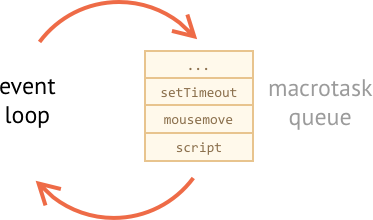

# Event loop: microtasks and macrotasks

Browser JavaScript execution flow, as well as in Node.js, is based on an *event loop*.

Understanding how event loop works is important for optimizations, and sometimes for the right architecture.

In this chapter we first cover theoretical details about how things work, and then see practical applications of that knowledge.

## Event Loop

The concept of *event loop* is very simple. There's an endless loop, when JavaScript engine waits for tasks, executes them and then sleeps waiting for more tasks.

1. While there are tasks:
    - execute the oldest task.
2. Sleep until a task appears, then go to 1.

That's a formalized algorithm for what we see when browsing a page. JavaScript engine does nothing most of the time, only runs if a script/handler/event activates.

A task can be JS-code triggered by events, but can also be something else, e.g.:

- When an external script `<script src="...">` loads, the task is to execute it.
- When a user moves their mouse, the task is to dispatch `mousemove` event and execute handlers.
- When the time is due for a scheduled `setTimeout`, the task is to run its callback.
- ...and so on.

Tasks are set -- the engine handles them -- then waits for more tasks (while sleeping and consuming close to zero CPU).

It may happen that a task comes while the engine is busy, then it's enqueued.

The tasks form a queue, so-called "macrotask queue" (v8 term):



For instance, while the engine is busy executing a `script`, a user may move their mouse causing `mousemove`, and `setTimeout` may be due and so on, these tasks form a queue, as illustrated on the picture above.

Tasks from the queue are processed on "first come – first served" basis. When the engine browser finishes with `fetch`, it handles `mousemove` event, then `setTimeout` handler, and so on.

So far, quite simple, right?

Two more details:
1. Rendering never happens while the engine executes a task.

    Doesn't matter if the task takes a long time. Changes to DOM are painted only after the task is complete.
2. If a task takes too long, the browser can't do other tasks, process user events, so after a time it suggests "killing" it.

    Usually, the whole page dies with the task.

Now let's see how we can apply that knowledge.

## Use-case: splitting CPU-hungry tasks

Let's say we have a CPU-hungry task.

For example, syntax-highlighting (used to colorize code examples on this page) is quite CPU-heavy. To highlight the code, it performs the analysis, creates many colored elements, adds them to the document -- for a big text that takes a lot.

While the engine is busy with syntax highlighting, it can't do other DOM-related stuff, process user events, etc. It may even cause the browser to "hang", which is unacceptable.

So we can split the long text into pieces. Highlight first 100 lines, then schedule another 100 lines using zero-delay `setTimeout`, and so on.

To demonstrate the approach, for the sake of simplicity, instead of syntax-highlighting let's take a function that counts from `1` to `1000000000`.

If you run the code below, the engine will "hang" for some time. For server-side JS that's clearly noticeable, and if you are running it in-browser, then try to click other buttons on the page -- you'll see that no other events get handled until the counting finishes.

```js run
let i = 0;

let start = Date.now();

function count() {

  // do a heavy job
  for (let j = 0; j < 1e9; j++) {
    i++;
  }

  alert("Done in " + (Date.now() - start) + 'ms');
}

count();
```

The browser may even show "the script takes too long" warning (but hopefully it won't, because the number is not very big).

Let's split the job using nested `setTimeout`:

```js run
let i = 0;

let start = Date.now();

function count() {

  // do a piece of the heavy job (*)
  do {
    i++;
  } while (i % 1e6 != 0);

  if (i == 1e9) {
    alert("Done in " + (Date.now() - start) + 'ms');
  } else {
    setTimeout(count); // schedule the new call (**)
  }

}

count();
```

Now the browser interface is fully functional during the "counting" process.

A single run of `count` does a part of the job `(*)`, and then re-schedules itself `(**)` if needed:

1. First run counts: `i=1...1000000`.
2. Second run counts: `i=1000001..2000000`.
3. ...and so on.

Pauses between `count` executions provide just enough "air" for the JavaScript engine to do something else, to react on other user actions.

The notable thing is that both variants -- with and without splitting the job by `setTimeout` -- are comparable in speed. There's no much difference in the overall counting time.

To make them closer, let's make an improvement.

We'll move the scheduling in the beginning of the `count()`:

```js run
let i = 0;

let start = Date.now();

function count() {

  // move the scheduling at the beginning
  if (i < 1e9 - 1e6) {
    setTimeout(count); // schedule the new call
  }

  do {
    i++;
  } while (i % 1e6 != 0);

  if (i == 1e9) {
    alert("Done in " + (Date.now() - start) + 'ms');
  }

}

count();
```

Now when we start to `count()` and see that we'll need to `count()` more, we schedule that immediately, before doing the job.

If you run it, it's easy to notice that it takes significantly less time.

Why?  

That's simple: remember, there's the in-browser minimal delay of 4ms for many nested `setTimeout` calls. Even if we set `0`, it's `4ms` (or a bit more). So the earlier we schedule it - the faster it runs.

## Use case: progress bar

Another benefit of splitting heavy tasks for browser scripts is that we can show a progress bar.

Usually the browser renders after the currently running code is complete. Doesn't matter if the task takes a long time. Changes to DOM are painted only after the task is finished.

From one hand, that's great, because our function may create many elements, add them one-by-one to the document and change their styles -- the visitor won't see any "intermediate", unfinished state. An important thing, right?

Here's the demo, the changes to `i` won't show up until the function finishes, so we'll see only the last value:


```html run
<div id="progress"></div>

<script>

  function count() {
    for (let i = 0; i < 1e6; i++) {
      i++;
      progress.innerHTML = i;
    }
  }

  count();
</script>
```

...But we also may want to show something during the task, e.g. a progress bar.

If we use `setTimeout` to split the heavy task into pieces, then changes are painted out in-between them.

This looks better:

```html run
<div id="progress"></div>

<script>
  let i = 0;

  function count() {

    // do a piece of the heavy job (*)
    do {
      i++;
      progress.innerHTML = i;
    } while (i % 1e3 != 0);

    if (i < 1e7) {
      setTimeout(count);
    }

  }

  count();
</script>
```

Now the `<div>` shows increasing values of `i`, a kind of a progress bar.


## Use case: doing something after the event

In an event handler we may decide to postpone some actions until the event bubbled up and was handled on all levels. We can do that by wrapping the code in zero delay `setTimeout`.

In the chapter <info:dispatch-events> we saw an example: a custom event `menu-open` is dispatched after the "click" event is fully handled.

```js
menu.onclick = function() {
  // ...

  // create a custom event with the clicked menu item data
  let customEvent = new CustomEvent("menu-open", {
    bubbles: true
    /* details: can add more details, e.g. clicked item data here */
  });

  // dispatch the custom event asynchronously
  setTimeout(() => menu.dispatchEvent(customEvent));
};
```

The custom event is totally independent here. It's dispatched asynchronously, after the `click` event bubbled up and was fully handled. That helps to workaround some potential bugs, that may happen when different events are nested in each other.

## Microtasks

Along with *macrotasks*, described in this chapter, there exist *microtasks*, mentioned in the chapter <info:microtask-queue>.

There are two main ways to create a microtask:

1. When a promise is ready, the execution of its `.then/catch/finally` handler becomes a microtask. Microtasks are used "under the cover" of `await` as well, as it's a form of promise handling, similar to `.then`, but syntactically different.
2. There's a special function `queueMicrotask(func)` that queues `func` for execution in the microtask queue.

After every *macrotask*, the engine executes all tasks from *microtask* queue, prior to running any other macrotasks.

**Microtask queue has a higher priority than the macrotask queue.**

For instance, take a look:

```js run
setTimeout(() => alert("timeout"));

Promise.resolve()
  .then(() => alert("promise"));

alert("code");
```

What's the order?

1. `code` shows first, because it's a regular synchronous call.
2. `promise` shows second, because `.then` passes through the microtask queue, and runs after the current code.
3. `timeout` shows last, because it's a macrotask.

**There may be no UI event between microtasks.**

Most of browser processing is macrotasks, including processing network request results, handling UI events and so on.

So if we'd like our code to execute asynchronously, but want the application state be basically the same (no mouse coordinate changes, no new network data, etc), then we can achieve that by creating a microtask with `queueMicrotask`.

Rendering also waits until the microtask queue is emptied.

Here's an example with a "counting progress bar", similar to the one shown previously, but `queueMicrotask` is used instead of `setTimeout`. You can see that it renders at the very end, just like the regular code:

```html run
<div id="progress"></div>

<script>
  let i = 0;

  function count() {

    // do a piece of the heavy job (*)
    do {
      i++;
      progress.innerHTML = i;
    } while (i % 1e3 != 0);

    if (i < 1e6) {
  *!*
      queueMicrotask(count);
  */!*
    }

  }

  count();
</script>
```

So, microtasks are asynchronous from the point of code execution, but they don't allow any browser processes or events to stick in-between them.

## Summary

The richer event loop picture may look like this:


The more detailed algorithm of the event loop (though still simplified compare to the [specification](https://html.spec.whatwg.org/multipage/webappapis.html#event-loop-processing-model)):

1. Dequeue and run the oldest task from the *macrotask* queue (e.g. "script").
2. Execute all *microtasks*:
    - While the microtask queue is not empty:
        - Dequeue and run the oldest microtask.
3. Render changes if any.
4. Wait until the macrotask queue is not empty (if needed).
5. Go to step 1.

To schedule a new macrotask:
- Use zero delayed `setTimeout(f)`.

That may be used to split a big calculation-heavy task into pieces, for the browser to be able to react on user events and show progress between them.

Also, used in event handlers to schedule an action after the event is fully handled (bubbling done).

To schedule a new microtask:
- Use `queueMicrotask(f)`.
- Also promise handlers go through the microtask queue.

There's no UI or network event handling between microtasks: they run immediately one after another.

So one may want to `queueMicrotask` to execute a function asynchronously, but also with the same application state.
