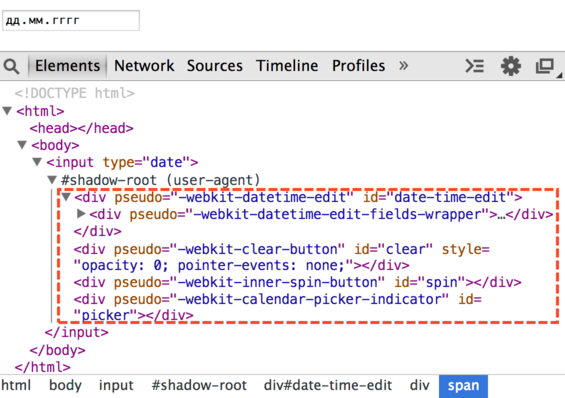
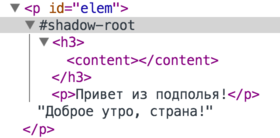

# Shadow DOM

Спецификация [Shadow DOM](http://w3c.github.io/webcomponents/spec/shadow/index.html) готовится как отдельный стандарт и применяется, в том числе, отдельно от веб-компонентов.

*Shadow DOM* -- это внутренний DOM элемента, который существует отдельно от внешнего документа. В нём могут быть свои ID, свои стили и так далее. Причём снаружи оно, без применения специальных техник, не видно, поэтому не возникает конфликтов.
[cut]

## Внутри браузера

Концепция Shadow DOM начала применяться довольно давно внутри самих браузеров. Когда браузер показывает сложные элементы управления, наподобие слайдера `<input type="range">` или календаря `<input type="date">` -- внутри себя он конструирует их из самых обычных стилизованных `<div>`, `<span>` и так далее. 

С первого взгляда они незаметны, но если в настройках Chrome Development Tools выбрать показ Shadow DOM, то их можно легко увидеть.

Например, вот такое содержимое будет у `<input type="date">`:


То, что находится под `shadow-root` -- это и есть Shadow DOM. 

**Получить элементы из Shadow DOM можно только при помощи специальных JavaScript-вызовов или селекторов. Это не обычные дети, а намного более мощное средство отделения содержимого.**

В Shadow DOM выше можно увидеть полезный атрибут `pseudo`. С его помощью можно стилизовать подэлементы через CSS.

Например, сделаем поле редактирования даты красным:

```html
<!--+ run -->
<style>
*!*
input::-webkit-datetime-edit {
*/!*
  background: red;
}
</style>

<input type="date">
```

Если говорить хронологически, то сначала браузеры начали экспериментировать внутри себя с инкапсуляцией внутренних DOM-структур, а уже потом, через некоторое время, появился стандарт Shadow DOM, который позволяет делать то же самое разработчикам.

## Создание Shadow DOM

Shadow DOM можно создать внутри любого элемента вызовом `elem.createShadowRoot()`.

Например:

```html
<!--+ run -->
<p id="elem">Доброе утро, страна!</p>

<script>
  var root = elem.createShadowRoot();
  root.innerHTML = "<p>Привет из подполья!</p>";
</script>
```

Если вы запустите этот пример, то увидите, что изначальное содержимое элемента куда-то исчезло и показывается только "Привет из подполья!". Это потому, что у элемента есть Shadow DOM. 

**С момента создания Shadow DOM обычное содержимое (дети) элемента не отображается, а показывается только Shadow DOM.**

Внутрь этого Shadow DOM, при желании, можно поместить обычное содержимое. Для этого нужно указать, куда, то есть "точку вставки" (insertion point). Это делается при помощи тега `<content>`.

Укажем его:

```html
<!--+ run -->
<p id="elem">Доброе утро, страна!</p>

<script>
  var root = elem.createShadowRoot();
  root.innerHTML = "<h3>*!*<content></content>*/!*</h3> <p>Привет из подполья!</p>";
</script>
```

Теперь, если у вас последний Chrome, вы увидите две строчки: "Доброе утро, страна!" в заголовке, а затем "Привет из подполья".

Shadow DOM примера выше в инструментах разработки:



Важные детали:
<ul>
<li>Тег `<content>` влияет только на отображение, он не перемещает узлы физически. Как видно из картинки выше, текстовый узел  "Доброе утро, страна!" остался внутри `p#elem`. Его можно даже получить при помощи `elem.firstElementChild`. </li>
<li>Внутри `<content>` показывается не `<p>`, а его содержимое, то есть в данном случае текст "Привет из подполья".</li>
</ul>

**Атрибутом `select` можно указать конкретный селектор содержимого, которое нужно переносить. Например, `<content select="h3"></content>` перенесёт только заголовки.**

Внутри Shadow DOM можно использовать `<content>` много раз, указывая таким образом, где конкретно какие части исходного содержимого разместить, но при этом дублирование узлов невозможно. Если узел показан в одном `<content>`, то в следующем он будет пропущен.

Например, если сначала идёт `<content select="h3.big">`, а затем `<content select="h3">`, то в первом `<content>` будут показаны заголовки `<h3>` с классом `big`, а во втором -- все остальные.</li>

**Содержимое внутри `<content>...</content>` будет показано только в том случае, если узлов для вставки нет.**

Ещё пример:

```html
<!--+ run -->
  
<section id="elem">
  <h1>Новости</h1>
  <article>Жили-были <i>старик со старухой</i>, но недавно...</article>
</section>

<script>
  var root = elem.createShadowRoot();
  root.innerHTML = "<content select='h1'></content> \
   <content select='.author'>Без автора.</content> \
   <content></content>";
  
  alert(elem.innerHTML);
  
</script>
```

При запуске мы увидим, что:
<ul>
<li>Первый `<content select='h1'>` выведет заголовок.</li>
<li>Второй `<content select=".author">` вывел бы автора, но так как такого элемента нет -- выводится содержимое самого `<content select=".author">`.</li> 
<li>Третий `<content>` выведет остальное содержимое (уже без заголовка `<h1>`, он выведен ранее!)</li>
</ul>

Ещё раз обратим внимание, что `<content>` физически не перемещает узлы по DOM. Он только показывает, где их отображать, а также, как мы увидим далее, влияет на применение стилей. Поэтому в примере выше `innerHTML` выведет содержимое `elem`, как если бы не было никакого Shadow DOM.

## Корень shadowRoot

После создания корень внутреннего DOM-дерева доступен как `elem.shadowRoot`. 

Он представляет собой специальный объект, поддерживающий основные методы CSS-запросов и подробно описанный в стандарте как [ShadowRoot](http://w3c.github.io/webcomponents/spec/shadow/#shadowroot-object).

Например:

```html
<!--+ run -->
<p id="elem">Доброе утро, страна!</p>

<script>
  var root = elem.createShadowRoot();
  root.innerHTML = "<h3><content></content></h3> <p>Привет из подполья!</p>";
</script>

<script>
*!*
  var root = elem.shadowRoot; // ...где-то в другом месте кода
  alert(root.querySelector('p').innerHTML); // Привет из подполья!
  alert(root.querySelector('content').innerHTML); // пусто, физически узлы - вне content 
*/!*
</script>
```

[warn header="Внутрь встроенных элементов так \"залезть\" нельзя"]
На момент написания статьи `shadowRoot` можно получить только для Shadow DOM, созданного описанным выше способом, но не встроенного, как в элементах типа `<input type="date">`.
[/warn]

## Шаблоны <template>

Элемент `<template>` предназначен для хранения "образца" разметки, предназначенного для вставки куда-либо.

Его отличие от обычных тегов в том, что его содержимое обрабатывается особым образом. Оно не показывается и считается находящимся вообще "вне документа".

Однако, вместе с тем, оно всё же парсится браузером и записывается в виде `DocumentFragment` в свойство `content`. Предполагается, что мы, при необходимости, возьмём фрагмент `content` и вставим, куда надо.

Пример использования:

```html
<!--+ run -->
  
<p id="elem">Доброе утро, страна!</p>

<template id="tmpl">
  <h3><content></content></h3> 
  <p>Привет из подполья!</p>
  <script> alert('Новость!'); </script>
</template>

<script>
  var root = elem.createShadowRoot();
  root.appendChild( tmpl.content.cloneNode(true) );
</script>
```

Детали:
<ul>
<li>В отличие от вставки через `innerHTML` и от обычного `DocumentFragment`, скрипт внутри шаблона выполнится при вставке. Содержимое шаблона изначально "вне документа" и "оживает", когда оно попадает в него. Это относится ко всему -- картинки начинают загружаться, видео -- проигрываться и т.п.</li>
<li>Вставляется не сам `tmpl.content`, а его клон. Это обычная практика, чтобы можно было использовать содержимое одного шаблона во многих однотипных элементах.</li>
</ul>

## Стили 

Стилизация Shadow DOM покрывается более общей спецификацией ["CSS Scoping"](http://drafts.csswg.org/css-scoping/). 

**По умолчанию стили внутри Shadow DOM относятся только к его содержимому.**

Например:

```html
<!--+ run -->
<p>Жили мы тихо-мирно, и тут...</p>

<p id="elem">Доброе утро, страна!</p>

<template id="tmpl">
*!*
  <style> p { color: red; } </style>
*/!*
  <h3><content></content></h3> 
  <p>Привет из подполья!</p>
</template>

<script>
  var root = elem.createShadowRoot();
  root.appendChild( tmpl.content.cloneNode(true) );
</script>
```

При запуске окрашенным в красный цвет окажется только `<p>` внутри Shadow DOM.

...Но при помощи специальных селекторов переходить через эту границу!

### Извне стиль для Shadow DOM

Если нужно со страницы стилизовать или выбрать элементы внутри Shadow DOM, то можно использовать селекторы:

<ul>
<li>**`::shadow` -- выбирает корень Shadow DOM.** 

Например, `#elem::shadow div` найдёт внутри Shadow DOM `#elem` элементы `div`.</li>
<li>**`/deep/` -- особого вида CSS-селектор для всех элементов Shadow DOM, который полностью игнорирует границы между DOM'ами, включая вложенные подэлементы, у которых тоже может быть свой Shadow DOM.**

Например, `#elem /deep/ span` найдёт все `span` внутри Shadow DOM `#elem`, но кроме того, если в `#elem` есть подэлементы, у которых свой Shadow DOM, то оно продолжит поиск в них.

Вот пример, когда внутри одного Shadow DOM есть `<input type="date">`, у которого тоже есть Shadow DOM:

```html
<!--+ run -->
<style>
##elem::shadow span {
  /* для span только внутри Shadow DOM #elem */
  text-decoration: underline;    
}

##elem /deep/ span {
  /* для span внутри Shadow DOM #elem и далее внутри input[type=date] */
  color: red; 
}
</style>

<p id="elem"></p>

<script>
  var root = elem.createShadowRoot();
  root.innerHTML = "<span>Текущее время:</span> <input type='date'>";
</script>
```

</li>
<li>Кроме того, на Shadow DOM действует CSS-наследование, если свойство поддерживает его по умолчанию.

В этом примере CSS-стили для `body` наследуются на внутренние элементы, включая Shadow DOM:

```html
<!--+ run autorun -->
<style>
  body {
    color: red;
    font-style: italic;
  }
</style>
<p id="elem"></p>
<script>
  elem.createShadowRoot().innerHTML = "<span>Привет, мир!</span>";
</script>
```

Внутренний элемент станет красным курсивом. 
</li>
</ul>

[warn header="Нельзя получить содержимое встроенных элементов"]
Описанные CSS-селекторы можно использовать не только в CSS, но и в `querySelector`. 

Исключением являются встроенные элементы типа `<input type="date">`, для которых CSS-селекторы работают, но  получить их содержимое нельзя.

Например:

```html
<!--+ run -->
<p id="elem"></p>

<script>
  var root = elem.createShadowRoot();
  root.innerHTML = "<span>Текущее время:</span> <input type='date'>";
  
  // выберет только span из #elem
  // вообще-то, должен выбрать и span из вложенных Shadow DOM,
  // но в текущей браузерной реализации для встроенных элементов - не умеет
  alert(document.querySelector('#elem /deep/ span').length); // 1
</script>
```

[/warn]

### Стиль Shadow DOM в зависимости от хозяина

Следующие селекторы позволяют выбрать элемент-хозяин:

<ul>
<li>**`:host` выбирает элемент-хозяин**, в котором, живёт Shadow DOM.</li>
<li>**`:host(селектор хозяина)` выбирает элемент-хозяин, если он подходит под селектор.**

Например:

```css
:host(.important) { 
  /* сработает, если хозяин имеет класс important */
}
```

Этот селектор используется для темизации хозяина "изнутри", в зависимости от его классов и атрибутов. 

**Хозяин :host выбирается в именно в контексте Shadow DOM.**

То есть, это доступ не к внешнему элементу, а, скорее, к корню текущего Shadow DOM.

После `:host(...)` мы можем указать селекторы и стили, которые нужно применить, если хозяин удовлетворяет тому или иному условию, например:

```html
<style> 
  :host p { color: green; } 
  :host(.important) p { color: red; } 
</style>
```

Эти селекторы сработают для `<p>` внутри Shadow DOM, причём второй -- только если у хозяина стоит класс `important`.
</li>
<li>**`:host-context(селектор хозяина)` выбирает элемент-хозяин, если какой-либо из его родителей удовлетворяет селектору.**

Например:

```css
:host-context(h1) p {
  /* селектор сработает для p, если хозяин находится внутри h1 */
}
```

Это используется для расширенной темизации, теперь уже не только в зависимости от его атрибутов, но и от того, внутри каких элементов он находится.
</li>
</ul>

Пример использования селектора `:host()` для темизации содержимого:

```html
<!--+ run autorun -->
*!*
<p class="message info">Доброе утро, страна!</p>
*/!*

*!*
<p class="message warning">Внимание-внимание! Говорит информбюро!</p>
*/!*

<template id="tmpl">
  <style>
  .content {
    min-height: 20px;
    padding: 19px;
    margin-bottom: 20px;
    background-color: #f5f5f5;
    border: 1px solid #e3e3e3;
    border-radius: 4px;
    box-shadow: inset 0 1px 1px rgba(0, 0, 0, .05);
  }

*!*
  :host(.info) .content {
    color: green;
  }
  
  :host(.warning) .content {
    color: red;
  }
*/!*
  
  </style>
  <div class="content"><content></content></div>
</template>

<script>
var elems = document.querySelectorAll('p.message');

elems[0].createShadowRoot().appendChild( tmpl.content.cloneNode(true) );
elems[1].createShadowRoot().appendChild( tmpl.content.cloneNode(true) );
</script>
```

### Стиль для содержимого <content>

Тег `<content>` не меняет DOM, а указывает, что где показывать. Поэтому если элемент изначально находится в элементе-хозяине -- внешний документ сохраняет к нему доступ.

К нему будут применены стили и сработают селекторы, всё как обычно.

Например, здесь применится стиль для `<span>`:

```html
<!--+ run -->
<style>
*!*
  span { text-decoration: underline; }
*/!*
</style>
    
<p id="elem"><span>Доброе утро, страна!</span></p>

<template id="tmpl">
  <h3><content></content></h3> 
  <p>Привет из подполья!</p>
</template>

<script>
  elem.createShadowRoot().appendChild( tmpl.content.cloneNode(true) );
</script>
```

В примере выше заголовок "Доброе утро, страна!", который пришёл как `<span>` из внешнего документа, будет подчёркнут, 

...Но, поскольку эти узлы показываются внутри Shadow DOM, то ему тоже может понадобится к ним доступ.

**Для обращения к "содержимому" `<content>` используется псевдоэлемент `::content`.**

Например, `content[select="h1"]::content span` найдёт элемент `<content select="h1">` и *в его содержимом* отыщет `<span>`. 

Селектор `::content` подразумевает `*::content`, так что `::content span` стилизует все `<span>` внутри всех `<content>`.

Например:

```html
<!--+ run -->
<style>
*!*
  span { text-decoration: underline; }
*/!*
</style>

<p id="elem"><span>Доброе утро, страна!</span></p>

<template id="tmpl">
  <style> 
*!*
    ::content span { color: green; } 
*/!*
  </style> 
  <h3><content></content></h3> 
  <p>Привет из подполья!</p>
</template>

<script>
  elem.createShadowRoot().appendChild( tmpl.content.cloneNode(true) );
</script>
```

Если запустить пример выше, то текст внутри `<h3>` станет зелёным и подчёркнутым одновременно. 

Приоритет селекторов расчитывается по [обычным правилам специфичности](http://www.w3.org/TR/css3-selectors/#specificity), если же приоритеты стилей на странице и в Shadow DOM и на странице равны, то, как описано в секции [Cascading](http://dev.w3.org/csswg/css-scoping/#cascading), побеждает страница, а для `!important`-стиля побеждает Shadow DOM.
</li>
</ul>

[summary]
Если обобщить -- инкапсуляция Shadow DOM имеет односторонний характер:
<ul>
<li>Изнутри Shadow DOM можно стилизовать только сам Shadow DOM и узлы, показываемые в `<content>`.</li>
<li>Со страницы можно иметь доступ и стилизовать элементы, изначально находящиеся внутри хозяина -- напрямую, а узлы внутри Shadow DOM -- при помощи селекторов `::shadow` и `/deep/`.</li>
</ul>
[/summary]


## Итого

Shadow DOM -- это средство для создания отдельного DOM-дерева внутри элемента, которое не видно снаружи без применения специальных методов.

<ul>
<li>Ряд браузерных элементов со сложной структурой уже имеют Shadow DOM.</li>
<li>Можно создать Shadow DOM внутри любого элемента вызовом `elem.createShadowRoot()`. В дальнейшем его корень будет доступен как `elem.shadowRoot`.</li>
<li>Как только у элемента появляется Shadow DOM, его изначальное содержимое скрывается. Теперь показывается только Shadow DOM, который может указать, какое содержимое хозяина куда вставлять, при помощи элемента `<content>`. Можно указать селектор `<content select="селектор">` и размещать разное содержимое в разных местах Shadow DOM.</li>
<li>Стили  и `querySelector`, объявленные внутри Shadow DOM, по умолчанию относятся только к его содержимому, могут обращаться к содержимому `<content>`, но не к основной странице.</li>
<li>Стили и `querySelector` с внешней страницы могут преодолевать границу между DOM при помощи селекторов `::shadow` и `/deep/`.</li>
</ul>

Спецификации, затрагивающие Shadow DOM:

<ul>
<li>[Shadow DOM](http://w3c.github.io/webcomponents/spec/shadow/) -- самая полная спецификация по свойствам и методам Shadow DOM, деталям обработки событий.</li>
<li>[Introduction to Web Components](http://w3c.github.io/webcomponents/explainer/) -- обо всём понемногу.</li>
<li>[CSS Scoping](http://drafts.csswg.org/css-scoping/) -- спецификация по CSS-селекторам, в том числе Shadow DOM.</li>
</ul>
