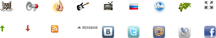

# CSS-спрайты 

CSS-спрайт -- способ объединить много изображений в одно, чтобы:
<ol>
<li>Cократить количество обращений к серверу.</li>
<li>Загрузить несколько изображений сразу, включая те, которые понадобятся в будущем.</li>
<li>Если у изображений сходная палитра, то объединённое изображение будет меньше по размеру, чем совокупность исходных картинок.</li>
</ol>
[cut]
Рассмотрим, как это работает, на примере дерева:

```html
<ul>
<li class="open">
  <div class="icon"></div>
  <div class="text">Раздел 1<br>В две строки</div>
  <ul>
  <li class="closed">
    <div class="icon"></div>
    <div class="text">Раздел 1.1 в одну строку</div>
  </li>
  <li class="leaf">
    <div class="icon"></div>
    <div class="text">Страница 1.2<br> в две строки</div>
  </li>
  </ul>
</li>
<li class="closed">
  <div class="icon"></div>
  <div class="text">Раздел 2<br>В две строки</div>
</li>
</ul>
```

[iframe src="sprite-tree-src" border=1 height=200 link edit]

Сейчас "плюс", "минус" и "статья" -- три отдельных изображения. Объединим их в спрайт.


## Шаг 1. Использовать background

Первый шаг к объединению изображений в "спрайт" -- показывать их через `background`., а не через тег `IMG`.

В данном случае он уже сделан. Стиль для дерева:

```css
.icon {
  width: 16px;
  height: 16px;
  float: left;
}

.open .icon {
  cursor: pointer;
  background: url(minus.gif);
}

.closed .icon {
  cursor: pointer;
  background: url(plus.gif);
}

.leaf .icon {
  cursor: text;
  background: url(article.gif);
}
```

## Шаг 2. Объединить изображения

Составим из нескольких изображений одно `icons.gif`, расположив их, например, по вертикали.

Из ,  и  получится одна картинка: 

## Шаг 3. Показать часть спрайта в "окошке"

А теперь самое забавное. Размер `DIV'а` для иконки -- жёстко фиксирован:

```css
.icon {
*!*
  width: 16px;
  height: 16px;
*/!*
  float: left;
}
```

Это значит, что если поставить `background'ом` объединённую картинку, то вся она не поместится, будет видна только верхняя часть:

[iframe src="sprite-tree-1" height=60 border=1]

Если бы высота иконки была больше, например, `16x48`, как в примере ниже, то было бы видно и остальное:

[iframe src="height48" height=80 border=1]
..Но так как там всего `16px`, то помещается только одно изображение.

## Шаг 4. Сдвинуть спрайт

Сдвиг фона `background-position` позволяет выбирать, какую именно часть спрайта видно.

В спрайте `icons.gif` изображения объединены так, что сдвиг на `16px` покажет следующую иконку:

```css
.icon {
  width: 16px;
  height: 16px;
  float: left;
  background: url(icons.gif) no-repeat;
}

.open .icon {
  background-position: 0 -16px; /* вверх на 16px */
  cursor: pointer;
}

.closed .icon {
  background-position: 0 0px; /* по умолчанию */
  cursor: pointer;
}

.leaf .icon {
  background-position: 0 -32px; /* вверх на 32px */
  cursor: text;
}
```

Результат:

[iframe src="sprite-tree" border=1 height=200 link edit]

<ul>
<li>В спрайт могут объединяться изображения разных размеров, т.е. сдвиг может быть любым.</li>
<li>Сдвигать можно и по горизонтали и по вертикали.</li>
</ul>

### Отступы

Обычно отступы делаются `margin/padding`, но иногда их бывает удобно предусмотреть в спрайте.

Тогда если элемент немного больше, чем размер изображения, то в "окошке" не появится лишнего.

Пример спрайта с отступами:



Иконка RSS находится в нём на координатах `(90px, 40px)`:


Это значит, что чтобы показать эту иконку, нужно сместить фон:

```css
background-position: -90px -40px;
```

При этом в левом-верхнем углу фона как раз и будет эта иконка:

[iframe src="sprite-example" border=1]

Элемент, в котором находится иконка (в рамке), больше по размеру, чем картинка. 

Его стиль:

```css
.rss {
  width: 35px; /* ширина/высота больше чем размер иконки */
  height: 35px;
  border: 1px solid black;
  float: left;
  background-image: url(sprite.png);
  background-position: -90px -40px;
}
```

Если бы в спрайте не было отступов, то в такое большое "окошко" наверняка влезли бы другие иконки.


## Итого

[smart header="Когда использовать для изображений `IMG`, а когда -- `CSS background`?"]

Решение лучше всего принимать, исходя из принципов семантической вёрстки.

Задайте вопрос -- что здесь делает изображение? Является ли оно самостоятельным элементом страницы (фотография, аватар посетителя), или же оформляет что-либо (иконка узла дерева)?

Элемент `IMG` следует использовать в первом случае, а для оформления у нас есть CSS.
[/smart]


Спрайты позволяют:
<ol>
<li>Cократить количество обращений к серверу.</li>
<li>Загрузить несколько изображений сразу, включая те, которые понадобятся в будущем.</li>
<li>Если у изображений сходная палитра, то объединённое изображение будет меньше по размеру, чем совокупность исходных картинок.</li>
</ol>

Если фоновое изображение нужно повторять по горизонтали или вертикали, то спрайты тоже подойдут -- изображения в них нужно располагать в этом случае так, чтобы при повторении не были видны соседи, т.е., соответственно, вертикально или горизонтально, но не "решёткой".

Далее мы встретимся со спрайтами при создании интерфейсов, чтобы кнопка при наведении меняла своё изображение. Один спрайт будет содержать все состояния кнопки, а переключение внешнего вида -- осуществляться при помощи сдвига `background-position`.

Для автоматизированной сборки спрайтов используются специальные инструменты, например <a href="http://csssprites.org/">SmartSprites</a>.