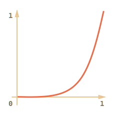
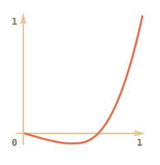
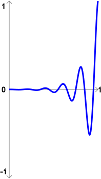
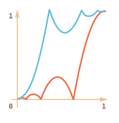

# JS-Анимация 

В этой главе мы рассмотрим устройство браузерной анимации. Она примерно одинаково реализована во всех фреймворках.

Понимание этого позволит разобраться в происходящем, если что-то вдруг не работает, а также написать сложную анимацию самому.

Анимация при помощи JavaScript и современная CSS-анимация дополняют друг друга.
[cut]

## Основы анимации   

С точки зрения HTML/CSS, анимация -- это постепенное изменение стиля  DOM-элемента. Например, увеличение координаты `style.left` от `0px` до `100px` сдвигает элемент.

Код, который производит изменение, вызывается таймером. Интервал таймера очень мал и поэтому анимация выглядит плавной. Это тот же принцип, что и в кино: для непрерывной анимации достаточно 24 или больше вызовов таймера в секунду.

Псевдо-код для анимации выглядит так:

```js
var timer = setInterval(function() {
    показать новый кадр 
    if (время вышло) clearInterval(timer);     
}, 10)
```

Задержка между кадрами в данном случае составляет `10 ms`, что означает `100` кадров в секунду. 

В большинстве фреймворков, задержка по умолчанию составляет `10`-`15` мс. Меньшая задержка делает анимацию более плавной, но только в том случае, если браузер достаточно быстр, чтобы анимировать каждый шаг вовремя. 

Если анимация требует большого количества вычислений, то нагрузка процессора может доходить до 100% и вызывать ощутимые "тормоза" в работе браузера. В 
таком случае, задержку можно увеличить. Например, 40мс дадут нам 25 кадров в секунду, что очень близко к кинематографическому стандарту в 24 кадра.

[smart header="`setInterval` вместо `setTimeout`"]
Мы используем `setInterval`, а не рекурсивный `setTimeout`, потому что нам нужен *один кадр за промежуток времени*, а не *фиксированная задержка между кадрами*</b>. 
В статье [](/setTimeout-setInterval) описана разница между `setInterval` и рекурсивным `setTimeout`.
[/smart]


### Пример

Например, передвинем элемент путём изменения `element.style.left` от 0 до 100px. Изменение происходит на 1px каждые 10мс.

```html
<script>
function move(elem) {

  var left = 0; // начальное значение

  function frame() { // функция для отрисовки
    left++;
    elem.style.left = left + 'px' 

    if (left == 100) { 
      clearInterval(timer); // завершить анимацию
    }
  }

  var timer = setInterval(frame, 10) // рисовать каждые 10мс
}
</script>

<div onclick="move(this.children[0])" class="example_path">
  <div class="example_block"></div>
</div>
```

Кликните для демонстрации:
[iframe height=60 src="move100" link]


## Структура анимации  

У анимации есть три основных параметра:
<dl>
<dt>`delay`</dt>
<dd>Время между кадрами (в миллисекундах, т.е. 1/1000 секунды). Например, 10мс.</dd>
<dt>`duration`</dt>
<dd>Общее время, которое должна длиться анимация, в мс. Например, 1000мс.</dd>
<dt>`step(progress)`</dt>
<dd>Функция **`step(progress)`** занимается отрисовкой состояния анимации, соответствующего времени `progress`.</dd>
</dl>

Каждый кадр выполняется, сколько времени прошло: `progress = (now-start)/duration`. Значение `progress` меняется от `0` в начале анимации до `1` в конце. Так как вычисления с дробными числами не всегда точны, то в конце оно может быть даже немного больше 1. В этом случае мы уменьшаем его до 1 и завершаем анимацию.

Создадим функцию `animate`, которая получает объект со свойствами `delay, duration, step` и выполняет анимацию.

```js
function animate(opts) {
  
  var start = new Date; // сохранить время начала 

  var timer = setInterval(function() {

    // вычислить сколько времени прошло
    var progress = (new Date - start) / opts.duration;
    if (progress > 1) progress = 1;

    // отрисовать анимацию
    opts.step(progress);
    
    if (progress == 1) clearInterval(timer); // конец :)
     
  }, opts.delay || 10); // по умолчанию кадр каждые 10мс

}
```

### Пример


Анимируем ширину элемента `width` от `0` до `100%`, используя нашу функцию:

```js
function stretch(elem) {
  animate({ 
    duration: 1000, // время на анимацию 1000 мс
    step: function(progress) {
      elem.style.width = progress*100 + '%';
    }
  });
}
```

Кликните для демонстрации:
[iframe height=60 src="width" link]


Функция `step` может получать дополнительные параметры анимации из `opts` (через `this`) или через замыкание.

Следующий пример использует параметр `to` из замыкания для анимации бегунка:

```js
function move(elem) {
  var to = 500;

  animate({
    duration: 1000,
    step: function(progress) {
      // progress меняется от 0 до 1, left от 0px до 500px
      elem.style.left = to*progress + "px";
    }
  });

}
```

Кликните для демонстрации:
[iframe height=60 src="move" link]

## Временная функция delta   

В сложных анимациях свойства изменяются по определённому закону. Зачастую, он гораздо сложнее, чем простое равномерное возрастание/убывание.

Для того, чтобы можно было задать более хитрые виды анимации, в алгоритм добавляется дополнительная функция `delta(progress)`, которая вычисляет текущее состояние анимации от 0 до 1, а `step` использует её значение вместо `progress`.

В `animate` изменится всего одна строчка. Было:

```js
...
opts.step(progress);
...
```

Станет:

```js
...
opts.step( opts.delta(progress) );
...
```


```js
//+ hide="Раскрыть код animate с delta"
function animate(opts) {

  var start = new Date; 

  var timer = setInterval(function() {

    var progress = (new Date - start) / opts.duration;
    if (progress > 1) progress = 1;

    opts.step( opts.delta(progress) );

    if (progress == 1) clearInterval(timer);

  }, opts.delay || 10);

}
```

Такое небольшое изменение добавляет много гибкости. Функция `step` занимается всего лишь отрисовкой текущего состояния анимации, а само состояние по времени определяется в `delta`.

Разные значения `delta` заставляют скорость анимации, ускорение и другие параметры вести себя абсолютно по-разному.

Рассмотрим примеры анимации движения с использованием различных `delta`.

### Линейная delta   

Самая простая функция `delta` -- это та, которая просто возвращает `progress`.

```js
function linear(progress) {
  return progress;
}
```

То есть, как будто никакой `delta` нет. Состояние анимации (которое при передвижении отображается как координата `left`) зависит от времени линейно.


**График:**


**По горизонтали -  `progress`, а по вертикали - `delta(progress)`.**

Пример:

```html
<div onclick="move(this.children[0], linear)" class="example_path">
	<div class="example_block"></div>
</div>
```

Здесь и далее функция `move` будет такой:

```js
function move(elem, delta, duration) {
  var to = 500;
  
  animate({
    delay: 10,
    duration: duration || 1000, 
    delta: delta,
    step: function(delta) {
      elem.style.left = to*delta + "px"    
    }
  });
  
}
```

То есть, она будет перемещать бегунок, изменяя `left` по закону `delta`, за `duration` мс (по умолчанию 1000мс).

Кликните для демонстрации линейной `delta`:
<div onclick="move(this.children[0], linear)" class="example_path">
	<div class="example_block"></div>
</div>


### В степени n   

Вот еще один простой случай. `delta` - это `progress` в `n-й` степени . Частные случаи - квадратичная, кубическая функции и т.д.

Для квадратичной функции:

```js
function quad(progress) {
  return Math.pow(progress, 2)
}
```

**График квадратичной функции:**


Пример для квадратичной функции (клик для просмотра):
<div onclick="move(this.children[0], quad)" class="example_path">
	<div class="example_block"></div>
</div>

Увеличение степени влияет на ускорение. Например, график для 5-й степени:



И пример:
<div onclick="move(this.children[0], quint)" class="example_path">
	<div class="example_block"></div>
</div>

**Функция `delta` описывает развитие анимации в зависимости от времени.** 

В примере выше -- сначала медленно: время идёт (ось X), а состояние анимации почти не меняется (ось Y), а потом всё быстрее и быстрее. Другие графики зададут иное поведение.


### Дуга   

Функция:

```js
function circ(progress) {
    return 1 - Math.sin(Math.acos(progress))
}
```

**График:**


Пример:
<div onclick="move(this.children[0], circ)" class="example_path">
	<div class="example_block"></div>
</div>


### Back: стреляем из лука   

Эта функция работает по принципу лука: сначала мы "натягиваем тетиву", а затем "стреляем".

В отличие от предыдущих функций, эта зависит от дополнительного параметра `x`, который является "коэффициентом упругости". Он определяет расстояние, на которое "оттягивается тетива".

Её код:

```js
function back(progress, x) {
    return Math.pow(progress, 2) * ((x + 1) * progress - x)
}
```

**График для `x = 1.5`:**



Пример для `x = 1.5`:
<div onclick="move(this.children[0], back)" class="example_path">
	<div class="example_block"></div>
</div>


### Отскок

Представьте, что мы отпускаем мяч, он падает на пол, несколько раз отскакивает и останавливается.

Функция `bounce` делает то же самое, только наоборот: "подпрыгивание" начинается сразу.

Эта функция немного сложнее предыдущих и использует специальные коэффициенты:

```js
function bounce(progress) {
  for (var a = 0, b = 1, result; 1; a += b, b /= 2) {
    if (progress >= (7 - 4 * a) / 11) {
      return -Math.pow((11 - 6 * a - 11 * progress) / 4, 2) + Math.pow(b, 2)
    }
  }
}
```

Код взят из MooTools.FX.Transitions. Конечно же, есть и другие реализации `bounce`.

Пример:
<div onclick="move(this.children[0], bounce, 2000)" class="example_path">
  <div class="example_block"></div>
</div>


### Упругая анимация

Эта функция зависит от дополнительного параметра `x`, который определяет начальный диапазон.

```js
function elastic(progress, x) {
  return Math.pow(2, 10 * (progress-1)) * Math.cos(20*Math.PI*x/3*progress)
}
```

**График для `x=1.5`:**


Пример для `x=1.5`:
<div onclick="move(this.children[0], elastic, 2000)" class="example_path">
  <div class="example_block"></div>
</div>


## Реверсивные функции (easeIn, easeOut, easeInOut)   

Обычно, JavaScript-фреймворк предоставляет несколько `delta`-функций.
Их прямое использование называется "easeIn".

**Иногда нужно показать анимацию в обратном режиме. Преобразование функции, которое даёт такой эффект, называется "easeOut"**. 


### easeOut   

В режиме "easeOut", значение delta вычисляется так:
`deltaEaseOut(progress) = 1 - delta(1 - progress)`

Например, функция `bounce` в режиме "easeOut":

```js
function bounce(progress) {
  for (var a = 0, b = 1, result; 1; a += b, b /= 2) {
    if (progress >= (7 - 4 * a) / 11) {
      return -Math.pow((11 - 6 * a - 11 * progress) / 4, 2) + Math.pow(b, 2);
    }
  }
}

*!*
function makeEaseOut(delta) {  // преобразовать delta 
  return function(progress) {
    return 1 - delta(1 - progress);
  }
}
*/!*

*!*var bounceEaseOut = makeEaseOut(bounce);*/!*
```

Кликните для демонстрации:
<div onclick="move(this.children[0], makeEaseOut(bounce))" class="example_path">
	<div class="example_block"></div>
</div>

Давайте посмотрим, как преобразование `easeOut` изменяет поведение функции:



Красным цветом обозначен <span style="color:red">easeIn</span>, а зеленым - <span style="color:#0f0">easeOut</span>.
<ul>
<li><span style="color:red">Обычно</span> анимируемый объект сначала медленно скачет внизу, а затем, в конце, резко достигает верха..</li>
<li>А после <span style="color:red">easeOut</span> он сначала прыгает наверх, а затем медленно скачет внизу.</li>
</ul>

**При `easeOut` анимация развивается в обратном временном порядке.**

Если есть анимационный эффект, такой как подпрыгивание -- он будет показан в конце, а не в начале (или наоборот, в начале, а не в конце).

### easeInOut   

А еще можно сделать так, чтобы показать эффект *и* в начале *и* в конце анимации. Соответствующее преобразование называется "easeInOut".

Его код выглядит так:

```js
if (progress <= 0.5) { // первая половина анимации)
  return delta(2 * progress) / 2;
} else { // вторая половина
  return (2 - delta(2 * (1 - progress))) / 2;
}
```

Например, `easeInOut` для `bounce`:
<div onclick="move(this.children[0], makeEaseInOut(bounce), 3000)" class="example_path">
	<div class="example_block"></div>
</div>

*У этого примера длительность составляет 3 секунды для того, что бы хватило времени для обоих эффектов(начального и конечного).*

Код, который трансформирует `delta`:

```js
function makeEaseInOut(delta) {  
  return function(progress) {
    if (progress < .5)
      return delta(2*progress) / 2;
    else
      return (2 - delta(2*(1-progress))) / 2;
  }
}

bounceEaseInOut = makeEaseInOut(bounce);
```

Трансформация "easeInOut" объединяет в себе два графика в один: `easeIn` для первой половины анимации и `easeOut` -- для второй.

Например, давайте посмотрим эффект <span style="color:#0f0">`easeOut`</span>/<span style="color:#00f">`easeInOut`</span> на примере функции `circ`:


Как видно, график первой половины анимации представляет собой уменьшенный "easeIn", а второй -- уменьшенный "easeOut". В результате, анимация начинается и заканчивается одинаковым эффектом.


### Графопостроитель  

Для наглядной демонстрации в действии различных delta, как нормальных(easeIn), так и измененных(easeOut,easeInOut), я подготовил графопостроитель. 

<iframe src="/files/tutorial/browser/animation/plot.html" style="border:1px;height:460px;width:600px"></iframe>
<a href="/files/tutorial/browser/animation/plot.html">Открыть в новом окне</a>.

Выберите функцию и нажмите `Рисовать!`


<ul>
<li><span style="color:#f00">easeIn</span> - базовое поведение: медленная анимация в начале, с постепенным ускорением.</li>
<li><span style="color:#0f0">easeOut</span> - поведение, обратное <span style="color:#f00">easeIn</span>: быстрая анимация на старте, а затем все медленней и медленней.</li>
<li><span style="color:#00f">easeInOut</span> - слияние обоих поведений. Анимация разделяется на две части. Первая часть - это `easeIn`, а вторая - `easeOut`.</li>
</ul>

Для примера, попробуйте "bounce". 

[summary]
Процесс анимации полностью в ваших руках благодаря `delta`. Вы можете сделать ее настолько реалистичной, насколько захотите.

И кстати. Если вы когда-нибудь изучали математику... Некоторые вещи все же бывают полезны в жизни :) Можно продумать и сделать красиво.

Впрочем, исходя из практики, можно сказать, что варианты `delta`, описанные выше, покрывают 95% потребностей в анимации.
[/summary]

## Сложные варианты step   

Анимировать можно все, что угодно. Вместо движения, как во всех предыдущих примерах, вы можете изменять прозрачность, ширину, высоту, цвет... Все, о чем вы можете подумать! 

Достаточно лишь написать соответствующий `step`.

### Подсветка цветом   

Функция `highlight`, представленная ниже, анимирует изменение цвета.

```js
function highlight(elem) {
  var from = [255,0,0], to = [255,255,255]
  animate({
    delay: 10,
    duration: 1000,
    delta: linear,
    step: function(delta) {
      elem.style.backgroundColor = 'rgb(' +
        Math.max(Math.min(parseInt((delta * (to[0]-from[0])) + from[0], 10), 255), 0) + ',' +
        Math.max(Math.min(parseInt((delta * (to[1]-from[1])) + from[1], 10), 255), 0) + ',' +
        Math.max(Math.min(parseInt((delta * (to[2]-from[2])) + from[2], 10), 255), 0) + ')'
    }
  })  
}
```

<div onclick="highlight(this, linear)" style="font-size:150%">Кликните по этой надписи, чтобы увидеть функцию в действии</div>

А теперь тоже самое, но `delta = makeEaseOut(bounce)`:

<div onclick="highlight(this, makeEaseOut(bounce))" style="font-size:150%">Кликните по этой надписи, чтобы увидеть функцию в действии</div>


### Набор текста  

Вы можете создавать интересные анимации, как, например, набор текста в "скачущем" режиме:

[pre]
<textarea id="textExample" style="border: 1px solid #BBB; color:#444" rows="4" cols="60">Он стал под дерево и ждет.
И вдруг граахнул гром —
Летит ужасный Бармаглот
И пылкает огнем!
</textarea>

<button onclick="animateText(document.getElementById('textExample'))">Запустить анимированную печать!</button>
[/pre]
Исходный код:

```js
function animateText(textArea) {
  var text = textArea.value
  var to = text.length, from = 0
  
  animate({
    delay: 20,
    duration: 5000,
    delta: bounce,
    step: function(delta) {
      var result = (to-from) * delta + from
      textArea.value = text.substr(0, Math.ceil(result))
    }
  })
}
```

## Итого [#animate]


Анимация выполняется путём использования `setInterval` с маленькой задержкой, порядка 10-50мс. При каждом запуске происходит отрисовка очередного кадра.

Анимационная функция, немного расширенная:

```js
function animate(opts) {

  var start = new Date;
  var delta = opts.delta || linear;

  var timer = setInterval(function() {

    var progress = (new Date - start) / opts.duration;
    if (progress > 1) progress = 1;

    opts.step( delta(progress) );

    if (progress == 1) {
      clearInterval(timer);
      opts.complete && opts.complete();
    }
  }, opts.delay || 13);

  return timer;
}
```

Основные параметры:
<ul>
<li>`delay` - задержка между кадрами, по умолчанию 13мс.</li>
<li>`duration` - длительность анимации в мс.</li> 
<li>`delta` - функция, которая определяет состояние анимации каждый кадр. Получает часть времени от 0 до 1, возвращает завершенность анимации от 0 до 1. По умолчанию `linear`.</li>
<li>`step` - функция, которая отрисовывает состояние анимации от 0 до 1.</li>
<li>`complete` - функция для вызова после завершенности анимации.</li>
<li>Вызов `animate` возвращает таймер, чтобы анимацию можно было отменить.</li>
</ul>

Функцию `delta` можно модифицировать, используя трансформации `easeOut/easeInOut`:

```js
function makeEaseInOut(delta) {
  return function(progress) {
    if (progress < .5) return delta(2*progress) / 2;
    else return (2 - delta(2*(1-progress))); / 2;
  }
}

function makeEaseOut(delta) {
  return function(progress) {
    return 1 - delta(1 - progress);
  }
}
```

На основе этой общей анимационной функции можно делать и более специализированные, например `animateProp`, которая анимирует свойство `opts.elem[opts.prop]` от `opts.start px` до `opts.end px` :

```js
//+ run
function animateProp(opts) {
  var start = opts.start, end = opts.end, prop = opts.prop;

  opts.step = function(delta) {
    opts.elem.style[prop] = Math.round(start + (end - start)*delta) + 'px';
  }
  return animate(opts);
}

// Использование:
animateProp({ 
  elem: document.body,
  prop: "width",
  start: 0,
  duration: 2000,
  end: document.body.clientWidth
});
```

Можно добавить еще варианты `delta`, `step`, создать общий фреймворк для анимации с единым таймером и т.п. Собственно, это и делают библиотеки типа jQuery. 


### Советы по оптимизации  

<dl>
<dt>Большое количество таймеров сильно нагружают процессор.</dt>
<dd>Если вы хотите запустить несколько анимаций одновременно, например, показать много падающих снежинок, то управляйте ими с помощью одного таймера.

Дело в том, что каждый таймер вызывает перерисовку. Поэтому браузер работает гораздо эффективней, если для всех анимаций приходится делать одну объединенную перерисовку вместо нескольких.

Фреймворки обычно используют один `setInterval` и запускают все кадры в заданном интервале.
</dd>
<dt>Помогайте браузеру в отрисовке</dt>
<dd>Браузер управляет отрисовкой дерева и элементы зависят друг от друга.

Если анимируемый элемент лежит глубоко в DOM, то другие элементы зависят от его размеров и позиции. Даже если анимация не касается их, браузер все равно делает лишние расчёты.

Для того, чтобы анимация меньше расходовала ресурсы процессора(и была плавнее), не анимируйте элемент, находящийся глубоко в DOM.

Вместо этого:
<ol>
<li>Для начала, удалите анимируемый элемент из DOM и прикрепите его непосредственно к `BODY`. Вам, возможно придется использовать `position: absolute` и выставить координаты.</li>
<li>Анимируйте элемент.</li>
<li>Верните его обратно в DOM.
</ol>

Эта хитрость поможет выполнять сложные анимации и при этом экономить ресурсы процессора.
</dd>
</dl>

Там, где это возможно, стоит использовать CSS-анимацию, особенно на смартфонах и планшетах, где процессор слабоват и JavaScript работает не быстро.

[head]
<link type="text/css" rel="stylesheet" href="/files/tutorial/browser/animation/animate.css" />
<script src="/files/tutorial/js/animate.js"></script>
<script src="/files/tutorial/browser/animation/step.js"></script>
<script>
function move(elem, delta, duration) {
  var to = 500;
  
  animate({
    delay: 10,
    duration: duration || 1000, 
    delta: delta,
    step: function(delta) {
      elem.style.left = to*delta + "px"    
    }
  });
  
}
</script>
[/head]