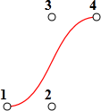
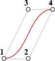
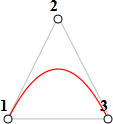
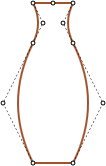
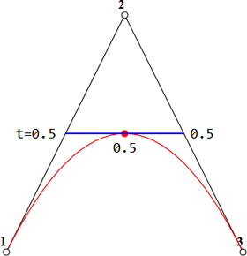

# Кривые Безье

Кривые Безье используются в компьютерной графике для рисования плавных изгибов, в [CSS-анимации](#css-animation) для описания процесса анимации и много где ещё.

Тему эту стоит изучить, чтобы в дальнейшем с комфортом пользоваться этим замечательным инструментом.
[cut]

## Виды кривых Безье

[Кривая Безье](http://ru.wikipedia.org/wiki/%D0%9A%D1%80%D0%B8%D0%B2%D0%B0%D1%8F_%D0%91%D0%B5%D0%B7%D1%8C%D0%B5) задаётся опорными точками.

Их может быть две, три, четыре или больше. Например:

<table>
<tr>
<th>По двум точкам</th>
<th>По трём точкам</th>
<th>По четырём точкам</th>
</tr>
<tr>
<td>

</td>
<td>

</td>
<td>

</td>
</tr>
</table>

Если вы посмотрите внимательно на эти кривые, то "на глазок" заметите: 
<ol>
<li>**Степень кривой равна числу точек минус один**.
На рисунках выше, соответственно, получаются для двух точек -- линейная кривая (прямая), для трёх точек -- квадратическая кривая (парабола), для четырёх -- кубическая.</li>
<li>**Кривая всегда находится внутри [выпуклой оболочки](http://ru.wikipedia.org/wiki/%D0%92%D1%8B%D0%BF%D1%83%D0%BA%D0%BB%D0%B0%D1%8F_%D0%BE%D0%B1%D0%BE%D0%BB%D0%BE%D1%87%D0%BA%D0%B0), образованной опорными точками:**

 

Благодаря последнему свойству в компьютерной графике можно оптимизировать проверку пересечений двух кривых. Если их выпуклые оболочки не пересекаются, то и кривые тоже не пересекутся.
</li>
</ol>

Основная ценность кривых Безье -- в том, что **кривую можно менять, двигая точки**. При этом **кривая меняется интуитивно понятным образом**.

Попробуйте двигать точки мышью в примере ниже:

[iframe src="demo.svg?nocpath=1&p=0,0,0.5,0,0.5,1,1,1" height=370]

Как можно заметить, **кривая натянута по касательным 1 -> 2 и 3 -> 4.**

После небольшой практики становится понятно, как расположить точки, чтобы получить нужную форму. А, соединяя несколько кривых, можно получить практически что угодно.

Вот некоторые примеры:

  

## Математика

У кривых Безье есть математическая формула. Как мы увидим далее, в ней нет особенной необходимости, но для полноты картины -- вот она.

**Координаты кривой описываются в зависимости от параметра `t⋲[0,1]`**

<ul>
<li>Для двух точек:

[pre]
<code>P = (1-t)P1 + tP2</code>
[/pre]
</li>
<li>Для трёх точек:

[pre]
<code>P = (1−t)2P1 + 2(1−t)tP2 + t2P3</code>
[/pre]
</li>
<li>Для четырёх точек:

[pre]
<code>P = (1−t)3P1 + 3(1−t)2tP2  +3(1−t)t2P3 + t3P4</code>
[/pre]
</li>
</ul>

Эти уравнения -- векторные, т.е. вместо <code>Pi</code>  нужно подставить координаты i-й опорной точки <code>(xi, yi)</code>.

Формула даёт возможность строить кривые, но не очень понятно, почему они именно такие, и как зависят от опорных точек. С этим нам поможет разобраться другой алгоритм.

## Рисование "де Кастельжо"

[Метод де Кастельжо](http://ru.wikipedia.org/wiki/%D0%90%D0%BB%D0%B3%D0%BE%D1%80%D0%B8%D1%82%D0%BC_%D0%B4%D0%B5_%D0%9A%D0%B0%D1%81%D1%82%D0%B5%D0%BB%D1%8C%D0%B6%D0%BE) идентичен математическому определению кривой и наглядно показывает, как она строится.

Посмотрим его на примере трех точек (точки можно двигать). Нажатие на кнопку "edit" запустит демонстрацию. 

[iframe src="demo.svg?p=0,0,0.5,1,1,0&animate=1" height=370]

**Алгоритм построения "де Кастельжо":**

<ol>

<li>Строятся отрезки между опорными точками 1-2-3. На рисунке выше они **чёрные**.</li>
<li>Параметр `t` пробегает значения от `0` до `1`. В примере выше использован шаг `0.05`, т.е. в цикле `0, 0.05, 0.1, 0.15, ... 0.95, 1`. 

Для каждого значения `t`:
<ol>
<li>На каждом из этих отрезков берётся точка, находящаяся от начала на расстоянии от 0 до `t` пропорционально длине. То есть, при `t=0` -- точка будет в начале, при `t=0.25` -- на расстоянии в 25% от начала отрезка, при `t=0.5` -- 50%(на середине), при `t=1` -- в конце. Так как **чёрных** отрезков -- два, то и точек выходит две штуки.</li>
<li>Эти точки соединяются. На рисунке ниже соединяющий их отрезок изображён синим.

<table>
<tr><td>При `t=0.25`</td><td>При `t=0.5`</td></tr>
<tr>
<td></td>
<td></td>
</tr>
</table>

</li>
<li>На получившемся отрезке берётся точка на расстоянии, соответствующем `t`. То есть, для `t=0.25` получаем точку в конце первой четверти отрезка, для `t=0.5` -- в середине отрезка. На рисунке выше эта точка отмечена красным. 
</li>
</ol>
</li>
<li>
По мере того как `t` пробегает последовательность от `0` до `1`, каждое значение `t` добавляет к кривой точку. **Совокупность таких точек для всех значений `t` образуют кривую Безье.**
</li>
</ol>
**Это был процесс для построения по трём точкам. Но то же самое происходит и с четырьмя точками.**

Демо для четырёх точек (точки можно двигать):

[iframe src="demo.svg?p=0,0,0.5,0,0.5,1,1,1&animate=1" height=370]

Алгоритм:
<ul>
<li>Точки по порядку соединяются отрезками: `1-2`, `2-3`, `3-4`. Получается три чёрных отрезка.</li>
<li>На отрезках берутся точки, соответствующие текущему `t`, соединяются. Получается два зелёных отрезка.</li>
<li>На этих отрезках берутся точки, соответствующие текущему `t`, соединяются. Получается один синий отрезок.</li>
<li>На синем отрезке берётся точка, соответствующая текущему `t`. При запуске примера выше она красная.</li>
<li>Эти точки описывают кривую.</li>
</ul>

Нажмите на кнопку "edit" в примере выше, чтобы увидеть это в действии.

Ещё примеры кривых:

[iframe src="demo.svg?p=0,0,0,0.75,0.25,1,1,1&animate=1" height=370]

С другими точками:

[iframe src="demo.svg?p=0,0,1,0.5,0,0.5,1,1&animate=1" height=370]

Петелька:

[iframe src="demo.svg?p=0,0,1,0.5,0,1,0.5,0&animate=1" height=370]

Пример негладкой кривой Безье:

[iframe src="demo.svg?p=0,0,1,1,0,1,1,0&animate=1" height=370]

Аналогичным образом могут быть построены кривые Безье и более высокого порядка: по пяти точкам, шести и так далее. Но обычно используются 2-3 точки, а для сложных линий несколько кривых соединяются. Это гораздо проще с точки зрения поддержки и расчётов.

[smart header="Как провести кривую через нужные точки?"]
Этот вопрос не связан с кривыми Безье, но он иногда возникает в смежных задачах.

Такая задача называется [интерполяцией](http://ru.wikipedia.org/wiki/%D0%98%D0%BD%D1%82%D0%B5%D1%80%D0%BF%D0%BE%D0%BB%D1%8F%D1%86%D0%B8%D1%8F). Существуют математические формулы, которые подбирают коэффициенты кривой по точкам, исходя из требований, например [многочлен Лагранжа](http://ru.wikipedia.org/wiki/%D0%98%D0%BD%D1%82%D0%B5%D1%80%D0%BF%D0%BE%D0%BB%D1%8F%D1%86%D0%B8%D0%BE%D0%BD%D0%BD%D1%8B%D0%B9_%D0%BC%D0%BD%D0%BE%D0%B3%D0%BE%D1%87%D0%BB%D0%B5%D0%BD_%D0%9B%D0%B0%D0%B3%D1%80%D0%B0%D0%BD%D0%B6%D0%B0). 

Как правило, в компьютерной графике для интерполяции используют кубические кривые, соединённых гладким образом. Вместе они выглядят как одна кривая. Это называется [интерполяция сплайнами](http://ru.wikipedia.org/wiki/%D0%9A%D1%83%D0%B1%D0%B8%D1%87%D0%B5%D1%81%D0%BA%D0%B8%D0%B9_%D1%81%D0%BF%D0%BB%D0%B0%D0%B9%D0%BD).
[/smart]
## Итого

Кривые Безье задаются опорными точками. Мы рассмотрели два определения кривых:
<ol>
<li>Через математическую формулу.</li>
<li>Через процесс построения де Кастельжо.</li>
</ol>

С их помощью можно описать почти любую линию, особенно если соединить несколько.

Применение:

<ul>
<li>В компьютерной графике, моделировании, в графических редакторах. Шрифты описываются с помощью кривых Безье.</li>
<li>В веб-разработке -- для графики на Canvas или в формате SVG. Кстати, все живые примеры выше написаны на SVG. Фактически, это один SVG-документ, к которому точки передаются параметрами. Вы можете открыть его в отдельном окне и посмотреть исходник: <a href="/files/tutorial/browser/animation/bezier/demo.svg?p=0,0,1,0.5,0,0.5,1,1&animate=1">demo.svg</a>.</li>
<li>В CSS-анимации, для задания временной функции.</li>
</ul>