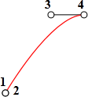
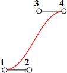

# CSS-анимация

Все современные браузеры, кроме IE<10 поддерживают <a href="http://www.w3.org/TR/css3-transitions/">CSS transitions</a>, которые позволяют реализовать анимацию средствами CSS, без привлечения JavaScript.

Большинство примеров из этой статьи не будут работать в IE<10.
[cut]

## Анимация свойства [#css-animation]

Идея проста. Вы указываете, что некоторое свойство будет анимироваться при помощи специальных CSS-правил. Далее, при изменении этого свойства, браузер сам обработает анимацию. 

Например, CSS, представленный ниже, 2 секунды анимирует свойство `background-color`.

```css
.animated {
  transition-property: background-color;
  transition-duration: 2s;
}
```

Любое изменение фонового цвета будет анимироваться в течение 2-х секунд.

У свойства `"transition"` есть и короткая запись:

```css
.animated {
  transition: background-color 2s;
}
```

Так как [стандарт CSS Transitions](http://www.w3.org/TR/css3-transitions/) находится в стадии разработки, то `transition` нужно снабжать браузерными префиксами.

### Пример
Этот пример работает во всех современных браузерах, не работает в IE&lt;10.

```html
<style>
.animated {
  -webkit-transition: background-color 2s;
  -ms-transition: background-color 2s;
  -o-transition: background-color 2s;
  -moz-transition: background-color 2s;
  transition: background-color 2s; /* без префикса - на будущее */

  border: 1px solid black;
}
</style>
<div class="animated" onclick="this.style.backgroundColor='red'">
  <span style="font-size:150%">Кликни меня</span>
</div>
```

<style>
.animated {
  transition: background-color 2s;
  -webkit-transition: background-color 2s;
  -o-transition: background-color 2s;
  -ms-transition: background-color 2s;
  -moz-transition: background-color 2s;
  border: 1px solid black;
}
</style>
<div class="animated" onclick="this.style.backgroundColor='red'">
  <span style="font-size:150%">Кликни меня</span>
</div>

CSS-анимации особенно рекомендуются на мобильных устройствах. Они отрисовываются плавнее, чем JavaScript, и меньше нагружают процессор, так как используют графическую акселерацию.


## Полный синтаксис CSS

Свойства для CSS-анимаций:
<dl>
<dt>`transition-property`</dt>
<dd>Список свойств, которые будут анимироваться. Анимировать можно не все свойства, но [многие](http://www.w3.org/TR/css3-transitions/#animatable-properties-). Значение `all` означает "анимировать все свойства".</dd>
<dt>`transition-duration`</dt>
<dd>Продолжительность анимации. Если указано одно значение -- оно применится ко всем свойствам, можно указать несколько значений для разных `transition-property`.</dd>
<dt>`transition-timing-function`</dt>
<dd>[Кривая Безье](/bezier) по 4-м точкам, используемая в качестве временной функциии.</dd>
<dt>`transition-delay`</dt>
<dd>Указывает задержку от изменения свойства до начала CSS-анимации.</dd>
</dl>

Свойство **`transition`** может содержать их все, в порядке: `property duration timing-function delay, ...`.

### Пример

Анимируем одновременно цвет и размер шрифта:

```html
<style>
.growing {
  -webkit-transition: font-size 3s, color 2s;
  -ms-transition: font-size 3s, color 2s;
  -o-transition: font-size 3s, color 2s;
  -moz-transition: font-size 3s, color 2s;
  transition: font-size 3s, color 2s; 
}
</style>
<button class="growing" onclick="this.style.fontSize='36px';this.style.color='red'">Кликни меня</button>
```

<style>
.growing {
  -webkit-transition: font-size 3s, color 2s;
  -ms-transition: font-size 3s, color 2s;
  -o-transition: font-size 3s, color 2s;
  -moz-transition: font-size 3s, color 2s;
  transition: font-size 3s, color 2s; 
}
</style>
<button class="growing" onclick="this.style.fontSize='36px';this.style.color='red'">Кликни меня</button>

## Временнáя функция

В качестве временной функции можно выбрать любую [кривую Безье](/bezier), удовлетворяющую условиям:
<ol>
<li>Начальная точка `(0,0)`.</li>
<li>Конечная точка `(1,1)`.</li>
<li>Для промежуточных точек значения `x` должны быть в интервале  `0..1`.</li>
</ol>

Синтаксис для задания кривой Безье в CSS: `cubic-bezier(x2, y2, x3, y3)`. В нём указываются координаты второй и третьей точек, так как первая и последняя фиксированы.

Например, торможение можно описать кривой Безье: `cubic-bezier(0.0, 0.5, 0.5 ,1.0)`.

График этой кривой:


Вы можете увидеть эту временную функцию в действии, кликнув на поезд:

```html
<style>
.train {
  position: relative;
  left: 0;
  -moz-transition: left 5s cubic-bezier(0.0,0.5,0.5,1.0);
  -webkit-transition: left 5s cubic-bezier(0.0,0.5,0.5,1.0);
  -ms-transition: left 5s cubic-bezier(0.0,0.5,0.5,1.0);
  -o-transition: left 5s cubic-bezier(0.0,0.5,0.5,1.0);
  transition: left 5s cubic-bezier(0.0,0.5,0.5,1.0);
}
</style>

```

<style>
.train {
  position: relative;
  cursor: pointer;
  left: 0;
  -moz-transition: left 5s cubic-bezier(0.0,0.5,0.5,1.0);
  -webkit-transition: left 5s cubic-bezier(0.0,0.5,0.5,1.0);
  -ms-transition: left 5s cubic-bezier(0.0,0.5,0.5,1.0);
  -o-transition: left 5s cubic-bezier(0.0,0.5,0.5,1.0);
  transition: left 5s cubic-bezier(0.0,0.5,0.5,1.0);
}
</style>


Существуют и несколько стандартных кривых: `linear`, `ease`, `ease-in`, `ease-out` и `ease-in-out`.

Значение `linear` -- это прямая, равномерное изменение. Оно используется по умолчанию.

Остальные кривые являются короткой записью следующих `cubic-bezier`. В таблице ниже показано соответствие:

<table>
<tr>
<th>`ease`</th>
<th>`ease-in`</th>
<th>`ease-out`</th>
<th>`ease-in-out`</th>
</tr>
<tr>
<td>`(0.25, 0.1, 0.25, 1.0)`</td>
<td>`(0.42, 0, 1.0, 1.0)`</td>
<td>`(0, 0, 0.58, 1.0)`</td>
<td>`(0.42, 0, 0.58, 1.0)`</td>
</tr>
<tr>
<td></td>
<td></td>
<td></td>
<td></td>
</tr>
</table>

Наиболее близкий стандартный вариант для примера с поездом -- `ease-out`:

```css
.train {
  -moz-transition: left 5s ease-out;
  ...
}
```

## CSS-преобразования

Браузеры, которые поддерживают CSS-анимацию, поддерживают и [CSS-преобразования](https://developer.mozilla.org/en/CSS/Using_CSS_transforms).

С их помощью можно сделать много красивых эффектов. Например, вращение:

```js
//+ run
 
document.body.style.MozTransition = "all 5s";
document.body.style.MozTransform = "rotate(360deg)";
document.body.style.WebkitTransition = "all 5s"; 
document.body.style.WebkitTransform = "rotate(360deg)";
document.body.style.OTransition = "all 5s";
document.body.style.OTransform = "rotate(360deg)";
document.body.style.MsTransition = "all 5s";
document.body.style.MsTransform = "rotate(360deg)";

document.body.style.Transition = "all 5s";
document.body.style.Transform = "rotate(360deg)";
```

Самое замечательное -- все эти эффекты используют графический ускоритель и  почти не нагружают процессор.

Все браузеры, кроме IE<10 поддерживают это, ну а в IE может быть что-то через JavaScript или вообще без анимации.

## Событие transitionend

На конец CSS-анимации можно повесить обработчик. Его стандартное имя: `transitionend`, но браузерные префиксы требуются и тут.

Кликните на лодочку:

[iframe src="boat" height=300 edit link]

Её анимация осуществляется функцией `go`, которая перезапускается по окончании (с переворотом через CSS).

```js
...
  go();

  elem.addEventListener('transitionend', go); /* на будущее */
  elem.addEventListener('webkitTransitionEnd', go);
  elem.addEventListener('mozTransitionEnd', go);
  elem.addEventListener('oTransitionEnd', go);
  elem.addEventListener('msTransitionEnd', go);
...
```

Объект события `transitionend` также содержит свойства:
<dl>
<dt>`propertyName`</dt>
<dd>Свойство, анимация которого завершилась.</dd>
<dt>`elapsedTime`</dt>
<dd>Время (в секундах), которое заняла анимация, без учета `transition-delay`.</dd>
</dl>

Свойство `propertyName` может быть полезно при одновременной анимации нескольких свойств. Каждое свойство даст своё событие, и можно решить, что с ним делать дальше.

## Ограничения и достоинства CSS-анимаций

[compare]
-Основное ограничение -- это то, что временная функция может быть задана только кривой Безье. Более сложные анимации, состоящие из нескольких кривых, реализуются при помощи [CSS animations](http://dev.w3.org/csswg/css3-animations/#animation-name-property) (стандарт пока не готов).
-CSS-анимации касаются только свойств, а в JavaScript можно делать всё, что угодно.
-Отсутствует поддержка в IE9-
+Простые вещи делаются просто. Особенно удобно, если от отсутствия эффекта в IE проблем не возникнет.
+Гораздо "легче" для процессора, чем анимации JavaScript.  Лучше используется графический ускоритель. Это очень важно для мобильных устройств.
[/compare]

[head]
<link type="text/css" rel="stylesheet" href="/files/tutorial/browser/animation/animate.css" />
<script src="/files/tutorial/browser/animation/step.js"></script>
[/head]