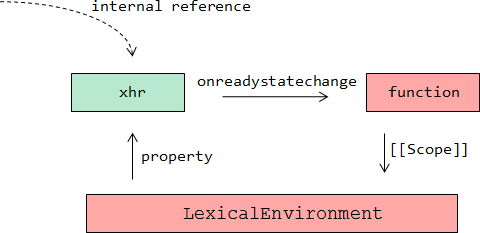
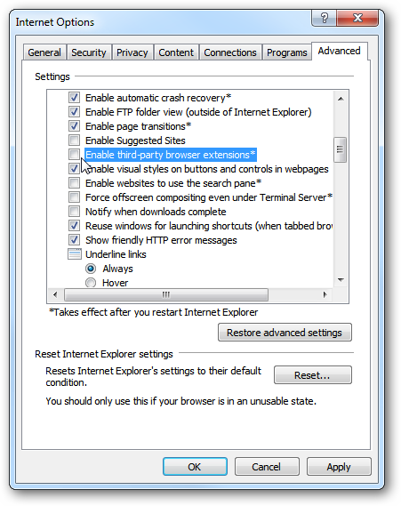
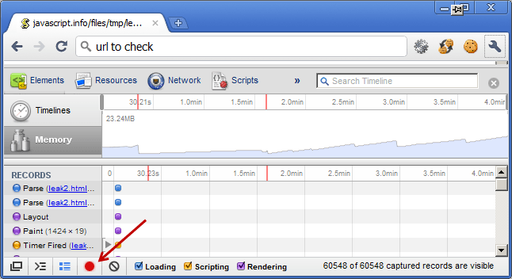

# Утечки памяти 

*Утечки памяти* происходят, когда браузер по какой-то причине не может освободить память от недостижимых объектов.

Обычно это происходит автоматически ([](/memory-management)). Кроме того, браузер освобождает память при переходе на другую страницу. Поэтому утечки в реальной жизни проявляют себя в двух ситуациях:

[cut]
<ol>
<li>Приложение, в котором посетитель все время на одной странице и работает со сложным JavaScript-интерфейсом. В этом случае утечки могут постепенно съедать доступную память.</li>
<li>Страница регулярно делает что-то, вызывающее утечку памяти. Посетитель (например, менеджер) оставляет компьютер на ночь включенным, чтобы не закрывать браузер с кучей вкладок. Приходит утром -- а браузер съел всю память <strike>и рухнул</strike> и сильно тормозит.</li>
</ol>
Утечки бывают из-за ошибок браузера, ошибок в расширениях браузера и, гораздо реже, по причине ошибок в архитектуре JavaScript-кода. Мы разберём несколько наиболее частых и важных примеров.

## Коллекция утечек в IE

### Утечка DOM ↔ JS в IE7-

IE до версии 8 не умел очищать циклические ссылки, появляющиеся между DOM-объектами и объектами JavaScript. В результате и DOM и JS оставались в памяти навсегда.

[warn header="Пропустите эту секцию, если IE8- не нужен"]
Проблема была особенно серьезна в IE6 до SP3 (или до обновления июня 2007 года), там память не освобождалась даже при переходе на другую страницу. 

Сейчас она существует в IE6, 7, а также, в облегчённом варианте, в IE8 (см. далее). Если вы не поддерживаете IE8-, то можете пропустить эту секцию.
[/warn]

Функция `setHandler` в примере ниже ведёт к утечке памяти в IE6,7:

```js
function setHandler() {
  var elem = document.getElementById('id');
  elem.onclick = function() {  
    /* может быть пустая функция, не важно */ 
  };
}
```

Элемент `elem` здесь ссылается на JavaScript-функцию через ссылку `onclick` напрямую, через свойство, а функция ссылается на `elem` через замыкание.


Здесь вместо DOM-элемента в IE может быть `XMLHttpRequest`, `ActiveX`, любой другой COM-объект. Круговая ссылка гарантирует утечку.


**Обойти утечки памяти в IE можно, разорвав циклические ссылки.**

Например, можно удалить ссылку на `elem` из замыкания, присвоив `elem = null`. Таким образом обработчик больше не ссылается на DOM-элемент. Циклическая ссылка разорвана:


Больше информации об этой утечке вы можете почерпнуть из статей:  <a href="http://msdn.microsoft.com/en-us/library/ms976398.aspx">Understanding and Solving Internet Explorer Leak Patterns</a> и <a href="http://msdn.microsoft.com/en-us/library/dd361842%28v=vs.85%29.aspx">Circular Memory Leak Mitigation</a>. 


### Утечка DOM ↔ JS, вариант для IE8-

В браузере IE8 была проведена серьёзная работа над ошибками, и пример, описанный выше, больше не приводит к утечке.

**Но ситуация исправлена не до конца. Утечка в IE8- появляется, если круговая ссылка возникает "через объект".**

Чтобы было понятнее, о чём речь, посмотрите на следующий код. Он вызывает утечку памяти:

```js
function leak() {
  // Создаём новый DIV, добавляем к BODY
  var elem = document.createElement('div');
  document.body.appendChild(elem);

  // Записываем в свойство жирный объект
  elem.__expando = {
    bigAss: new Array(1000000).join('lalala')
  };

*!*
  // Создаём круговую ссылку. Без этой строки утечки не будет.
  elem.__expando.__elem = elem;
*/!*

  // Удалить элемент из DOM. Браузер должен очистить память.
  elem.parentElement.removeChild(elem);
}
```

<a href="/files/tutorial/leak/leak_ie8.html" target="_blank">Открыть в новом окне (в IE)</a>

Этот пример, течёт в IE6,7,8, а также в IE9 в режиме совместимости с IE8. Проблема -- в круговой ссылке `elem.__expando__elem = elem`. 

**Утечка может возникать и неявным образом, через замыкание:**

```js
function leak() {
  var elem = document.createElement('div');
  document.body.appendChild(elem);

  elem.__expando = {
    bigAss: new Array(1000000).join('lalala'),
*!*
    method: function() {} // создаётся круговая ссылка через замыкание
*/!*
  };

  // Удалить элемент из DOM. Браузер должен очистить память.
  elem.parentElement.removeChild(elem);
}
```

<a href="/files/tutorial/leak/leak_ie8_2.html" target="_blank">Открыть в новом окне (в IE)</a>

**Без метода `method` здесь утечки не возникнет.**

Бывает ли такая ситуация в реальной жизни? Или это -- целиком синтетический пример, для заумных программистов?

Да, конечно бывает. Например, при разработке графических компонент. 

Во-первых, сам объект компонента хранит ссылку на его DOM-элемент, чтобы работать с ним. Например:

```js
function Menu(elem) {
  elem.onclick = function() {
    // ссылка на elem осталась в замыкании
  };
}

var menu = new Menu(elem);
```

То есть, компонент всегда знает свой элемент. 

Но бывают ситуации, когда нужно пойти в обратном направлении, а именно -- по элементу определить, какой на нём компонент. Например, при делегировании, чтобы передать обработку события на элементе соответствующему компоненту. Или при Drag'n'Drop, чтобы получить компонент, соответствующий элементу, на который произведён перенос.

Сама задача не является чем-то из ряда вон выходящим. Вполне естественно, что JS-компонент привязан к элементу, а элемент знает о компоненте на нём. Но в IE8- прямая привязка ведёт к утечке памяти!

```js
function Menu(elem) {
  elem.onclick = function() {};
}

var menu = new Menu(elem); // Menu содержит ссылку на elem
*!*
elem.menu = menu; // вот такая привязка или что-то подобное ведёт к утечке
```

<a href="/files/tutorial/leak/leak_ie8_widget.html" target="_blank">Открыть в новом окне (в IE)</a>

Такая привязка удобна, т.к. мы по DOM-элементу можем получить JS-компонент, который к нему привязан. Но, как видим, ведёт к утечке в IE8-.

### Утечка IE8 при обращении к коллекциям таблицы

Эта утечка происходит только в IE8 в стандартном режиме. В нём при обращении к табличным псевдо-массивам (напр. `rows`) создаются и не очищаются внутренние ссылки, что приводит к утечкам.

Также воспроизводится в новых IE в режиме совместимости с IE8.

Код:

```js
var elem = document.createElement('div'); // любой элемент

function leak() {
     
    elem.innerHTML = '<table><tr><td>1</td></tr></table>';

*!*
    elem.firstChild.rows[0]; // просто доступ через rows[] приводит к утечке
    // при том, что мы даже не сохраняем значение в переменную
*/!*

    elem.removeChild(elem.firstChild); // удалить таблицу (*)
    // alert(elem.childNodes.length) // выдал бы 0, elem очищен, всё честно
}
```

<a href="/files/tutorial/leak/leak_ie8_table.html" target="_blank">Открыть в новом окне (в IE)</a>

Особенности:
<ul>
<li>Если убрать отмеченную строку, то утечки не будет.</li>
<li>Если заменить строку `(*)` на `elem.innerHTML = ''`, то память будет очищена, т.к. этот способ работает по-другому, нежели просто `removeChild` (см. главу [](/memory-management)).</li>
<li>Утечка произойдёт не только при доступе к `rows`, но и к другим свойствам, например `elem.firstChild.tBodies[0]`.</li>
</ul>

Эта утечка проявляется, в частности, при удалении детей элемента следующей функцией:

```js
function empty(elem) {
  while(elem.firstChild) elem.removeChild(elem.firstChild);
}
```

Если идёт доступ к табличным коллекциям и регулярное обновление таблиц при помощи DOM-методов  -- утечка в IE8 будет расти.

Более подробно вы можете почитать об этой утечке в статье [Утечки памяти в IE8, или страшная сказка со счастливым концом](http://habrahabr.ru/post/141451/).

### Утечка через XmlHttpRequest в IE8-
 
Следующий код вызывает утечки памяти в IE8-:

```js
function leak() {
  var xhr = new XMLHttpRequest(); // в IE6 создать через ActiveX

  xhr.open('GET', '/server.do', true);

  xhr.onreadystatechange = function() {
    if(xhr.readyState == 4 && xhr.status == 200) {            
      // ...
    }
  }

  xhr.send(null);
}
```

Как вы думаете, почему? Если вы внимательно читали то, что написано выше, то имеете информацию для ответа на этот вопрос..

Посмотрим, какая структура памяти создается при каждом запуске:



Когда запускается асинхронный запрос `xhr`, браузер создаёт специальную внутреннюю ссылку (internal reference) на этот объект. находится в процессе коммуникации. Именно поэтому объект `xhr` будет жив после окончания работы функции.

**Когда запрос завершен, браузер удаляет внутреннюю ссылку, `xhr` становится недостижимым и память очищается... Везде, кроме IE8-.**


<a href="/files/tutorial/leak/leak_ie8_xhr.html" target="_blank">Открыть в новом окне (в IE8-)</a> (откройте страницу и пусть поработает минут 20 - съест всю  память, включая виртуальную).

Чтобы это исправить, нам нужно разорвать круговую ссылку `XMLHttpRequest ↔ JS`. Например, можно удалить `xhr` из замыкания:

```js
function leak() {
  var xhr = new XMLHttpRequest();

  xhr.open('GET', 'something.js?'+Math.random(), true);

  xhr.onreadystatechange = function() {
    if (xhr.readyState != 4) return;

    if(xhr.status == 200) {
      document.getElementById('test').innerHTML++;
    }

*!*
    xhr = null; // по завершении запроса удаляем ссылку из замыкания
*/!*
  }

  xhr.send(null);
}
```


Теперь циклической ссылки нет -- мы устранили утечку.

<a href="/files/tutorial/leak/leak_ie8_xhr_fixed.html" target="_blank">Посмотреть исправленный пример для IE в отдельном окне</a>.


## Объемы утечек памяти

Объем "утекающей" памяти может быть небольшим. Тогда это почти не ощущается. Но так как замыкания ведут к сохранению переменных внешних функций, то одна функция может тянуть за собой много чего ещё.

Представьте, вы создали функцию, и одна из ее переменных содержит очень большую по объему строку (например, получает с сервера).

```js
function f() {
  var data = "Большой объем данных, например, переданных сервером"

  /* делаем что-то хорошее (ну или плохое) с полученными данными */

  function inner() {
    // ...
  }

  return inner;
}
```

**Пока функция `inner` остается в памяти, `LexicalEnvironment` с переменной большого объема внутри висит в памяти.** 

Висит до тех пор, пока функция `inner` жива.

**Как правило, JavaScript не знает, какие из переменных функции `inner` будут использованы, поэтому оставляет их все.**

Исключение -- виртуальная машина V8 (Chrome, Opera, Node.JS), она обычно видит, что переменная не используется во внутренних функциях, и очистит память.

В других же интерпретаторах, даже если код спроектирован так, что никакой утечки нет, по вполне разумной причине может создаваться множество функций, а память будет расти потому, что функция тянет за собой своё замыкание. 

Сэкономить память здесь вполне можно. Мы же знаем, что переменная `data` не используется в `inner`. Поэтому просто обнулим её:

```js
function f() {
  var data = "Большое количество данных, например, переданных сервером"

  /* действия с data */

  function inner() {
    // ...
  }

*!*
  data = null; // когда data станет не нужна -
*/!*

  return inner;
}
```

## jQuery: утечки и борьба с утечками

[warn header="Изменения в jQuery 2"]
В jQuery 2 объект с данными элемента, о котором идёт речь далее, более недоступен извне. Он стал локальной переменной внутри jQuery с именем `data_priv`, явный доступ к внутренним данным более невозможен (или deprecated).

Но в остальном всё работает точно так, как описано, и с теми же последствиями.
[/warn]

**В jQuery для борьбы с утечками памяти в IE6-7 используется <a href="http://api.jquery.com/jQuery.data/">$.data</a> API. Однако, это может стать причиной новых(!) утечек, характерных для jQuery.**

Основной принцип `$.data` — это для любого JavaScript объекта сохранить/получить значение для элемента с помощью jQuery вызова:

```js
//+ run
$(document.body).data('prop', { anything: "любой объект" }) // set
alert( $(document.body).data('prop') ) // get
```

jQuery `elem.data(prop, val)` делает следующее:
<ol>
<li>Элемент получает уникальный идентификатор, если у него такого еще нет:

```js
elem[ jQuery.expando ] = id = ++jQuery.uuid;  // средствами jQuery
```

`jQuery.expando` -- это случайная строка, сгенерированная jQuery один раз при входе на страницу. Уникальное свойство, чтобы ничего важного не перезаписать.</li> 
<li>...А сами данные сохраняются в специальном объекте `jQuery.cache`:

```js
jQuery.cache[id]['prop'] = { anything: "любой объект" };
```

</li>
</ol>

Когда данные считываются из элемента:

<ol>
<li>Уникальный идентификатор элемента извлекается из `id = elem[ jQuery.expando]`.
<li>Данные считываются из `jQuery.cache[id]`.</li>
</ol>
	
Смысл этого API в том, что DOM-элемент никогда не ссылается на JavaScript объект напрямую. Задействуется идентификатор, а сами данные хранятся в `jQuery.cache`. Утечек в IE не будет. 

К тому же все данные известны библиотеке, так что можно клонировать с ними и т.п.

**Как побочный эффект -- возникает утечка памяти, если элемент удален из DOM без дополнительной очистки.**

### Примеры утечек в jQuery

Следующий код создает jQuery-утечку во всех браузерах:

```js
$('<div/>')
  .html(new Array(1000).join('text')) // div с текстом, возможна AJAX-загрузка
  .click(function() { })
  .appendTo('#data')

document.getElementById('data').innerHTML = ''; // (*)
```

<a href="/files/tutorial/leak/jquery2.html" target="_blank">Показать в отдельном окне</a>

Утечка происходит потому, что обработчик события в jQuery хранится в данных элемента. В строке `(*)` элемент удален очисткой родительского `innerHTML`, но в `jQuery.cache` данные остались. 

Более того, система обработки событий в jQuery устроена так, что вместе с обработчиком в данных хранится и ссылка на элемент, так что в итоге оба -- и обработчик и элемент -- остаются в памяти вместе со всем замыканием!

**Ещё более простой пример утечки:**

Этот код создает утечку:

```js
function go() {
  $('<div/>')
    .html(new Array(1000).join('text')) 
    .click(function() { })
}
```

<a href="/files/tutorial/leak/jquery1.html" target="_blank">Показать в отдельном окне</a>

Причина здесь в том, что элемент `<div>` создан, но нигде не размещен :). После выполнения функции ссылка на него теряется. Но обработчик события `click` уже сохранил данные в `jQuery.cache`, которые застревают там навсегда.

### Используем jQuery без утечек

Чтобы избежать утечек, описанных выше, для удаления элементов используйте функции jQuery API, а не чистый JavaScript.

Методы <a href="http://api.jquery.com/remove/">remove()</a>, <a href="http://api.jquery.com/empty">empty()</a> и <a href="http://api.jquery.com/html">html()</a> проверяют дочерние элементы на наличие данных и очищают их. Это несколько замедляет процедуру удаления, но зато освобождается память.

	
**К счастью обнаружить такие утечки легко. Проверьте размер `$.cache.`** Если  он большой и растет, то изучите кэш, посмотрите, какие записи остаются и почему.

### Улучшение производительности jQuery

У способа борьбы с утечками IE, применённого в jQuery, есть побочный эффект. 

**Функции, удаляющие элементы, бегают по всему дереву DOM и очищают подэлементы.**

Представьте себе, что вы получили с сервера большую таблицу (в виде текста), вставили её в документ и хотите обновить. Вызов `$('table').remove()` будет бегать по всем ячейкам и искать в них данные. Но мы-то знаем, что обработчики назначены через делегирование, и тратить на это время ни к чему!

Чтобы "грязно" удалить элемент, без чистки, можно воспользоваться методом <a href="http://api.jquery.com/detach">detach()</a>. Его официальное назначение -- в том, чтобы убрать элемент из DOM, но сохранить возможность для вставки (и, соответственно, оставить на нём все данные). А неофициальное -- быстро убрать элемент из DOM. Если на нём нет данных и обработчиков, то всё хорошо.

В принципе, если хочется всё сделать чисто, но быстро -- никто не мешает сделать  `elem.detach()` и поместить вызов `elem.remove()` в `setTimeout`. В результате очистка будет происходить ассинхронно и незаметно.

Итак, будем надеяться, что эта тема для вас теперь прозрачна и ясна и в следующих разделах мы не будем больше говорить об утечках в jQuery.

## Поиск и устранение утечек памяти

### Проверка на утечки

Существует множество шаблонов утечек и ошибок в браузерах, которые могут приводить к утечкам. Для их устранения сперва надо постараться изолировать и воспроизвести утечку.

<ul>
<li>**Необходимо помнить, что браузер может очистить память не сразу когда объект стал недостижим, а чуть позже.** Например, сборщик мусора может ждать, пока не будет достигнут определенный лимит использования памяти, или запускаться время от времени.</li>

Поэтому если вы думаете, что нашли проблему и тестовый код, запущенный в цикле, течёт -- подождите примерно минуту, добейтесь, чтобы памяти ело стабильно и много. Тогда будет понятно, что это не особенность сборщика мусора.</li><li>**Если речь об IE, то надо смотреть "Виртуальную память" в списке процессов, а не только обычную "Память".** Обычная может очищаться за счет того, что перемещается в виртуальную (на диск).</li>
<li>Для простоты отладки, если есть подозрение на утечку конкретных объектов, в них добавляют большие свойства-маркеры. Например, подойдет фрагмент текста: `new Array(999999).join('leak')`.</li>
</ul>

### Настройка браузера

Утечки могут возникать из-за расширений браузера, взимодействющих со страницей. Еще более важно, что **утечки могут быть следствием конфликта двух браузерных расширений** Например, было такое: память текла когда включены расширения Skype и плагин антивируса одновременно.

Чтобы понять, в расширениях дело или нет, нужно отключить их:

<ol>
<li>Отключить Flash.</li>
<li>Отключить анивирусную защиту, проверку ссылок и другие модули и дополнения.</li>
<li>Отключить плагины. Отключить ВСЕ плагины.
<ul>
<li>
 Для IE есть параметр коммандной строки:

```
"C:\Program Files\Internet Explorer\iexplore.exe" -extoff
```

Кроме того необходимо отключить сторонние расширения в свойствах IE.




</li>
<li>Firefox необходимо запускать с чистым профилем. Используйте следующую команду для запуска менеджера профилей и создания чистого пустого профиля:

```
firefox --profilemanager
```

</li>
</ul>
</li>
</ol>

## Инструменты

Пожалуй, единственный браузер с поддержкой отладки памяти -- это Chrome. В инструментах разработчика вкладка Timeline -- Memory показывает график использования памяти.



Можем посмотреть, сколько памяти и куда он использует.

Также в Profiles есть кнопка Take Heap Snapshot, здесь можно сделать и исследовать снимок текущего состояния страницы. Снимки можно сравнивать друг с другом, выяснять количество новых объектов. Можно смотреть, почему объект не очищен и кто на него ссылается.

Замечательная статья на эту тему есть в документации: [Chrome Developer Tools: Heap Profiling](http://code.google.com/chrome/devtools/docs/heap-profiling.html).

Утечки памяти штука довольно сложная. В борьбе с ними вам определенно понадобится одна вещь: *Удача!*

<div style="text-align:center">

</div>

<p style="text-align:right;font-style:italic">Перевести с английского варианта<br> учебника помог Марат Шагиев</p>

