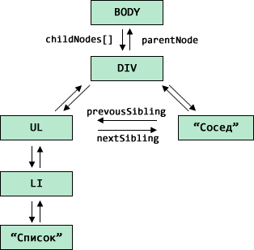
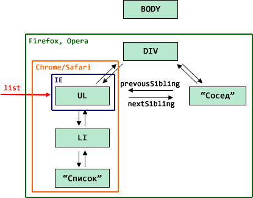

# Очистка памяти при removeChild/innerHTML

Управление памятью в случае с DOM работает по сути так же, как и с обычными JavaScript-объектами. Пока объект достижим -- он остаётся в памяти.

Но есть и особенности, поскольку DOM весь переплетён ссылками. 
[cut]
## Пример
Для примера рассмотрим следующий HTML:

<table>
<tr>
<th>Код</th>
<th>Структура в памяти</th>
<tr>
<td>

```html
<html>
<body>
  <div>
    <ul>
      <li>Список</li>
    </ul>
    Сосед
  </div>
</body>
</html>
```

</td>
<td>

</td>
</tr>
</table>

## Удаление removeChild 

Операция `removeChild` разрывает все связи удаляемым узлом и его родителем.

Поэтому, если удалить `DIV` из `BODY`, то всё поддерево под `DIV` станет недостижимым и будет удалено.

А что происходит, если на какой-то элемент внутри удаляемого поддерева есть ссылка?

Например, `UL` сохранён в переменную `list`:

```js
var list = document.getElementsByTagName('UL')[0];
document.body.removeChild(document.body.children[0]);
```

**В этом случае, так как DOM взаимосвязан, то он полностью остаётся в памяти!** Включая детей, родителей, соседей и т.п... Всё из-за внешней ссылки `list`, которая делает их достижимыми.


То есть, в этом случае DOM работает по той же логике, что и обычные объекты.

## Удаление через innerHTML

Удаление через очистку `elem.innerHTML="..."` браузеры интерпретируют по-разному.

По идее, при присвоении `innerHTML` из DOM должны удаляться текущие узлы и добавляться новые (из html). Но стандарт ничего не говорит о том, что делать с узлами после удаления. И тут разные браузеры имеют разное мнение.

Посмотрим, что произойдёт с DOM-структурой при очистке `BODY`, если на какой-либо элемент есть ссылка.

```js
var list = document.getElementsByTagName('UL')[0];
document.body.innerHTML = "";
```

Обращаю внимание -- связь разрывается только между `DIV` и `BODY`, т.е. на верхнем уровне, а `list` -- это произвольный элемент.

Чтобы увидеть, что останется в памяти, а что нет -- запустим код:

```html
<!--+ run -->
<div>
  <ul>
    <li>Список</li>
  </ul>
  Сосед
</div>

<script>
  var list = document.getElementsByTagName('ul')[0];
  document.body.innerHTML = ''; // удалили DIV 

  alert(list.parentNode);  // цела ли ссылка UL -> DIV ?
  alert(list.nextSibling); // живы ли соседи UL ?
  alert(list.children.length);  // живы ли потомки UL ?
</script>
```

Как ни странно, браузеры ведут себя по-разному:

<table>
<tr><th></th>
<th>`parentNode`</th>
<th>`nextSibling`</th>
<th>`children.length`</th>
</tr>
<tr>
<td>Chrome/Safari/Opera</td>
<td>`null`</td>
<td>`null`</td>
<td>`1`</td>
</tr>
<tr>
<td>Firefox</td>
<td>Элемент</td>
<td>Элемент</td>
<td>`1`</td>
</tr>
<tr>
<td>IE 6-9</td>
<td>`null`</td>
<td>`null`</td>
<td>`0`</td>
</tr>
</table>

Иными словами, браузеры ведут себя с различной степенью агрессивности по отношению к элементам.

<dl>
<dt>Firefox, Opera</dt>
<dd>Главные пацифисты. Оставляют всё, на что есть ссылки, т.е. элемент, его родителя, соседей и детей.</dd>
<dt>Chrome/Safari</dt>
<dd>Считают, что раз мы задали ссылку на `UL`, то нам нужно только это поддерево, а остальные (соседи, родитель) можно удалить.</dd>
<dt>Internet Explorer</dt>
<dd>Как ни странно, самый агрессивный. Удаляет вообще всё, кроме узла, на который есть ссылка. Это поведение одинаково для всех версий IE.</dd>
</dl>

На иллюстрации ниже показано, какую часть DOM оставит каждый из браузеров:


Таким образом, кросс-браузерно, при поддержке IE, гарантировано одно: **сам узел, на который есть ссылка, останется в памяти.**  

Это поведение специфично для `innerHTML`. При обычном удалении узла из DOM все браузеры ведут себя как `Firefox/Opera`, т.е. остаётся всё.

