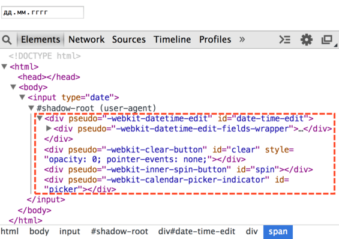
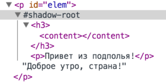

# Shadow DOM

Спецификация [Shadow DOM](http://w3c.github.io/webcomponents/spec/shadow/) является отдельным стандартом. Частично он уже используется для обычных DOM-элементов, но также применяется для создания веб-компонентов.

*Shadow DOM* -- это внутренний DOM элемента, который существует отдельно от внешнего документа. В нём могут быть свои ID, свои стили и так далее. Причём снаружи его, без применения специальных техник, не видно, поэтому не возникает конфликтов.
[cut]

## Внутри браузера

Концепция Shadow DOM начала применяться довольно давно внутри самих браузеров. Когда браузер показывает сложные элементы управления, наподобие слайдера `<input type="range">` или календаря `<input type="date">` -- внутри себя он конструирует их из самых обычных стилизованных `<div>`, `<span>` и так далее. 

С первого взгляда они незаметны, но если в настройках Chrome Development Tools выбрать показ Shadow DOM, то их можно легко увидеть.

Например, вот такое содержимое будет у `<input type="date">`:


То, что находится под `#shadow-root` -- это и есть Shadow DOM. 

**Получить элементы из Shadow DOM можно только при помощи специальных JavaScript-вызовов или селекторов. Это не обычные дети, а намного более мощное средство отделения содержимого.**

В Shadow DOM выше можно увидеть полезный атрибут `pseudo`. Он нестандартный, существует по историческим причинам. С его помощью можно стилизовать подэлементы через CSS, например, сделаем поле редактирования даты красным:

```html
<!--+ run -->
<style>
*!*
input::-webkit-datetime-edit {
*/!*
  background: red;
}
</style>

<input type="date">
```

Ещё раз заметим, что `pseudo` -- нестандартный атрибут. Если говорить хронологически, то сначала браузеры начали экспериментировать внутри себя с инкапсуляцией внутренних DOM-структур, а уже потом, через некоторое время, появился стандарт Shadow DOM, который позволяет делать то же самое разработчикам.

Далее мы рассмотрим работу с Shadow DOM из JavaScript, по стандарту [Shadow DOM](http://w3c.github.io/webcomponents/spec/shadow/).

## Создание Shadow DOM

Shadow DOM можно создать внутри любого элемента вызовом `elem.createShadowRoot()`.

Например:

```html
<!--+ run autorun="no-epub" -->
<p id="elem">Доброе утро, страна!</p>

<script>
  var root = elem.createShadowRoot();
  root.innerHTML = "<p>Привет из подполья!</p>";
</script>
```

Если вы запустите этот пример, то увидите, что изначальное содержимое элемента куда-то исчезло и показывается только "Привет из подполья!". Это потому, что у элемента есть Shadow DOM. 

**С момента создания Shadow DOM обычное содержимое (дети) элемента не отображается, а показывается только Shadow DOM.**

Внутрь этого Shadow DOM, при желании, можно поместить обычное содержимое. Для этого нужно указать, куда. В Shadow DOM это делается через "точку вставки" (insertion point). Она объявляется при помощи тега `<content>`, например:

```html
<!--+ run autorun="no-epub" -->
<p id="elem">Доброе утро, страна!</p>

<script>
  var root = elem.createShadowRoot();
  root.innerHTML = "<h3>*!*<content></content>*/!*</h3> <p>Привет из подполья!</p>";
</script>
```

Теперь вы увидите две строчки: "Доброе утро, страна!" в заголовке, а затем "Привет из подполья".

Shadow DOM примера выше в инструментах разработки:



Важные детали:
<ul>
<li>Тег `<content>` влияет только на отображение, он не перемещает узлы физически. Как видно из картинки выше, текстовый узел  "Доброе утро, страна!" остался внутри `p#elem`. Его можно даже получить при помощи `elem.firstElementChild`. </li>
<li>Внутри `<content>` показывается не элемент целиком `<p id="elem">`, а его содержимое, то есть в данном случае текст "Доброе утро, страна!".</li>
</ul>

**В `<content>` атрибутом `select` можно указать конкретный селектор содержимого, которое нужно переносить. Например, `<content select="h3"></content>` перенесёт только заголовки.**

Внутри Shadow DOM можно использовать `<content>` много раз с разными значениями `select`, указывая таким образом, где конкретно какие части исходного содержимого разместить. Но при этом дублирование узлов невозможно. Если узел показан в одном `<content>`, то в следующем он будет пропущен.

Например, если сначала идёт `<content select="h3.title">`, а затем `<content select="h3">`, то в первом `<content>` будут показаны заголовки `<h3>` с классом `title`, а во втором -- все остальные, кроме уже показанных.</li>

В примере выше тег `<content></content>` внутри пуст. Если в нём указать содержимое, то оно будет показано только в том случае, если узлов для вставки нет. Например потому что ни один узел не подпал под указанный `select`, или все они уже отображены другими, более ранними `<content>`.

Например:

```html
<!--+ run autorun="no-epub" -->
  
<section id="elem">
  <h1>Новости</h1>
  <article>Жили-были <i>старик со старухой</i>, но недавно...</article>
</section>

<script>
  var root = elem.createShadowRoot();

  root.innerHTML = "<content select='h1'></content> \
   <content select='.author'>Без автора.</content> \
   <content></content>";
  
</script>

<button onclick="alert(root.innerHTML)">root.innerHTML</button>
```

При запуске мы увидим, что:
<ul>
<li>Первый `<content select='h1'>` выведет заголовок.</li>
<li>Второй `<content select=".author">` вывел бы автора, но так как такого элемента нет -- выводится содержимое самого `<content select=".author">`, то есть "Без автора".</li> 
<li>Третий `<content>` выведет остальное содержимое исходного элемента -- уже без заголовка `<h1>`, он выведен ранее!</li>
</ul>

Ещё раз обратим внимание, что `<content>` физически не перемещает узлы по DOM. Он только показывает, где их отображать, а также, как мы увидим далее, влияет на применение стилей. 

## Корень shadowRoot

После создания корень внутреннего DOM-дерева доступен как `elem.shadowRoot`. 

Он представляет собой специальный объект, поддерживающий основные методы CSS-запросов и подробно описанный в стандарте как [ShadowRoot](http://w3c.github.io/webcomponents/spec/shadow/#shadowroot-object).

Если нужно работать с содержимым в Shadow DOM, то нужно перейти к нему через `elem.shadowRoot`. Можно и создать новое Shadow DOM-дерево из JavaScript, например:

```html
<!--+ run autorun="no-epub" -->
<p id="elem">Доброе утро, страна!</p>

<script>
*!*
  // создать новое дерево Shadow DOM для elem
*/!*
  var root = elem.createShadowRoot();

  root.innerHTML = "<h3><content></content></h3> <p>Привет из подполья!</p> <hr>";
</script>

<script>
*!*
  // прочитать данные из Shadow DOM для elem
*/!*
  var root = elem.shadowRoot; 
  // Привет из подполья!
  document.write("<p>p:" + root.querySelector('p').innerHTML); 
  // пусто, так как физически узлы - вне content 
  document.write("<p>content:" + root.querySelector('content').innerHTML); 
</script>
```

[warn header="Внутрь встроенных элементов так \"залезть\" нельзя"]
На момент написания статьи `shadowRoot` можно получить только для Shadow DOM, созданного описанным выше способом, но не встроенного, как в элементах типа `<input type="date">`.
[/warn]


## Итого

Shadow DOM -- это средство для создания отдельного DOM-дерева внутри элемента, которое не видно снаружи без применения специальных методов.

<ul>
<li>Ряд браузерных элементов со сложной структурой уже имеют Shadow DOM.</li>
<li>Можно создать Shadow DOM внутри любого элемента вызовом `elem.createShadowRoot()`. В дальнейшем его корень будет доступен как `elem.shadowRoot`. У встроенных элементов он недоступен.</li>
<li>Как только у элемента появляется Shadow DOM, его изначальное содержимое скрывается. Теперь показывается только Shadow DOM, который может указать, какое содержимое хозяина куда вставлять, при помощи элемента `<content>`. Можно указать селектор `<content select="селектор">` и размещать разное содержимое в разных местах Shadow DOM.</li>
<li>Элемент `<content>` перемещает содержимое исходного элемента в Shadow DOM только визуально, в структуре DOM оно остаётся на тех же местах.</li>
</ul>

Подробнее спецификация описана по адресу [](http://w3c.github.io/webcomponents/spec/shadow/).

Далее мы рассмотрим работу с шаблонами, которые также являются частью платформы Web Components и не заменяют существующие шаблонные системы, но дополняют их важными встроенными в браузер возможностями.

