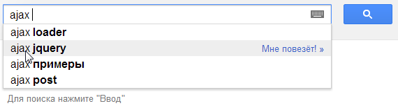

# Введение в AJAX и COMET

В этой главе мы "обзорно", на уровне возможностей и примеров рассмотрим технологию AJAX. Пока что с минимумом технических деталей.

Она будет полезна для понимания, что такое AJAX и с чем его едят.
[cut]

## Что такое AJAX? 

AJAX (аббревиатура от "<strong>A</strong>synchronous <strong>J</strong>avascript <strong>A</strong>nd <strong>X</strong>ml") -- технология обращения к серверу без перезагрузки страницы.

За счет этого уменьшается время отклика и веб-приложение по интерактивности больше напоминает десктоп.

Несмотря на то, что в названии технологии присутствует буква `X` (от слова XML), использовать XML вовсе не обязательно. Под AJAX подразумевают любое общение с сервером без перезагрузки страницы, организованное при помощи JavaScript.

## Что я могу сделать с помощью AJAX?

<dl>
<dt>Элементы интерфейса</dt>
<dd>В первую очередь AJAX полезен для форм и кнопок, связанных с элементарными действиями: добавить в корзину, подписаться, и т.п.

Сейчас -- в порядке вещей, что такие действия на сайтах осуществляются без перезагрузки страницы.
</dd>
<dt>Динамическая подгрузка данных</dt>
<dd>Например, дерево, которое при раскрытии узла запрашивает данные у сервера.</dd>
<dt>Живой поиск</dt>
<dd>*Живой поиск* -- классический пример использования AJAX, взятый на вооружение современными поисковыми системами.

Пользователь начинает печатать поисковую фразу, а JavaScript предлагает возможные варианты, получая список самых вероятных дополнений с сервера.

Код, который это обеспечивает, работает следующим образом.
<ol>
	<li>Код активируется примерно при каждом нажатии клавиши, но не чаще чем раз в 100мс (примерно).</li>
</ul>
</li>
	<li>Создается скрытый DIV и заполняется ответом сервера:
<ul>
	<li>Текущий результат подсвечен, можно перемещаться и выбирать</li>
	<li>При нажатии правой стрелки или при клике -- поиск в подрезультатах</li>
</ul>
</li>
	<li>Результаты запросов кешируются, повторных обращений к серверу не происходит.</li>
</ul>
</li>
<li>В Google не только предлагаются варианты, но система тут же инициирует и сам поиск, т.е. не нужно даже нажимать [key Enter].</li>
</ol>
</dd>
</dl>

**Технически, с помощью AJAX можно обмениваться любыми данными с сервером.**

Обычно используются форматы:
<ul>
<li>JSON -- для отправки и получения структурированных данных, объектов.</li>
<li>XML -- если сервер почему-то работает в формате XML, то можно использовать и его, есть средства.</li>
<li>HTML/текст -- можно и просто загрузить с сервера код HTML или текст для показа на странице.</li>
<li>Бинарные данные, файлы -- гораздо реже, в современных браузерах есть удобные средства для них.</li>
</ul>

## Что такое COMET?

[COMET](http://ru.wikipedia.org/wiki/Comet_(%D0%BF%D1%80%D0%BE%D0%B3%D1%80%D0%B0%D0%BC%D0%BC%D0%B8%D1%80%D0%BE%D0%B2%D0%B0%D0%BD%D0%B8%D0%B5)) -- общий термин, описывающий различные техники получения данных по инициативе сервера.

Можно сказать, что AJAX -- это "отправил запрос -- получил результат", а COMET -- это "непрерывный канал, по которому приходят данные".

Примеры COMET-приложений:

<ul>
<li>Чат -- человек сидит и смотрит, что пишут другие. При этом новые сообщения приходят "сами по себе", он не должен нажимать на кнопку для обновления окна чата.</li>
<li>Аукцион -- человек смотрит на экран и видит, как обновляется текущая ставка за товар.</li>
<li>Интерфейс редактирования -- когда один редактор начинает изменять документ, другие видят информацию об этом. Возможно и совместное редактирование, когда редакторы видят изменения друг друга.</li>
</ul>

На текущий момент технология COMET удобно реализуется во всех браузерах.

## Об этом разделе

Здесь мы будем говорить об AJAX и COMET на низком уровне, на уровне веб-стандартов и их использования.

Существуют библиотеки и фреймворки, добавляющие удобства, например [Socket.io](http://socket.io), [CometD](http://cometd.org/) и другие.

В принципе, можно начать их использовать и не зная, что внутри. Но, скорее всего, вам всё равно понадобится отлаживать ошибки, смотреть детали коммуникации, выбирать наилучшее решение для конкретной задачи, и здесь обязательно разбираться, как это всё работает.

