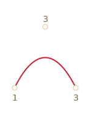
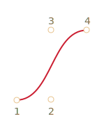
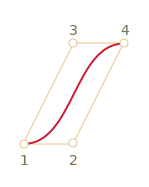
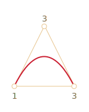
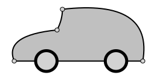
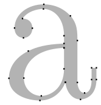
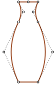
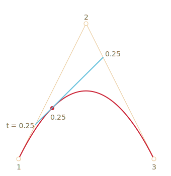

# Кривые Безье

Кривые Безье используются в компьютерной графике для рисования плавных изгибов, в CSS-анимации и много где ещё.

Несмотря на "умное" название -- это очень простая штука.

В принципе, можно создавать анимацию и без знания кривых Безье, но стоит один раз изучить эту тему хотя бы для того, чтобы в дальнейшем с комфортом пользоваться этим замечательным инструментом. Тем более что в мире векторной графики и продвинутых анимаций без них никак. 

[cut]

## Виды кривых Безье

[Кривая Безье](http://ru.wikipedia.org/wiki/%D0%9A%D1%80%D0%B8%D0%B2%D0%B0%D1%8F_%D0%91%D0%B5%D0%B7%D1%8C%D0%B5) задаётся опорными точками.

Их может быть две, три, четыре или больше. Например:

По двум точкам:

По трём точкам:

По четырём точкам:

Если вы посмотрите внимательно на эти кривые, то "на глазок" заметите: 
<ol>
<li>**Точки не всегда на кривой.** Это совершенно нормально, как именно строится кривая мы рассмотрим чуть позже.</li>
<li>**Степень кривой равна числу точек минус один**.
Для двух точек -- это линейная кривая (т.е. прямая), для трёх точек -- квадратическая кривая (парабола), для четырёх -- кубическая.</li>
<li>**Кривая всегда находится внутри [выпуклой оболочки](http://ru.wikipedia.org/wiki/%D0%92%D1%8B%D0%BF%D1%83%D0%BA%D0%BB%D0%B0%D1%8F_%D0%BE%D0%B1%D0%BE%D0%BB%D0%BE%D1%87%D0%BA%D0%B0), образованной опорными точками:**

 

Благодаря последнему свойству в компьютерной графике можно оптимизировать проверку пересечений двух кривых. Если их выпуклые оболочки не пересекаются, то и кривые тоже не пересекутся.
</li>
</ol>

Основная ценность кривых Безье -- в том, что, двигая точки, кривую можно менять, причём кривая при этом меняется интуитивно понятным образом.

Попробуйте двигать точки мышью в примере ниже:

[iframe src="demo.svg?nocpath=1&p=0,0,0.5,0,0.5,1,1,1" height=370]

**Как можно заметить, кривая натянута по касательным 1 -> 2 и 3 -> 4.**

После небольшой практики становится понятно, как расположить точки, чтобы получить нужную форму. А, соединяя несколько кривых, можно получить практически что угодно.

Вот некоторые примеры:

  

## Математика

У кривых Безье есть математическая формула. 

Как мы увидим далее, для пользования кривыми Безье знать её нет особенной необходимости, но для полноты картины -- вот она.

**Координаты кривой описываются в зависимости от параметра `t⋲[0,1]`**

<ul>
<li>Для двух точек:

[pre]
<code>P = (1-t)P1 + tP2</code>
[/pre]
</li>
<li>Для трёх точек:

[pre]
<code>P = (1−t)2P1 + 2(1−t)tP2 + t2P3</code>
[/pre]
</li>
<li>Для четырёх точек:

[pre]
<code>P = (1−t)3P1 + 3(1−t)2tP2  +3(1−t)t2P3 + t3P4</code>
[/pre]
</li>
</ul>

Вместо <code>Pi</code>  нужно подставить координаты i-й опорной точки <code>(xi, yi)</code>.

Эти уравнения векторные, то есть на для каждой из координат:
<ul>
<li><code>x = (1−t)2x1 + 2(1−t)tx2 + t2x3</code></li>
<li><code>y = (1−t)2y1 + 2(1−t)ty2 + t2y3</code></li>
</ul>

Вместо <code>x1, y1, x2, y2, x3, y3</code> подставляются координаты трёх опорных точек, и в то время как `t` пробегает множество от `0` до `1`, соответствующие значения `(x, y)` как раз и образуют кривую.

Впрочем, это чересчур наукообразно, не очень понятно, почему кривые именно такие, и как зависят от опорных точек. С этим нам поможет разобраться другой, более наглядный алгоритм.

## Рисование "де Кастельжо"

[Метод де Кастельжо](http://ru.wikipedia.org/wiki/%D0%90%D0%BB%D0%B3%D0%BE%D1%80%D0%B8%D1%82%D0%BC_%D0%B4%D0%B5_%D0%9A%D0%B0%D1%81%D1%82%D0%B5%D0%BB%D1%8C%D0%B6%D0%BE) идентичен математическому определению кривой и наглядно показывает, как она строится.

Посмотрим его на примере трёх точек (точки можно двигать). Нажатие на кнопку "play" запустит демонстрацию. 

[iframe src="demo.svg?p=0,0,0.5,1,1,0&animate=1" height=370]

**Алгоритм построения кривой по "методу де Кастельжо":**

<ol>
<li>Рисуем опорные точки. В примере выше это `1`, `2`, `3`.</li>
<li>Строятся отрезки между опорными точками 1 -> 2 -> 3. На рисунке выше они **чёрные**.</li>
<li>Параметр `t` пробегает значения от `0` до `1`. В примере выше использован шаг `0.05`, т.е. в цикле `0, 0.05, 0.1, 0.15, ... 0.95, 1`. 

Значение `t` пробегает интервал от 0 до 1, для каждого `t`:
<ol>
<li>На каждом из этих отрезков берётся точка, находящаяся от начала на расстоянии от 0 до `t` пропорционально длине.  Так как чёрных отрезков -- два, то и точек выходит две штуки.

То есть, при `t=0` -- точки будут в начале, при `t=0.25` -- на расстоянии в 25% от начала отрезка, при `t=0.5` -- 50%(на середине), при `t=1` -- в конце отрезка. 
</li>
<li>Эти точки соединяются. На рисунке ниже соединяющий их отрезок изображён синим.

<table>
<thead>
<tr><td>При `t=0.25`</td><td>При `t=0.5`</td></tr>
</thead>
<tbody>
<tr>
<td></td>
<td></td>
</tr>
</tbody>
</table>

</li>
<li>На получившемся отрезке берётся точка на расстоянии, соответствующем `t`. То есть, для `t=0.25` (первый рисунок) получаем точку в конце первой четверти отрезка, для `t=0.5` (второй рисунок) -- в середине отрезка. На рисунках выше эта точка отмечена красным. 
</li>
</ol>
</li>
<li>
По мере того как `t` пробегает последовательность от `0` до `1`, каждое значение `t` добавляет к кривой точку. **Совокупность таких точек для всех значений `t` образуют кривую Безье.**
</li>
</ol>

Это был процесс для построения по трём точкам. Но то же самое происходит и с четырьмя точками.

Демо для четырёх точек (точки можно двигать):

[iframe src="demo.svg?p=0,0,0.5,0,0.5,1,1,1&animate=1" height=370]

Алгоритм:
<ul>
<li>Точки по порядку соединяются отрезками: 1 -> 2, 2 -> 3, 3 -> 4. Получается три чёрных отрезка.</li>
<li>На отрезках берутся точки, соответствующие текущему `t`, соединяются. Получается два зелёных отрезка.</li>
<li>На этих отрезках берутся точки, соответствующие текущему `t`, соединяются. Получается один синий отрезок.</li>
<li>На синем отрезке берётся точка, соответствующая текущему `t`. При запуске примера выше она красная.</li>
<li>Эти точки описывают кривую.</li>
</ul>

Нажмите на кнопку "play" в примере выше, чтобы увидеть это в действии.

Ещё примеры кривых:

[iframe src="demo.svg?p=0,0,0,0.75,0.25,1,1,1&animate=1" height=370]

С другими точками:

[iframe src="demo.svg?p=0,0,1,0.5,0,0.5,1,1&animate=1" height=370]

Петелька:

[iframe src="demo.svg?p=0,0,1,0.5,0,1,0.5,0&animate=1" height=370]

Пример негладкой кривой Безье:

[iframe src="demo.svg?p=0,0,1,1,0,1,1,0&animate=1" height=370]

Аналогичным образом могут быть построены кривые Безье и более высокого порядка: по пяти точкам, шести и так далее. Но обычно используются 2-3 точки, а для сложных линий несколько кривых соединяются. Это гораздо проще с точки зрения поддержки и расчётов.

[smart header="Как провести кривую Безье через нужные точки?"]
Кривые Безье обычно проводятся при помощи "опорных" точек, из которых, как можно видеть из примеров выше, только первая и последняя лежат на кривой.

Если нужно провести кривую именно *через* нужные точки, то это уже другая задача, она называется [интерполяцией](http://ru.wikipedia.org/wiki/%D0%98%D0%BD%D1%82%D0%B5%D1%80%D0%BF%D0%BE%D0%BB%D1%8F%D1%86%D0%B8%D1%8F). Существуют математические формулы, которые подбирают коэффициенты кривой по точкам, исходя из требований, например [многочлен Лагранжа](http://ru.wikipedia.org/wiki/%D0%98%D0%BD%D1%82%D0%B5%D1%80%D0%BF%D0%BE%D0%BB%D1%8F%D1%86%D0%B8%D0%BE%D0%BD%D0%BD%D1%8B%D0%B9_%D0%BC%D0%BD%D0%BE%D0%B3%D0%BE%D1%87%D0%BB%D0%B5%D0%BD_%D0%9B%D0%B0%D0%B3%D1%80%D0%B0%D0%BD%D0%B6%D0%B0). 

Как правило, в компьютерной графике для интерполяции используют кубические кривые, соединённых гладким образом. Вместе они выглядят как одна кривая. Это называется [интерполяция сплайнами](http://ru.wikipedia.org/wiki/%D0%9A%D1%83%D0%B1%D0%B8%D1%87%D0%B5%D1%81%D0%BA%D0%B8%D0%B9_%D1%81%D0%BF%D0%BB%D0%B0%D0%B9%D0%BD).
[/smart]

## Итого

Кривые Безье задаются опорными точками. 

Мы рассмотрели два определения кривых:
<ol>
<li>Через математическую формулу.</li>
<li>Через процесс построения де Кастельжо.</li>
</ol>

Их удобство в том, что:
<ul>
<li>Можно легко нарисовать плавные линии вручную, передвигая точки мышкой.</li>
<li>Более сложные изгибы и линии можно составить, если соединить несколько кривых Безье.</li>
</ul>

Применение:

<ul>
<li>В компьютерной графике, моделировании, в графических редакторах. Шрифты описываются с помощью кривых Безье.</li>
<li>В веб-разработке -- для графики на Canvas или в формате SVG. Кстати, все живые примеры выше написаны на SVG. Фактически, это один SVG-документ, к которому точки передаются параметрами. Вы можете открыть его в отдельном окне и посмотреть исходник: [demo.svg](demo.svg?p=0,0,1,0.5,0,0.5,1,1&animate=1).</li>
<li>В CSS-анимации, для задания траектории или скорости передвижения.</li>
</ul>