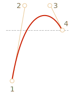

Для такой анимации необходимо подобрать правильную кривую Безье.

Чтобы она выпрыгивала вверх, обе опорные точки можно вынести по `y>1`, например: `cubic-bezier(0.25, 1.5, 0.75, 1.5)` (промежуточные опорные точки имеют `y=1.5`).

Её график:

