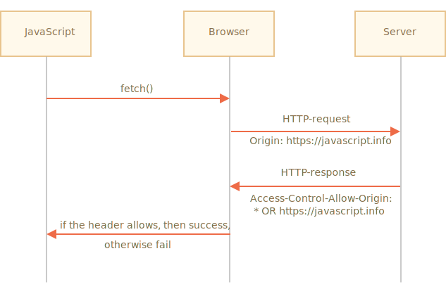
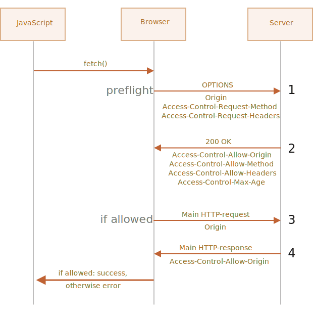

# Fetch: Cross-Origin Requests

If we send a `fetch` request to another web-site, it will probably fail.

For instance, let's try fetching `http://example.com`:

```js run async
try {
  await fetch('http://example.com');
} catch(err) {
  alert(err); // Failed to fetch
}
```

Fetch fails, as expected.

The core concept here is *origin* -- a domain/port/protocol triplet.

Cross-origin requests -- those sent to another domain (even a subdomain) or protocol or port -- require special headers from the remote side.

That policy is called "CORS": Cross-Origin Resource Sharing.

## Why is CORS needed? A brief history

CORS exists to protect the internet from evil hackers.

Seriously. Let's make a very brief historical digression.

**For many years a script from one site could not access the content of another site.**

That simple, yet powerful rule was a foundation of the internet security. E.g. an evil script from website `hacker.com` could not access user's mailbox at website `gmail.com`. People felt safe.

JavaScript also did not have any special methods to perform network requests at that time. It was a toy language to decorate a web page.

But web developers demanded more power. A variety of tricks were invented to work around the limitation and make requests to other websites.

### Using forms

One way to communicate with another server was to submit a `<form>` there. People submitted it into `<iframe>`, just to stay on the current page, like this:

```html
<!-- form target -->
*!*
<iframe name="iframe"></iframe>
*/!*

<!-- a form could be dynamically generated and submited by JavaScript -->
*!*
<form target="iframe" method="POST" action="http://another.com/…">
*/!*
  ...
</form>
```

So, it was possible to make a GET/POST request to another site, even without networking methods, as forms can send data anywhere. But as it's forbidden to access the content of an `<iframe>` from another site, it wasn't possible to read the response.

To be precise, there were actually tricks for that, they required special scripts at both the iframe and the page. So the communication with the iframe was technically possible. Right now there's no point to go into details, let these dinosaurs rest in peace.

### Using scripts

Another trick was to use a `script` tag. A script could have any `src`, with any domain, like `<script src="http://another.com/…">`. It's possible to execute a script from any website.

If a website, e.g. `another.com` intended to expose data for this kind of access, then a so-called "JSONP (JSON with padding)" protocol was used.

Here's how it worked.

Let's say we, at our site, need to get the data from `http://another.com`, such as the weather:

1. First, in advance, we declare a global function to accept the data, e.g. `gotWeather`.

    ```js
    // 1. Declare the function to process the weather data
    function gotWeather({ temperature, humidity }) {
      alert(`temperature: ${temperature}, humidity: ${humidity}`);
    }
    ```
2. Then we make a `<script>` tag with `src="http://another.com/weather.json?callback=gotWeather"`, using the name of our function as the `callback` URL-parameter.

    ```js
    let script = document.createElement('script');
    script.src = `http://another.com/weather.json?callback=gotWeather`;
    document.body.append(script);
    ```
3. The remote server `another.com` dynamically generates a script that calls `gotWeather(...)` with the data it wants us to receive.
    ```js
    // The expected answer from the server looks like this:
    gotWeather({
      temperature: 25,
      humidity: 78
    });
    ```
4. When the remote script loads and executes, `gotWeather` runs, and, as it's our function, we have the data.

That works, and doesn't violate security, because both sides agreed to pass the data this way. And, when both sides agree, it's definitely not a hack. There are still services that provide such access, as it works even for very old browsers.

After a while, networking methods appeared in browser JavaScript.

At first, cross-origin requests were forbidden. But as a result of long discussions, cross-origin requests were allowed, but with any new capabilities requiring an explicit allowance by the server, expressed in special headers.

## Safe requests

There are two types of cross-origin requests:

1. Safe requests.
2. All the others.

Safe Requests are simpler to make, so let's start with them.

A request is safe if it satisfies two conditions:

1. [Safe method](https://fetch.spec.whatwg.org/#cors-safelisted-method): GET, POST or HEAD
2. [Safe headers](https://fetch.spec.whatwg.org/#cors-safelisted-request-header) -- the only allowed custom headers are:
    - `Accept`,
    - `Accept-Language`,
    - `Content-Language`,
    - `Content-Type` with the value `application/x-www-form-urlencoded`, `multipart/form-data` or `text/plain`.

Any other request is considered "unsafe". For instance, a request with `PUT` method or with an `API-Key` HTTP-header does not fit the limitations.

**The essential difference is that a safe request can be made with a `<form>` or a `<script>`, without any special methods.**

So, even a very old server should be ready to accept a safe request.

Contrary to that, requests with non-standard headers or e.g. method `DELETE` can't be created this way. For a long time JavaScript was unable to do such requests. So an old server may assume that such requests come from a privileged source, "because a webpage is unable to send them".

When we try to make a unsafe request, the browser sends a special "preflight" request that asks the server -- does it agree to accept such cross-origin requests, or not?

And, unless the server explicitly confirms that with headers, a unsafe request is not sent.

Now we'll go into details.

## CORS for safe requests

If a request is cross-origin, the browser always adds `Origin` header to it.

For instance, if we request `https://anywhere.com/request` from `https://javascript.info/page`, the headers will be like:

```http
GET /request
Host: anywhere.com
*!*
Origin: https://javascript.info
*/!*
...
```

As you can see, `Origin` header contains exactly the origin (domain/protocol/port), without a path.

The server can inspect the `Origin` and, if it agrees to accept such a request, adds a special header `Access-Control-Allow-Origin` to the response. That header should contain the allowed origin (in our case `https://javascript.info`), or a star `*`. Then the response is successful, otherwise an error.

The browser plays the role of a trusted mediator here:
1. It ensures that the correct `Origin` is sent with a cross-origin request.
2. It checks for permitting `Access-Control-Allow-Origin` in the response, if it exists, then JavaScript is allowed to access the response, otherwise it fails with an error.



Here's an example of a permissive server response:
```http
200 OK
Content-Type:text/html; charset=UTF-8
*!*
Access-Control-Allow-Origin: https://javascript.info
*/!*
```

## Response headers

For cross-origin request, by default JavaScript may only access so-called "safe" response headers:

- `Cache-Control`
- `Content-Language`
- `Content-Type`
- `Expires`
- `Last-Modified`
- `Pragma`

Accessing any other response header causes an error.

```smart
There's no `Content-Length` header in the list!

This header contains the full response length. So, if we're downloading something and would like to track the percentage of progress, then an additional permission is required to access that header (see below).
```

To grant JavaScript access to any other response header, the server must send  `Access-Control-Expose-Headers` header. It contains a comma-separated list of unsafe header names that should be made accessible.

For example:

```http
200 OK
Content-Type:text/html; charset=UTF-8
Content-Length: 12345
API-Key: 2c9de507f2c54aa1
Access-Control-Allow-Origin: https://javascript.info
*!*
Access-Control-Expose-Headers: Content-Length,API-Key
*/!*
```

With such `Access-Control-Expose-Headers` header, the script is allowed to read `Content-Length` and `API-Key` headers of the response.

## "Unsafe" requests

We can use any HTTP-method: not just `GET/POST`, but also `PATCH`, `DELETE` and others.

Some time ago no one could even imagine that a webpage could make such requests. So there may still exist webservices that treat a non-standard method as a signal: "That's not a browser". They can take it into account when checking access rights.

So, to avoid misunderstandings, any "unsafe" request -- that couldn't be done in the old times, the browser does not make such requests right away. Before it sends a preliminary, so-called "preflight" request, asking for permission.

A preflight request uses method `OPTIONS`, no body and two headers:

- `Access-Control-Request-Method` header has the method of the unsafe request.
- `Access-Control-Request-Headers` header provides a comma-separated list of its unsafe HTTP-headers.

If the server agrees to serve the requests, then it should respond with empty body, status 200 and headers:

- `Access-Control-Allow-Origin` must be either `*` or the requesting origin, such as `https://javascript.info`, to allow it.
- `Access-Control-Allow-Methods` must have the allowed method.
- `Access-Control-Allow-Headers` must have a list of allowed headers.
- Additionally, the header `Access-Control-Max-Age` may specify a number of seconds to cache the permissions. So the browser won't have to send a preflight for subsequent requests that satisfy given permissions.



Let's see how it works step-by-step on example, for a cross-origin `PATCH` request (this method is often used to update data):

```js
let response = await fetch('https://site.com/service.json', {
  method: 'PATCH',
  headers: {
    'Content-Type': 'application/json',
    'API-Key': 'secret'
  }
});
```

There are three reasons why the request is unsafe (one is enough):
- Method `PATCH`
- `Content-Type` is not one of: `application/x-www-form-urlencoded`, `multipart/form-data`, `text/plain`.
- "Unsafe" `API-Key` header.

### Step 1 (preflight request)

Prior to sending such request, the browser, on its own, sends a preflight request that looks like this:

```http
OPTIONS /service.json
Host: site.com
Origin: https://javascript.info
Access-Control-Request-Method: PATCH
Access-Control-Request-Headers: Content-Type,API-Key
```

- Method: `OPTIONS`.
- The path -- exactly the same as the main request: `/service.json`.
- Cross-origin special headers:
    - `Origin` -- the source origin.
    - `Access-Control-Request-Method` -- requested method.
    - `Access-Control-Request-Headers` -- a comma-separated list of "unsafe" headers.

### Step 2 (preflight response)

The server should respond with status 200 and headers:
- `Access-Control-Allow-Origin: https://javascript.info`
- `Access-Control-Allow-Methods: PATCH`
- `Access-Control-Allow-Headers: Content-Type,API-Key`.

That allows future communication, otherwise an error is triggered.

If the server expects other methods and headers in the future, it makes sense to allow them in advance by adding to the list.

For example, this response also allows `PUT`, `DELETE` and additional headers:

```http
200 OK
Access-Control-Allow-Origin: https://javascript.info
Access-Control-Allow-Methods: PUT,PATCH,DELETE
Access-Control-Allow-Headers: API-Key,Content-Type,If-Modified-Since,Cache-Control
Access-Control-Max-Age: 86400
```

Now the browser can see that `PATCH` is in `Access-Control-Allow-Methods` and `Content-Type,API-Key` are in the list `Access-Control-Allow-Headers`, so it sends out the main request.

If there's header `Access-Control-Max-Age` with a number of seconds, then the preflight permissions are cached for the given time. The response above will be cached for 86400 seconds (one day). Within this timeframe, subsequent requests will not cause a preflight. Assuming that they fit the cached allowances, they will be sent directly.

### Step 3 (actual request)

When the preflight is successful, the browser now makes the main request. The algorithm here is the same as for safe requests.

The main request has `Origin` header (because it's cross-origin):

```http
PATCH /service.json
Host: site.com
Content-Type: application/json
API-Key: secret
Origin: https://javascript.info
```

### Step 4 (actual response)

The server should not forget to add `Access-Control-Allow-Origin` to the main response. A successful preflight does not relieve from that:

```http
Access-Control-Allow-Origin: https://javascript.info
```

Then JavaScript is able to read the main server response.

```smart
Preflight request occurs "behind the scenes", it's invisible to JavaScript.

JavaScript only gets the response to the main request or an error if there's no server permission.
```

## Credentials

A cross-origin request initiated by JavaScript code by default does not bring any credentials (cookies or HTTP authentication).

That's uncommon for HTTP-requests. Usually, a request to `http://site.com` is accompanied by all cookies from that domain. But cross-origin requests made by JavaScript methods are an exception.

For example, `fetch('http://another.com')` does not send any cookies, even those  (!) that belong to `another.com` domain.

Why?

That's because a request with credentials is much more powerful than without them. If allowed, it grants JavaScript the full power to act on behalf of the user and access sensitive information using their credentials.

Does the server really trust the script that much? Then it must explicitly allow requests with credentials with an additional header.

To send credentials in `fetch`, we need to add the option `credentials: "include"`, like this:

```js
fetch('http://another.com', {
  credentials: "include"
});
```

Now `fetch` sends cookies originating from `another.com` with request to that site.

If the server agrees to accept the request *with credentials*, it should add a header `Access-Control-Allow-Credentials: true` to the response, in addition to `Access-Control-Allow-Origin`.

For example:

```http
200 OK
Access-Control-Allow-Origin: https://javascript.info
Access-Control-Allow-Credentials: true
```

Please note: `Access-Control-Allow-Origin` is prohibited from using a star `*` for requests with credentials. Like shown above, it must provide the exact origin there. That's an additional safety measure, to ensure that the server really knows who it trusts to make such requests.

## Summary

From the browser point of view, there are two kinds of cross-origin requests: "safe" and all the others.

"Safe" requests must satisfy the following conditions:
- Method: GET, POST or HEAD.
- Headers -- we can set only:
    - `Accept`
    - `Accept-Language`
    - `Content-Language`
    - `Content-Type` to the value `application/x-www-form-urlencoded`, `multipart/form-data` or `text/plain`.

The essential difference is that safe requests were doable since ancient times using `<form>` or `<script>` tags, while unsafe were impossible for browsers for a long time.

So, the practical difference is that safe requests are sent right away, with `Origin` header, while for the other ones the browser makes a preliminary "preflight" request, asking for permission.

**For safe requests:**

- → The browser sends `Origin` header with the origin.
- ← For requests without credentials (not sent default), the server should set:
    - `Access-Control-Allow-Origin` to `*` or same value as `Origin`
- ← For requests with credentials, the server should set:
    - `Access-Control-Allow-Origin` to same value as `Origin`
    - `Access-Control-Allow-Credentials` to `true`

Additionally, to grant JavaScript access to any response headers except `Cache-Control`,  `Content-Language`, `Content-Type`, `Expires`, `Last-Modified` or `Pragma`, the server should list the allowed ones in `Access-Control-Expose-Headers` header.

**For unsafe requests, a preliminary "preflight" request is issued before the requested one:**

- → The browser sends `OPTIONS` request to the same URL, with headers:
    - `Access-Control-Request-Method` has requested method.
    - `Access-Control-Request-Headers` lists unsafe requested headers.
- ← The server should respond with status 200 and headers:
    - `Access-Control-Allow-Methods` with a list of allowed methods,
    - `Access-Control-Allow-Headers` with a list of allowed headers,
    - `Access-Control-Max-Age` with a number of seconds to cache permissions.
- Then the actual request is sent, the previous "safe" scheme is applied.
