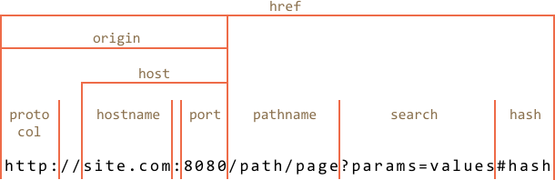

# URL objects

The built-in [URL](https://url.spec.whatwg.org/#api) class provides a convenient interface for creating and parsing URLs.

There are no networking methods that require exactly an `URL` object, strings are good enough. So technically we don't have to use `URL`. But sometimes it can be really helpful.

## Creating an URL

The syntax to create a new URL object:

```js
new URL(url, [base])
```

- **`url`** -- the URL string or path (if base is set, see below).
- **`base`** -- an optional base, if set and `url` has only path, then the URL is generated relative to `base`.

For example, these two URLs are same:

```js run
let url1 = new URL('https://javascript.info/profile/admin');
let url2 = new URL('/profile/admin', 'https://javascript.info');

alert(url1); // https://javascript.info/profile/admin
alert(url2); // https://javascript.info/profile/admin
```

Go to the path relative to the current URL:

```js run
let url = new URL('https://javascript.info/profile/admin');
let testerUrl = new URL('tester', url);

alert(testerUrl); // https://javascript.info/profile/tester
```


The `URL` object immediately allows us to access its components, so it's a nice way to parse the url, e.g.:

```js run
let url = new URL('https://javascript.info/url');

alert(url.protocol); // https:
alert(url.host);     // javascript.info
alert(url.pathname); // /url
```

Here's the cheatsheet:



- `href` is the full url, same as `url.toString()`
- `protocol` ends with the colon character `:`
- `search` - a string of parameters, starts with the question mark `?`
- `hash` starts with the hash character `#`
- there are also `user` and `password` properties if HTTP authentication is present.


```smart header="We can use `URL` everywhere instead of a string"
We can use an `URL` object in `fetch` or `XMLHttpRequest`, almost everywhere where a string url is expected.

In the vast majority of methods it's automatically converted to a string.
```

## SearchParams "?..."

Let's say we want to create an url with given search params, for instance, `https://google.com/search?query=JavaScript`.

They must be correctly encoded to include non-latin charcters, spaces etc.

Some time ago, before `URL` objects appeared, we'd use built-in functions `encodeURIComponent/decodeURIComponent`. They have some problems, but now that doesn't matter.

There's URL property for that: `url.searchParams` is an object of type [URLSearchParams](https://url.spec.whatwg.org/#urlsearchparams).

It provides convenient methods for search parameters:

- **`append(name, value)`** -- add the parameter,
- **`delete(name)`** -- remove the parameter,
- **`get(name)`** -- get the parameter,
- **`getAll(name)`** -- get all parameters with that name (if many, e.g. `?user=John&user=Pete`),
- **`has(name)`** -- check for the existance of the parameter,
- **`set(name, value)`** -- set/replace the parameter,
- **`sort()`** -- sort parameters by name, rarely needed,
- ...and also iterable, similar to `Map`.

So, `URL` object also provides an easy way to operate on url parameters.

For example:

```js run
let url = new URL('https://google.com/search');
url.searchParams.set('query', 'test me!'); // added parameter with a space and !

alert(url); // https://google.com/search?query=test+me%21

url.searchParams.set('tbs', 'qdr:y'); // add param for date range: past year

alert(url); // https://google.com/search?query=test+me%21&tbs=qdr%3Ay

// iterate over search parameters (decoded)
for(let [name, value] of url.searchParams) {
  alert(`${name}=${value}`); // query=test me!, then tbs=qdr:y
}
```
