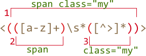

# Capturing groups

A part of a pattern can be enclosed in parentheses `pattern:(...)`. This is called a "capturing group".

That has two effects:

1. It allows to place a part of the match into a separate array item when using  [String#match](mdn:js/String/match) or [RegExp#exec](mdn:/RegExp/exec) methods.
2. If we put a quantifier after the parentheses, it applies to the parentheses as a whole, not the last character.

## Example

In the example below the pattern `pattern:(go)+` finds one or more `match:'go'`:

```js run
alert( 'Gogogo now!'.match(/(go)+/i) ); // "Gogogo"
```

Without parentheses, the pattern `pattern:/go+/` means `subject:g`, followed by `subject:o` repeated one or more times. For instance, `match:goooo` or `match:gooooooooo`.

Parentheses group the word `pattern:(go)` together.

Let's make something more complex -- a regexp to match an email.

Examples of emails:

```
my@mail.com
john.smith@site.com.uk
```

The pattern: `pattern:[-.\w]+@([\w-]+\.)+[\w-]{2,20}`.

- The first part before `@` may include any alphanumeric word characters, a dot and a dash `pattern:[-.\w]+`, like `match:john.smith`.
- Then `pattern:@`
- And then the domain and maybe a second-level domain like `site.com` or with subdomains like `host.site.com.uk`. We can match it as "a word followed by a dot" repeated one or more times for subdomains: `match:mail.` or `match:site.com.`, and then "a word" for the last part: `match:.com` or `match:.uk`.

    The word followed by a dot is `pattern:(\w+\.)+` (repeated). The last word should not have a dot at the end, so it's just `\w{2,20}`. The quantifier `pattern:{2,20}` limits the length, because domain zones are like `.uk` or `.com` or `.museum`, but can't be longer than 20 characters.

    So the domain pattern is `pattern:(\w+\.)+\w{2,20}`. Now we replace `\w` with `[\w-]`, because dashes are also allowed in domains, and we get the final result.

That regexp is not perfect, but usually works. It's short and good enough to fix errors or occasional mistypes.

For instance, here we can find all emails in the string:

```js run
let reg = /[-.\w]+@([\w-]+\.)+[\w-]{2,20}/g;

alert("my@mail.com @ his@site.com.uk".match(reg)); // my@mail.com,his@site.com.uk
```


## Contents of parentheses  

Parentheses are numbered from left to right. The search engine remembers the content of each and allows to reference it in the pattern or in the replacement string.

For instance, we can find an HTML-tag using a (simplified) pattern `pattern:<.*?>`. Usually we'd want to do something with the result after it.

If we enclose the inner contents of `<...>` into parentheses, then we can access it like this:

```js run
let str = '<h1>Hello, world!</h1>';
let reg = /<(.*?)>/;

alert( str.match(reg) ); // Array: ["<h1>", "h1"]
```

The call to [String#match](mdn:js/String/match) returns groups only if the regexp has no `pattern:/.../g` flag.

If we need all matches with their groups then we can use [RegExp#exec](mdn:js/RegExp/exec) method as described in <info:regexp-methods>:

```js run
let str = '<h1>Hello, world!</h1>';

// two matches: opening <h1> and closing </h1> tags
let reg = /<(.*?)>/g;

let match;

while (match = reg.exec(str)) {
  // first shows the match: <h1>,h1
  // then shows the match: </h1>,/h1
  alert(match);
}
```

Here we have two matches for `pattern:<(.*?)>`, each of them is an array with the full match and groups.

## Nested groups

Parentheses can be nested. In this case the numbering also goes from left to right.

For instance, when searching a tag in `subject:<span class="my">` we may be interested in:

1. The tag content as a whole: `match:span class="my"`.
2. The tag name: `match:span`.
3. The tag attributes: `match:class="my"`.

Let's add parentheses for them:

```js run
let str = '<span class="my">';

let reg = /<(([a-z]+)\s*([^>]*))>/;

let result = str.match(reg);
alert(result); // <span class="my">, span class="my", span, class="my"
```

Here's how groups look:



At the zero index of the `result` is always the full match.

Then groups, numbered from left to right. Whichever opens first gives the first group `result[1]`. Here it encloses the whole tag content.

Then in `result[2]` goes the group from the second opening `pattern:(` till the corresponding `pattern:)` -- tag name, then we don't group spaces, but group attributes for `result[3]`.

**If a group is optional and doesn't exist in the match, the corresponding `result` index is present (and equals `undefined`).**

For instance, let's consider the regexp `pattern:a(z)?(c)?`. It looks for `"a"` optionally followed by `"z"` optionally followed by `"c"`.

If we run it on the string with a single letter `subject:a`, then the result is:

```js run
let match = 'a'.match(/a(z)?(c)?/);

alert( match.length ); // 3
alert( match[0] ); // a (whole match)
alert( match[1] ); // undefined
alert( match[2] ); // undefined
```

The array has the length of `3`, but all groups are empty.

And here's a more complex match for the string `subject:ack`:

```js run
let match = 'ack'.match(/a(z)?(c)?/)

alert( match.length ); // 3
alert( match[0] ); // ac (whole match)
alert( match[1] ); // undefined, because there's nothing for (z)?
alert( match[2] ); // c
```

The array length is permanent: `3`. But there's nothing for the group `pattern:(z)?`, so the result is `["ac", undefined, "c"]`.

## Non-capturing groups with ?:

Sometimes we need parentheses to correctly apply a quantifier, but we don't want their contents in the array.

A group may be excluded by adding `pattern:?:` in the beginning.

For instance, if we want to find `pattern:(go)+`, but don't want to put remember the contents (`go`) in a separate array item, we can write: `pattern:(?:go)+`.

In the example below we only get the name "John" as a separate member of the `results` array:

```js run
let str = "Gogo John!";
*!*
// exclude Gogo from capturing
let reg = /(?:go)+ (\w+)/i;
*/!*

let result = str.match(reg);

alert( result.length ); // 2
alert( result[1] ); // John
```
