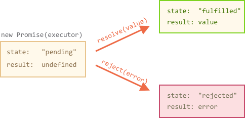
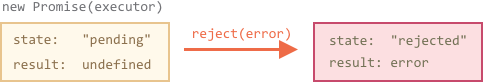

# Promise

Imagine that you're a top singer, and fans ask for your next upcoming single day and night.

To get a relief, you promise to send it to them when it's published. You give your fans a list. They can fill in their coordinates, so that when the song becomes available, all subscribed parties instantly get it. And if something goes very wrong, so that the song won't be published ever, then they are also to be notified.

Everyone is happy: you, because the people don't crowd you any more, and fans, because they won't miss the single.

That was a real-life analogy for things we often have in programming:

1. A "producing code" that does something and needs time. For instance, it loads a remote script. That's the "singer".
2. A "consuming code" wants the result when it's ready. Many functions may need that result. So that's the "fans".
3. A *promise* is a special JavaScript object that links them together. That's the "list". The producing code makes it and gives to everyone, so that they can subscribe for the result.

The analogy isn't very accurate, because JavaScript promises are more complex than a simple list: they have additional features and limitations. But still they are alike.

The constructor syntax for a promise object is:

```js
let promise = new Promise(function(resolve, reject) {
  // producing code
});
```

The function passed to `new Promise` is called *executor*. When the promise is created, it's called automatically. It contains the producing code, that should eventually finish with a result. In terms of the analogy above, the executor is a "singer".

The `promise` object has internal properties:

- `state` -- initially is "pending", then changes to "fulfilled" or "rejected",
- `result` -- an arbitrary value, initially `undefined`.

Both `state` and `result` are managed by the executor.

When the executor finishes the job, it should call one of:

- `resolve(value)` -- to indicate that the job finished successfully:
    - sets `state` to `"fulfilled"`,
    - sets `result` to `value`.
- `reject(error)` -- to indicate that an error occured:
    - sets `state` to `"rejected"`,
    - sets `result` to `error`.



Here's a simple executor, just to see it in action:

```js run
let promise = new Promise(function(resolve, reject) {
  // the function is executed automatically when the promise is constructed

  alert(resolve); // function () { [native code] }
  alert(reject);  // function () { [native code] }

  // after 1 second signal that the job is done with the result "done!"
  setTimeout(() => *!*resolve("done!")*/!*, 1000);
});
```

We can see two things by running the code above:

1. The executor is called automatically and immediately (by `new Promise`).
2. Executor arguments `resolve` and `reject` are functions that come from JavaScript engine. We don't need to create them (their string representation may vary between JavaScript engines). Instead the executor should call them when ready.

After one second of thinking it calls `resolve("done")` to produce the result:


The next example rejects the promise with an error:

```js
let promise = new Promise(function(resolve, reject) {
  // after 1 second signal that the job is finished with an error
  setTimeout(() => *!*reject(new Error("Whoops!"))*/!*, 1000);
});
```



The promise that is either resolved or rejected is called "settled", as opposed to a "pending" promise.

````smart header="There can be only one result or an error"
The executor should call only one `resolve` or `reject`. And the promise state change is final.

All further calls of `resolve` and `reject` are ignored:

```js
let promise = new Promise(function(resolve, reject) {
  resolve("done");

  reject(new Error("…")); // ignored
  setTimeout(() => resolve("…")); // ignored
});
```

The idea is that a job done by the executor may have only one result or an error. In programming, there exist other data structures that allow many "flowing" results, for instance streams and queues. They have their own advantages and disadvantages versus promises. They are not supported by JavaScript core and lack certain language features that promises provide, so we don't cover them here, to concentrate on promises.

Also we if we call `resolve/reject` with more then one argument -- only the first argument is used, the next ones are ignored.
````

```smart header="Reject with `Error` objects"
Technically we can call `reject` (just like `resolve`) with any type of argument. But it's recommended to use `Error` objects in `reject` (or inherit from them). The reasoning for that will become obvious soon.
```

````smart header="Resolve/reject can be immediate"
In practice an executor usually does something asynchronously and calls `resolve/reject` after some time, but it doesn't have to. We can call `resolve` or `reject` immediately, like this:

```js
let promise = new Promise(function(resolve, reject) {
  resolve(123); // immediately give the result: 123
});
```

For instance, it happens when we start to do a job and then see that everything has already been done. Technically that's fine: we have a resolved promise right now.
````

```smart header="The `state` and `result` are internal"
Properties `state` and `result` of a promise object are internal. We can't directly access them from our code, but we can use methods `.then/catch` for that, they are described below.
```

## Consumers: ".then" and ".catch"

A promise object serves as a link between the producing code (executor) and the consuming code. "Consumers" -- functions that want to receive the result/error can be registered using methods `promise.then` and `promise.catch`.


The syntax of `.then` is:

```js
promise.then(
  function(result) { /* handle a sucessful result */ },
  function(error) { /* handle an error */ }
);
```

The first function argument runs when the promise is resolved and gets the result, and the second one -- when it's rejected and gets the error.

For instance:

```js run
let promise = new Promise(function(resolve, reject) {
  setTimeout(() => resolve("done!"), 1000);
});

// resolve runs the first function in .then
promise.then(
*!*
  result => alert(result), // shows "done!" after 1 second
*/!*
  error => alert(error) // doesn't run
);
```

In case of a rejection:

```js run
let promise = new Promise(function(resolve, reject) {
  setTimeout(() => reject(new Error("Whoops!")), 1000);
});

// reject runs the second function in .then
promise.then(
  result => alert(result), // doesn't run
*!*
  error => alert(error) // shows "Error: Whoops!" after 1 second
*/!*
);
```

If we're interested only in successful completions, then we can provide only one argument to `.then`:

```js run
let promise = new Promise(resolve => {
  setTimeout(() => resolve("done!"), 1000);
});

*!*
promise.then(alert); // shows "done!" after 1 second
*/!*
```

If we're interested only in errors, then we can use `.then(null, function)` or an "alias" to it: `.catch(function)`


```js run
let promise = new Promise((resolve, reject) => {
  setTimeout(() => reject(new Error("Whoops!")), 1000);
});

*!*
// .catch(f) is the same as promise.then(null, f)
promise.catch(alert); // shows "Error: Whoops!" after 1 second
*/!*
```

So, `.catch(f)` is a complete analog of `.then(null, f)`, just a shorthand.

````smart header="On settled promises `then` runs immediately"
If a promise is pending, `.then/catch` handlers wait for the result. Otherwise, if a promise has already settled, they execute immediately:

```js run
// an immediately resolved promise
let promise = new Promise(resolve => resolve("done!"));

promise.then(alert); // done! (shows up right now)
```

That's good for jobs that may sometimes require time and sometimes finish immediately. The handler is guaranteed to run in both cases.

To be precise, `.then/catch` queue up and are taken from the queue asynchronously when the current code finishes, like `setTimeout(..., 0)`.

So here the `alert` call is "queued" and runs immediately after the code finishes:

```js run
// an immediately resolved promise
let promise = new Promise(resolve => resolve("done!"));

promise.then(alert); // done! (right after the current code finishes)

alert("code finished"); // this alert shows first
```

In practice the time for the code to finish execution is usually negligible. But the code after `.then` always executes before the `.then` handler (even in the case of a pre-resolved promise), that could matter.
````

Now let's see more practical examples to see how promises can help us in writing asynchronous code.

## Example: loadScript

We have the `loadScript` function for loading a script from the previous chapter.

Here's the callback-based variant, just to remind it:

```js
function loadScript(src, callback) {
  let script = document.createElement('script');
  script.src = src;

  script.onload = () => callback(null, script);
  script.onerror = () => callback(new Error(`Script load error ` + src));

  document.head.append(script);
}
```

Let's rewrite it using promises.

The new function `loadScript` will not require a callback. Instead it will create and return a promise object that settles when the loading is complete. The outer code can add handlers to it using `.then`:

```js run
function loadScript(src) {  
  return new Promise(function(resolve, reject) {
    let script = document.createElement('script');
    script.src = src;

    script.onload = () => resolve(script);
    script.onerror = () => reject(new Error("Script load error: " + src));

    document.head.append(script);
  });
}
```

Usage:

```js run
let promise = loadScript("https://cdnjs.cloudflare.com/ajax/libs/lodash.js/3.2.0/lodash.js");
promise.then(
  script => alert(`${script.src} is loaded!`),
  error => alert(`Error: ${error.message}`)
);

promise.then(script => alert('One more handler to do something else!'));
```

We can immediately see few benefits over the callback-based syntax:

```compare minus="Callbacks" plus="Promises"
- We must have a ready `callback` function when calling `loadScript`. In other words, we must know what to do with the result *before* `loadScript` is called.
- There can be only one callback.
+ Promises allow us to code more naturally. First we run `loadScript`, and `.then` code what we do with the result.
+ We can call `.then` as many times as we want, at any point of time later.
```

So promises already give us better code flow and flexibility. But there's more. We'll see that in the next chapters.
