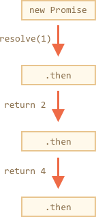
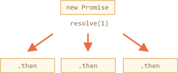
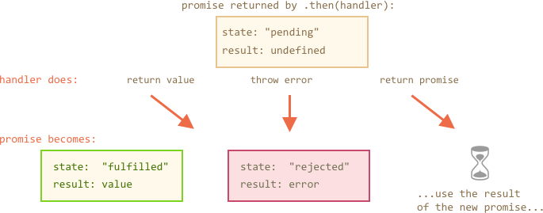
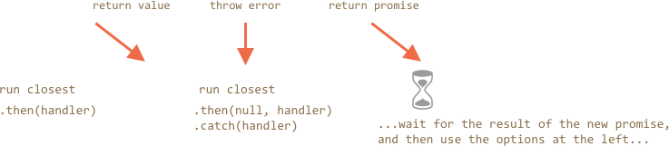

# Promises chaining

Let's return to the problem mentioned in the chapter <info:callbacks>.

- We have a sequence of asynchronous tasks to be done one after another. For instance, loading scripts.
- How to code it well?

Promises provide a couple of recipes to do that.

[cut]

In this chapter we cover promise chaining.

It looks like this:

```js run
new Promise(function(resolve, reject) {

  setTimeout(() => resolve(1), 1000); // (*)

}).then(function(result) { // (**)

  alert(result); // 1
  return result * 2;

}).then(function(result) { // (***)

  alert(result); // 2
  return result * 2;

}).then(function(result) {

  alert(result); // 4
  return result * 2;

});
```

The idea is that the result is passed through the chain of `.then` handlers.

Here the flow is:
1. The initial promise resolves in 1 second `(*)`,
2. Then the `.then` handler is called `(**)`.
3. The value that it returns is passed to the next `.then` handler `(***)`
4. ...and so on.

As the result is passed along the chain of handlers, we can see a sequence of `alert` calls: `1` -> `2` -> `4`.



The whole thing works, because a call to `promise.then` returns a promise, so that we can call the next `.then` on it.

When a handler returns a value, it becomes the result of that promise, so the next `.then` is called with it.

To make these words more clear, here's the start of the chain:

```js run
new Promise(function(resolve, reject) {

  setTimeout(() => resolve(1), 1000);

}).then(function(result) {

  alert(result);
  return result * 2; // <-- (1)

}) // <-- (2)
// .then…
```

The value returned by `.then` is a promise, that's why we are able to add another `.then` at `(2)`. When the value is returned in `(1)`, that promise becomes resolved, so the next handler runs with the value.

Unlike the chaining, technically we can also add many `.then` to a single promise, like this:

```js run
let promise = new Promise(function(resolve, reject) {
  setTimeout(() => resolve(1), 1000);
});

promise.then(function(result) {
  alert(result); // 1
  return result * 2;
});

promise.then(function(result) {
  alert(result); // 1
  return result * 2;
});

promise.then(function(result) {
  alert(result); // 1
  return result * 2;
});
```

...But that's a totally different thing. Here's the picture (compare it with the chaining above):



All `.then` on the same promise get the same result -- the result of that promise. So in the code above all `alert` show the same: `1`. There is no result-passing between them.

In practice we rarely need multiple handlers for one promise. Chaining is used much more often.

## Returning promises

Normally, a value returned by a `.then` handler is immediately passed to the next handler. But there's an exception.

If the returned value is a promise, then the further execution is suspended until it settles. After that, the result of that promise is given to the next `.then` handler.

For instance:

```js run
new Promise(function(resolve, reject) {

  setTimeout(() => resolve(1), 1000);

}).then(function(result) {

  alert(result); // 1

*!*
  return new Promise((resolve, reject) => { // (*)
    setTimeout(() => resolve(result * 2), 1000);
  });
*/!*

}).then(function(result) { // (**)

  alert(result); // 2

  return new Promise((resolve, reject) => {
    setTimeout(() => resolve(result * 2), 1000);
  });

}).then(function(result) {

  alert(result); // 4

});
```

Here the first `.then` shows `1` returns `new Promise(…)` in the line `(*)`. After one second it resolves, and the result (the argument of `resolve`, here it's `result*2`) is passed on to handler of the second `.then` in the line `(**)`. It shows `2` and does the same thing.

So the output is again 1 -> 2 > 4, but now with 1 second delay between `alert` calls.

Returning promises allows us to build chains of asynchronous actions.

## Example: loadScript

Let's use this feature with `loadScript` to load scripts one by one, in sequence:

```js run
loadScript("/article/promise-chaining/one.js")
  .then(function(script) {
    return loadScript("/article/promise-chaining/two.js");
  })
  .then(function(script) {
    return loadScript("/article/promise-chaining/three.js");
  })
  .then(function(script) {
    // use functions declared in scripts
    // to show that they indeed loaded
    one();
    two();
    three();
  });
```

Here each `loadScript` call returns a promise, and the next `.then` runs when it resolves. Then it initiates the loading of the next script. So scripts are loaded one after another.

We can add more asynchronous actions to the chain. Please note that code is still "flat", it grows down, not to the right. There are no signs of "pyramid of doom".

Please note that technically it is also possible to write `.then` directly after each promise, without returning them, like this:

```js run
loadScript("/article/promise-chaining/one.js").then(function(script1) {
  loadScript("/article/promise-chaining/two.js").then(function(script2) {
    loadScript("/article/promise-chaining/three.js").then(function(script3) {
      // this function has access to variables script1, script2 and script3
      one();
      two();
      three();
    });
  });
});
```

This code does the same: loads 3 scripts in sequence. But it "grows to the right". So we have the same problem as with callbacks. Use chaining (return promises from `.then`) to evade it.

Sometimes it's ok to write `.then` directly, because the nested function has access to the outer scope (here the most nested callback has access to all variables `scriptX`), but that's an exception rather than a rule.


````smart header="Thenables"
To be precise, `.then` may return an arbitrary "thenable" object, and it will be treated the same way as a promise.

A "thenable" object is any object with a method `.then`.

The idea is that 3rd-party libraries may implement "promise-compatible" objects of their own. They can have extended set of methods, but also be compatible with native promises, because they implement `.then`.

Here's an example of a thenable object:

```js run
class Thenable {
  constructor(num) {
    this.num = num;
  }
  then(resolve, reject) {
    alert(resolve); // function() { native code }
    // resolve with this.num*2 after the 1 second
    setTimeout(() => resolve(this.num * 2), 1000); // (**)
  }
}

new Promise(resolve => resolve(1))
  .then(result => {
    return new Thenable(result); // (*)
  })
  .then(alert); // shows 2 after 1000ms
```

JavaScript checks the object returned by `.then` handler in the line `(*)`: if it has a callable method named `then`, then it calls that method providing native functions `resolve`, `reject` as arguments (similar to executor) and waits until one of them is called. In the example above `resolve(2)` is called after 1 second `(**)`. Then the result is passed further down the chain.

This feature allows to integrate custom objects with promise chains without having to inherit from `Promise`.
````


## Bigger example: fetch

In frontend programming promises are often used for network requests. So let's see an extended example of that.

We'll use the [fetch](mdn:api/WindowOrWorkerGlobalScope/fetch) method to load the information about the user from the remote server. The method is quite complex, it has many optional parameters, but the basic usage is quite simple:

```js
let promise = fetch(url);
```

This makes a network request to the `url` and returns a promise. The promise resolves with a `response` object when the remote server responds with headers, but *before the full response is downloaded*.

To read the full response, we should call a method `response.text()`: it returns a promise that resolves  when the full text downloaded from the remote server, with that text as a result.

The code below makes a request to `user.json` and loads its text from the server:

```js run
fetch('/article/promise-chaining/user.json')
  // .then below runs when the remote server responds
  .then(function(response) {
    // response.text() returns a new promise that resolves with the full response text
    // when we finish downloading it
    return response.text();
  })
  .then(function(text) {
    // ...and here's the content of the remote file
    alert(text); // {"name": "iliakan", isAdmin: true}
  });
```

There is also a method `response.json()` that reads the remote data and parses it as JSON. In our case that's even more convenient, so let's switch to it.

We'll also use arrow functions for brevity:

```js run
// same as above, but response.json() parses the remote content as JSON
fetch('/article/promise-chaining/user.json')
  .then(response => response.json())
  .then(user => alert(user.name)); // iliakan
```

Now let's do something with the loaded user.

For instance, we can make one more request to github, load the user profile and show the avatar:

```js run
// Make a request for user.json
fetch('/article/promise-chaining/user.json')
  // Load it as json
  .then(response => response.json())
  // Make a request to github
  .then(user => fetch(`https://api.github.com/users/${user.name}`))
  // Load the response as json
  .then(response => response.json())
  // Show the avatar image (githubUser.avatar_url) for 3 seconds (maybe animate it)
  .then(githubUser => {
    let img = document.createElement('img');
    img.src = githubUser.avatar_url;
    img.className = "promise-avatar-example";
    document.body.append(img);

    setTimeout(() => img.remove(), 3000); // (*)
  });
```

The code works, see comments about the details, but it should be quite self-descriptive. Although, there's a potential problem in it, a typical error of those who begin to use promises.

Look at the line `(*)`: how can we do something *after* the avatar has finished showing and gets removed? For instance, we'd like to show a form for editing that user or something else. As of now, there's no way.

To make the chain extendable, we need to return a promise that resolves when the avatar finishes showing.

Like this:

```js run
fetch('/article/promise-chaining/user.json')
  .then(response => response.json())
  .then(user => fetch(`https://api.github.com/users/${user.name}`))
  .then(response => response.json())
*!*
  .then(githubUser => new Promise(function(resolve, reject) {
*/!*
    let img = document.createElement('img');
    img.src = githubUser.avatar_url;
    img.className = "promise-avatar-example";
    document.body.append(img);

    setTimeout(() => {
      img.remove();
*!*
      resolve(githubUser);
*/!*
    }, 3000);
  }))
  // triggers after 3 seconds
  .then(githubUser => alert(`Finished showing ${githubUser.name}`));
```

Now right after `setTimeout` runs `img.remove()`, it calls `resolve(githubUser)`, thus passing the control to the next `.then` in the chain and passing forward the user data.

As a rule, an asynchronous action should always return a promise.

That makes possible to plan actions after it. Even if we don't plan to extend the chain now, we may need it later.

Finally, we can split the code into reusable functions:

```js run
function loadJson(url) {
  return fetch(url)
    .then(response => response.json());
}

function loadGithubUser(name) {
  return fetch(`https://api.github.com/users/${name}`)
    .then(response => response.json());
}

function showAvatar(githubUser) {
  return new Promise(function(resolve, reject) {
    let img = document.createElement('img');
    img.src = githubUser.avatar_url;
    img.className = "promise-avatar-example";
    document.body.append(img);

    setTimeout(() => {
      img.remove();
      resolve(githubUser);
    }, 3000);
  });
}

// Use them:
loadJson('/article/promise-chaining/user.json')
  .then(user => loadGithubUser(user.name))
  .then(showAvatar)
  .then(githubUser => alert(`Finished showing ${githubUser.name}`));
  // ...
```

## Error handling

Asynchronous actions may sometimes fail: in case of an error the corresponding promise becomes rejected. For instance, `fetch` fails if the remote server is not available. We can use `.catch` to handle errors (rejections).

Promise chaining is great at that aspect. When a promise rejects, the control jumps to the closest rejection handler down the chain. That's very convenient in practice.

For instance, in the code below the URL is wrong (no such server) and `.catch` handles the error:

```js run
*!*
fetch('https://no-such-server.blabla') // rejects
*/!*
  .then(response => response.json())
  .catch(err => alert(err)) // TypeError: failed to fetch (the text may vary)
```

Or, maybe, everything is all right with the server, but the response is not a valid JSON:

```js run
fetch('/') // fetch works fine now, the server responds successfully
*!*
  .then(response => response.json()) // rejects: the page is HTML, not a valid json
*/!*
  .catch(err => alert(err)) // SyntaxError: Unexpected token < in JSON at position 0
```


In the example below we append `.catch` to handle all errors in the avatar-loading-and-showing chain:

```js run
fetch('/article/promise-chaining/user.json')
  .then(response => response.json())
  .then(user => fetch(`https://api.github.com/users/${user.name}`))
  .then(response => response.json())
  .then(githubUser => new Promise(function(resolve, reject) {
    let img = document.createElement('img');
    img.src = githubUser.avatar_url;
    img.className = "promise-avatar-example";
    document.body.append(img);

    setTimeout(() => {
      img.remove();
      resolve(githubUser);
    }, 3000);
  }))
  .catch(error => alert(error.message));
```

Here `.catch` doesn't trigger at all, because there are no errors. But if any of the promises above rejects, then it would execute.

## Implicit try..catch

The code of the executor and promise handlers has an "invisible `try..catch`" around it. If an error happens, it gets caught and treated as a rejection.

For instance, this code:

```js run
new Promise(function(resolve, reject) {
*!*
  throw new Error("Whoops!");
*/!*
}).catch(alert); // Error: Whoops!
```

...Works the same way as this:

```js run
new Promise(function(resolve, reject) {
*!*
  reject(new Error("Whoops!"));
*/!*  
}).catch(alert); // Error: Whoops!
```

The "invisible `try..catch`" around the executor automatically catches the error and treats it as a rejection.

That's so not only in the executor, but in handlers as well. If we `throw` inside `.then` handler, that means a rejected promise, so the control jumps to the nearest error handler.

Here's an example:

```js run
new Promise(function(resolve, reject) {
  resolve("ok");
}).then(function(result) {
*!*
  throw new Error("Whoops!"); // rejects the promise
*/!*
}).catch(alert); // Error: Whoops!
```

That's so not only for `throw`, but for any errors, including programming errors as well:

```js run
new Promise(function(resolve, reject) {
  resolve("ok");
}).then(function(result) {
*!*
  blabla(); // no such function
*/!*
}).catch(alert); // ReferenceError: blabla is not defined
```

As a side effect, the final `.catch` not only catches explicit rejections, but also occasional errors in the handlers above.

## Rethrowing

As we already noticed, `.catch` behaves like `try..catch`. We may have as many `.then` as we want, and then use a single `.catch` at the end to handle errors in all of them.

In a regular `try..catch` we can analyze the error and maybe rethrow it if can't handle. The same thing is possible for promises. If we `throw` inside `.catch`, then the control goes to the next closest error handler. And if we handle the error and finish normally, then it continues to the closest successful `.then` handler.

In the example below the `.catch` successfully handles the error:
```js run
// the execution: catch -> then
new Promise(function(resolve, reject) {

  throw new Error("Whoops!");

}).catch(function(error) {

  alert("The error is handled, continue normally");

}).then(() => alert("Next successful handler runs"));
```

Here the `.catch` block finishes normally. So the next successful handler is called. Or it could return something, that would be the same.

...And here the `.catch` block analyzes the error and throws it again:

```js run
// the execution: catch -> catch -> then
new Promise(function(resolve, reject) {

  throw new Error("Whoops!");

}).catch(function(error) { // (*)

  if (error instanceof URIError) {
    // handle it
  } else {
    alert("Can't handle such error");

*!*
    throw error; // throwing this or another error jumps to the next catch
*/!*
  }

}).then(function() {
  /* never runs here */
}).catch(error => { // (**)

  alert(`The unknown error has occurred: ${error}`);
  // don't return anything => execution goes the normal way

});
```

The handler `(*)` catches the error and just can't handle it, because it's not `URIError`, so it throws it again. Then the execution jumps to the next `.catch` down the chain `(**)`.

In the section below we'll see a practical example of rethrowing.

## Fetch error handling example

Let's improve error handling for the user-loading example.

The promise returned by [fetch](mdn:api/WindowOrWorkerGlobalScope/fetch) rejects when it's impossible to make a request. For instance, a remote server is not available, or the URL is malformed. But if the remote server responds with error 404, or even error 500, then it's considered a valid response.

What if the server returns a non-JSON page with error 500 in the line `(*)`? What if there's no such user, and github returns a page with error 404 at `(**)`?

```js run
fetch('no-such-user.json') // (*)
  .then(response => response.json())
  .then(user => fetch(`https://api.github.com/users/${user.name}`)) // (**)
  .then(response => response.json())
  .catch(alert); // SyntaxError: Unexpected token < in JSON at position 0
  // ...
```


As of now, the code tries to load the response as JSON no matter what and dies with a syntax error. You can see that by running the example above, as the file `no-such-user.json` doesn't exist.

That's not good, because the error just falls through the chain, without details: what failed and where.

So let's add one more step: we should check the `response.status` property that has HTTP status, and if it's not 200, then throw an error.

```js run
class HttpError extends Error { // (1)
  constructor(response) {
    super(`${response.status} for ${response.url}`);
    this.name = 'HttpError';
    this.response = response;
  }
}

function loadJson(url) { // (2)
  return fetch(url)
    .then(response => {
      if (response.status == 200) {
        return response.json();
      } else {
        throw new HttpError(response);
      }
    })
}

loadJson('no-such-user.json') // (3)
  .catch(alert); // HttpError: 404 for .../no-such-user.json
```

1. We make a custom class for HTTP Errors to distinguish them from other types of errors. Besides, the new class has a constructor that accepts the `response` object and saves it in the error. So error-handling code will be able to access it.
2. Then we put together the requesting and error-handling code into a function that fetches the `url` *and* treats any non-200 status as an error. That's convenient, because we often need such logic.
3. Now `alert` shows better message.

The great thing about having our own class for errors is that we can easily check for it in error-handling code.

For instance, we can make a request, and then if we get 404 -- ask the user to modify the information.

The code below loads a user with the given name from github. If there's no such user, then it asks for the correct name:

```js run
function demoGithubUser() {
  let name = prompt("Enter a name?", "iliakan");

  return loadJson(`https://api.github.com/users/${name}`)
    .then(user => {
      alert(`Full name: ${user.name}.`); // (1)
      return user;
    })
    .catch(err => {
*!*
      if (err instanceof HttpError && err.response.status == 404) { // (2)
*/!*
        alert("No such user, please reenter.");
        return demoGithubUser();
      } else {
        throw err;
      }
    });
}

demoGithubUser();
```

Here:

1. If `loadJson` returns a valid user object, then the name is shown `(1)`, and the user is returned, so that we can add more user-related actions to the chain. In that case the `.catch` below is ignored, everything's very simple and fine.
2. Otherwise, in case of an error, we check it in the line `(2)`. Only if it's indeed the HTTP error, and the status is 404 (Not found), we ask the user to reenter. For other errors -- we don't know how to handle, so we just rethrow them.

## Unhandled rejections

What happens when an error is not handled? For instance, after the rethrow as in the example above. Or if we forget to append an error handler to the end of the chain, like here:

```js untrusted run refresh
new Promise(function() {
  noSuchFunction(); // Error here (no such function)
}); // no .catch attached
```

Or here:

```js untrusted run refresh
// a chain of promises without .catch at the end
new Promise(function() {
  throw new Error("Whoops!");
}).then(function() {
  // ...something...
}).then(function() {
  // ...something else...
}).then(function() {
  // ...but no catch after it!
});
```

In case of an error, the promise state becomes "rejected", and the execution should jump to the closest rejection handler. But there is no such handler in the examples above. So the error gets "stuck".

In practice, that's usually because of the bad code. Indeed, how come that there's no error handling?

Most JavaScript engines track such situations and generate a global error in that case. We can see it in the console.

In the browser we can catch it using the event `unhandledrejection`:

```js run
*!*
window.addEventListener('unhandledrejection', function(event) {
  // the event object has two special properties:
  alert(event.promise); // [object Promise] - the promise that generated the error
  alert(event.reason); // Error: Whoops! - the unhandled error object
});
*/!*

new Promise(function() {
  throw new Error("Whoops!");
}); // no catch to handle the error
```

The event is the part of the [HTML standard](https://html.spec.whatwg.org/multipage/webappapis.html#unhandled-promise-rejections). Now if an error occurs, and there's no `.catch`, the `unhandledrejection` handler triggers: the `event` object has the information about the error, so we can do something with it.

Usually such errors are unrecoverable, so our best way out is to inform the user about the problem and probably report about the incident to the server.

In non-browser environments like Node.JS there are other similar ways to track unhandled errors.

## Summary

To summarize, `.then/catch(handler)` returns a new promise that changes depending on what handler does:

1. If it returns a value or finishes without a `return` (same as `return undefined`), then the new promise becomes resolved, and the closest resolve handler (the first argument of `.then`) is called with that value.
2. If it throws an error, then the new promise becomes rejected, and the closest rejection handler (second argument of `.then` or `.catch`) is called with it.
3. If it returns a promise, then JavaScript waits until it settles and then acts on its outcome the same way.

The picture of how the promise returned by `.then/catch` changes:



The smaller picture of how handlers are called:



In the examples of error handling above the `.catch` was always the last in the chain. In practice though, not every promise chain has a `.catch`. Just like regular code is not always wrapped in `try..catch`.

We should place `.catch` exactly in the places where we want to handle errors and know how to handle them. Using custom error classes can help to analyze errors and rethrow those that we can't handle.

For errors that fall outside of our scope we should have the `unhandledrejection` event handler (for browsers, and analogs for other environments). Such unknown errors are usually unrecoverable, so all we should do is to inform the user and probably report to our server about the incident.
